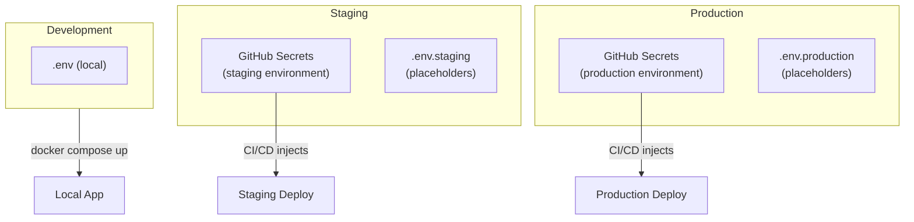

# Secrets Management Guide

**Version**: 1.0.0
**Date**: 2026-02-04
**Author**: DevOps Agent
**Status**: Approved

---

## 1. Overview

This guide describes the comprehensive secrets management strategy for the Hybrid RAG Knowledge Platform across all environments (development, staging, production).

### 1.1 Document Scope

| Aspect | Coverage |
|--------|----------|
| Secret Types | Database credentials, API keys, JWT secrets, SSL certificates |
| Environments | Development, Staging, Production |
| Storage Methods | Environment files, Docker Secrets, GitHub Secrets |
| Lifecycle | Creation, Rotation, Revocation, Auditing |

### 1.2 Security Principles

```
+------------------------------------------------------------------+
|                    SECRETS MANAGEMENT PRINCIPLES                   |
+------------------------------------------------------------------+
|  1. NEVER commit secrets to version control                       |
|  2. Use different secrets for each environment                    |
|  3. Rotate secrets regularly (see Section 6)                      |
|  4. Apply least privilege principle                               |
|  5. Log access but never log secret values                        |
+------------------------------------------------------------------+
```

---

## 2. Secret Categories

### 2.1 Secret Classification Matrix

| Category | Sensitivity | Examples | Rotation Frequency |
|----------|-------------|----------|-------------------|
| **Critical** | Highest | Production DB passwords, JWT secrets | 30 days |
| **High** | High | API keys (DeepSeek), Admin credentials | 90 days |
| **Medium** | Medium | Monitoring passwords, Staging credentials | 180 days |
| **Low** | Low | Development tokens | On demand |

### 2.2 Complete Secret Inventory

#### 2.2.1 Database Credentials

| Secret Name | Service | Environment | Required |
|-------------|---------|-------------|:--------:|
| `DB_PASSWORD` | PostgreSQL | All | Yes |
| `NEO4J_PASSWORD` | Neo4j | All | Yes |
| `REDIS_PASSWORD` | Redis | Staging/Production | Yes |
| `ES_PASSWORD` | Elasticsearch | Production | Yes |
| `KEYCLOAK_DB_PASSWORD` | Keycloak DB | All | Yes |

#### 2.2.2 Application Secrets

| Secret Name | Service | Environment | Required |
|-------------|---------|-------------|:--------:|
| `JWT_SECRET` | API Gateway | All | Yes |
| `KEYCLOAK_ADMIN_PASSWORD` | Keycloak | All | Yes |
| `DEEPSEEK_API_KEY` | AI Service | All | Yes |

#### 2.2.3 Monitoring Secrets

| Secret Name | Service | Environment | Required |
|-------------|---------|-------------|:--------:|
| `GRAFANA_ADMIN_PASSWORD` | Grafana | Staging/Production | Yes |
| `KIBANA_PASSWORD` | Kibana | Production | Optional |

#### 2.2.4 Object Storage Secrets

| Secret Name | Service | Environment | Required |
|-------------|---------|-------------|:--------:|
| `MINIO_ACCESS_KEY` | MinIO | All | Yes |
| `MINIO_SECRET_KEY` | MinIO | All | Yes |

#### 2.2.5 External Integration Secrets

| Secret Name | Service | Environment | Required |
|-------------|---------|-------------|:--------:|
| `SLACK_WEBHOOK_URL` | Alerting | Production | Optional |
| `SMTP_PASSWORD` | Email Alerts | Production | Optional |

#### 2.2.6 Deployment Secrets

| Secret Name | Service | Environment | Required |
|-------------|---------|-------------|:--------:|
| `STAGING_SSH_KEY` | SSH Deployment | Staging | Yes |
| `PRODUCTION_SSH_KEY` | SSH Deployment | Production | Yes |
| `SLACK_BOT_TOKEN` | CI/CD Notifications | All | Yes |

---

## 3. Environment-Specific Management

### 3.1 Development Environment

```
+------------------------------------------------------------------+
|                     DEVELOPMENT SECRETS                           |
+------------------------------------------------------------------+
|  Storage: .env file (local only)                                  |
|  Template: .env.example (committed to Git)                        |
|  Security: Relaxed (local development only)                       |
+------------------------------------------------------------------+
```

**Setup Process**:

```bash
# 1. Copy template
cp infrastructure/docker/.env.example infrastructure/docker/.env

# 2. Generate development secrets
openssl rand -base64 18  # For passwords
openssl rand -base64 48  # For JWT secret

# 3. Fill in .env file with generated values
```

**Development .env Checklist**:

- [ ] `DB_PASSWORD` - Any strong password
- [ ] `NEO4J_PASSWORD` - Any strong password (min 8 chars)
- [ ] `JWT_SECRET` - Generated 48+ character string
- [ ] `KEYCLOAK_ADMIN_PASSWORD` - Any password
- [ ] `MINIO_ACCESS_KEY` / `MINIO_SECRET_KEY` - Generated strings
- [ ] `DEEPSEEK_API_KEY` - Your development API key

### 3.2 Staging Environment

```
+------------------------------------------------------------------+
|                      STAGING SECRETS                              |
+------------------------------------------------------------------+
|  Storage: .env.staging + GitHub Environment Secrets               |
|  Template: .env.staging (placeholders only)                       |
|  Security: Production-like (isolated from production data)        |
+------------------------------------------------------------------+
```

**Setup Process**:

```bash
# 1. Generate staging secrets
./infrastructure/scripts/validate-secrets.sh --generate staging

# 2. Store in GitHub Secrets (environment: staging)
gh secret set DB_PASSWORD --env staging < staging_db_password.txt
gh secret set JWT_SECRET --env staging < staging_jwt_secret.txt
# ... repeat for all secrets

# 3. For local staging deployment
cp .env.staging .env.staging.local
# Edit .env.staging.local with actual values
```

**Staging Secret Naming Convention**:

```
Format: <SERVICE>_<TYPE>
Example: STAGING_DB_PASSWORD (in GitHub)
         DB_PASSWORD (in .env.staging)
```

### 3.3 Production Environment

```
+------------------------------------------------------------------+
|                     PRODUCTION SECRETS                            |
+------------------------------------------------------------------+
|  Storage: GitHub Environment Secrets + Secrets Manager (optional) |
|  Template: .env.production (placeholders only)                    |
|  Security: Maximum (encryption, rotation, auditing)               |
+------------------------------------------------------------------+
```

**Setup Process**:

```bash
# 1. Generate production secrets (air-gapped machine recommended)
./infrastructure/scripts/validate-secrets.sh --generate production

# 2. Store in GitHub Secrets (environment: production)
gh secret set DB_PASSWORD --env production < prod_db_password.txt
gh secret set JWT_SECRET --env production < prod_jwt_secret.txt

# 3. Configure environment protection rules
# - Required reviewers: 2
# - Wait timer: 5 minutes
# - Allowed branches: main, release/*
```

**Production Secret Requirements**:

| Secret | Minimum Length | Complexity |
|--------|---------------|------------|
| Passwords | 32 characters | Alphanumeric + special |
| JWT Secret | 64 characters | Base64 encoded |
| API Keys | Vendor-specific | - |

---

## 4. Secret Storage Methods

### 4.1 Method Comparison

| Method | Security | Complexity | Use Case |
|--------|----------|------------|----------|
| `.env` files | Low | Simple | Development |
| Docker Secrets | Medium | Moderate | Docker Swarm |
| GitHub Secrets | High | Simple | CI/CD |
| HashiCorp Vault | Highest | Complex | Enterprise |
| AWS Secrets Manager | High | Moderate | AWS deployments |

### 4.2 Current Implementation: Environment Files + GitHub Secrets



### 4.3 Docker Secrets (Optional Enhancement)

For Docker Swarm deployments, secrets can be stored as Docker Secrets:

```yaml
# docker-compose.prod.yml addition
secrets:
  db_password:
    external: true
  jwt_secret:
    external: true
  deepseek_api_key:
    external: true

services:
  backend:
    secrets:
      - db_password
      - jwt_secret
    environment:
      - DB_PASSWORD_FILE=/run/secrets/db_password
```

**Creating Docker Secrets**:

```bash
# Create secrets from files
echo "your-password" | docker secret create db_password -
echo "your-jwt-secret" | docker secret create jwt_secret -

# List secrets
docker secret ls

# Inspect secret metadata (not the value)
docker secret inspect db_password
```

---

## 5. Secret Generation

### 5.1 Generation Commands

```bash
# Strong password (32 characters)
openssl rand -base64 32

# Extra strong password (48 characters)
openssl rand -base64 48

# JWT Secret (64+ characters)
openssl rand -base64 64

# Alphanumeric only (for systems with special char restrictions)
openssl rand -base64 32 | tr -dc 'a-zA-Z0-9' | head -c 32

# UUID-based (for access keys)
uuidgen | tr -d '-'
```

### 5.2 Automated Generation Script

The `validate-secrets.sh` script can generate secrets:

```bash
# Generate all secrets for an environment
./infrastructure/scripts/validate-secrets.sh --generate production

# Output is saved to:
# - /tmp/secrets-production-YYYYMMDD/
# - Automatically excluded from version control
```

### 5.3 Password Complexity Requirements

| Environment | Min Length | Uppercase | Lowercase | Numbers | Special |
|-------------|-----------|-----------|-----------|---------|---------|
| Development | 8 | Optional | Required | Required | Optional |
| Staging | 16 | Required | Required | Required | Required |
| Production | 32 | Required | Required | Required | Required |

---

## 6. Secret Rotation

### 6.1 Rotation Schedule

| Secret Type | Dev | Staging | Production |
|-------------|-----|---------|------------|
| Database Passwords | Never | 180 days | 90 days |
| JWT Secret | Never | 90 days | 30 days |
| API Keys | On demand | 90 days | 60 days |
| Admin Credentials | On demand | 180 days | 90 days |
| SSH Keys | Never | 365 days | 180 days |

### 6.2 Rotation Procedure

#### 6.2.1 Database Password Rotation

```bash
# 1. Generate new password
NEW_PASSWORD=$(openssl rand -base64 32)

# 2. Update database user password
docker exec kp-postgresql psql -U postgres -c \
  "ALTER USER knowledge_app PASSWORD '${NEW_PASSWORD}';"

# 3. Update GitHub Secret
echo "${NEW_PASSWORD}" | gh secret set DB_PASSWORD --env production

# 4. Restart affected services
docker compose -f docker-compose.yml -f docker-compose.prod.yml restart backend ai-service

# 5. Verify connectivity
docker exec kp-backend curl -s localhost:8080/actuator/health
```

#### 6.2.2 JWT Secret Rotation

```bash
# WARNING: JWT rotation invalidates all existing sessions
# Plan for maintenance window

# 1. Generate new JWT secret
NEW_JWT=$(openssl rand -base64 64)

# 2. Update GitHub Secret
echo "${NEW_JWT}" | gh secret set JWT_SECRET --env production

# 3. Deploy with new secret
# This requires a full deployment to take effect

# 4. All users will need to re-authenticate
```

#### 6.2.3 API Key Rotation (DeepSeek)

```bash
# 1. Generate new API key in DeepSeek console
# 2. Update GitHub Secret
gh secret set DEEPSEEK_API_KEY --env production --body "new-api-key"

# 3. Restart AI service
docker compose restart ai-service

# 4. Revoke old API key in DeepSeek console
```

### 6.3 Zero-Downtime Rotation (Future Enhancement)

For zero-downtime rotation, implement dual-secret support:

```yaml
# Application configuration
secrets:
  jwt:
    primary: ${JWT_SECRET}
    secondary: ${JWT_SECRET_OLD}  # For validation during transition
```

---

## 7. Secret Validation

### 7.1 Pre-Deployment Validation

Always run the validation script before deployment:

```bash
# Validate staging secrets
./infrastructure/scripts/validate-secrets.sh staging

# Validate production secrets
./infrastructure/scripts/validate-secrets.sh production

# Validate with verbose output
./infrastructure/scripts/validate-secrets.sh production --verbose
```

### 7.2 Validation Checks

| Check | Description | Required |
|-------|-------------|:--------:|
| Presence | Secret is defined and not empty | Yes |
| Length | Meets minimum length requirement | Yes |
| Complexity | Contains required character types | Production only |
| Placeholder | Not a placeholder value (__*__) | Yes |
| Format | Matches expected format (e.g., API key pattern) | Optional |

### 7.3 CI/CD Integration

```yaml
# .github/workflows/deploy.yml
jobs:
  validate-secrets:
    runs-on: ubuntu-latest
    steps:
      - uses: actions/checkout@v4
      - name: Validate Secrets
        env:
          DB_PASSWORD: ${{ secrets.DB_PASSWORD }}
          JWT_SECRET: ${{ secrets.JWT_SECRET }}
          DEEPSEEK_API_KEY: ${{ secrets.DEEPSEEK_API_KEY }}
        run: |
          ./infrastructure/scripts/validate-secrets.sh production --ci-mode
```

---

## 8. Security Best Practices

### 8.1 Access Control

```
+------------------------------------------------------------------+
|                     ACCESS CONTROL MATRIX                         |
+------------------------------------------------------------------+
|  Role          | Dev Secrets | Staging Secrets | Prod Secrets    |
|  ------------- | ----------- | --------------- | --------------- |
|  Developer     | Read/Write  | Read Only       | No Access       |
|  Tech Lead     | Read/Write  | Read/Write      | Read Only       |
|  DevOps        | Read/Write  | Read/Write      | Read/Write      |
|  Security Team | Audit Only  | Audit Only      | Full Access     |
+------------------------------------------------------------------+
```

### 8.2 Logging and Auditing

**DO Log**:
- Secret access timestamps
- Who accessed which secret type
- Rotation events
- Validation failures

**NEVER Log**:
- Secret values (even masked)
- Full environment dumps
- Debug output containing secrets

### 8.3 Incident Response

If a secret is compromised:

1. **Immediate**: Rotate the compromised secret
2. **1 hour**: Audit access logs for unauthorized use
3. **24 hours**: Complete security review
4. **1 week**: Update rotation policy if needed

```bash
# Emergency secret rotation
./infrastructure/scripts/validate-secrets.sh --emergency-rotate <secret-name>
```

### 8.4 Secure Transmission

| Method | Use Case | Security |
|--------|----------|----------|
| SSH | Server access | Ed25519 keys |
| HTTPS | API calls | TLS 1.3 |
| GitHub Secrets | CI/CD | AES-256 encrypted |

---

## 9. Troubleshooting

### 9.1 Common Issues

#### Issue: Service fails to start with "missing secret" error

```bash
# Check if secret is set
docker exec kp-backend printenv | grep -c DB_PASSWORD

# Verify .env file is loaded
docker compose config | grep DB_PASSWORD
```

#### Issue: Authentication fails after secret rotation

```bash
# Check if all services have the new secret
docker compose ps
docker compose restart backend api-gateway keycloak
```

#### Issue: CI/CD pipeline fails secret validation

```bash
# List GitHub secrets (names only)
gh secret list

# Verify environment exists
gh api repos/{owner}/{repo}/environments
```

### 9.2 Debug Mode (Development Only)

```bash
# Print masked secret values for debugging
./infrastructure/scripts/validate-secrets.sh development --debug

# Output shows: DB_PASSWORD: Kj2x****(4 hidden)
```

---

## 10. Compliance Checklist

### 10.1 Pre-Production Checklist

- [ ] All production secrets are unique (not reused from staging)
- [ ] All default passwords have been changed
- [ ] JWT secret is at least 64 characters
- [ ] Database passwords are at least 32 characters
- [ ] No placeholder values remain (`__*__`)
- [ ] Rotation schedule is documented and followed
- [ ] Emergency rotation procedure is tested
- [ ] Access control is properly configured
- [ ] Audit logging is enabled

### 10.2 Periodic Review Checklist

- [ ] Secrets have not exceeded rotation deadline
- [ ] Access logs show no suspicious activity
- [ ] No secrets are exposed in logs or error messages
- [ ] Backup recovery includes secret restoration
- [ ] Team members with access are still authorized

---

## 11. Quick Reference

### 11.1 File Locations

| File | Purpose |
|------|---------|
| `infrastructure/docker/.env` | Local development (not committed) |
| `infrastructure/docker/.env.example` | Template (committed) |
| `infrastructure/docker/.env.staging` | Staging placeholders (committed) |
| `infrastructure/docker/.env.production` | Production placeholders (committed) |
| `infrastructure/scripts/validate-secrets.sh` | Validation script |

### 11.2 Quick Commands

```bash
# Generate strong password
openssl rand -base64 32

# Validate production secrets
./infrastructure/scripts/validate-secrets.sh production

# List GitHub secrets
gh secret list

# Set GitHub secret
gh secret set SECRET_NAME --body "value"

# Set environment-specific secret
gh secret set SECRET_NAME --env production --body "value"
```

### 11.3 Support

| Issue Type | Contact |
|------------|---------|
| Secret rotation | DevOps Team (Slack: #proj-hrkp-alerts) |
| Access requests | Security Team |
| Pipeline failures | DevOps Team (Slack: #proj-hrkp-dev) |

---

## Related Documents

| Document | Path |
|----------|------|
| GitHub Actions Secrets Guide | `docs/06_deployment/github_actions_secrets_guide.md` |
| Production Deployment Guide | `docs/06_deployment/production_deployment_guide.md` |
| Security Environment Setup | `docs/06_deployment/security_env_setup_guide.md` |
| Validate Secrets Script | `infrastructure/scripts/validate-secrets.sh` |

---

**Document End**
