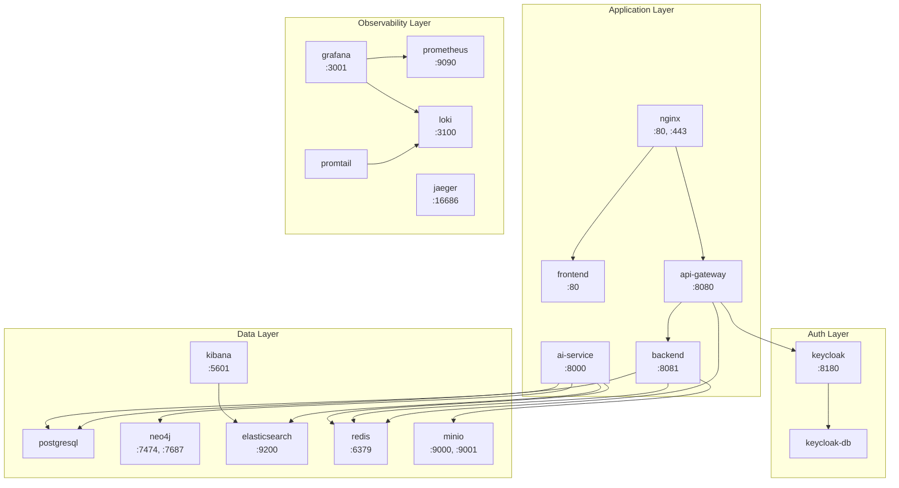

# Docker Operations Guide - 운영 매뉴얼

**Infra Engineer** | Version: 1.0 | Updated: 2026-02-08

---

## 목차

1. [컨테이너 관리](#1-컨테이너-관리)
2. [디스크/리소스 관리](#2-디스크리소스-관리)
3. [서비스별 헬스체크](#3-서비스별-헬스체크)
4. [서비스 의존관계](#4-서비스-의존관계)
5. [트러블슈팅](#5-트러블슈팅)
6. [주기적 유지보수 체크리스트](#6-주기적-유지보수-체크리스트)
7. [Quick Reference](#7-quick-reference)

---

## 환경 정보

| 항목 | 값 |
|------|-----|
| Docker Compose 프로젝트명 | `knowledge-platform` |
| docker-compose.yml 위치 | `infrastructure/docker/docker-compose.yml` |
| 컨테이너 수 | 18개 (Application 5 + Auth 2 + Data 5 + Observability 5 + Utility 1) |
| 네트워크 | `kp-frontend`, `kp-backend`, `kp-database`, `kp-monitoring` |
| 런타임 환경 | WSL2, Docker 29.2.0 |

### 18개 컨테이너 목록

| # | 서비스명 | 컨테이너명 | 레이어 | 이미지 |
|---|---------|-----------|--------|--------|
| 1 | nginx | kp-nginx | Application | Custom (nginx:alpine 기반) |
| 2 | frontend | kp-frontend | Application | Custom (React 빌드) |
| 3 | api-gateway | kp-api-gateway | Application | Custom (Spring Cloud Gateway) |
| 4 | backend | kp-backend | Application | Custom (Spring Boot) |
| 5 | ai-service | kp-ai-service | Application | Custom (FastAPI) |
| 6 | keycloak | kp-keycloak | Auth | quay.io/keycloak/keycloak:23.0 |
| 7 | keycloak-db | kp-keycloak-db | Auth | postgres:16-alpine |
| 8 | postgresql | kp-postgresql | Data | postgres:16-alpine |
| 9 | neo4j | kp-neo4j | Data | neo4j:5.15-community |
| 10 | elasticsearch | kp-elasticsearch | Data | elasticsearch:8.11.0 |
| 11 | kibana | kp-kibana | Data | kibana:8.11.0 |
| 12 | redis | kp-redis | Data | redis:7.2-alpine |
| 13 | minio | kp-minio | Data | minio/minio:latest |
| 14 | prometheus | kp-prometheus | Observability | prom/prometheus:v2.48.0 |
| 15 | grafana | kp-grafana | Observability | grafana/grafana:10.2.0 |
| 16 | loki | kp-loki | Observability | grafana/loki:2.9.0 |
| 17 | promtail | kp-promtail | Observability | grafana/promtail:2.9.0 |
| 18 | jaeger | kp-jaeger | Observability | jaegertracing/all-in-one:1.52 |

> init-db (kp-init-db)는 `--profile init` 으로만 실행되며, 완료 후 자동 종료됩니다.

---

## 1. 컨테이너 관리

### 1.1 전체 상태 확인

```bash
# 작업 디렉토리 이동
cd infrastructure/docker

# docker-compose 기준 전체 상태 (서비스 단위)
docker compose ps

# 모든 컨테이너 상태 (포맷 지정)
docker ps --format "table {{.Names}}\t{{.Status}}\t{{.Ports}}" | grep kp-

# 컨테이너별 리소스 사용량 (실시간)
docker stats --no-stream --format "table {{.Name}}\t{{.CPUPerc}}\t{{.MemUsage}}\t{{.MemPerc}}" | grep kp-
```

### 1.2 전체 환경 시작/중지

```bash
cd infrastructure/docker

# 전체 시작 (백그라운드)
docker compose up -d

# 전체 중지 (데이터 유지)
docker compose down

# 전체 중지 + 볼륨 삭제 (주의: 모든 데이터 삭제)
docker compose down -v

# 전체 중지 + 이미지 삭제
docker compose down --rmi all
```

### 1.3 개별 서비스 시작/중지/재시작

```bash
# 특정 서비스 시작
docker compose up -d postgresql

# 특정 서비스 중지
docker compose stop ai-service

# 특정 서비스 재시작
docker compose restart backend

# 특정 서비스 빌드 후 시작 (코드 변경 반영)
docker compose up -d --build ai-service

# 여러 서비스 한번에 시작
docker compose up -d postgresql neo4j elasticsearch redis
```

### 1.4 로그 확인

```bash
# 특정 서비스 로그 (최근 100줄)
docker compose logs --tail=100 ai-service

# 실시간 로그 스트리밍
docker compose logs -f ai-service

# 여러 서비스 로그 동시 확인
docker compose logs -f ai-service backend api-gateway

# 특정 시간대 로그 (docker logs 사용)
docker logs --since="2026-02-08T09:00:00" kp-ai-service

# 에러만 필터링
docker compose logs ai-service 2>&1 | grep -i "error\|exception\|traceback"
```

### 1.5 컨테이너 쉘 접속

```bash
# bash 쉘 접속
docker exec -it kp-ai-service bash

# sh 쉘 접속 (alpine 기반 이미지)
docker exec -it kp-redis sh
docker exec -it kp-postgresql sh

# 특정 명령어 실행 (쉘 접속 없이)
docker exec kp-postgresql psql -U knowledge -d knowledge -c "SELECT count(*) FROM documents;"
docker exec kp-redis redis-cli info memory
docker exec kp-neo4j cypher-shell -u neo4j -p "${NEO4J_PASSWORD}" "MATCH (n) RETURN count(n);"
```

### 1.6 컨테이너 상세 정보

```bash
# 컨테이너 설정 상세 조회
docker inspect kp-ai-service

# 헬스체크 상태만 조회
docker inspect --format='{{json .State.Health}}' kp-ai-service | python3 -m json.tool

# IP 주소 확인
docker inspect --format='{{range .NetworkSettings.Networks}}{{.IPAddress}} {{end}}' kp-ai-service

# 환경변수 확인
docker inspect --format='{{range .Config.Env}}{{println .}}{{end}}' kp-ai-service

# 마운트된 볼륨 확인
docker inspect --format='{{range .Mounts}}{{.Source}} -> {{.Destination}} ({{.Type}}){{println}}{{end}}' kp-ai-service
```

---

## 2. 디스크/리소스 관리

### 2.1 디스크 사용량 확인

```bash
# Docker 전체 디스크 사용량 요약
docker system df

# 상세 보기
docker system df -v

# 이미지별 크기 확인
docker images --format "table {{.Repository}}\t{{.Tag}}\t{{.Size}}" | sort -k3 -h

# 볼륨별 크기 확인
docker system df -v 2>/dev/null | grep -A 100 "Local Volumes space usage"

# WSL2 전체 디스크 사용량
df -h /
```

### 2.2 미사용 리소스 정리

정리 명령어는 영향도에 따라 단계적으로 실행합니다.

**1단계: 안전한 정리 (일상적으로 실행 가능)**

```bash
# 중지된 컨테이너, 사용하지 않는 네트워크, dangling 이미지, 빌드 캐시 정리
docker system prune -f
```

**2단계: 빌드 캐시 정리 (빌드 속도에 영향)**

```bash
# BuildKit 빌드 캐시 정리
docker builder prune -f

# 모든 빌드 캐시 완전 정리 (첫 빌드 시간 증가)
docker builder prune -a -f
```

**3단계: 미사용 이미지 정리 (재빌드 필요)**

```bash
# 어떤 컨테이너에서도 참조하지 않는 이미지 삭제
docker image prune -a -f

# 특정 조건으로 이미지 정리 (24시간 이상 된 dangling 이미지)
docker image prune --filter "until=24h" -f
```

**4단계: 미사용 볼륨 정리 (데이터 삭제 위험)**

```bash
# 어떤 컨테이너에서도 마운트하지 않는 볼륨 삭제
docker volume prune -f
```

> **주의**: `docker volume prune`은 중지된 컨테이너의 볼륨도 삭제할 수 있습니다.
> 실행 전 반드시 `docker volume ls` 로 대상 볼륨을 확인하세요.
> 프로젝트 볼륨은 `kp-` 접두사로 명명되어 있습니다. 중요 데이터가 포함된 볼륨:
> - `kp-postgresql-data` - 메인 DB (SSOT)
> - `kp-keycloak-db-data` - Keycloak 인증 DB
> - `kp-neo4j-data` - 지식 그래프
> - `kp-elasticsearch-data` - 벡터/텍스트 검색 인덱스
> - `kp-minio-data` - 업로드된 원본 문서

**전체 정리 (비상 시에만)**

```bash
# 모든 미사용 리소스 + 볼륨까지 정리 (데이터 손실 위험!)
docker system prune -a --volumes -f
```

### 2.3 디스크 사용량 모니터링 기준

| 사용률 | 상태 | 조치 |
|--------|------|------|
| 0-70% | 정상 | 모니터링 유지 |
| 70-80% | 주의 | 1단계 정리 실행, 로그 확인 |
| 80-90% | 경고 | 2~3단계 정리, Slack alerts 채널 알림 |
| 90%+ | 위험 | 즉시 정리 + 원인 파악, Slack alerts 긴급 알림 |

```bash
# 디스크 사용률 확인 스크립트
USAGE=$(df / --output=pcent | tail -1 | tr -d ' %')
if [ "$USAGE" -ge 90 ]; then
    echo "CRITICAL: Disk usage ${USAGE}%"
elif [ "$USAGE" -ge 80 ]; then
    echo "WARNING: Disk usage ${USAGE}%"
else
    echo "OK: Disk usage ${USAGE}%"
fi
```

### 2.4 WSL2 vdisk 축소

WSL2는 가상 디스크(ext4.vhdx)를 사용합니다. Docker 리소스를 삭제해도 vhdx 파일 크기는 자동으로 줄어들지 않으므로 수동 축소가 필요합니다.

```powershell
# 1. WSL 종료 (Windows PowerShell에서 실행)
wsl --shutdown

# 2. vhdx 위치 확인 (일반적인 경로)
# %LOCALAPPDATA%\Docker\wsl\data\ext4.vhdx
# 또는 %LOCALAPPDATA%\Packages\CanonicalGroupLimited...\LocalState\ext4.vhdx

# 3. diskpart로 축소
diskpart
# DISKPART> select vdisk file="C:\Users\{사용자}\AppData\Local\Docker\wsl\data\ext4.vhdx"
# DISKPART> compact vdisk
# DISKPART> exit

# 4. 또는 Optimize-VHD 사용 (Hyper-V 관리 도구 필요)
Optimize-VHD -Path "C:\Users\{사용자}\AppData\Local\Docker\wsl\data\ext4.vhdx" -Mode Full
```

### 2.5 리소스 제한 현황

docker-compose.yml에 정의된 서비스별 리소스 제한입니다.

| 서비스 | CPU Limit | Memory Limit | Memory Reservation |
|--------|-----------|-------------|-------------------|
| ai-service | 4 | 8G | 4G |
| postgresql | 2 | 4G | 2G |
| neo4j | 2 | 4G | 2G |
| elasticsearch | 2 | 4G | 2G |
| backend | 2 | 2G | 1G |
| keycloak | 1 | 1G | 512M |
| api-gateway | 1 | 1G | 512M |
| kibana | 1 | 1G | 512M |
| minio | 1 | 1G | 512M |
| redis | 0.5 | 1G | 512M |
| grafana | 0.5 | 512M | 256M |
| prometheus | 0.5 | 512M | 256M |
| loki | 0.5 | 512M | 256M |
| jaeger | 0.5 | 512M | 256M |
| nginx | 0.5 | 256M | 128M |
| frontend | 0.5 | 256M | 128M |
| keycloak-db | 0.5 | 512M | 256M |
| promtail | 0.25 | 256M | 128M |

**합계**: CPU ~19.25 cores, Memory ~30G (limits) / ~15.5G (reservations)

---

## 3. 서비스별 헬스체크

### 3.1 Application Layer

```bash
# ai-service (FastAPI) - Port 8000
curl -s http://localhost:8000/api/v1/health | python3 -m json.tool

# backend (Spring Boot) - Port 8081
curl -s http://localhost:8081/actuator/health | python3 -m json.tool

# api-gateway (Spring Cloud Gateway) - Port 8080
curl -s http://localhost:8080/actuator/health | python3 -m json.tool

# frontend (Nginx serving React) - Port 80 (nginx 경유)
curl -s -o /dev/null -w "%{http_code}" http://localhost:80/

# nginx (Reverse Proxy) - Port 80, 443
docker exec kp-nginx nginx -t
```

### 3.2 Auth Layer

```bash
# keycloak - Port 8180
curl -s http://localhost:8180/health/ready | python3 -m json.tool

# keycloak-db (PostgreSQL) - 외부 포트 없음, 컨테이너 내부에서 확인
docker exec kp-keycloak-db pg_isready -U keycloak -d keycloak
```

### 3.3 Data Layer

```bash
# postgresql - Port 5432 (외부 포트 미노출, 내부 확인)
docker exec kp-postgresql pg_isready -U knowledge -d knowledge

# PostgreSQL 상세 상태
docker exec kp-postgresql psql -U knowledge -d knowledge -c "SELECT version();"
docker exec kp-postgresql psql -U knowledge -d knowledge -c "SELECT count(*) as table_count FROM information_schema.tables WHERE table_schema = 'public';"

# neo4j - Port 7474 (Browser), 7687 (Bolt)
curl -s http://localhost:7474 | head -5
# Bolt 연결 확인
docker exec kp-neo4j cypher-shell -u neo4j -p "${NEO4J_PASSWORD}" "RETURN 1 AS test;"

# elasticsearch - Port 9200
curl -s http://localhost:9200/_cluster/health | python3 -m json.tool
curl -s http://localhost:9200/_cat/indices?v

# kibana - Port 5601
curl -s http://localhost:5601/api/status | python3 -m json.tool

# redis - Port 6379
docker exec kp-redis redis-cli ping
# 상세 정보
docker exec kp-redis redis-cli info server | head -10
docker exec kp-redis redis-cli info memory | head -10

# minio - Port 9000 (API), 9001 (Console)
curl -s http://localhost:9000/minio/health/live
curl -s -o /dev/null -w "%{http_code}" http://localhost:9001/
```

### 3.4 Observability Layer

```bash
# prometheus - Port 9090
curl -s http://localhost:9090/-/healthy
curl -s http://localhost:9090/api/v1/targets | python3 -m json.tool | head -30

# grafana - Port 3001
curl -s http://localhost:3001/api/health | python3 -m json.tool

# loki - Port 3100
curl -s http://localhost:3100/ready

# promtail - 외부 포트 없음, 컨테이너 로그로 확인
docker compose logs --tail=5 promtail

# jaeger - Port 16686 (UI)
curl -s -o /dev/null -w "%{http_code}" http://localhost:16686/
```

### 3.5 전체 헬스체크 스크립트

모든 서비스를 한번에 점검합니다.

```bash
#!/bin/bash
echo "=== Knowledge Platform Health Check ==="
echo ""

# Application Layer
echo "[Application Layer]"
printf "  %-15s : %s\n" "ai-service"   "$(curl -s -o /dev/null -w '%{http_code}' http://localhost:8000/api/v1/health 2>/dev/null || echo 'FAIL')"
printf "  %-15s : %s\n" "backend"      "$(curl -s -o /dev/null -w '%{http_code}' http://localhost:8081/actuator/health 2>/dev/null || echo 'FAIL')"
printf "  %-15s : %s\n" "api-gateway"  "$(curl -s -o /dev/null -w '%{http_code}' http://localhost:8080/actuator/health 2>/dev/null || echo 'FAIL')"
printf "  %-15s : %s\n" "nginx"        "$(docker exec kp-nginx nginx -t 2>&1 | grep -q 'ok' && echo 'OK' || echo 'FAIL')"

# Auth Layer
echo ""
echo "[Auth Layer]"
printf "  %-15s : %s\n" "keycloak"     "$(curl -s -o /dev/null -w '%{http_code}' http://localhost:8180/health/ready 2>/dev/null || echo 'FAIL')"
printf "  %-15s : %s\n" "keycloak-db"  "$(docker exec kp-keycloak-db pg_isready -U keycloak -d keycloak 2>/dev/null && echo 'OK' || echo 'FAIL')"

# Data Layer
echo ""
echo "[Data Layer]"
printf "  %-15s : %s\n" "postgresql"   "$(docker exec kp-postgresql pg_isready -U knowledge -d knowledge 2>/dev/null && echo 'OK' || echo 'FAIL')"
printf "  %-15s : %s\n" "neo4j"        "$(curl -s -o /dev/null -w '%{http_code}' http://localhost:7474 2>/dev/null || echo 'FAIL')"
printf "  %-15s : %s\n" "elasticsearch" "$(curl -s http://localhost:9200/_cluster/health 2>/dev/null | grep -oP '\"status\":\"(green|yellow)\"' | head -1 || echo 'FAIL')"
printf "  %-15s : %s\n" "kibana"       "$(curl -s -o /dev/null -w '%{http_code}' http://localhost:5601/api/status 2>/dev/null || echo 'FAIL')"
printf "  %-15s : %s\n" "redis"        "$(docker exec kp-redis redis-cli ping 2>/dev/null || echo 'FAIL')"
printf "  %-15s : %s\n" "minio"        "$(curl -s -o /dev/null -w '%{http_code}' http://localhost:9000/minio/health/live 2>/dev/null || echo 'FAIL')"

# Observability Layer
echo ""
echo "[Observability Layer]"
printf "  %-15s : %s\n" "prometheus"   "$(curl -s -o /dev/null -w '%{http_code}' http://localhost:9090/-/healthy 2>/dev/null || echo 'FAIL')"
printf "  %-15s : %s\n" "grafana"      "$(curl -s -o /dev/null -w '%{http_code}' http://localhost:3001/api/health 2>/dev/null || echo 'FAIL')"
printf "  %-15s : %s\n" "loki"         "$(curl -s -o /dev/null -w '%{http_code}' http://localhost:3100/ready 2>/dev/null || echo 'FAIL')"
printf "  %-15s : %s\n" "jaeger"       "$(curl -s -o /dev/null -w '%{http_code}' http://localhost:16686/ 2>/dev/null || echo 'FAIL')"

echo ""
echo "=== Check Complete ==="
```

---

## 4. 서비스 의존관계

### 4.1 의존관계 다이어그램



### 4.2 의존관계 매트릭스

| 서비스 | depends_on (condition: service_healthy) |
|--------|----------------------------------------|
| nginx | frontend, api-gateway |
| api-gateway | keycloak, backend, redis |
| backend | postgresql, redis, minio |
| ai-service | elasticsearch, neo4j, redis, postgresql |
| keycloak | keycloak-db |
| kibana | elasticsearch |
| grafana | prometheus, loki |
| promtail | loki |

### 4.3 올바른 시작 순서

Docker Compose의 `depends_on` + `condition: service_healthy`가 자동으로 순서를 관리하지만, 수동으로 시작할 경우 다음 순서를 따릅니다.

**Phase 1 - 데이터 레이어 (의존성 없음)**

```bash
docker compose up -d postgresql keycloak-db neo4j elasticsearch redis minio
```

**Phase 2 - 인증 + 모니터링 (Phase 1이 healthy 된 후)**

```bash
docker compose up -d keycloak kibana loki prometheus jaeger
```

**Phase 3 - 로그 수집 (Phase 2가 healthy 된 후)**

```bash
docker compose up -d promtail grafana
```

**Phase 4 - 애플리케이션 (Phase 2~3이 healthy 된 후)**

```bash
docker compose up -d backend ai-service
```

**Phase 5 - 게이트웨이 + 프론트엔드 (Phase 4가 healthy 된 후)**

```bash
docker compose up -d frontend api-gateway
```

**Phase 6 - 리버스 프록시 (Phase 5가 healthy 된 후)**

```bash
docker compose up -d nginx
```

> 참고: `docker compose up -d` 한 번으로 전체를 시작하면 Docker Compose가 healthcheck 기반으로 자동 순서를 관리합니다.

### 4.4 올바른 중지 순서

시작 순서의 역순으로 중지합니다.

```bash
# 역순 중지 (애플리케이션 -> 인프라)
docker compose stop nginx
docker compose stop frontend api-gateway
docker compose stop backend ai-service
docker compose stop keycloak grafana promtail
docker compose stop kibana loki prometheus jaeger
docker compose stop postgresql keycloak-db neo4j elasticsearch redis minio
```

> 참고: `docker compose down`은 의존관계를 고려하여 자동으로 역순 중지합니다.

### 4.5 의존 서비스 장애 시 연쇄 영향

| 장애 서비스 | 직접 영향 | 간접 영향 |
|------------|----------|----------|
| **postgresql** | backend, ai-service, init-db | api-gateway (backend 다운), nginx (gateway 다운) |
| **redis** | backend, ai-service, api-gateway | nginx (gateway 다운) |
| **elasticsearch** | ai-service, kibana | api-gateway (ai-service 라우팅 실패) |
| **neo4j** | ai-service | api-gateway (ai-service 라우팅 실패) |
| **keycloak-db** | keycloak | api-gateway (인증 불가), nginx |
| **keycloak** | api-gateway | nginx (gateway 다운) |
| **loki** | promtail, grafana | 로그 수집/조회 불가 (서비스 운영에는 영향 없음) |
| **prometheus** | grafana | 메트릭 조회 불가 (서비스 운영에는 영향 없음) |
| **minio** | backend | 문서 업로드/다운로드 불가 |

**핵심 서비스 우선순위**: postgresql > redis > elasticsearch > neo4j > keycloak > 나머지

장애 복구 시 위 우선순위에 따라 복구하면 연쇄 영향을 최소화할 수 있습니다.

---

## 5. 트러블슈팅

### 5.1 Exit 127 - Command Not Found

**증상**:
```
kp-ai-service exited with code 127
```

**원인**: 컨테이너 내부에서 실행하려는 명령어가 존재하지 않음. 주로 Dockerfile의 `CMD` 또는 `ENTRYPOINT`에서 참조하는 바이너리가 이미지에 포함되지 않은 경우.

**진단**:
```bash
# 마지막 로그 확인
docker logs kp-ai-service --tail=50

# 컨테이너를 쉘로 시작하여 명령어 존재 여부 확인
docker compose run --rm --entrypoint sh ai-service
# 컨테이너 내부에서
which uvicorn
which python
```

**대응**:
- Dockerfile에서 해당 명령어가 설치되는지 확인
- multi-stage build에서 실행 파일이 runtime 스테이지로 복사되었는지 확인
- `docker compose build --no-cache <서비스>` 로 재빌드

### 5.2 컨테이너 재시작 루프 (Restart Loop)

**증상**:
```
kp-backend    Restarting (1) 5 seconds ago
kp-backend    Restarting (1) 10 seconds ago
```

**진단**:
```bash
# 재시작 횟수 확인
docker inspect --format='{{.RestartCount}}' kp-backend

# 직전 종료 코드 확인
docker inspect --format='{{.State.ExitCode}}' kp-backend

# 로그에서 시작 실패 원인 확인
docker logs kp-backend --tail=100

# 의존 서비스 상태 확인 (backend의 경우)
docker exec kp-postgresql pg_isready -U knowledge
docker exec kp-redis redis-cli ping
```

**대응**:
- Exit Code 1: 애플리케이션 에러 (로그 확인)
- Exit Code 137: OOM Kill (메모리 부족, 아래 5.3 참조)
- Exit Code 143: SIGTERM (정상 종료 신호, 재시작 정책 확인)
- 의존 서비스가 healthy인지 확인
- 환경변수 누락 여부 확인 (`.env` 파일)

```bash
# 재시작 정책 무시하고 중지
docker update --restart=no kp-backend
docker stop kp-backend

# 원인 해결 후 재시작 정책 복원
docker update --restart=unless-stopped kp-backend
docker compose up -d backend
```

### 5.3 OOM (Out of Memory)

**증상**:
```
kp-ai-service exited with code 137
```
또는 `docker inspect`에서 `OOMKilled: true`

**진단**:
```bash
# OOM 여부 확인
docker inspect --format='{{.State.OOMKilled}}' kp-ai-service

# 현재 메모리 사용량 확인
docker stats --no-stream --format "table {{.Name}}\t{{.MemUsage}}\t{{.MemPerc}}" | grep kp-

# 시스템 전체 메모리 확인
free -h

# dmesg에서 OOM 기록 확인
dmesg | grep -i "oom\|killed" | tail -20
```

**대응**:

1. docker-compose.yml에서 메모리 제한 증가:

```yaml
# 예: ai-service 메모리 증가
deploy:
  resources:
    limits:
      memory: 10G    # 8G -> 10G
    reservations:
      memory: 6G     # 4G -> 6G
```

2. 불필요한 서비스 중지하여 메모리 확보:

```bash
# 관찰 도구 일시 중지 (서비스 운영에 영향 없음)
docker compose stop grafana kibana jaeger promtail
```

3. WSL2 메모리 제한 증가 (Windows에서 `%USERPROFILE%/.wslconfig`):

```ini
[wsl2]
memory=16GB
swap=4GB
```

### 5.4 포트 충돌

**증상**:
```
Error response from daemon: driver failed programming external connectivity on endpoint kp-nginx:
Bind for 0.0.0.0:80 failed: port is already allocated
```

**진단**:
```bash
# 해당 포트를 사용 중인 프로세스 확인
# Linux/WSL2
ss -tlnp | grep :80
# 또는
lsof -i :80

# Windows에서 (PowerShell)
netstat -ano | findstr :80
```

**대응**:

1. 충돌 프로세스 종료:

```bash
# PID 확인 후 종료
kill <PID>
```

2. 또는 docker-compose.yml에서 포트 변경 (.env 파일 활용):

```bash
# .env 파일에서 포트 변경
NGINX_HTTP_PORT=8088
GATEWAY_PORT=8082
```

**프로젝트 포트 매핑 전체 목록**:

| 서비스 | 호스트 포트 | 컨테이너 포트 | .env 변수 |
|--------|-----------|-------------|----------|
| nginx | 80, 443 | 80, 443 | `NGINX_HTTP_PORT`, `NGINX_HTTPS_PORT` |
| api-gateway | 8080 | 8080 | `GATEWAY_PORT` |
| backend | 8081 | 8081 | (고정) |
| ai-service | 8000 | 8000 | (고정) |
| keycloak | 8180 | 8080 | `KEYCLOAK_PORT` |
| neo4j | 7474, 7687 | 7474, 7687 | `NEO4J_BROWSER_PORT`, `NEO4J_BOLT_PORT` |
| elasticsearch | 9200 | 9200 | `ELASTICSEARCH_PORT` |
| kibana | 5601 | 5601 | `KIBANA_PORT` |
| redis | 6379 | 6379 | `REDIS_PORT` |
| minio | 9000, 9001 | 9000, 9001 | `MINIO_API_PORT`, `MINIO_CONSOLE_PORT` |
| prometheus | 9090 | 9090 | `PROMETHEUS_PORT` |
| grafana | 3001 | 3000 | `GRAFANA_PORT` |
| loki | 3100 | 3100 | `LOKI_PORT` |
| jaeger | 16686, 14268 | 16686, 14268 | `JAEGER_UI_PORT`, `JAEGER_COLLECTOR_PORT` |

### 5.5 네트워크 문제

**증상**: 컨테이너 간 통신 실패 (Connection refused, Name resolution failure)

**진단**:
```bash
# 네트워크 목록 확인
docker network ls | grep kp

# 특정 네트워크에 연결된 컨테이너 확인
docker network inspect kp-database --format='{{range .Containers}}{{.Name}} {{end}}'
docker network inspect kp-backend --format='{{range .Containers}}{{.Name}} {{end}}'
docker network inspect kp-frontend --format='{{range .Containers}}{{.Name}} {{end}}'
docker network inspect kp-monitoring --format='{{range .Containers}}{{.Name}} {{end}}'

# 컨테이너에서 DNS 해결 확인
docker exec kp-ai-service ping -c 1 elasticsearch
docker exec kp-ai-service ping -c 1 neo4j

# 컨테이너에서 특정 서비스 포트 접근 확인
docker exec kp-ai-service wget -q -O - http://elasticsearch:9200 2>/dev/null | head -5
```

**네트워크별 서비스 매핑**:

| 네트워크 | 연결된 서비스 |
|----------|-------------|
| kp-frontend | nginx, frontend, api-gateway, keycloak, grafana |
| kp-backend | api-gateway, backend, ai-service, prometheus, jaeger |
| kp-database | api-gateway, backend, ai-service, keycloak, keycloak-db, postgresql, neo4j, elasticsearch, kibana, redis, minio |
| kp-monitoring | prometheus, grafana, loki, promtail, jaeger, kibana |

**대응**:

1. 두 서비스가 같은 네트워크에 있는지 확인
2. 서비스 이름(DNS)이 docker-compose.yml의 서비스명과 일치하는지 확인
3. 네트워크 재생성:

```bash
docker compose down
docker network prune -f
docker compose up -d
```

### 5.6 볼륨 권한 문제

**증상**:
```
Permission denied: '/var/lib/postgresql/data'
```
또는
```
mkdir: cannot create directory '/data': Permission denied
```

**진단**:
```bash
# 볼륨의 실제 마운트 경로 확인
docker volume inspect kp-postgresql-data

# 컨테이너 내부 파일 소유자 확인
docker exec kp-postgresql ls -la /var/lib/postgresql/data/
```

**대응**:

```bash
# 볼륨 삭제 후 재생성 (데이터 삭제됨!)
docker compose stop postgresql
docker volume rm kp-postgresql-data
docker compose up -d postgresql
```

### 5.7 이미지 Pull 실패

**증상**:
```
Error response from daemon: pull access denied for ...
```
또는
```
Error response from daemon: Get "https://registry-1.docker.io/v2/": net/http: TLS handshake timeout
```

**대응**:

```bash
# 네트워크 확인
curl -s https://registry-1.docker.io/v2/ | head -5

# 수동 pull 재시도
docker pull postgres:16-alpine

# Docker Hub rate limit 확인
curl -s "https://auth.docker.io/token?service=registry.docker.io&scope=repository:library/postgres:pull" | python3 -m json.tool
```

---

## 6. 주기적 유지보수 체크리스트

### 6.1 일간 (매일)

- [ ] 전체 컨테이너 상태 확인: `docker compose ps`
- [ ] 비정상 컨테이너 유무 확인 (Restarting, Exit 상태)
- [ ] 로그에서 ERROR/WARN 패턴 점검

```bash
# 일간 점검 명령어
docker compose ps
docker ps --format "table {{.Names}}\t{{.Status}}" | grep -v "healthy\|Up"
```

### 6.2 주간 (매주)

- [ ] 디스크 사용량 점검: `docker system df`
- [ ] 불필요한 이미지 정리: `docker image prune -f`
- [ ] 빌드 캐시 확인: `docker builder prune --dry-run`
- [ ] 컨테이너 리소스 사용 패턴 확인: `docker stats --no-stream`
- [ ] 로그 볼륨 크기 점검

```bash
# 주간 점검 명령어
docker system df
docker stats --no-stream --format "table {{.Name}}\t{{.CPUPerc}}\t{{.MemUsage}}" | grep kp-
docker image prune -f
df -h /
```

### 6.3 월간 (매월)

- [ ] 이미지 버전 점검 (보안 업데이트 확인)
- [ ] 전체 미사용 리소스 정리
- [ ] 볼륨 백업 상태 확인
- [ ] WSL2 vdisk 크기 확인 및 축소
- [ ] docker-compose.yml 리소스 제한 적정성 검토
- [ ] 보안 취약점 스캔

```bash
# 월간 점검 명령어
docker images --format "table {{.Repository}}\t{{.Tag}}\t{{.CreatedSince}}" | grep kp
docker system prune -f
docker builder prune -f

# 이미지 취약점 스캔 (Docker Scout 사용)
docker scout quickview knowledge-platform/ai-service:latest
```

### 6.4 이미지 버전 현황

정기적으로 최신 보안 패치를 확인해야 하는 외부 이미지 목록입니다.

| 이미지 | 현재 버전 | 확인 URL |
|--------|----------|---------|
| postgres | 16-alpine | https://hub.docker.com/_/postgres |
| neo4j | 5.15-community | https://hub.docker.com/_/neo4j |
| elasticsearch | 8.11.0 | https://www.docker.elastic.co/ |
| kibana | 8.11.0 | https://www.docker.elastic.co/ |
| redis | 7.2-alpine | https://hub.docker.com/_/redis |
| keycloak | 23.0 | https://quay.io/repository/keycloak/keycloak |
| minio | latest | https://hub.docker.com/r/minio/minio |
| prometheus | v2.48.0 | https://hub.docker.com/r/prom/prometheus |
| grafana | 10.2.0 | https://hub.docker.com/r/grafana/grafana |
| loki | 2.9.0 | https://hub.docker.com/r/grafana/loki |
| promtail | 2.9.0 | https://hub.docker.com/r/grafana/promtail |
| jaeger | 1.52 | https://hub.docker.com/r/jaegertracing/all-in-one |

---

## 7. Quick Reference

### 한 페이지 치트시트

```
=======================================================================
  Knowledge Platform - Docker Operations Cheat Sheet
=======================================================================

--- 환경 시작/중지 ---
docker compose up -d                    # 전체 시작
docker compose down                     # 전체 중지 (데이터 유지)
docker compose down -v                  # 전체 중지 + 데이터 삭제
docker compose --profile init up init-db # DB 초기화 (최초 1회)

--- 상태 확인 ---
docker compose ps                       # 서비스 상태
docker stats --no-stream | grep kp-     # 리소스 사용량
docker compose logs -f <서비스>          # 실시간 로그

--- 개별 서비스 ---
docker compose up -d --build <서비스>    # 빌드 후 시작
docker compose restart <서비스>          # 재시작
docker compose stop <서비스>             # 중지
docker exec -it kp-<서비스> bash         # 쉘 접속

--- 헬스체크 ---
curl localhost:8000/api/v1/health       # ai-service
curl localhost:8081/actuator/health     # backend
curl localhost:8080/actuator/health     # api-gateway
curl localhost:9200/_cluster/health     # elasticsearch
curl localhost:7474                     # neo4j
curl localhost:8180/health/ready        # keycloak
curl localhost:9000/minio/health/live   # minio
curl localhost:9090/-/healthy           # prometheus
curl localhost:3001/api/health          # grafana
curl localhost:3100/ready               # loki
docker exec kp-postgresql pg_isready -U knowledge
docker exec kp-redis redis-cli ping

--- 디스크 정리 ---
docker system df                        # 사용량 확인
docker system prune -f                  # 안전한 정리
docker builder prune -f                 # 빌드 캐시 정리
docker image prune -a -f                # 미사용 이미지 정리
docker volume prune -f                  # 미사용 볼륨 정리 (주의!)

--- 네트워크 ---
docker network ls | grep kp             # 네트워크 목록
docker network inspect kp-database      # 네트워크 상세

--- 볼륨 ---
docker volume ls | grep kp              # 볼륨 목록
docker volume inspect kp-postgresql-data # 볼륨 상세

--- 디버깅 ---
docker logs kp-<이름> --tail=100        # 최근 로그
docker inspect kp-<이름>                # 상세 정보
docker exec kp-<이름> <명령어>           # 내부 명령 실행
docker compose logs -f 2>&1 | grep ERROR # 에러 필터링

=======================================================================
  작업 디렉토리: infrastructure/docker/
  환경 변수: infrastructure/docker/.env
  설정 파일: infrastructure/docker/docker-compose.yml
=======================================================================
```

---

## 관련 문서

| 문서 | 경로 |
|------|------|
| Docker Compose 트러블슈팅 | `knowledge_service/docs/07_maintenance/01_docker_troubleshooting.md` |
| AI Service 빌드 가이드 | `knowledge_service/docs/06_deployment/13_ai_service_build_guide.md` |
| 인프라 설계서 | `knowledge_service/docs/02_design/10_infrastructure_detailed_design.md` |
| Observability 운영 매뉴얼 | `knowledge_service/docs/07_maintenance/16_observability_operations_manual.md` |
| Kibana 사용자 가이드 | `knowledge_service/docs/07_maintenance/02_kibana_user_guide.md` |
| Keycloak 관리 가이드 | `knowledge_service/docs/07_maintenance/06_keycloak_admin_guide.md` |

---

## 변경 이력

| 날짜 | 버전 | 변경 내용 | 작성자 |
|------|------|----------|--------|
| 2026-02-08 | 1.0 | Docker 운영 매뉴얼 초판 작성 | Infra Engineer |
