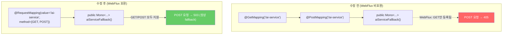
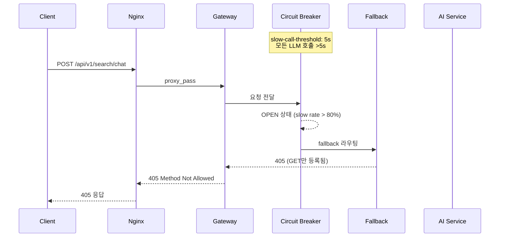
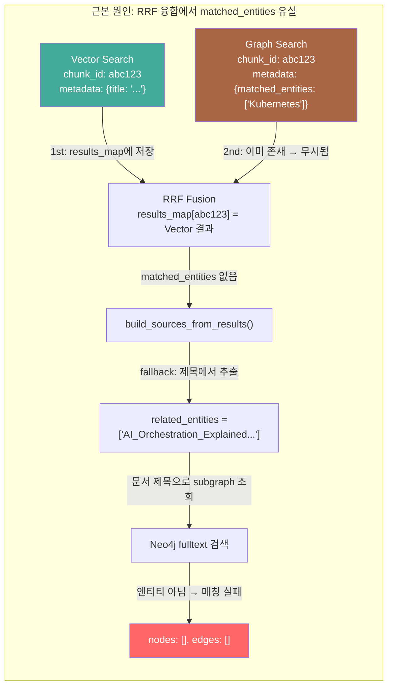
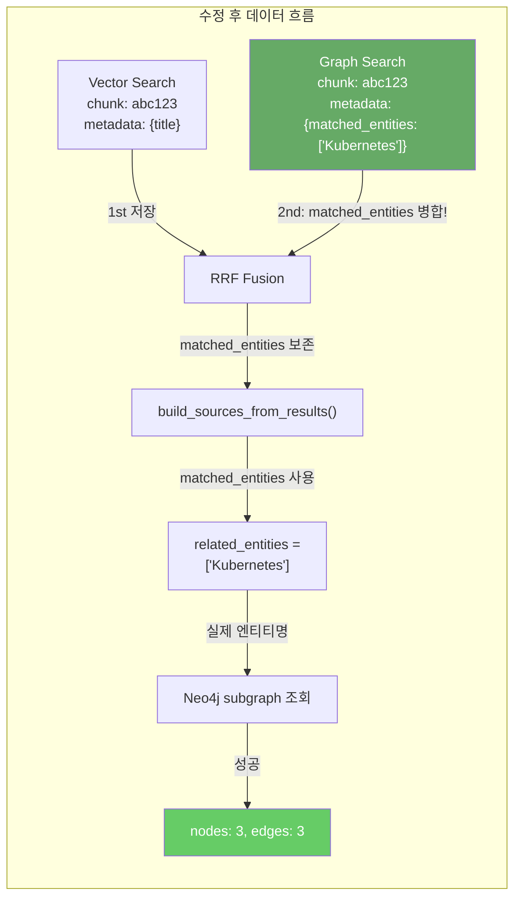
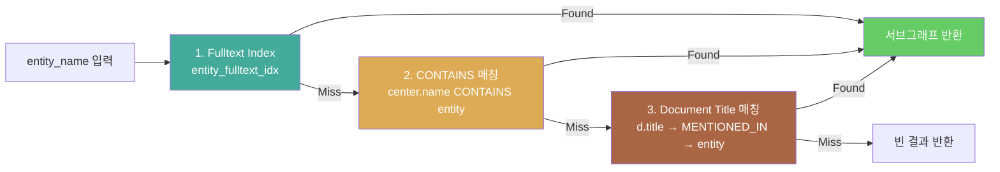

# Bug Fix Report: Gateway 405 오류 + 그래프 시각화 빈 결과

## 기본 정보

| 항목 | 내용 |
|------|------|
| **보고일** | 2026-02-11 |
| **수정자** | Claude (AI Assistant) |
| **우선순위** | High |
| **상태** | 수정 완료, 검증 완료 |
| **커밋** | `eb40cda` |
| **영향 범위** | Chat 검색 (405 → 200), 그래프 시각화 (빈 결과 → 정상) |
| **관련 이슈** | ISSUE-011 (그래프 패널 엔티티명), SCRUM-101 (graph 소스 태깅) |

---

## 버그 요약

이 보고서는 동일 세션에서 발견/수정된 **연관된 2건의 버그**를 다룹니다.

| # | 버그 | 증상 | 근본 원인 |
|---|------|------|-----------|
| 1 | Gateway 405 Method Not Allowed | POST `/api/v1/search/chat` → 405 | FallbackController 어노테이션 + Circuit Breaker 설정 |
| 2 | 그래프 시각화 빈 결과 | 그래프 아이콘 클릭 → 빈 그래프 | RRF 융합에서 `matched_entities` 유실 |

---

## Bug #1: Gateway 405 Method Not Allowed

### 증상

```
POST /api/v1/search/chat HTTP/1.1

→ 405 Method Not Allowed
{
  "timestamp": "2026-02-11T...",
  "path": "/fallback/ai-service",
  "status": 405,
  "error": "Method Not Allowed"
}
```

- `/api/v1/search/chat`에 POST 요청 시 405 반환
- 에러 응답이 Spring Boot 형식 (FastAPI가 아님) → Gateway 레벨 문제
- AI Service 직접 호출 (`:8000`) 시에는 정상 200 OK

### 원인 분석

**2가지 원인**이 복합 작용:

#### 원인 1: FallbackController 어노테이션 스택 오류



Spring WebFlux에서 `@GetMapping` + `@PostMapping`을 같은 메서드에 스택하면 **마지막 어노테이션만 등록**됩니다.
`@GetMapping`이 먼저 처리되어 GET만 등록 → POST 요청 시 405 반환.

#### 원인 2: Circuit Breaker 임계값 과소 설정

```yaml
# 수정 전
ai-config:
  slow-call-duration-threshold: 5s   # LLM 호출은 항상 >5s
  sliding-window-size: 5
  slow-call-rate-threshold: 80

# 수정 후
ai-config:
  slow-call-duration-threshold: 30s   # LLM 응답 대기 충분
  sliding-window-size: 10
  slow-call-rate-threshold: 90
```

LLM 기반 Chat 검색은 **평균 15~50초** 소요되므로, `slow-call-duration-threshold: 5s`는 모든 호출을 "느린 호출"로 판정합니다.
5건 중 80%가 느리면 → Circuit Breaker OPEN → Fallback 라우팅 → 405 (원인 1과 결합).



### 수정 내용

| 파일 | 변경 |
|------|------|
| `FallbackController.java` | 6개 fallback + generic → `@RequestMapping(method = {GET, POST})` |
| `application.yml` | `slow-call-duration-threshold: 30s`, `sliding-window-size: 10`, `slow-call-rate-threshold: 90` |

### 검증

```
POST /api/v1/search/chat (via nginx full path)
→ 200 OK, 51.6s, answer 2544자
```

---

## Bug #2: 그래프 시각화 빈 결과

### 증상

검색 결과에서 `source_type: "graph"` 항목의 그래프 아이콘 클릭 시:

```json
POST /api/v1/graph/subgraph
{
  "entity_name": "AI_Orchestration_Explained_The_What_Why__How_for_2024",
  "depth": 1, "limit": 15
}

→ {"center": "AI_Orchestration_Explained_The_What_Why__How_for_2024",
   "nodes": [], "edges": [], "node_count": 0}
```

`entity_name`에 **문서 제목**이 전달되어 Neo4j 엔티티 검색 실패 → 빈 그래프.

### 원인 분석 (3단계)



#### 원인 1: RRF 융합에서 metadata 유실

`_rrf_fusion()` 메서드에서 동일 `chunk_id`가 여러 소스에 존재할 때, **첫 번째 소스의 결과만 저장**합니다.

```python
# search.py - _rrf_fusion()
for result in result_list:
    if chunk_id not in results_map:
        results_map[chunk_id] = result   # 첫 번째만 저장
```

소스 처리 순서: **Vector(1st) → Keyword(2nd) → Graph(3rd)**

| 단계 | 처리 | 결과 |
|------|------|------|
| Vector 처리 | `results_map["abc123"] = vector_result` | `metadata: {title: "..."}` (matched_entities 없음) |
| Graph 처리 | `"abc123" in results_map` → **스킵** | Graph의 `matched_entities: ["Kubernetes"]` **유실** |
| source 업데이트 | `result.source = "graph"` (RRF 점수 기반) | source는 graph이지만 metadata는 vector 것 |

#### 원인 2: 제목 → 엔티티 fallback 부정확

`_extract_entities_from_title()`이 제목 전체를 엔티티로 반환:

```python
# 수정 전
def _extract_entities_from_title(title):
    if not title or _is_filename(title):
        return []
    return [title]  # "AI_Orchestration_Explained_..." 그대로 반환
```

#### 원인 3: subgraph API fallback 부재

`query_subgraph()`가 fulltext 인덱스에서 못 찾으면 즉시 빈 결과 반환.
문서 제목이나 부분 매칭 시도 없이 포기.

### 수정 내용



#### Fix 1: RRF 융합 — matched_entities 병합 (`search.py`)

```python
if chunk_id not in results_map:
    results_map[chunk_id] = result
else:
    # ISSUE-011: graph 소스의 matched_entities 병합
    existing = results_map[chunk_id]
    new_entities = result.metadata.get("matched_entities", [])
    if new_entities and not existing.metadata.get("matched_entities"):
        existing.metadata["matched_entities"] = new_entities
```

#### Fix 2: 제목에서 키워드 추출 개선 (`rag_workflow.py`)

```python
# 수정 후: 제목을 분리하여 개별 키워드 추출
def _extract_entities_from_title(title):
    # "AI_Orchestration_Explained_The_What_Why__How_for_2024"
    # → ['AI', 'Orchestration'] (불용어/날짜 제거)

    parts = re.split(r'[_\-\s]+', title)
    # 불용어 필터링 (the, for, explained, ...)
    # 날짜 필터링 (20250108, 2024, ...)
    # 한글 키워드 추출
    return entities[:5]
```

| 입력 (제목) | 수정 전 | 수정 후 |
|------------|---------|---------|
| `AI_Orchestration_Explained_The_What_Why__How_for_2024` | `["AI_Orchestration_Explained_..."]` | `["AI", "Orchestration"]` |
| `아키텍처팀 AI프로젝트 이해 워크샵-20250108` | `["아키텍처팀 AI프로젝트 이해 워크샵-20250108"]` | `["아키텍처팀", "AI프로젝트", "이해", "워크샵", "프로젝트"]` |
| `KMS_설계서.pdf` | `[]` (파일명 감지) | `[]` (파일명 감지) |

#### Fix 3: subgraph API 3단계 fallback (`neo4j_storage.py`)



| Fallback 단계 | 쿼리 전략 | 대상 |
|--------------|----------|------|
| 1. Fulltext | `db.index.fulltext.queryNodes("entity_fulltext_idx", ...)` | 정확한 엔티티명 |
| 2. CONTAINS | `center.name CONTAINS $name OR $name CONTAINS center.name` | 부분 매칭 |
| 3. Document Title | `Document.title` → `PART_OF` → `Chunk` → `MENTIONED_IN` → `Entity` | 문서에서 역추적 |

### 검증

#### 수정 전

```json
// Chat API sources
{
  "graph_context": {
    "related_entities": ["AI_Orchestration_Explained_The_What_Why__How_for_2024"]
  }
}
// → subgraph: nodes=0, edges=0
```

#### 수정 후

```json
// Chat API sources (캐시 클리어 후)
{
  "graph_context": {
    "related_entities": ["CI/CD", "Kubernetes", "CI/CD 파이프라인"]
  }
}
// → subgraph("Kubernetes"): nodes=3, edges=3
//   - Kubernetes (Technology)
//   - test_doc_2.txt (Knowledge)
//   - MSA 차세대 플랫폼 전환 프로젝트 (Topic)
```

---

## 수정 파일 목록

| 파일 | 변경 | 버그 |
|------|------|------|
| `gateway/.../FallbackController.java` | `@RequestMapping(method={GET,POST})` 통일 | #1 |
| `gateway/.../application.yml` | Circuit Breaker 임계값 조정 | #1 |
| `src/app/services/search.py` | RRF 융합 시 `matched_entities` 병합 | #2 |
| `src/app/agents/rag_workflow.py` | `_extract_entities_from_title()` 키워드 분리 | #2 |
| `src/app/storage/neo4j_storage.py` | `query_subgraph` 3단계 fallback 추가 | #2 |

---

## 재발 방지 대책

### 단기

| 항목 | 조치 |
|------|------|
| **Circuit Breaker 모니터링** | Grafana 대시보드에 CB 상태 (OPEN/HALF_OPEN/CLOSED) 패널 추가 권장 |
| **Redis 캐시 주의** | 코드 수정 후 `FLUSHDB`로 캐시 클리어 필요 (오래된 메타데이터 반환 방지) |

### 중기

| 항목 | 조치 |
|------|------|
| **E2E 테스트 추가** | Chat → Graph 클릭 → Subgraph 비어있지 않음 검증 |
| **RRF 융합 단위 테스트** | Vector+Graph 중복 chunk의 `matched_entities` 보존 검증 |
| **FallbackController 테스트** | POST 메서드 지원 여부 WebTestClient로 검증 |

### 장기

| 항목 | 조치 |
|------|------|
| **KG 추출 확장** | 현재 5개 Knowledge 노드만 엔티티 연결 → 전체 문서에 Entity Extraction 수행 |
| **Graph 품질 대시보드** | 문서별 엔티티 연결 수 모니터링 (연결 없는 문서 식별) |

---

## 참고

- [Circuit Breaker 운영 매뉴얼](./12_circuit_breaker_operations_manual.md)
- [Neo4j 쿼리 가이드](./15_neo4j_query_guide.md)
- [Graph Search 구현 문서](../03_implementation/graph_search_implementation_2026-02-07.md)
