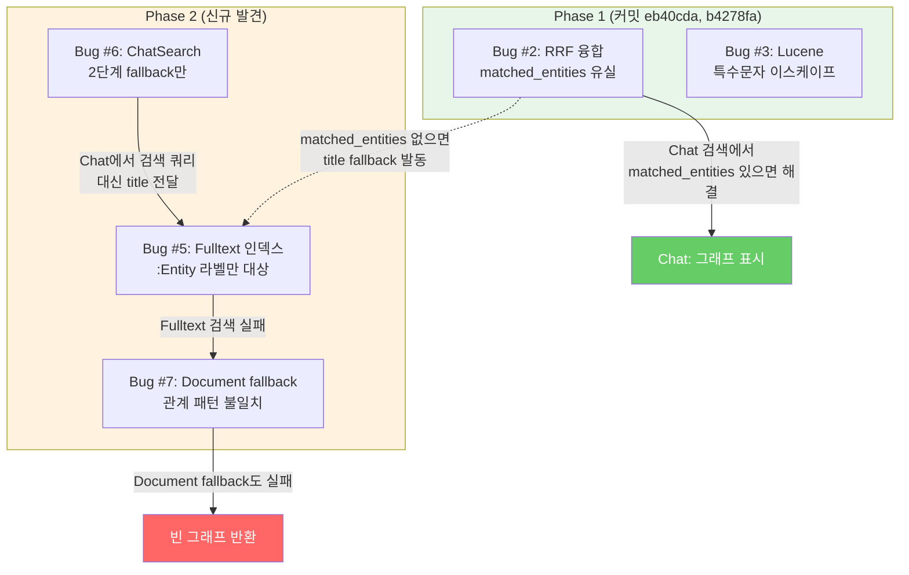
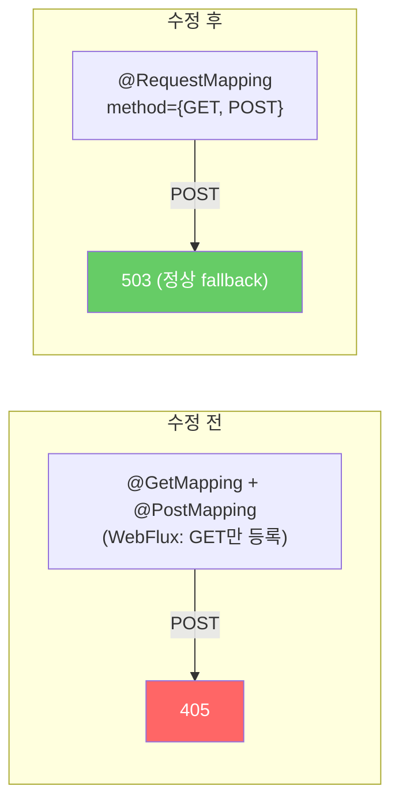
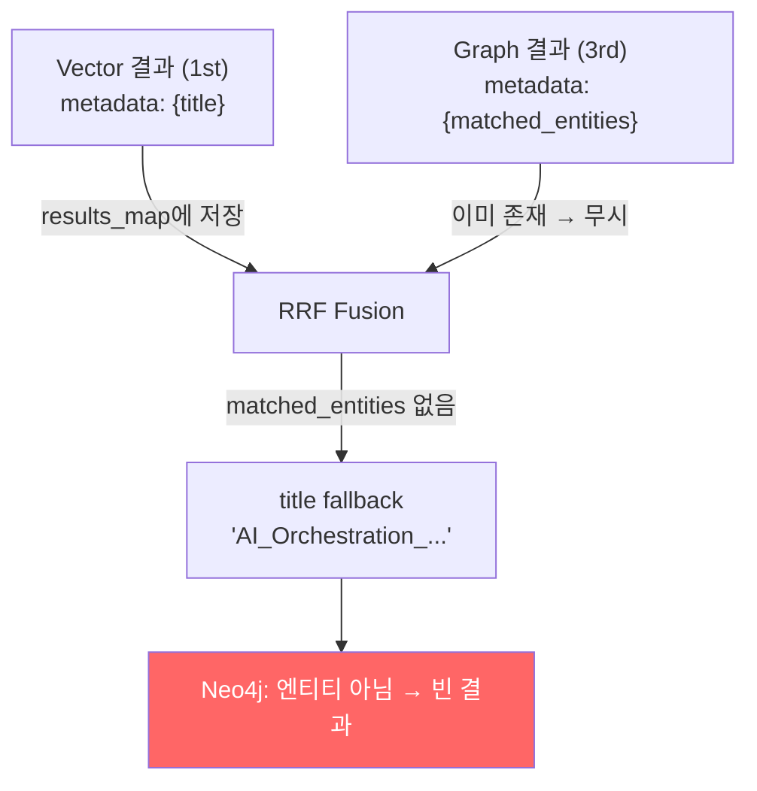
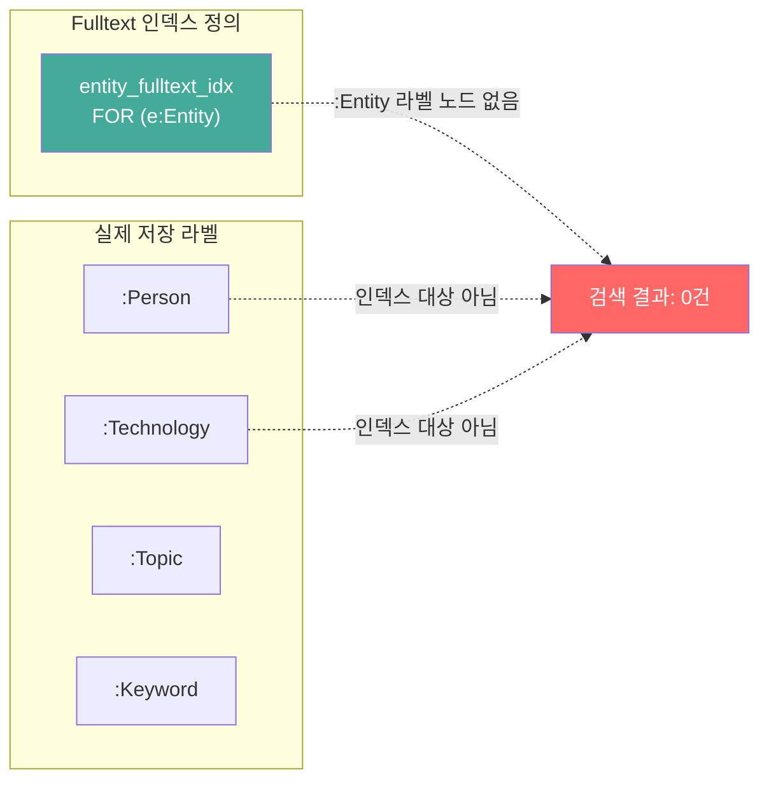
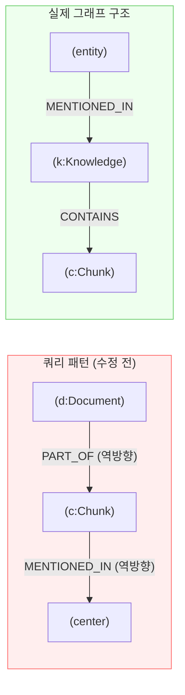
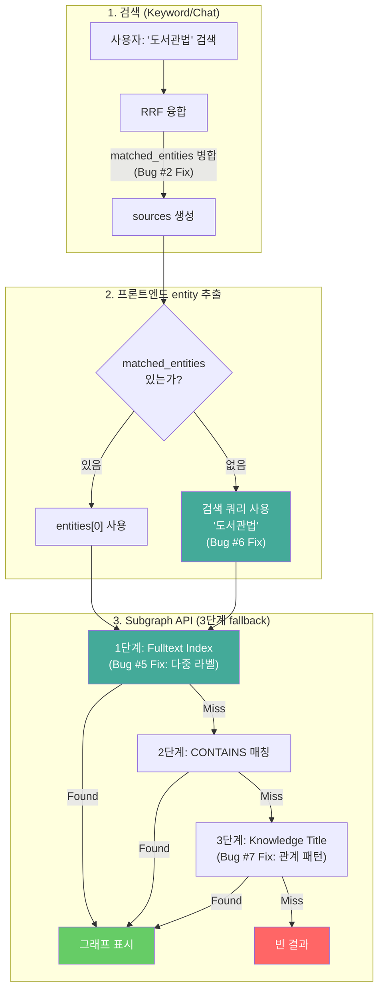
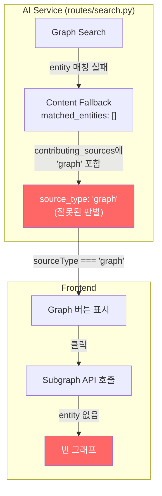

# Bug Fix Report: Gateway 오류 + 그래프 시각화 빈 결과 (종합)

## 기본 정보

| 항목 | 내용 |
|------|------|
| **보고일** | 2026-02-11 |
| **최종 수정일** | 2026-02-11 (Phase 3 추가) |
| **수정자** | Agent Teams (TechLead 분석 → RAG/Frontend/Backend 구현) |
| **우선순위** | High |
| **상태** | Phase 1: 완료, Phase 2: 완료, Phase 3: 완료 |
| **커밋** | Phase 1: `eb40cda`, `b4278fa` / Phase 2: `c097c74` / Phase 3: `7b9f326` |
| **영향 범위** | Chat/Keyword 검색 그래프 시각화, Gateway Fallback, Subgraph API |
| **관련 이슈** | ISSUE-011 (그래프 패널 엔티티명), SCRUM-101 (graph 소스 태깅) |

---

## 버그 요약

이 보고서는 그래프 시각화 관련 **8건의 버그**를 3단계(Phase)에 걸쳐 다룹니다.

| # | 버그 | 증상 | 근본 원인 | Phase |
|---|------|------|-----------|-------|
| 1 | Gateway 405 Method Not Allowed | POST `/api/v1/search/chat` → 405 | FallbackController 어노테이션 + CB 설정 | 1 |
| 2 | 그래프 빈 결과 (RRF 융합) | Chat 검색 → 빈 그래프 | RRF 융합에서 `matched_entities` 유실 | 1 |
| 3 | Lucene 특수문자 파싱 오류 | `CI/CD` → 500 Error | Fulltext 쿼리에 Lucene 특수문자 미이스케이프 | 1 |
| 4 | AI Service 503 Timeout | Chat 검색 → 503 | Gateway 타임아웃(60s) < AI 처리시간(91s) | 1 |
| 5 | Fulltext 인덱스 라벨 불일치 | Keyword 검색 → 빈 그래프 | 인덱스 `:Entity` vs 실제 `:Person/:Topic/...` | 2 |
| 6 | ChatSearch entity 추출 미흡 | Chat 검색 → 문서제목 전달 | ChatSearch 2단계 fallback (KeywordSearch 4단계와 불일치) | 2 |
| 7 | Document fallback 관계 패턴 | 3단계 fallback 항상 실패 | 쿼리 패턴 ≠ 실제 그래프 구조 | 2 |
| **8** | **Graph 배지 UX 모순** | **Graph 버튼 클릭 → 빈 그래프** | **`matched_entities` 없는데 `source_type: "graph"` 반환** | **3** |

### Phase 간 관계



**Phase 1**은 `matched_entities`가 존재하는 경우(Graph 소스 직접 매칭)를 해결했습니다.
**Phase 2**는 `matched_entities`가 없는 경우(Keyword 검색, 간접 매칭)에서 fallback 체인 전체가 실패하는 근본 원인을 해결합니다.

---

## Phase 1 버그 상세

### Bug #1: Gateway 405 Method Not Allowed

**증상**: POST `/api/v1/search/chat` → 405 (Spring Boot 형식 응답)

**원인 2가지**:

1. **FallbackController 어노테이션**: `@GetMapping` + `@PostMapping` 스택 시 WebFlux에서 GET만 등록



2. **Circuit Breaker 과소 설정**: `slow-call-duration-threshold: 5s` → LLM 호출(15~50초)을 모두 "느린 호출"로 판정 → CB OPEN → Fallback 라우팅

| 설정 | 수정 전 | 수정 후 |
|------|--------|--------|
| `slow-call-duration-threshold` | 5s | 30s |
| `sliding-window-size` | 5 | 10 |
| `slow-call-rate-threshold` | 80 | 90 |

**수정 파일**: `FallbackController.java`, `gateway/application.yml`
**검증**: POST `/api/v1/search/chat` → 200 OK, 51.6s

---

### Bug #2: 그래프 시각화 빈 결과 (RRF 융합)

**증상**: Chat 검색 결과에서 그래프 아이콘 클릭 → `nodes: [], edges: []`

**원인**: RRF 융합에서 동일 chunk_id의 Graph 소스 `matched_entities`가 유실



**수정 3건**:

| Fix | 파일 | 내용 |
|-----|------|------|
| Fix 1 | `search.py` `_rrf_fusion()` | Graph 소스의 `matched_entities`를 기존 결과에 병합 |
| Fix 2 | `rag_workflow.py` `_extract_entities_from_title()` | 제목 전체 반환 → 키워드 분리 (불용어/날짜 제거) |
| Fix 3 | `neo4j_storage.py` `query_subgraph()` | 3단계 fallback: Fulltext → CONTAINS → Document Title |

**검증**: Chat 검색 → `related_entities: ["CI/CD", "Kubernetes"]` → subgraph: nodes=3, edges=3

---

### Bug #3: Lucene 특수문자 파싱 오류

**증상**: `CI/CD` entity → 500 Internal Server Error (TokenMgrError)

**원인**: Neo4j Fulltext는 Lucene Query Parser 사용. `/`는 정규식 구분자로 해석.

**수정**: `_escape_lucene()` 함수 추가 (Lucene 특수문자 `+ - && || ! ( ) { } [ ] ^ " ~ * ? : \ /` 이스케이프)

| 입력 | 이스케이프 후 | 결과 |
|------|-------------|------|
| `CI/CD` | `CI\/CD` | 3 nodes |
| `C++` | `C\+\+` | 정상 검색 |

**수정 파일**: `neo4j_storage.py`
**검증**: POST subgraph `CI/CD` → 200 OK, nodes=3

---

### Bug #4: AI Service 503 Timeout

**증상**: Chat 검색 → 503 Service Unavailable (특정 프롬프트)

**원인**: CPU 환경에서 Cold Start 91초 (Gateway 타임아웃 60초 초과)

| 단계 | Cold Start | Warm |
|------|-----------|------|
| 임베딩 모델 로드 | **46초** | 0초 |
| Hybrid Search | 9초 | 2초 |
| LLM 생성 | 35초 | 31초 |
| **합계** | **91초** | **34초** |

**수정**: Gateway/Resilience4j/Backend 타임아웃 60s → **120s** 통일

**검증**: Cold Start → 200 OK, 62.2s / Warm → 200 OK, 33.7s

---

## Phase 2 버그 상세

> **발견 경위**: "도서관법" Keyword 검색에서 10건 결과(200 OK) 반환됨에도 그래프가 빈 결과.
> Phase 1 수정(Bug #2)이 적용되어 있음에도 동일 증상 재현.

### Bug #5: Neo4j Fulltext 인덱스 라벨 불일치 (P0, 가장 핵심)

**증상**: 모든 검색 유형에서 Fulltext 기반 subgraph 조회가 항상 실패

**근본 원인**: 인덱스 대상 라벨과 실제 저장 라벨의 불일치



**인덱스 정의** (`03_neo4j_constraints.cypher:70-71`):
```cypher
CREATE FULLTEXT INDEX entity_fulltext_idx IF NOT EXISTS
FOR (e:Entity) ON EACH [e.name, e.description];
```

**엔티티 저장** (`neo4j_storage.py:37-45`, `_ENTITY_TYPE_LABEL_MAP`):
```python
_ENTITY_TYPE_LABEL_MAP = {
    "person": "Person",
    "technology": "Technology",
    "topic": "Topic",
    "keyword": "Keyword",
    # "Entity" 라벨로 저장하지 않음!
}
```

`:Entity` 라벨 노드가 **존재하지 않으므로** Fulltext 검색이 항상 0건 반환 → 1단계 fallback 무조건 실패.

**수정**:
```cypher
-- 기존 인덱스 삭제 후 다중 라벨로 재생성
DROP INDEX entity_fulltext_idx IF EXISTS;
CREATE FULLTEXT INDEX entity_fulltext_idx IF NOT EXISTS
FOR (n:Person|Technology|Topic|Keyword|Entity)
ON EACH [n.name, n.description];
```

**수정 파일**: `infrastructure/docker/init-db/03_neo4j_constraints.cypher` + 실행 중 Neo4j에 직접 적용

---

### Bug #6: ChatSearch entity_name 추출 로직 미흡

**증상**: Chat 검색에서 `matched_entities`가 비어있으면 문서 제목이 그대로 entity_name으로 전달

**원인**: KeywordSearch와 ChatSearch의 fallback 로직 불일치

| 순위 | KeywordSearch.tsx (Phase 1 수정 완료) | ChatSearch.tsx (Phase 2 전) |
|------|--------------------------------------|----------------------------|
| 1순위 | `graphContext.relatedEntities` | `graphContext.relatedEntities` |
| 2순위 | `submittedQuery` (검색 키워드) | ~~없음~~ |
| 3순위 | title 정리 (괄호 제거) | `source.title` (raw) |
| 4순위 | `metadata.projectName` | ~~없음~~ |

**사례**: "도서관법" Keyword 검색 → `matched_entities: []` → `submittedQuery: "도서관법"` 사용 (정상)
하지만 Chat 검색에서 동일 상황 시 → `title: "법령용어한영사전(부록)"` 그대로 전달 (실패)

**수정**: ChatSearch.tsx의 `handleGraphSourceClick`을 KeywordSearch와 동일한 4단계 fallback으로 통일

```typescript
// ChatSearch.tsx - 수정 후
const handleGraphSourceClick = (source) => {
  // 1순위: matched_entities
  const entities = source.graphContext?.relatedEntities || [];
  if (entities.length > 0) { /* 사용 */ }

  // 2순위: 마지막 사용자 메시지 (검색 쿼리)
  const lastUserMsg = messages.filter(m => m.role === 'user').pop();
  if (lastUserMsg?.content) { /* 사용 */ }

  // 3순위: title 정리 (괄호 제거)
  const cleaned = source.title.replace(/\([^)]*\)/g, '').trim();

  // 4순위: metadata.projectName
};
```

**수정 파일**: `frontend/src/features/search/ChatSearch.tsx`

---

### Bug #7: Document fallback 관계 패턴 불일치

**증상**: `query_subgraph()` 3단계 Document Title fallback이 항상 실패

**원인**: fallback 쿼리의 관계 패턴이 실제 그래프 구조와 불일치



| 항목 | 쿼리 패턴 (수정 전) | 실제 구조 |
|------|---------------------|----------|
| 문서 라벨 | `:Document` | `:Knowledge` |
| 문서→청크 관계 | `(c)-[:PART_OF]->(d)` | `(k)-[:CONTAINS]->(c)` |
| 엔티티→문서 관계 | `(center)-[:MENTIONED_IN]->(c)` | `(e)-[:MENTIONED_IN]->(k)` |

**수정**: 쿼리를 실제 그래프 구조에 맞게 변경
```cypher
-- 수정 후
MATCH (k:Knowledge)
WHERE k.title CONTAINS $entity_name
MATCH (e)-[:MENTIONED_IN]->(k)
WHERE e:Person OR e:Technology OR e:Topic OR e:Keyword
RETURN e, k
```

**수정 파일**: `knowledge_service/src/app/storage/neo4j_storage.py`

---

## 전체 수정 파일 목록

### Phase 1 (커밋: `eb40cda`, `b4278fa`)

| 파일 | 변경 | 버그 |
|------|------|------|
| `gateway/.../FallbackController.java` | `@RequestMapping(method={GET,POST})` 통일 | #1 |
| `gateway/.../application.yml` | CB 임계값 + 타임아웃 조정 | #1, #4 |
| `backend/.../application.yml` | `ai-service.timeout` 60→120s | #4 |
| `src/app/services/search.py` | RRF 융합 `matched_entities` 병합 | #2 |
| `src/app/agents/rag_workflow.py` | `_extract_entities_from_title()` 키워드 분리 | #2 |
| `src/app/storage/neo4j_storage.py` | 3단계 fallback + `_escape_lucene()` | #2, #3 |

### Phase 2 (미커밋)

| 파일 | 변경 | 버그 |
|------|------|------|
| `infrastructure/docker/init-db/03_neo4j_constraints.cypher` | Fulltext 인덱스 다중 라벨 | #5 |
| Neo4j 실행 중 인덱스 재생성 | `DROP` + `CREATE` 직접 실행 | #5 |
| `src/app/storage/neo4j_storage.py` | Document fallback 관계 패턴 수정 | #7 |
| `frontend/.../ChatSearch.tsx` | 4단계 entity fallback 통일 | #6 |
| `frontend/.../KeywordSearch.tsx` | hasGraphData 조건 확장 | #6 |

---

## End-to-End 데이터 흐름 (Phase 1+2 수정 후)



---

## 재발 방지 대책

### 즉시 (Phase 2 완료 시)

| 항목 | 조치 |
|------|------|
| **Neo4j 인덱스 검증** | 인덱스 라벨과 실제 저장 라벨 일치 여부 확인 스크립트 추가 |
| **Redis 캐시 클리어** | 코드 수정 후 `FLUSHDB`로 오래된 메타데이터 제거 |
| **Frontend 일관성** | ChatSearch/KeywordSearch의 entity 추출 로직 통일 확인 |

### 단기

| 항목 | 조치 |
|------|------|
| **E2E 테스트** | Keyword 검색 → Graph 클릭 → Subgraph 비어있지 않음 검증 |
| **RRF 융합 단위 테스트** | Vector+Graph 중복 chunk의 `matched_entities` 보존 검증 |
| **Lucene 특수문자 테스트** | `CI/CD`, `C++`, `(부록)` 등 특수문자 엔티티 검증 |
| **인덱스 라벨 정합성 테스트** | `SHOW INDEXES` 결과와 `_ENTITY_TYPE_LABEL_MAP` 비교 자동 검증 |

### 중기

| 항목 | 조치 |
|------|------|
| **KG 추출 확장** | 현재 5개 Knowledge만 엔티티 연결 → 전체 문서 Entity Extraction |
| **Graph 품질 대시보드** | 문서별 엔티티 연결 수 모니터링 |
| **Circuit Breaker 모니터링** | Grafana 대시보드에 CB 상태 패널 추가 |

---

## 교훈

### 1. Chat/Keyword 검색 경로의 차이
Phase 1에서 Chat 검색으로만 검증하여 Keyword 검색 경로의 문제를 놓침.
**모든 검색 유형(Chat, Keyword, Hybrid)에서 교차 검증 필수.**

### 2. 인덱스-스토리지 정합성
인덱스 정의(`03_neo4j_constraints.cypher`)와 데이터 저장 로직(`neo4j_storage.py`)이 별도 파일에 분산되어 있어 불일치 발견이 어려움.
**인덱스 생성 시 실제 저장 라벨과의 일치 여부를 코드 리뷰에서 반드시 확인.**

### 3. Fallback 체인의 각 단계 독립 검증
3단계 fallback이 존재하더라도 각 단계가 독립적으로 실패할 수 있음.
**각 fallback 단계의 개별 동작을 단위 테스트로 검증.**

### 4. API 응답이 UI의 진실 소스 (Phase 3 교훈)
UI 버그로 보이더라도 먼저 API 응답 데이터의 정합성을 확인해야 함.
`source_type: "graph"`를 API가 잘못 내려보내면 Frontend는 신뢰하고 Graph 버튼을 표시할 수밖에 없음.
**데이터 소스(API)를 먼저 의심하고, UI는 그 다음에 검증.**

---

## Phase 3 버그 상세

### Bug #8: Graph 배지 UX 모순 (가장 근본적)

**증상**: "도서관법" Keyword 검색 → 결과에 Graph 버튼 표시 → 클릭 시 빈 그래프

**근본 원인**: AI Service API가 `matched_entities`가 비어있는데도 `source_type: "graph"`를 반환



**수정 2건**:

| Fix | 파일 | 내용 |
|-----|------|------|
| Fix 1 | `src/app/api/routes/search.py` | `source_type: "graph"` 설정 시 `matched_entities` 비어있지 않은지 확인 |
| Fix 2 | `frontend/.../KeywordSearch.tsx`, `SourceCitation.tsx` | Graph 버튼 표시 조건을 `relatedEntities` 존재 여부로 제한 |

**수정 코드 (Backend - 핵심)**:
```python
# 수정 전: contributing_sources만 확인
source_type=(
    "graph" if "graph" in r.metadata.get("contributing_sources", [])
    else ...
)

# 수정 후: matched_entities + contributing_sources 둘 다 확인
source_type=(
    "graph" if bool(r.metadata.get("matched_entities"))
    and "graph" in r.metadata.get("contributing_sources", [])
    else ...
)
```

**검증**: QA 4/4 PASS
- "도서관법" 검색 → source_type ≠ "graph" (matched_entities 없음) ✅
- "AI" subgraph → nodes=38, edges=111 정상 ✅

---

## 전체 수정 파일 목록 (Phase 3 추가)

### Phase 3 (커밋: `7b9f326`)

| 파일 | 변경 | 버그 |
|------|------|------|
| `src/app/api/routes/search.py` | `source_type` 판별 시 `matched_entities` 체크 추가 | #8 |
| `frontend/.../KeywordSearch.tsx` | `hasGraphData` 조건을 `relatedEntities` 기반으로 제한 | #8 |
| `frontend/.../SourceCitation.tsx` | Graph 버튼 조건을 `relatedEntities` 기반으로 변경 | #8 |

---

## 참고

- [Circuit Breaker 운영 매뉴얼](./12_circuit_breaker_operations_manual.md)
- [Neo4j 쿼리 가이드](./15_neo4j_query_guide.md)
- [Graph Search 구현 문서](../03_implementation/graph_search_implementation_2026-02-07.md)
