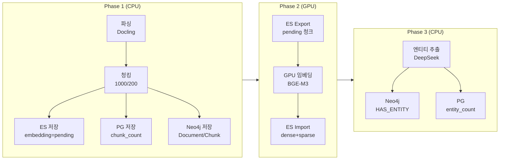
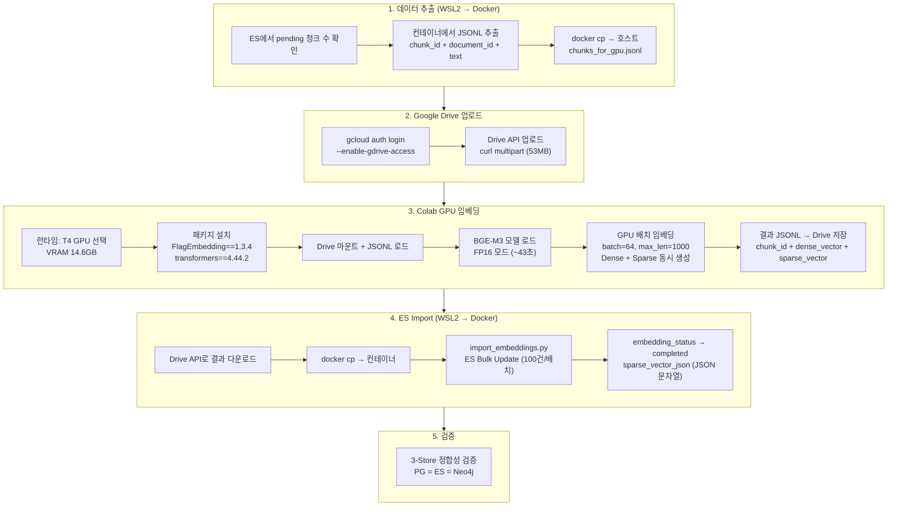

# ETL 3-Phase 파이프라인 운영 가이드

**Version**: 1.2 | **Updated**: 2026-02-25

---

## 1. 파이프라인 개요

### 1.1 3-Phase 아키텍처



### 1.2 Phase별 역할

| Phase | 환경 | 소요시간 | 핵심 작업 |
|-------|------|---------|----------|
| **Phase 1** | CPU (Docker) | ~6시간/1,786파일 | 파싱 + 청킹 → ES/PG/Neo4j |
| **Phase 2** | GPU (Colab T4) | 13.5분/53,414청크 | dense+sparse 임베딩 ✅ |
| **Phase 3** | CPU (Docker) | ~43h (3워커) / ~128h (1워커) | 엔티티 추출 → Neo4j (MENTIONS/RELATED) |

---

## 2. Phase 1: 파싱 + 청킹

### 2.1 실행 방법

```bash
# 1. 컨테이너 최신 빌드 (코드 변경 시 필수)
docker-compose build ai-service
docker-compose up -d ai-service

# 2. Phase 1 실행 (컨테이너 내 nohup 필수)
docker exec kp-ai-service bash -c "nohup python3 /app/scripts/run_etl_phase1_chunks.py > /tmp/etl_phase1.log 2>&1 &"

# 3. 로그 확인
docker exec kp-ai-service tail -20 /tmp/etl_phase1.log
```

### 2.2 핵심 파라미터

```python
# run_etl_phase1_chunks.py
InitialDataLoader(
    chunk_size=1000,       # 청크 크기 (토큰)
    chunk_overlap=200,     # 오버랩
    batch_size=4,          # CPU 최적값 (8은 역효과)
    max_retries=2,         # 재시도 횟수
    continue_on_error=True,
    enable_embeddings=False,        # Phase 1: OFF
    enable_entity_extraction=False, # Phase 3에서 처리
)
```

### 2.3 중복 파일 처리 (Dedup)

- SHA-256 파일 해시로 중복 검사
- PG `documents.file_hash` + `processing_status='completed'` 조건
- 동일 파일은 SKIP (데이터 미생성, 기존 doc_id 유지)
- 기존 데이터 삭제 필요 시: PG/ES/Neo4j 모두 수동 삭제 필요

### 2.4 모니터링

```bash
# 모니터 시작 (15분 간격, Slack dev 채널 보고)
nohup bash knowledge_service/scripts/etl_phase1_monitor.sh > /tmp/etl_phase1_monitor.log 2>&1 &

# 모니터 확인
ps aux | grep "etl.*monitor" | grep -v grep

# 모니터 종료
kill <PID>
```

**모니터 보고 항목**: 진행률 바, 성공/스킵/실패 수, ES 청크 수, PG 문서 수, CPU/메모리

### 2.5 완료 확인

```bash
# 로그에서 완료 확인
docker exec kp-ai-service grep "Phase 1 Completed" /tmp/etl_phase1.log

# 진행 상황 JSON
docker exec kp-ai-service cat /app/knowledge_data/etl_phase1_progress.json

# DB 검증
curl -s http://localhost:9200/knowledge_chunks/_count | python3 -c "import sys,json; print('ES chunks:', json.load(sys.stdin)['count'])"
docker exec kp-postgresql psql -U knowledge -d knowledge -t -c "SELECT count(*), sum(chunk_count) FROM documents;"
```

---

## 3. Phase 2: GPU 임베딩 (Colab)

### 3.1 전체 워크플로우

Phase 2는 Phase 1에서 생성된 청크에 Dense(1024d) + Sparse 벡터를 GPU로 고속 생성하는 단계이다. Google Colab T4 GPU를 활용하며, CPU 대비 **약 94배** 빠르다.



### 3.2 Colab 노트북 및 상세 매뉴얼

| 자료 | 경로 | 설명 |
|------|------|------|
| **실행 노트북** | `docs/07_maintenance/gpu_embedding_colab.ipynb` | Colab에서 직접 실행 가능 (8셀, 실행 결과 포함) |
| **상세 매뉴얼** | `docs/07_maintenance/30_gpu_embedding_colab_manual.md` | gcloud 인증, Drive 업/다운, ES Import, 트러블슈팅 |

### 3.3 준비

Phase 1 완료 후, embedding_status=pending인 청크를 Colab로 전송:

```bash
# pending 청크 수 확인
curl -s 'http://localhost:9200/knowledge_chunks/_count' -H 'Content-Type: application/json' \
  -d '{"query":{"term":{"embedding_status":"pending"}}}' | python3 -c "import sys,json; print(json.load(sys.stdin)['count'])"
```

### 3.4 Colab 노트북 핵심 설정

```python
# BGE-M3 GPU 임베딩 (gpu_embedding_colab.ipynb Cell 6)
from FlagEmbedding import BGEM3FlagModel
model = BGEM3FlagModel("BAAI/bge-m3", use_fp16=True)  # T4 GPU

result = model.encode(
    texts,
    batch_size=64,       # GPU 최적값 (CPU에서는 4)
    max_length=1000,     # 기존 데이터 일관성 유지
    return_dense=True,   # 1024차원 Dense 벡터
    return_sparse=True,  # 토큰별 Sparse 가중치
    return_colbert_vecs=False  # 미사용 (메모리 절약)
)
```

### 3.5 최적 파라미터 (확정, 2026-02-10)

| 파라미터 | CPU 값 | GPU 값 | 비고 |
|---------|--------|--------|------|
| batch_size | 4 | 64 | CPU 8은 역효과 (55초→7초) |
| max_text_length | 1000 | 1000 | 1500은 OOM (7.3GB+) |
| workers | 1 | - | CPU 2워커는 경합 |
| use_fp16 | False | True | GPU에서만 fp16 사용 |

### 3.6 Phase 2 실행 결과 (2026-02-15)

| 항목 | 값 |
|------|-----|
| GPU 임베딩 | 53,414건, **65.6 c/s**, 814.8초 (13.5분) |
| CPU 보충 임베딩 | 2,649건, 1.2 c/s, 38.3분 |
| ES Import | 53,414건, **434 docs/s**, 123초 |
| 최종 완료 | **56,063건 (100%)** |
| Sparse 저장 형식 | `sparse_vector_json` (JSON 문자열) |
| 비용 | **$0** (Colab Free Tier) |

> **주의**: Sparse vector를 ES object로 저장하면 동적 매핑 폭발이 발생한다. 반드시 JSON 문자열(`sparse_vector_json`)로 저장해야 한다. 상세: [GPU 임베딩 Colab 매뉴얼 Section 9.7](./30_gpu_embedding_colab_manual.md)

---

## 4. Phase 3: 엔티티 추출

### 4.1 실행 방법

```bash
# 단일 워커 실행
docker exec kp-ai-service bash -c "nohup bash -c 'ENTITY_MIN_TOKENS=50 ENTITY_CONCURRENCY=3 python3 /app/scripts/batch_entity_extraction.py' > /tmp/entity_extraction.log 2>&1 &"

# 3-워커 병렬 실행 (API Key 3개 필요)
# Step 1: 체크포인트 시딩 (기존 처리 완료 ID 복사)
docker exec kp-ai-service bash -c 'python3 -c "
import json, shutil
cp = json.load(open(\"/tmp/entity_checkpoint.json\"))
ids = cp.get(\"processed_ids\", [])
for w in range(3):
    d = {\"processed_ids\": ids, \"stats\": {\"total_entities\":0,\"total_relationships\":0,\"total_chunks_processed\":0,\"total_errors\":0,\"start_time\":None,\"last_save_time\":None}}
    json.dump(d, open(\"/tmp/entity_checkpoint_w%d.json\" % w, \"w\"))
"'

# Step 2: 3개 워커 동시 실행
docker exec kp-ai-service bash -c 'nohup bash -c "ENTITY_MIN_TOKENS=50 ENTITY_CONCURRENCY=3 ENTITY_PARTITION=0/3 ENTITY_CHECKPOINT_FILE=/tmp/entity_checkpoint_w0.json DEEPSEEK_API_KEY=<KEY1> python3 /app/scripts/batch_entity_extraction.py" > /tmp/entity_w0.log 2>&1 &'
docker exec kp-ai-service bash -c 'nohup bash -c "ENTITY_MIN_TOKENS=50 ENTITY_CONCURRENCY=3 ENTITY_PARTITION=1/3 ENTITY_CHECKPOINT_FILE=/tmp/entity_checkpoint_w1.json DEEPSEEK_API_KEY=<KEY2> python3 /app/scripts/batch_entity_extraction.py" > /tmp/entity_w1.log 2>&1 &'
docker exec kp-ai-service bash -c 'nohup bash -c "ENTITY_MIN_TOKENS=50 ENTITY_CONCURRENCY=3 ENTITY_PARTITION=2/3 ENTITY_CHECKPOINT_FILE=/tmp/entity_checkpoint_w2.json DEEPSEEK_API_KEY=<KEY3> python3 /app/scripts/batch_entity_extraction.py" > /tmp/entity_w2.log 2>&1 &'
```

### 4.2 핵심 파라미터

| 파라미터 | 환경변수 | 기본값 | 설명 |
|---------|---------|-------|------|
| 최소 토큰 | `ENTITY_MIN_TOKENS` | 150 | 처리 대상 최소 token_count (**50 권장**) |
| 동시 처리 | `ENTITY_CONCURRENCY` | 3 | 워커당 동시 LLM 호출 수 |
| 배치 크기 | `ENTITY_BATCH_SIZE` | 50 | 체크포인트 저장 간격 |
| 파티셔닝 | `ENTITY_PARTITION` | "" | "ID/TOTAL" (예: "0/3" = 3워커 중 첫째) |
| 체크포인트 | `ENTITY_CHECKPOINT_FILE` | /tmp/entity_checkpoint.json | 워커별 분리 시 `_w0`, `_w1` 등 |
| API 키 | `DEEPSEEK_API_KEY` | (컨테이너 env) | 워커별 다른 키 지정 가능 |
| Gleaning | `ENTITY_MAX_GLEANINGS` | 1 | 2-pass extraction |

### 4.3 핵심 로직

- `batch_entity_extraction.py`로 청크 단위 엔티티/관계 추출
- DeepSeek V3.2 API: 1차 추출 → Gleaning(누락 보완) → 관계 추출 (3-pass)
- Neo4j: `(Chunk)-[:MENTIONS]->(Entity)` 관계 생성
- Neo4j: `(Entity)-[:RELATED]->(Entity)` 의미적 관계 생성
- Neo4j: `c.entity_extracted=true`, `c.entity_count` 업데이트
- 체크포인트 기반 중단/재개 지원

### 4.4 모니터링

```bash
# 각 워커 로그 확인
docker exec kp-ai-service tail -5 /tmp/entity_w0.log
docker exec kp-ai-service tail -5 /tmp/entity_w1.log
docker exec kp-ai-service tail -5 /tmp/entity_w2.log

# 처리 완료 수 확인 (각 워커 체크포인트)
docker exec kp-ai-service bash -c 'for w in 0 1 2; do echo -n "Worker $w: "; python3 -c "import json; print(len(json.load(open(\"/tmp/entity_checkpoint_w${w}.json\"))[\"processed_ids\"]))" 2>/dev/null || echo "N/A"; done'

# Neo4j 전체 MENTIONS 수 확인
docker exec kp-ai-service bash -c 'python3 -c "
from neo4j import GraphDatabase
d = GraphDatabase.driver(\"bolt://neo4j:7687\", auth=(\"neo4j\", \"neo4j_dev_2026!\"))
with d.session() as s:
    r = s.run(\"MATCH ()-[m:MENTIONS]->() RETURN count(m) as cnt\")
    print(\"MENTIONS:\", r.single()[\"cnt\"])
d.close()
"'
```

### 4.5 실행 이력

| 실행 | 날짜 | 설정 | 대상 | 결과 |
|------|------|------|------|------|
| 1차 | 2026-02-15 | MIN_TOKENS=100, 2워커 | 16,185건 | 완료 (70,855 엔티티) |
| 2차 | 2026-02-16 | MIN_TOKENS=50, **3워커** | 23,074건 | **진행 중** |

### 4.6 token_count < 50 쓰레기 데이터

| 범위 | 청크 수 | 설명 |
|------|--------:|------|
| 0-9 | ~3,000 | 빈 문자열, 단일 기호 |
| 10-29 | ~7,000 | 테이블 셀 조각 ("항목", "---") |
| 30-49 | ~6,766 | 짧은 구분선, 캡션 |

→ Phase 1 청킹에서 테이블/구분선이 개별 청크로 분리된 결과. **엔티티 추출 대상 제외** (token_count < 50).

---

## 5. 트러블슈팅

### 5.1 nohup vs docker exec -d

```bash
# ❌ docker exec -d는 셸 끊기면 종료됨
docker exec -d kp-ai-service python3 /app/scripts/run_etl.py

# ✅ nohup으로 컨테이너 내부에서 실행
docker exec kp-ai-service bash -c "nohup python3 /app/scripts/run_etl.py > /tmp/etl.log 2>&1 &"
```

### 5.2 PG chunk_count 수동 보정

Phase 1 코드 버그로 chunk_count가 잘못 저장된 경우:

```bash
# 1. ES에서 문서별 실제 청크 수 추출
curl -s 'http://localhost:9200/knowledge_chunks/_search' \
  -H 'Content-Type: application/json' \
  -d '{"size":0,"aggs":{"by_doc":{"terms":{"field":"document_id","size":300}}}}' \
  > /tmp/es_agg.json

# 2. Python으로 SQL 생성
python3 -c "
import json
with open('/tmp/es_agg.json') as f:
    data = json.load(f)
buckets = data['aggregations']['by_doc']['buckets']
with open('/tmp/fix.sql', 'w') as f:
    f.write('BEGIN;\n')
    for b in buckets:
        f.write(f\"UPDATE documents SET chunk_count = {b['doc_count']} WHERE id = '{b['key']}'::uuid;\n\")
    f.write('COMMIT;\n')
print(f'{len(buckets)} updates generated')
"

# 3. SQL 실행
docker cp /tmp/fix.sql kp-postgresql:/tmp/fix.sql
docker exec kp-postgresql psql -U knowledge -d knowledge -f /tmp/fix.sql
```

### 5.3 이전 모니터 프로세스 충돌

세션 전환 시 이전 모니터가 계속 실행되어 낡은 데이터를 Slack에 보내는 문제:

```bash
# 1. 실행 중인 모니터 확인
ps aux | grep "etl.*monitor\|embedding.*monitor" | grep -v grep

# 2. 이전 모니터 종료
kill <OLD_PID>

# 3. 새 모니터 시작
nohup bash knowledge_service/scripts/etl_phase1_monitor.sh > /tmp/etl_phase1_monitor.log 2>&1 &
```

### 5.4 DB 연결 정보

| DB | Host | User | Password | Database |
|----|------|------|----------|----------|
| PostgreSQL | localhost:5432 | knowledge | (docker-compose) | knowledge |
| Neo4j | localhost:7687 | neo4j | neo4j_dev_2026! | neo4j |
| Elasticsearch | localhost:9200 | - | - | knowledge_chunks |

### 5.5 Bash에서 특수문자 주의

curl 요청 시 `!` 문자는 bash 히스토리 확장으로 해석됨:

```bash
# ❌ 잘못된 방법
curl -d '{"password":"admin123!"}'  # !가 bash에서 변환됨

# ✅ 올바른 방법 (임시 파일 사용)
cat > /tmp/req.json << 'ENDJSON'
{"password":"admin123!"}
ENDJSON
curl -d @/tmp/req.json
```

---

## 6. 스크립트 목록

| 스크립트/파일 | 위치 | Phase | 용도 |
|-------------|------|:-----:|------|
| `run_etl_phase1_chunks.py` | `knowledge_service/scripts/` | 1 | Phase 1 ETL 실행 |
| `etl_phase1_monitor.sh` | `knowledge_service/scripts/` | 1 | Phase 1 모니터 (15분) |
| **`gpu_embedding_colab.ipynb`** | `knowledge_service/docs/07_maintenance/` | **2** | **Colab GPU 임베딩 노트북** |
| `import_embeddings.py` | `knowledge_service/scripts/` | 2 | ES Bulk Import (GPU 결과) |
| `verify_3store_consistency.py` | `knowledge_service/scripts/` | 2 | 3-Store 정합성 검증 |
| `batch_entity_extraction.py` | `knowledge_service/scripts/` | 3 | 엔티티 추출 (멀티워커) |
| `etl_v2_monitor.sh` | `knowledge_service/scripts/` | - | 전체 ETL v2 모니터 |
| `embedding_monitor.sh` | `knowledge_service/scripts/` | - | 임베딩 전용 모니터 |
| `send_slack.sh` | `scripts/` | - | Slack 메시지 전송 |

자세한 목록: [scripts/README.md](../../../scripts/README.md)

---

## 7. 운영 체크리스트

### 세션 시작 시
- [ ] `ps aux | grep monitor | grep -v grep` → 이전 모니터 확인/종료
- [ ] `docker ps` → 컨테이너 상태 확인
- [ ] `curl -s http://localhost:9200/knowledge_chunks/_count` → ES 상태 확인
- [ ] ETL 진행 중이면 로그 확인

### Phase 전환 시
- [ ] 이전 Phase 완료 확인 (로그 + DB 수치)
- [ ] PG chunk_count/entity_count 정합성 검증
- [ ] 모니터 스크립트 교체
- [ ] Slack 보고

### 세션 종료 시
- [ ] 실행 중 프로세스 기록 (PID, 내용)
- [ ] MEMORY.md 업데이트
- [ ] 작업일지 기록
