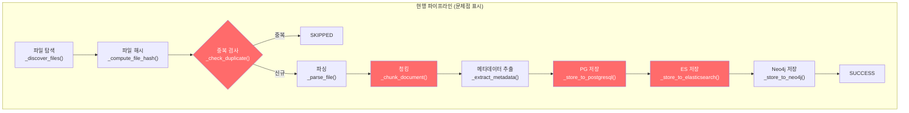
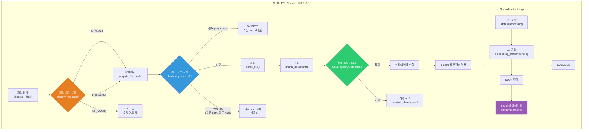
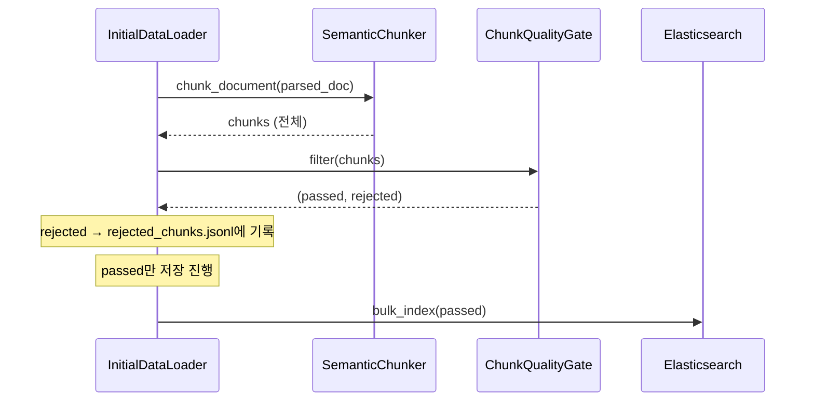
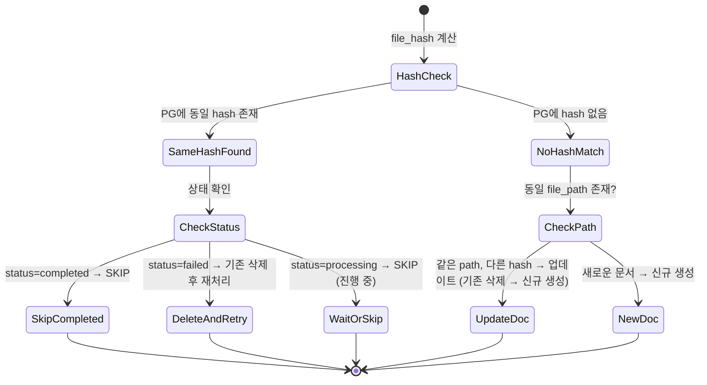
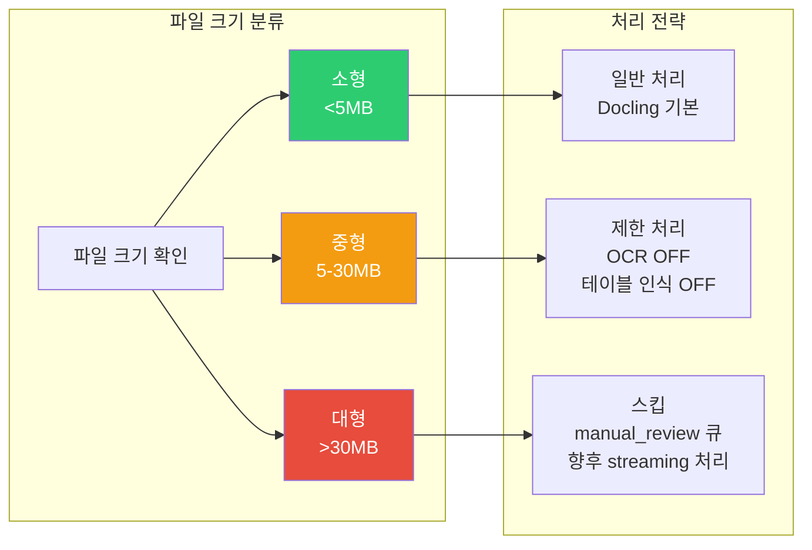
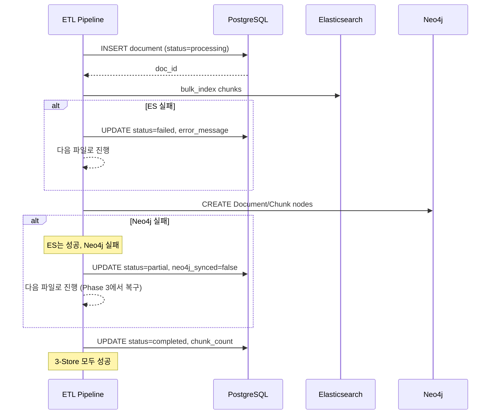
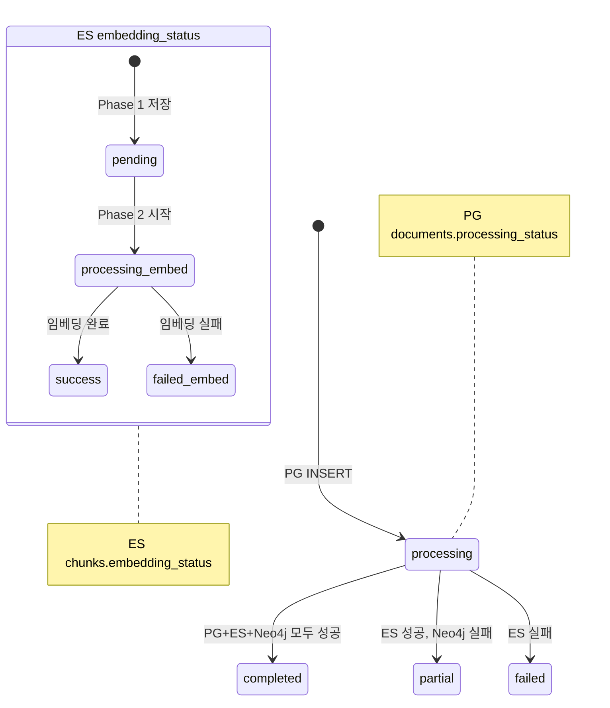
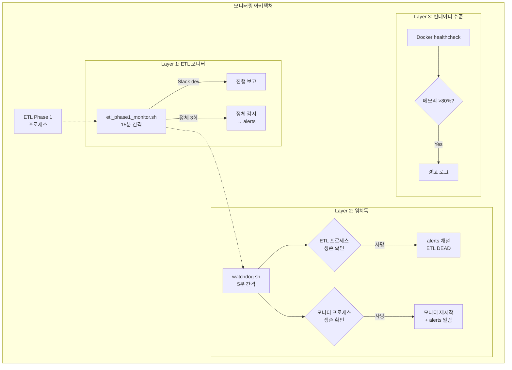
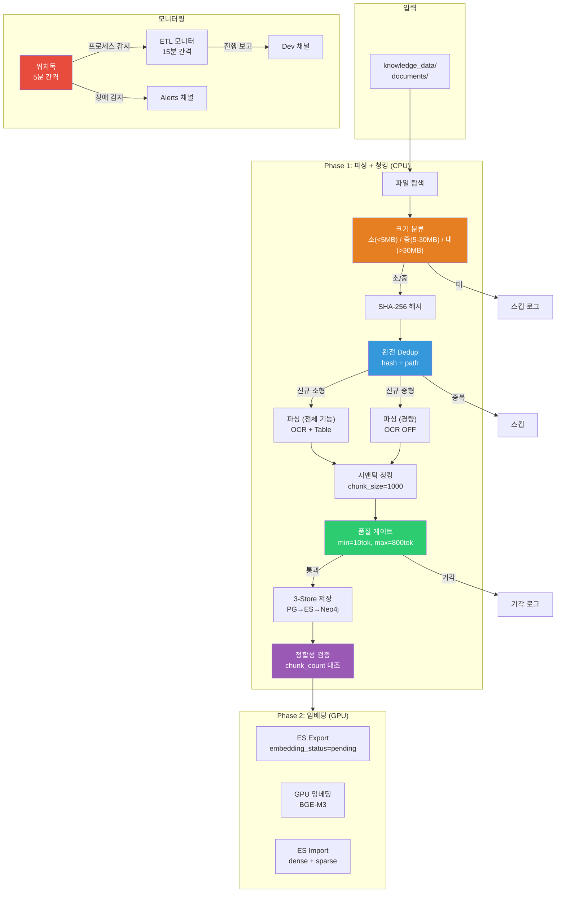

# ETL 아키텍처 반성 및 개선 설계서

## 문서 정보

| 항목 | 내용 |
|------|------|
| 문서명 | ETL Phase 1 아키텍처 반성 및 개선 설계 |
| 버전 | 1.0 |
| 작성일 | 2026-02-14 |
| 작성자 | Architect Agent |
| 상태 | Draft |

---

## 1. 반성문

나는 이 프로젝트의 Software Architect로서 ETL 파이프라인의 설계를 담당했다. Phase 1 실행 결과, 다수의 심각한 품질 문제와 안정성 장애가 발생했다. 이 문제들의 근본 원인은 코드 버그가 아니라 **설계 부재**에 있다.

### 1.1 내가 놓친 것들

**청크 품질 게이트를 파이프라인 외부에 방치했다.**
`ChunkQualityGate` 클래스가 존재하지만, `InitialDataLoader._process_file()` 파이프라인에 통합되어 있지 않다. 이 클래스는 독립적으로 존재할 뿐, 실제 ETL 흐름에서 호출되지 않는다. 설계 단계에서 "청킹 → [품질 검증] → 저장" 흐름을 명시했어야 했고, 구현자가 빠뜨리지 않도록 파이프라인 다이어그램에 필수 단계로 포함시켰어야 했다.

결과: Junk 청크 340개, Short 청크 1,014개가 ES에 그대로 적재되었다.

**chunk_size 파라미터의 의미가 모호했다.**
`InitialDataLoader`의 기본값은 `chunk_size=600` (문자 수)이지만, `run_etl_phase1_chunks.py`에서 `chunk_size=1000`으로 오버라이드한다. 그런데 `SemanticChunker`의 `max_chunk_size`는 기본값 2048이 그대로 적용된다. 코드/테이블 특수 블록은 `max_chunk_size`를 초과해도 분할하지 않는다(`_assemble_chunks` line 462-464). 이로 인해 6,765 tokens짜리 초대형 청크가 생성된다.

설계서에서 chunk_size와 max_chunk_size의 관계, 특수 블록의 크기 제한 정책을 명확히 정의하지 않은 것은 나의 실수다.

**Dedup 로직의 조건이 불완전했다.**
`_check_duplicate()`는 `processing_status = 'completed'` 조건으로만 검색한다. 만약 이전 실행에서 파일이 `failed` 상태로 PG에 저장된 후, 같은 파일이 다시 들어오면 dedup에 걸리지 않고 새 document_id로 저장된다. 이후 failed 건이 재처리되면 동일 파일에 대해 2개의 document가 존재하게 된다.

또한, file_path가 다르지만 내용이 같은 파일(복사본)은 dedup되지만, 같은 path의 파일이 내용이 변경된 경우(업데이트)는 새 해시이므로 중복 document가 생긴다. 이에 대한 정책(스킵 vs 업데이트 vs 버전관리)을 설계하지 않았다.

결과: PG에 29그룹의 중복 문서가 존재한다.

**메모리 관리 전략을 설계하지 않았다.**
46MB PDF가 Docling OCR을 통해 처리될 때 메모리가 10GB를 초과하여 OOM Kill이 발생했다. 파일 크기별 처리 전략(소/중/대), 메모리 사용량 사전 추정, 컨테이너 메모리 제한과의 관계를 전혀 설계하지 않았다. run_etl_phase1_chunks.py에 30MB 파일 스킵이 긴급 패치로 추가되었지만, 이것은 설계가 아니라 땜질이다.

**3-Store 정합성을 보장하는 메커니즘이 없었다.**
PG → ES → Neo4j 순서로 저장하지만, ES나 Neo4j 저장이 실패해도 PG에는 `status='completed'`로 남는다. 이후 dedup 체크에서 이 document는 "완료됨"으로 판단되어 재처리되지 않는다. 결과적으로 PG에만 있고 ES에는 없는 유령 문서가 생길 수 있다.

`embedding_status` 필드도 혼재 상태(success/pending/completed)가 발생했는데, 이는 상태 전이 다이어그램을 설계하지 않아서 각 저장 단계에서 제각기 상태값을 사용한 결과다.

**모니터링 아키텍처를 설계 범위에 포함하지 않았다.**
"모니터링은 운영 영역"이라고 생각하고 설계 범위에서 제외했다. 그러나 ETL처럼 장시간 실행되는 배치 파이프라인에서 모니터링은 아키텍처의 일부다. 모니터 프로세스의 생존 확인, 정체 감지, 알림 에스컬레이션 등이 시스템 설계에 포함되어야 했다.

### 1.2 나의 책임

위 문제들은 모두 **설계 문서에 명시했어야 할 사항들**이다. 구현자가 실수한 것이 아니라, 설계자인 내가 결정해야 할 것들을 결정하지 않고 넘어간 것이다. "좋은 설계는 구현 코드를 예측 가능하게 만든다"는 나의 설계 철학에 비추어, 이번 ETL 파이프라인은 예측 불가능한 구현 결과를 양산했다.

꼼수 없이 인정한다: **이번 장애의 아키텍처적 근본 원인은 나의 설계 부재다.**

---

## 2. 현재 아키텍처 문제점 분석

### 2.1 현행 ETL Phase 1 파이프라인



### 2.2 발견된 7가지 문제

| # | 문제 | 근본 원인 | 영향 |
|---|------|----------|------|
| 1 | Junk 청크 340개 (<3 tokens) | ChunkQualityGate가 파이프라인에 미통합 | ES에 쓰레기 데이터 적재 |
| 2 | Short 청크 1,014개 (<10 tokens) | 동일 원인 | 임베딩 자원 낭비, 검색 품질 저하 |
| 3 | Ultra-long 청크 88개 (>500 tokens, 최대 6,765) | 특수 블록(코드/테이블)의 max_chunk_size 미적용 | 임베딩 잘림, 검색 정확도 하락 |
| 4 | PG 문서 중복 29그룹 | dedup이 `completed` 상태만 확인 + path 기반 중복 미처리 | 3-Store 정합성 파괴 |
| 5 | embedding_status 3종 혼재 | 상태 전이 정의 부재 | Phase 2 추출 시 혼란 |
| 6 | OOM Kill (46MB PDF) | 파일 크기별 메모리 전략 부재 | 2시간 53분 서비스 중단 |
| 7 | 모니터 2시간 무감지 | 모니터 self-health-check 부재 | 장애 감지 실패 |

---

## 3. 개선된 아키텍처 설계

### 3.1 개선 파이프라인 전체 흐름



### 3.2 개선점 1: 청크 품질 게이트 통합

**문제**: `ChunkQualityGate`가 존재하지만 `_process_file()` 파이프라인에서 호출되지 않음

**해결**: 청킹 직후, 저장 직전에 품질 게이트를 필수 단계로 삽입



**구현 방안**:

`_process_file()` 내에서 `_chunk_document()` 호출 후:

```python
# Step 2: 청킹
chunks = self._chunk_document(parsed_doc)

# Step 2.5: 품질 게이트 (NEW)
from app.services.chunk_quality_filter import ChunkQualityGate
gate = ChunkQualityGate()
chunks, rejected = gate.filter(chunks)

# 기각 청크 로깅
if rejected:
    self._log_rejected_chunks(rejected, file_info)
    logger.info(
        "Quality gate: %d passed, %d rejected for %s",
        len(chunks), len(rejected), file_info.file_name,
    )

result.chunk_count = len(chunks)
if not chunks:
    result.status = LoadStatus.SKIPPED
    result.error_message = "All chunks rejected by quality gate"
    break
```

**ChunkQualityGate 강화 항목**:

| 기준 | 현재값 | 개선값 | 비고 |
|------|--------|--------|------|
| MIN_TOKEN_COUNT | 10 | 10 | 유지 |
| MIN_CHAR_LENGTH | 30 | 30 | 유지 |
| MAX_TOKEN_COUNT | 없음 | **800** | 신규: ultra-long 방지 |
| 의미 문자 비율 | 30% | 30% | 유지 |
| 빈 텍스트 검사 | 없음 | **추가** | strip() 후 빈 문자열 |

MAX_TOKEN_COUNT 초과 청크의 처리: 기각이 아니라 **재분할**. 품질 게이트에서 800 tokens 초과 청크를 감지하면, 해당 청크를 SemanticChunker에 재귀적으로 전달하여 강제 분할한다. 코드/테이블 블록이라도 임베딩 모델의 max_length(8192 tokens for BGE-M3)를 넘지 않도록 보장한다.

### 3.3 개선점 2: 완전한 문서 중복 방지

**문제**: dedup이 `processing_status='completed'`만 확인하여, failed/pending 상태 문서가 중복 생성됨

**해결**: file_hash 기반 완전 dedup + file_path 기반 업데이트 전략



**구현 방안** (`_check_duplicate_v2`):

```python
async def _check_duplicate_v2(self, file_hash: str, file_path: str) -> tuple[str, str]:
    """
    Returns:
        (action, existing_doc_id)
        action: "skip" | "delete_and_retry" | "new" | "update"
    """
    # 1. file_hash 기반 검색 (모든 status)
    row = await conn.fetchrow(
        "SELECT id, processing_status, file_path FROM documents WHERE file_hash = $1 LIMIT 1",
        file_hash,
    )
    if row:
        if row["processing_status"] == "completed":
            return ("skip", str(row["id"]))
        elif row["processing_status"] == "failed":
            return ("delete_and_retry", str(row["id"]))
        else:
            return ("skip", str(row["id"]))  # processing 중

    # 2. file_path 기반 검색 (해시가 다른 = 파일 업데이트)
    row = await conn.fetchrow(
        "SELECT id FROM documents WHERE file_path = $1 LIMIT 1",
        file_path,
    )
    if row:
        return ("update", str(row["id"]))

    return ("new", "")
```

**삭제 시 3-Store 연쇄 삭제**:

```python
async def _delete_document_cascade(self, doc_id: str):
    """PG + ES + Neo4j에서 문서 관련 데이터 전부 삭제"""
    # 1. ES: document_id 기준 청크 전체 삭제
    await es.delete_by_query(index=index, body={
        "query": {"term": {"document_id": doc_id}}
    })
    # 2. Neo4j: Document 노드 + 연결된 Chunk/Entity 관계 삭제
    await session.run(
        "MATCH (d:Document {id: $id}) OPTIONAL MATCH (d)-[r]-() DELETE r, d",
        id=doc_id,
    )
    # 3. PG: documents 레코드 삭제
    await conn.execute("DELETE FROM documents WHERE id = $1::uuid", doc_id)
```

### 3.4 개선점 3: 메모리 관리 전략

**문제**: 46MB PDF → Docling OCR에서 메모리 10GB 초과 → OOM Kill

**해결**: 파일 크기 3단계 분류 + 메모리 예산제



**구현 방안**:

| 크기 범위 | 처리 방식 | 이유 |
|-----------|----------|------|
| < 5MB | 전체 기능 (OCR + 테이블) | 메모리 안전 범위 |
| 5-30MB | OCR 비활성화, 텍스트만 추출 | OCR이 메모리 주범 (PDF 페이지당 ~200MB) |
| > 30MB | 스킵 + manual_review 큐 등록 | OOM 위험. 향후 streaming 파서로 처리 |

```python
MAX_FILE_SIZE_MB = 30
MEDIUM_FILE_SIZE_MB = 5

def _classify_file_size(self, file_info: FileInfo) -> str:
    size_mb = file_info.file_size / (1024 * 1024)
    if size_mb > MAX_FILE_SIZE_MB:
        return "large"
    elif size_mb > MEDIUM_FILE_SIZE_MB:
        return "medium"
    return "small"
```

중형 파일 처리 시 파서 옵션 조정:

```python
if size_class == "medium":
    # OCR 비활성화된 파서로 전환
    parser = DocumentParser(ocr_enabled=False, table_structure_enabled=False)
    parsed_doc = parser.parse(file_info.file_path)
```

### 3.5 개선점 4: 3-Store 정합성 보장

**문제**: PG 저장 성공 후 ES/Neo4j 저장 실패 시 정합성 파괴

**해결**: 2-Phase Commit 패턴 (경량 버전)



**상태 전이 다이어그램** (embedding_status 포함):



**핵심 원칙**:
- `processing_status` 값은 `processing`, `completed`, `partial`, `failed` 4가지만 허용
- `embedding_status` 값은 `pending`, `processing`, `success`, `failed` 4가지만 허용
- PG가 `completed`가 되려면 ES 저장이 반드시 성공해야 함
- Neo4j 실패는 `partial`로 표시하고, Phase 3에서 복구 가능

**chunk_count 정확성 보장**:

```python
# 저장 완료 후 실제 ES 카운트와 비교 검증
es_count = await es.count(index=index, body={
    "query": {"term": {"document_id": doc_id}}
})
if es_count["count"] != len(chunks):
    logger.error(
        "chunk_count mismatch: expected=%d, es_actual=%d",
        len(chunks), es_count["count"],
    )
    # PG에 실제 ES 카운트로 보정
    await conn.execute(
        "UPDATE documents SET chunk_count=$1 WHERE id=$2::uuid",
        es_count["count"], doc_id,
    )
```

### 3.6 개선점 5: 모니터링 아키텍처

**문제**: 모니터 스크립트 크래시 → 2시간 장애 무감지

**해결**: 이중 모니터 아키텍처 (ETL 모니터 + 워치독)



**워치독 설계**:

```bash
#!/usr/bin/env bash
# watchdog.sh - 5분 간격으로 ETL 프로세스 + 모니터 프로세스 생존 확인

INTERVAL=300  # 5분

while true; do
    # 1. ETL 프로세스 생존 확인
    ETL_ALIVE=$(docker top kp-ai-service 2>/dev/null | grep -c "run_etl" || echo "0")
    if [ "${ETL_ALIVE:-0}" = "0" ]; then
        # ETL이 자연 종료인지, 비정상 종료인지 확인
        PROGRESS=$(docker exec kp-ai-service cat /app/knowledge_data/etl_phase1_progress.json 2>/dev/null)
        STATUS=$(echo "$PROGRESS" | python3 -c "import sys,json; print(json.load(sys.stdin).get('status','unknown'))" 2>/dev/null)

        if [ "$STATUS" != "completed" ]; then
            ./scripts/send_slack.sh alerts Watchdog "ETL 프로세스 비정상 종료 감지! status=$STATUS"
        fi
    fi

    # 2. 모니터 프로세스 생존 확인
    MON_ALIVE=$(pgrep -f "etl_phase1_monitor" | wc -l)
    if [ "${MON_ALIVE:-0}" = "0" ] && [ "${ETL_ALIVE:-0}" != "0" ]; then
        # ETL은 살아있는데 모니터만 죽은 경우 → 모니터 재시작
        ./scripts/send_slack.sh alerts Watchdog "모니터 사망 감지! 자동 재시작합니다."
        nohup bash knowledge_service/scripts/etl_phase1_monitor.sh > /tmp/etl_phase1_monitor.log 2>&1 &
    fi

    # 3. 컨테이너 메모리 확인
    MEM_PCT=$(docker stats kp-ai-service --no-stream --format "{{.MemPerc}}" 2>/dev/null | tr -d '%')
    if [ -n "$MEM_PCT" ] && [ "$(echo "$MEM_PCT > 80" | bc)" = "1" ]; then
        ./scripts/send_slack.sh alerts Watchdog "메모리 경고: kp-ai-service ${MEM_PCT}% 사용 중"
    fi

    sleep $INTERVAL
done
```

**핵심 원칙**:
- 모니터링 스크립트에는 `set -e` 사용 금지 (에러 시 종료하면 모니터링 자체가 중단)
- 워치독은 ETL/모니터와 별도 프로세스로 실행 (동반 종료 방지)
- alerts 채널은 정말 긴급한 상황에서만 사용 (dev 채널과 분리)

---

## 4. 특수 블록(코드/테이블) 크기 제한 정책

### 4.1 현재 동작

`SemanticChunker._assemble_chunks()` line 462-464:
```python
if seg_type in ("code", "table"):
    # 특수 블록: 그대로 하나의 청크로
    # max_chunk_size 초과해도 분할하지 않음
    raw_chunks.append((content.strip(), seg_start, seg_end, seg_type))
```

이로 인해 수천 토큰짜리 코드 블록이나 대형 테이블이 단일 청크로 생성된다.

### 4.2 개선 정책

| 블록 타입 | 현재 | 개선 |
|-----------|------|------|
| 코드 블록 | 무제한 | 800 tokens 초과 시 행 단위 분할 |
| 테이블 | 무제한 | 800 tokens 초과 시 행 단위 분할 |
| 일반 텍스트 | chunk_size=1000 | 유지 |

**분할 기준**: BGE-M3의 max_length는 8,192 tokens이지만, 검색 품질을 위해 청크당 800 tokens 이하를 목표로 한다. 800 tokens를 초과하는 특수 블록은:

1. **코드 블록**: 빈 줄 또는 함수/클래스 경계에서 분할
2. **테이블**: 헤더 행을 유지하면서 데이터 행 기준으로 분할 (각 하위 청크에 헤더 복사)

---

## 5. 개선된 전체 아키텍처 다이어그램



---

## 6. 구현 우선순위

| 순위 | 개선 항목 | 코드 변경 범위 | 효과 |
|------|----------|---------------|------|
| **P0** | 품질 게이트 파이프라인 통합 | `initial_data_loader.py` _process_file() | Junk/Short 1,354개 방지 |
| **P0** | 완전 dedup (v2) | `initial_data_loader.py` _check_duplicate_v2() | 중복 29그룹 방지 |
| **P1** | 파일 크기 분류 + 메모리 전략 | `initial_data_loader.py` + `run_etl_phase1_chunks.py` | OOM Kill 방지 |
| **P1** | 3-Store 2-Phase Commit | `initial_data_loader.py` _store_document() | 정합성 보장 |
| **P1** | embedding_status 상태 통일 | `initial_data_loader.py` _store_to_elasticsearch() | pending만 사용 |
| **P2** | 특수 블록 크기 제한 | `chunker.py` _assemble_chunks() | Ultra-long 88개 방지 |
| **P2** | 워치독 스크립트 | 신규 `watchdog.sh` | 모니터 사망 자동 복구 |
| **P3** | chunk_count 정합성 검증 | `initial_data_loader.py` _store_document() 후 | 데이터 신뢰성 |

---

## 7. 변경 이력

| 버전 | 일자 | 작성자 | 변경 내용 |
|------|------|--------|----------|
| 1.0 | 2026-02-14 | Architect Agent | 최초 작성: 7대 문제 분석 + 5대 개선안 설계 |
