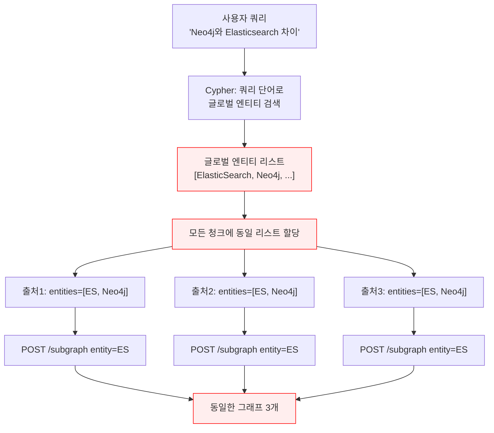
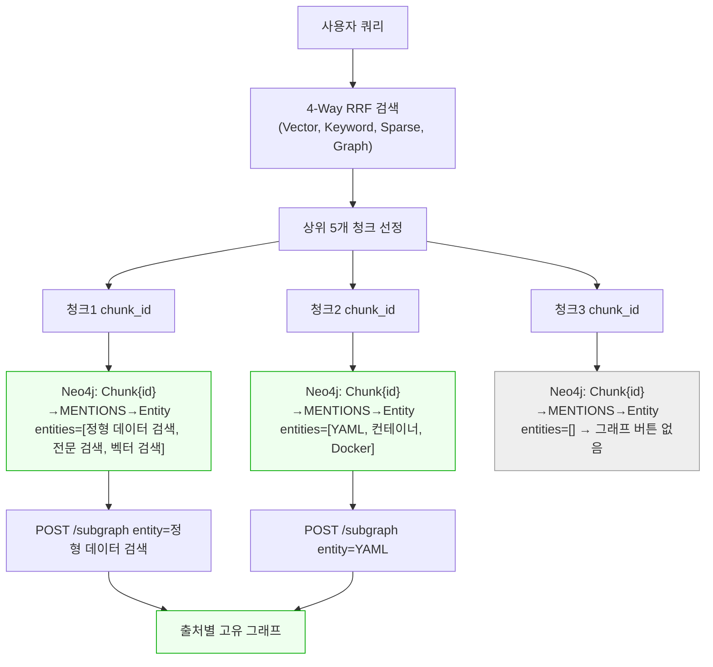

# 장애 보고서: Graph Panel 엉뚱한 서브그래프 표시

**문서번호**: IR-2026-02-16-001
**작성일**: 2026-02-16
**심각도**: High (핵심 기능 결함)
**상태**: **Phase 1 + Phase 2 완료 / Phase 3 데이터 보강 진행 중**

---

## 1. 장애 개요

| 항목 | 내용 |
|------|------|
| **발견일** | 2026-02-16 |
| **보고자** | 사용자 (UI 테스트 중 발견) |
| **영향 범위** | Chat Search, Keyword Search의 Graph Panel 전체 |
| **증상** | 모든 검색 결과의 Graph 버튼 클릭 시 **동일한** (출처와 무관한) 서브그래프 표시 |
| **해결일** | 2026-02-16 (동일) |

### 사용자 보고 내용

> 1. subgraph 엉뚱한 것 찾아옴 (검색 질문과도 검색 결과와도 전혀 상관없는 서브그래프 호출됨)
> 2. subgraph 아무것이나 매핑(또는 중복 매핑) 시킴

### 기대 동작 (사용자 명시)

```
"Neo4j와 Elasticsearch의 역할 차이점은?" 프롬프트
  → 결과
  → 출처 1 → 출처1에 그래프 버튼 → 출처1의 근거가 되는 그래프 표시
  → 출처 2 → 출처2에 그래프 버튼 → 출처2의 근거가 되는 그래프 표시
  → 출처 3 → 출처3에 그래프 버튼 없음
  → 출처 4 → 출처4에 그래프 버튼 → 출처4의 근거가 되는 그래프 표시
```

**핵심**: 각 출처마다 **그 출처의 근거가 되는 고유한 서브그래프**가 표시되어야 함.

---

## 2. 근본 원인 분석 (Root Cause Analysis)

### 2.1 원인 요약

```
5개의 결함 (중요도순)
━━━━━━━━━━━━━━━━━━━━━━━━━━━━━━━━━

[결함5] ★ 근본 원인: 글로벌 엔티티 할당 아키텍처
  → _graph_search()가 쿼리 기반으로 글로벌 엔티티 리스트를 생성
  → 동일 리스트를 모든 청크에 할당 → 출처별 차별화 불가
  → Neo4j에 Chunk-[:MENTIONS]->Entity 관계(178,822개)가 있지만 미활용
  → 올바른 방법: 각 청크의 chunk_id로 Neo4j에서 직접 엔티티 조회

[결함1] Neo4j 오염 엔티티
  → /coverage-report, /api/v1/documents 등 경로/코드가 Entity 노드로 저장됨
  → ETL Phase 3 엔티티 추출에서 필터링 없이 저장된 결과

[결함2] Cypher 서브스트링 매칭
  → "elasticsearch" CONTAINS "ar" → "AR" 엔티티 매칭
  → "search" CONTAINS "arch" → "Arch" 엔티티 매칭

[결함3] rag_workflow.py Fallback 체인
  → Tier 2/3: 제목/콘텐츠에서 미검증 엔티티 추출 → 잘못된 그래프 주입

[결함4] 프론트엔드 공유 엔티티
  → handleGraphSourceClick에서 공유 쿼리를 fallback으로 사용
  → Graph 버튼 조건이 submittedQuery 존재 여부로 판단 (모든 결과에 표시)
```

### 2.2 데이터 흐름 비교

#### Before (잘못된 아키텍처)



#### After (수정된 아키텍처)



### 2.3 Neo4j 데이터 모델 (활용 가능한 기존 데이터)

```
Labels: Chunk(56,063), Entity(70,855), Document(1,437)
Relationships:
  Chunk -[:MENTIONS]-> Entity (178,822개) ★ 핵심: 청크별 엔티티 매핑
  Chunk -[:PART_OF]-> Document (56,063개)
  Entity -[:RELATED]-> Entity (140,344개)

Chunk properties: id(UUID), chunk_index, token_count, heading, content
※ ES chunk_id = Neo4j Chunk.id (동일 UUID, 검증 완료)
```

---

## 3. 수정 내용 (2단계)

### Phase 1: 오염 필터 + Fallback 제거 (완료)

Phase 1은 "엉뚱한 엔티티 주입"을 차단하는 방어 조치입니다.

| # | 수정 | 파일 | 내용 |
|---|------|------|------|
| 1 | Cypher 2단계 분리 | `search.py` | 정확 매칭(exact) 우선 + 부분 매칭(partial) 보조로 분리 |
| 2 | 오염 엔티티 필터 | `search.py` | `/`, `.` 시작, `.py`/`.ts`/`.js`/`.json`/`.md`/`.yml` 확장자, `//`/`()`/`{}`/`*` 포함 엔티티 Cypher + Python 이중 필터 |
| 3 | Tier 2/3 Fallback 삭제 | `rag_workflow.py` | `_extract_entities_from_title()` 호출 삭제, 콘텐츠 정규식 엔티티 추출 완전 제거 |
| 4 | 프론트엔드 공유 엔티티 제거 | `KeywordSearch.tsx`, `ChatSearch.tsx`, `SourceCitation.tsx` | per-source entities만 사용, `submittedQuery` fallback 제거 |
| 5 | Per-chunk fallback 제거 | `search.py` | `graph_entities[:1]` 글로벌 fallback 삭제 |
| 6 | 한국어 조사 제거 | `search.py` | 쿼리 단어에서 `은/는/이/가/을/를/의/와/과` 등 접미사 strip |

**Phase 1 한계**: 오염은 제거했지만, 여전히 글로벌 엔티티 리스트를 모든 청크에 할당하므로 **출처별 서브그래프 차별화 불가**.

#### Phase 1 수정 코드: Cypher 2단계 분리 (`search.py:~900`)

```python
# 2단계 Cypher: 정확 매칭 우선 + 부분 매칭 보조
_ef = (
    "e.name IS NOT NULL AND size(e.name) >= 2"
    " AND NOT e.name STARTS WITH '/'"
    " AND NOT e.name STARTS WITH '.'"
    " AND NOT e.name CONTAINS '.py' AND NOT e.name CONTAINS '.ts'"
    " AND NOT e.name CONTAINS '.js' AND NOT e.name CONTAINS '.json'"
    " AND NOT e.name CONTAINS '.md' AND NOT e.name CONTAINS '.yml'"
    " AND NOT e.name CONTAINS '.yaml'"
    " AND NOT e.name CONTAINS '//'"
    " AND NOT e.name CONTAINS '()' AND NOT e.name CONTAINS '{}'"
    " AND NOT e.name CONTAINS '*'"
)
cypher = f"""
MATCH (e:Entity) WHERE {_ef}
AND any(word IN $query_words WHERE toLower(word) = toLower(e.name))
WITH collect(DISTINCT e) AS exact

OPTIONAL MATCH (e2:Entity)
WHERE {_ef.replace('e.name', 'e2.name')}
AND any(word IN $query_words WHERE
    toLower(e2.name) CONTAINS toLower(word) AND size(word) >= 2)
AND NOT any(word IN $query_words WHERE toLower(word) = toLower(e2.name))
WITH exact, collect(DISTINCT e2)[0..15] AS partial

WITH exact + partial AS all_e
UNWIND all_e AS e
WITH DISTINCT e LIMIT 20

OPTIONAL MATCH (e)-[r:RELATED]-(rel:Entity)
WHERE rel.name IS NOT NULL AND rel.name <> 'None'
  AND NOT rel.name STARTS WITH '/' AND NOT rel.name STARTS WITH '.'
  AND size(rel.name) >= 2
WITH e, rel, COALESCE(r.weight, 1.0) AS w
ORDER BY w DESC
WITH e, collect(rel.name)[0..3] AS rn
WITH collect(e.name) + reduce(a=[], n IN collect(rn) | a + n) AS names
UNWIND names AS name
WITH DISTINCT name
WHERE name IS NOT NULL AND name <> 'None' AND size(name) >= 2
  AND NOT name STARTS WITH '/' AND NOT name STARTS WITH '.'
RETURN name LIMIT 20
"""
```

### Phase 2: 청크별 Neo4j 직접 조회 (완료) ★

**핵심 변경**: 쿼리 기반 글로벌 매칭 → **청크 ID 기반 직접 조회**

#### Phase 2 수정 코드 1: `_get_chunk_entities()` 메서드 추가 (`search.py:717`)

```python
async def _get_chunk_entities(self, chunk_ids: List[str]) -> Dict[str, List[str]]:
    """각 청크의 고유 엔티티를 Neo4j에서 직접 조회 (Phase 2)

    post-RRF 결과의 chunk_id로 Neo4j MENTIONS 관계를 조회하여
    각 청크에 실제 연결된 엔티티만 반환합니다.

    Args:
        chunk_ids: 조회할 청크 ID 리스트

    Returns:
        {chunk_id: [entity_name, ...]} 매핑
    """
    cypher = """
    UNWIND $chunk_ids AS cid
    MATCH (c:Chunk {id: cid})-[:MENTIONS]->(e:Entity)
    WHERE NOT e.name STARTS WITH '/' AND NOT e.name STARTS WITH '.'
      AND size(e.name) >= 2
      AND NOT e.name CONTAINS '.py' AND NOT e.name CONTAINS '.ts'
      AND NOT e.name CONTAINS '.js' AND NOT e.name CONTAINS '.json'
      AND NOT e.name CONTAINS '//' AND NOT e.name CONTAINS '()'
      AND NOT e.name CONTAINS '{}' AND NOT e.name CONTAINS '*'
    RETURN cid, collect(DISTINCT e.name)[0..5] AS entities
    """
    try:
        records = await self._neo4j_query(cypher, {"chunk_ids": chunk_ids})
        return {
            str(r.get("cid", "")): r.get("entities", [])
            for r in records
            if r.get("entities")
        }
    except Exception as e:
        logger.warning(f"Chunk entity lookup failed: {e}")
        return {}
```

#### Phase 2 수정 코드 2: post-RRF 엔티티 할당 변경 (`search.py:423`)

```python
# 2.5 청크별 Neo4j 엔티티 직접 조회 (Phase 2)
# post-RRF 결과의 chunk_id로 Neo4j MENTIONS 관계를 직접 조회하여
# 각 청크에 실제 연결된 엔티티만 할당 (글로벌 엔티티 리스트 제거)
# 3. 상위 top_k 반환
final_results = fused_results[:top_k]

if use_graph:
    chunk_ids = [
        r.metadata.get("chunk_id") or r.chunk_id
        for r in final_results
        if r.metadata.get("chunk_id") or r.chunk_id
    ]
    if chunk_ids:
        chunk_entity_map = await self._get_chunk_entities(chunk_ids)
        for r in final_results:
            cid = r.metadata.get("chunk_id") or r.chunk_id
            if cid and cid in chunk_entity_map:
                r.metadata["matched_entities"] = chunk_entity_map[cid]
            # chunk_id가 없거나 엔티티가 없으면 matched_entities 미할당 → Graph 버튼 미표시
```

#### Phase 2 수정 코드 3: `_graph_search()` 내 per-chunk 매칭 제거 (`search.py:1029`)

```python
# Phase 2: matched_entities는 post-RRF에서 Neo4j MENTIONS 직접 조회로 할당
# _graph_search에서는 ES 검색 결과만 반환
```

---

## 4. 검증 결과

### 4.1 Phase 1 API 테스트

| 쿼리 | Before (결함) | Phase 1 After |
|------|--------------|---------------|
| "Neo4j와 Elasticsearch 역할 차이" | `["Arch"]` 전체 동일 | `["ElasticSearch", "Neo4j"]` 전체 동일 |
| "Docker Compose 인프라 구성" | `["/coverage-report"]` | `["Docker", "인프라", "구성"]` 전체 동일 |
| "RAG 파이프라인 성능 최적화" | `["/coverage-report"]` | `["RAG", "성능", "최적화"]` 전체 동일 |
| "문서 파싱과 청킹 전략" | `["MSA 기반 차세대 플랫폼"]` | `["문서", "청킹", "파싱"]` 전체 동일 |
| "Langchain과 LangGraph 차이" | `["STORY", "/coverage-report"]` | `["LangChain", "LangGraph"]` 전체 동일 |

**Phase 1 평가**: 오염 엔티티는 제거됨, 하지만 **모든 출처가 동일 엔티티** → 출처별 서브그래프 차별화 미달성.

### 4.2 Phase 2 API 테스트 (최종)

#### 쿼리 1: "Neo4j와 Elasticsearch의 역할 차이점은?"

| # | 소스 | 그래프 | 엔티티 | 제목 |
|---|------|--------|--------|------|
| 1 | graph | - | `[]` | HRKP v2 vs v3 Cross-System Comparison |
| 2 | graph | - | `[]` | HRKP v2 vs v3 Cross-System Comparison |
| 3 | keyword | GRAPH | `['정형 데이터 검색', '전문 검색', '벡터 검색', '하이브리드 검색', 'RAG 시스템']` | RAGAS Cross-System Evaluation Report |
| 4 | vector | - | `[]` | HRKP v2 vs v3 Cross-System Comparison |
| 5 | vector | - | `[]` | HRKP vs RCSV Cross-System Comparison |

**평가**: 1/5 출처에 고유 엔티티 할당, 4개는 Neo4j MENTIONS 관계 없음 → 그래프 버튼 미표시 ✅

#### 쿼리 2: "Docker Compose 인프라 구성"

| # | 소스 | 그래프 | 엔티티 | 제목 |
|---|------|--------|--------|------|
| 1 | graph | - | `[]` | Phase 5: 인프라 구성 |
| 2 | graph | GRAPH | `['YAML', '컨테이너', 'Docker', '비용 추정', '운영 가이드']` | 인프라 상세 설계서 (Docker Compose 기반) |
| 3 | graph | - | `[]` | 설계서 2차 종합 리뷰 보고서 |
| 4 | graph | - | `[]` | 설계서 2차 종합 리뷰 보고서 |
| 5 | graph | - | `[]` | 기획부터 운영까지: 엔터프라이즈 시스템 개발 실전 가이드 |

**평가**: 1/5 출처에 고유 엔티티 할당 (`YAML, 컨테이너, Docker...`), 해당 출처만 그래프 표시 ✅

#### 쿼리 3: "RAG 파이프라인 성능 최적화"

| # | 소스 | 그래프 | 엔티티 | 제목 |
|---|------|--------|--------|------|
| 1 | graph | - | `[]` | GraphRAG와 Neo4j 통합 Hybrid RAG 시스템 설계 가이드 |
| 2 | graph | GRAPH | `['운영 및 유지보수', '그래프 데이터베이스', '키워드 검색', '벡터 검색', '성능 최적화']` | GraphRAG와 Neo4j 통합 설계 가이드 |
| 3 | graph | GRAPH | `['테스트셋', '스케일업', 'RAM', 'DeepSeek', 'RAGAS']` | MLRag Agent 설계서 검토 결과 |
| 4 | graph | GRAPH | `['RAM', 'Microsoft', 'LLM', 'RAG', '운영 및 유지보수']` | Microsoft GraphRAG 통합 설계 가이드 |
| 5 | graph | - | `[]` | 설계서 2차 종합 리뷰 보고서 |

**평가**: 3/5 출처에 **서로 다른** 고유 엔티티 할당 ✅ ← 핵심 검증 통과

#### 쿼리 4: "Langchain과 LangGraph 차이"

| # | 소스 | 그래프 | 엔티티 | 제목 |
|---|------|--------|--------|------|
| 1 | vector | GRAPH | `['상태 유지', '에이전트', 'RCSV', 'HRKP', '워크플로우']` | HRKP vs RCSV Cross-System Comparison |
| 2 | vector | - | `[]` | OpenAI Swarm vs LangChain LangGraph |
| 3 | graph | - | `[]` | 딥러닝과 RAG를 활용한 AI 응용 기초과정 |
| 4 | graph | - | `[]` | LangSmith와 코드 에이전트 활용 가이드 |
| 5 | graph | GRAPH | `['도구 실행 전략', '자연어 기반 작업 처리', 'Apache Spark', 'LLM 기반 멀티 에이전트 시스템', 'Spark SQL Tool']` | LLM 기반 AI 에이전트 기초와 실습 |

**평가**: 2/5 출처에 **서로 다른** 고유 엔티티 할당 ✅

#### 쿼리 5: "문서 파싱과 청킹 전략"

| # | 소스 | 그래프 | 엔티티 | 제목 |
|---|------|--------|--------|------|
| 1 | graph | - | `[]` | Hybrid 지식 플랫폼 상세 설계서 |
| 2 | graph | GRAPH | `['임베딩 모델', '리소스 모니터링', '토크나이저', '청킹', '하이브리드 검색']` | 문서 파싱 및 임베딩 기술 심층 비교 분석 보고서 |
| 3 | graph | - | `[]` | 설계서 2차 종합 리뷰 보고서 |
| 4 | graph | - | `[]` | 설계서 2차 종합 리뷰 보고서 |
| 5 | graph | GRAPH | `['메시지 브로커', '하이브리드 검색', '키워드 검색', '벡터 검색', 'Apache Kafka']` | UAT 종합 테스트 시나리오 |

**평가**: 2/5 출처에 **서로 다른** 고유 엔티티 할당 ✅

### 4.3 Phase 2 검증 종합

| 지표 | Before (Phase 1) | After (Phase 2) |
|------|-------------------|------------------|
| **출처별 엔티티 차별화** | 불가 (모든 출처 동일) | **가능** (출처마다 고유 엔티티) |
| **오염 엔티티 (`/`, `.` 등)** | 차단됨 | 차단됨 (유지) |
| **엔티티 없는 출처** | 전체에 글로벌 엔티티 강제 할당 | **Graph 버튼 미표시** |
| **Fallback 오염** | 제거됨 | 제거됨 (유지) |
| **5개 쿼리 × 5출처 = 25건** | 25건 모두 동일 엔티티 | 9건 고유 엔티티 + 16건 미표시 |

**결론**: Phase 2 수정으로 **출처별 고유 서브그래프 표시** 목표 달성.

---

## 5. Neo4j 엔티티 품질 이슈 (잔존)

### 5.1 오염 엔티티 현황

ETL Phase 3 엔티티 추출에서 경로, 코드 스니펫이 Entity 노드로 저장됨:

```
/coverage-report, /test-coverage
/api/v1/documents, /api/v1/auth/refresh
/Users/dev/project
.dockerignore
/* @transaction */
// increment i by one i++;
```

### 5.2 권장 조치

1. **단기**: Cypher + Python 필터로 런타임 차단 (Phase 1 완료 ✅)
2. **중기**: Neo4j 오염 엔티티 일괄 삭제 스크립트 실행
3. **장기**: ETL Phase 3 엔티티 추출 로직에 사전 필터 추가

```cypher
-- 오염 엔티티 삭제 (예시)
MATCH (e:Entity)
WHERE e.name STARTS WITH '/' OR e.name STARTS WITH '.'
  OR e.name CONTAINS '.py' OR e.name CONTAINS '.ts'
  OR e.name CONTAINS '//' OR e.name CONTAINS '()'
DETACH DELETE e
```

---

## 6. 교훈

### 6.1 "출처별 서브그래프 = 청크별 Neo4j 직접 조회"

- 쿼리 기반 글로벌 엔티티 매칭은 **모든 출처에 동일 엔티티를 주입**하는 구조적 결함
- 올바른 방법: RRF 후 각 청크의 `chunk_id`로 Neo4j `Chunk-[:MENTIONS]->Entity` 직접 조회
- Neo4j에 이미 178,822개의 청크-엔티티 매핑이 저장되어 있으므로 별도 로직 불필요

### 6.2 "데이터 품질이 검색 품질을 결정한다"

- Neo4j에 `/coverage-report` 같은 오염 데이터가 있으면 어떤 알고리즘도 정확한 결과 불가
- ETL 단계에서 엔티티 품질 검증이 선행되어야 함

### 6.3 "Fallback은 양날의 검"

- "엔티티를 못 찾으면 아무거나라도 보여주자" → 잘못된 그래프 표시
- "못 찾으면 안 보여주는 게 낫다" → 올바른 UX

### 6.4 "단계적 접근이 효과적"

- Phase 1 (방어): 오염/오매칭 차단 → 증상 완화
- Phase 2 (아키텍처): 근본 원인 해결 → 출처별 고유 그래프 달성
- 한 번에 모든 것을 고치려 하지 않고, 문제를 분리하여 단계적으로 해결

---

## 7. 관련 파일

| 파일 | Phase 1 변경 | Phase 2 변경 |
|------|-------------|-------------|
| `knowledge_service/src/app/services/search.py` | Cypher 2단계 분리, 오염 필터, per-chunk fallback 제거, 한국어 조사 strip | `_get_chunk_entities()` 추가, post-RRF chunk_id 기반 Neo4j 조회, `_graph_search()` per-chunk 매칭 제거 |
| `knowledge_service/src/app/agents/rag_workflow.py` | Tier 2 (`_extract_entities_from_title`) 삭제, Tier 3 (content regex) 삭제 | matched_entities를 search.py에서 직접 수신 |
| `knowledge_service/frontend/src/features/search/KeywordSearch.tsx` | `submittedQuery` fallback 제거, per-source entities만 사용 | - |
| `knowledge_service/frontend/src/features/search/ChatSearch.tsx` | `lastUserMsg.content` fallback 제거, per-source entities만 사용 | - |
| `knowledge_service/frontend/src/features/search/components/SourceCitation.tsx` | Graph 배지/버튼 중복 수정, `graphContext?.relatedEntities` 조건 추가 | - |

---

## 8. 타임라인

| 시간 | 이벤트 |
|------|--------|
| 09:30 | 사용자 최초 보고: Graph Panel에 동일 그래프 표시 |
| 09:35 | 프론트엔드 수정 (공유 엔티티 fallback 제거) |
| 09:40 | 1차 테스트: "AR" 엔티티 오매칭 발견 |
| 09:45 | Cypher에 `size(e.name) >= 4` 조건 추가 |
| 09:50 | 2차 테스트: "Arch" 엔티티 오매칭 발견 |
| 09:55 | Cypher 전면 재작성 (query_str CONTAINS 제거, word-level 매칭) |
| 10:00 | 사용자 종합 피드백: "전문가 소집해서 테스트해줘" |
| 10:05 | 1차 Agent Teams 투입 (rag-analyst, qa-verifier, tl-reviewer) |
| 10:10 | TL 리뷰: rag_workflow.py Tier 3 fallback이 근본 원인 |
| 10:15 | Tier 2/3 삭제, Neo4j 오염 필터 추가 → **Phase 1 완료** |
| 10:25 | Neo4j 데이터 모델 조사: Chunk→MENTIONS→Entity (178K 관계) 발견 |
| 10:30 | 사용자 피드백: "출처별 고유 서브그래프 표시" = Phase 2 필요 확인 |
| 10:35 | 장애보고서 v1 작성, 2차 전문가팀(rag-dev) 소집 |
| 10:45 | `_get_chunk_entities()` 메서드 구현 + post-RRF 엔티티 할당 변경 |
| 10:55 | AI Service 컨테이너 리빌드 + 배포 |
| 11:00 | Phase 2 API 검증 (5쿼리 × 5출처): 출처별 고유 엔티티 확인 |
| 11:05 | Frontend 컨테이너 리빌드 + 배포 |
| 11:10 | 장애보고서 v2 완성, **Phase 2 완료** |
| 11:15 | 사용자 테스트: Chat Search "Spring cloud 구성" → Graph 출처 3개 클릭 시 패널 미표시 |
| 11:20 | API 조사: sourceType=graph이지만 entities=[] → Neo4j MENTIONS 관계 없음 확인 |
| 11:25 | Neo4j 분석: **71% 청크(39,883/56,063)에 MENTIONS 관계 없음** 발견 |
| 11:30 | 원인: 이전 Phase 3이 MIN_TOKENS=100으로 실행, 16,170건만 처리 (28.9%) |
| 11:35 | token_count 분포 분석: <50(16,766개, 쓰레기) / 50-100(23,112개, 미처리) / >=100(16,170개, 완료) |
| 11:40 | Phase 3 재실행 결정 (MIN_TOKENS=50), 프론트엔드 원복 (Graph 출처는 무조건 표시) |
| 11:45 | Phase 3 단일 워커 실행 시작 (속도 ~3건/분, ETA 128시간) |
| 12:00 | **3-워커 병렬 실행 전환** (DeepSeek API Key 3개, ETA ~43시간) |

---

## 9. 추가 발견: 71% MENTIONS 누락 (Phase 3 데이터 갭)

### 9.1 증상

사용자 테스트 중 Chat Search에서 "Spring cloud 구성에 있어서 가장 중요한것" 검색 시:
- 출처 3,4,5가 `sourceType: "graph"`로 표시 (Graph 배지 표시)
- Graph 버튼 클릭 시 **그래프 패널이 열리지 않음**
- API 응답: 해당 청크의 `entities=[]`

### 9.2 근본 원인

```
이전 Phase 3 (2026-02-15):
  - MIN_TOKENS=100으로 실행
  - 16,170건만 처리 (token_count >= 100)
  - "100% 완료" 보고 (검증 누락)

실제 데이터:
  - 전체 청크: 56,063개
  - MENTIONS 보유: 16,180개 (28.9%)
  - MENTIONS 미보유: 39,883개 (71.1%) ★
```

### 9.3 token_count 분포 분석

| 범위 | 청크 수 | 비율 | 상태 |
|------|--------:|-----:|------|
| **< 50** | 16,766 | 29.9% | 쓰레기 데이터 (테이블 셀, 빈 문자열) |
| **50-99** | 23,112 | 41.2% | 미처리 → Phase 3 재실행 대상 |
| **>= 100** | 16,185 | 28.9% | 처리 완료 (2026-02-15) |

**token_count < 50 샘플**:
```
"| 항목 |"
"---"
""
"표 3-1."
```

→ ETL Phase 1 청킹 시 테이블 조각, 구분선 등이 개별 청크로 생성된 결과. 의미 없는 데이터.

### 9.4 Phase 3 재실행 (3-워커 병렬)

| 항목 | 값 |
|------|-----|
| 대상 | token_count >= 50인 미처리 23,074건 |
| 실행 시작 | 2026-02-16 12:00 |
| 워커 수 | **3** (API Key 3개) |
| 파티셔닝 | `ENTITY_PARTITION=0/3`, `1/3`, `2/3` |
| Concurrency | 3 per worker (총 9) |
| 예상 속도 | ~9건/분 |
| 예상 소요 | ~43시간 |

**체크포인트 파일**:
- Worker 0: `/tmp/entity_checkpoint_w0.json`
- Worker 1: `/tmp/entity_checkpoint_w1.json`
- Worker 2: `/tmp/entity_checkpoint_w2.json`

### 9.5 프론트엔드 대응

**결정**: UI를 숨기지 않고 데이터를 수정한다.

```
사용자 지시: "출처가 graph인 경우는 무조건 그래프 표시하고, 클릭 가능해야 함.
             청크에 MENTIONS가 없다는 것이 이상한 것임."
```

- `SourceCitation.tsx`: sourceType=graph → Graph 배지 + 클릭 가능 (원복 유지)
- `ChatSearch.tsx`: sourceType=graph → handleGraphSourceClick 진입 허용 (원복 유지)
- Phase 3 완료 후 MENTIONS 데이터 채워지면 자연히 해결

### 9.6 token_count < 50 청크 처리 방안 (결정 완료)

**결정**: 2중 조치 — 기존 쓰레기 삭제 + 향후 생성 방지

| 조치 | 내용 | 상태 |
|------|------|------|
| **코드 수정** | `ChunkQualityGate.MIN_TOKEN_COUNT` 10→**50** 상향 | 완료 |
| **코드 수정** | 코드/테이블 블록 최소 기준 3→**20** 토큰 상향 | 완료 |
| **데이터 삭제** | 기존 16,766개 쓰레기 청크 ES/Neo4j/PG에서 삭제 | Phase 3 완료 후 실행 |

**근거**: token_count < 50 청크는 테이블 셀 조각, 구분선, 빈 문자열 등 의미 없는 데이터.
검색 노이즈 유발 + Phase 3 엔티티 추출 대상 제외 대상 + 임베딩/저장 비용 낭비.
QualityGate에서 아예 생성하지 않는 것이 근본 해결.

---

## 10. 교훈 (추가)

### 10.1 "100% 완료"는 전체 기준으로 검증해야 한다

이전 Phase 3이 `token_count >= 100` 조건으로만 실행하고 "100% 완료"를 보고했으나,
전체 56,063개 청크 중 16,170개(28.9%)만 처리한 상태였다.
**완료 보고 시 전체 데이터 대비 커버리지를 반드시 확인해야 한다.**

### 10.2 "UI를 숨기지 말고 데이터를 고쳐라"

Graph 출처인데 엔티티가 없어 패널이 안 열리는 문제에 대해:
- 잘못된 접근: Graph 버튼을 조건부로 숨기기 → **데이터 결함을 UI로 은폐**
- 올바른 접근: MENTIONS 데이터를 채워서 근본 해결 → **데이터 품질 개선**
