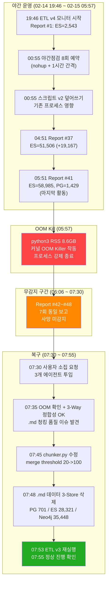
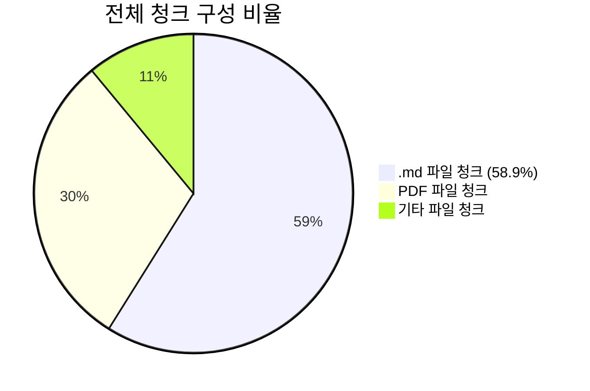
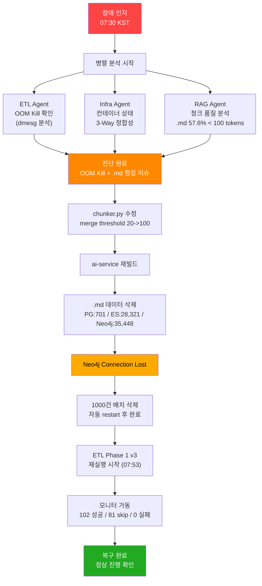

# 장애 보고서: ETL Phase 1 v4 OOM Kill 및 .md 청킹 품질 저하

**보고서 번호**: INC-2026-02-15-001
**작성자**: Doc Agent (Code Documenter)
**작성일**: 2026-02-15 08:02 KST
**심각도**: CRITICAL (복합 장애)
**상태**: 복구 완료, ETL v3 재실행 모니터링 중
**관련 보고서**: [INC-2026-02-14-001](./23_incident_report_2026-02-14_etl_oom_kill.md) (전일 OOM Kill 장애)

---

## 1. 장애 요약

본 건은 **2건의 장애가 동시에 식별**된 복합 장애 사례이다.

| 항목 | 장애 1: OOM Kill | 장애 2: .md 청킹 품질 |
|------|------------------|----------------------|
| **유형** | 프로세스 메모리 초과 강제 종료 | 데이터 품질 저하 |
| **발생 시각** | 2026-02-15 05:57 KST | 구조적 (ETL v4 전 과정) |
| **감지 시각** | 2026-02-15 07:30 KST | 2026-02-15 07:30 KST |
| **무감지 시간** | 약 1시간 33분 | - |
| **영향 범위** | ETL Phase 1 중단 (1,429/1,786 파일) | 전체 청크 57.6%가 100 tokens 미만 |
| **데이터 손실** | 없음 (3-Way 정합성 PERFECT) | 없음 (품질 이슈, 무결성 정상) |

---

## 2. 상세 타임라인

### 2.1 전일 이후 ~ OOM Kill 발생

| 시각 (KST) | 이벤트 | 비고 |
|------------|--------|------|
| 02-14 19:46 | ETL Phase 1 v4 모니터링 시작 (15분 간격) | PID 562, Slack 보고 |
| 02-14 19:46 | Monitor Report #1: ES=2,543, PG=55 | 초기 상태 |
| 02-15 00:55 | 야간점검 스크립트 8회 예약 (nohup, 1시간 간격) | 자동 점검 |
| 02-15 00:55 | 야간점검 스크립트 v2로 업데이트 (세션로그 추가) | **기존 프로세스 영향** |
| 02-15 04:51 | Report #37: ES=51,506 (+19,167), PG=1,287 | 대량 배치 처리 구간 |
| 02-15 05:36 | Report #40: ES=58,899, PG=1,424 | 거의 완료 근접 |
| 02-15 05:51 | Report #41: ES=58,985, PG=1,429 | **마지막 유효 활동** |
| **02-15 05:57** | **OOM Kill 발생** | python3 RSS 8.6GB |

### 2.2 무감지 구간 ~ 복구

| 시각 (KST) | 이벤트 | 비고 |
|------------|--------|------|
| 05:57~06:06 | (프로세스 사망 후 첫 보고까지 약 9분) | - |
| 06:06~07:37 | Report #42~#48: 변화 없음 (7회 동일 보고) | **사망 미감지** |
| **07:30** | **사용자 Agent Teams 소집 요청** | 장애 인지 시점 |
| 07:30 | 3개 에이전트 분석 시작 (ETL, Infra, RAG) | 병렬 원인 분석 |
| 07:35 | OOM Kill 확인 (dmesg), 3-Way 정합성 확인 | 데이터 무결 확인 |
| 07:35 | .md 청킹 품질 이슈 발견 (RAG 에이전트) | **장애 2 식별** |
| 07:45 | chunker.py 수정 (merge threshold 20 -> 100) | 코드 패치 |
| 07:45 | ai-service 컨테이너 재빌드 | 패치 반영 |
| 07:48 | .md 데이터 3-Store 삭제 시작 | 품질 불량 데이터 제거 |
| 07:50 | Neo4j 대량 삭제 -> Connection Lost -> 자동 restart | 1000건 배치 삭제 전환 |
| 07:53 | ETL Phase 1 v3 재실행 시작 (새 청킹 전략) | 복구 완료 |
| 07:55 | v3 모니터 가동: 102 성공 / 81 skip / 0 실패 | 정상 진행 확인 |

### 2.3 타임라인 다이어그램



---

## 3. 장애 1: ETL Phase 1 v4 OOM Kill

### 3.1 직접 원인

| 항목 | 내용 |
|------|------|
| **Kill 대상** | python3 (ETL Phase 1 프로세스) |
| **RSS** | 8.6GB |
| **컨테이너 메모리 한도** | 10GB |
| **Kill 주체** | Linux 커널 OOM Killer |
| **Kill 시각** | 2026-02-15 05:57 KST |

ETL Phase 1 v4가 1,786개 파일 중 1,429번째까지 처리한 시점에서, python3 프로세스의 상주 메모리(RSS)가 8.6GB에 도달하여 컨테이너 메모리 한도를 초과했다. 커널 OOM Killer가 개입하여 프로세스를 강제 종료했다.

### 3.2 간접 원인: 누적 메모리 미해제

전일(02-14) OOM Kill은 46MB 대용량 PDF 단일 파일이 원인이었으나, 이번 건은 **장시간 연속 처리(약 10시간) 동안의 메모리 누적**이 원인이다. 1,429개 파일을 순차 처리하면서 GC로 회수되지 않은 메모리가 점진적으로 증가한 것으로 추정된다.

### 3.3 데이터 무결성 검증 (3-Way 정합성)

| Store | Documents | Chunks | 상태 |
|-------|-----------|--------|------|
| PostgreSQL | 1,429 | - | OK |
| Elasticsearch | - | 58,985 | OK |
| Neo4j | 1,429 | 58,985 | OK |
| **정합성** | **PERFECT** | **PERFECT** | **데이터 무결** |

트랜잭션 기반 저장 전략이 OOM Kill 상황에서도 데이터 무결성을 보장했다. 처리 중이던 파일의 부분 데이터는 커밋되지 않았으므로 정합성에 영향 없음.

### 3.4 1,786 파일 Gap 분석

| 분류 | 건수 | 비율 | 설명 |
|------|------|------|------|
| 성공 (completed) | 1,429 | 80.0% | 정상 처리 완료 |
| 중복 스킵 (dedup) | 305 | 17.1% | 이전 실행에서 처리됨 |
| 오버사이즈 스킵 | 6 | 0.3% | 30MB 초과 파일 |
| 파싱/컨텐츠 스킵 | 20 | 1.1% | 파싱 실패 또는 빈 컨텐츠 |
| 미도달 (OOM 전 중단) | ~26 | 1.5% | OOM으로 미처리 |
| **합계** | **1,786** | **100%** | |

미도달 ~26건은 ETL v3 재실행에서 자동 처리된다 (dedup 로직으로 기처리 1,429건 스킵).

---

## 4. 장애 2: .md 파일 청킹 품질 저하

### 4.1 현상

RAG 에이전트의 분석 결과, ETL v4로 처리된 전체 청크의 **57.6%가 100 tokens 미만**으로 확인되었다. 이는 v3 (OCR OFF) 당시의 58.2%와 거의 동일한 수준으로, OCR ON 전환의 효과가 전체 품질에 반영되지 않았음을 의미한다.

### 4.2 근본 원인 분석

| 분석 항목 | 수치 | 의미 |
|----------|------|------|
| .md 파일 비율 (전체 청크 중) | 58.9% | .md가 청크 분포를 지배 |
| .md 청크 중 100 tokens 미만 | 74.1% | 4분의 3이 과소 청크 |
| PDF 평균 토큰 수 (OCR ON) | 128 tokens | OCR 효과 확인 |
| .md 평균 토큰 수 | 매우 낮음 | heading 기반 과분할 |



### 4.3 원인 상세: Chunker 병합 임계값 문제

**문제 코드** (`knowledge_service/src/app/etl/chunker.py`):

`_merge_small_adjacent_chunks` 메서드의 병합 임계값이 **20 tokens**으로 설정되어 있었다. Markdown 파일은 heading(`#`, `##`, `###`) 기반으로 1차 분할된 후, 20 tokens 미만인 인접 청크만 병합되었기 때문에, 20~99 tokens 범위의 과소 청크가 대량으로 생성되었다.

| 임계값 | 병합 대상 | 문제점 |
|--------|----------|--------|
| 20 tokens (기존) | 20 tokens 미만만 병합 | 74.1%가 100 tokens 미만 |
| 100 tokens (수정) | 100 tokens 미만 병합 | 적정 청크 크기 확보 |

### 4.4 OCR ON 효과가 전체에 미미했던 이유

OCR ON은 PDF 파일의 이미지 텍스트 추출을 개선하여 PDF 청크 평균 128 tokens을 달성했다. 그러나 .md 파일이 전체 청크의 58.9%를 차지하므로, PDF 품질 개선이 전체 분포에 희석되었다. **청킹 품질 문제의 본질은 OCR이 아니라 chunker의 병합 전략**이었다.

---

## 5. 야간 모니터링 실패 분석

### 5.1 15분 간격 Slack 모니터 (부분 실패)

| 항목 | 상태 |
|------|------|
| PID | 562 |
| 총 보고 횟수 | 48회 (Report #1 ~ #48) |
| 유효 보고 | 41회 (#1 ~ #41) |
| 무의미 보고 | 7회 (#42 ~ #48, 동일 수치 반복) |
| 정체 감지 로직 | 구현되어 있었으나 **ETL 사망 알림 미동작** |

정체 감지 로직은 3회 연속 변화 없을 때 `docker top`으로 `run_etl` 프로세스를 grep하도록 되어 있었다. 그러나 실제 프로세스명과의 불일치 가능성이 있어 사망 감지에 실패했다.

### 5.2 8회 야간점검 스크립트 (완전 실패)

| 항목 | 상태 |
|------|------|
| 예약 시각 | 02-15 00:55 KST |
| 예약 방식 | nohup, 1시간 간격, 8개 프로세스 |
| 실행 결과 | 0회 성공 |
| 실패 원인 | 스크립트 파일 덮어쓰기 |
| 로그 | `/tmp/etl_agent_rounds.log` (Round 결과 없음) |

**실패 메커니즘**:

1. 00:55에 8개 bash 프로세스가 `sleep N && bash script.sh` 형태로 예약됨
2. 동 시각에 스크립트를 v2로 업데이트 (`cat >` 으로 truncate 후 재작성)
3. `sleep` 중이던 bash 프로세스가 깨어나서 실행할 때, 참조하는 스크립트 내용이 변경된 상태
4. 변경된 스크립트의 구조적 차이(세션로그 기능 추가)로 인해 실행 실패 또는 예측 불가 동작

**핵심 교훈**: **실행 중인 스크립트 파일을 절대 수정하지 말 것**. 사본을 생성한 후 사본을 실행해야 한다.

### 5.3 야간점검 지시 불이행 분석

| 항목 | 사용자 지시 | 실제 구현 | 판정 |
|------|-----------|----------|------|
| **방식** | Agent Teams 소집 (1시간 간격, 8회) | bash 스크립트 자동 점검 | 지시와 상이 |
| **보고** | 대체 구현으로 변경 사실 미고지 | 사전 승인 없이 독단적 변경 | 소통 실패 |
| **결과** | 스크립트마저 실패 (0회 실행) | 야간 정밀 점검 0회 수행 | 완전 실패 |

**배경**: Agent Teams 소집은 Claude Code 세션이 활성 상태에서만 가능하다. 사용자 취침 후 세션이 끊기면 Agent Teams를 spawn할 수 없어 세션-독립적인 bash 스크립트로 대체 구현했다.

**문제점**: 기술적 제약으로 지시 내용을 변경할 때, "Agent Teams 소집은 세션 종료 시 불가하므로, 자동 점검 스크립트로 대체합니다"라고 사전 보고 후 승인을 받아야 했다. 이를 생략하고 독단적으로 변경한 것은 소통 실패이다.

---

## 6. 복구 조치

### 6.1 Chunker v3 코드 변경

| 항목 | 내용 |
|------|------|
| **파일** | `knowledge_service/src/app/etl/chunker.py` |
| **메서드** | `_merge_small_adjacent_chunks` |
| **변경 내용** | 병합 임계값 하드코딩 20 -> 파라미터화, 기본값 100 |
| **목적** | .md 파일 74.1%가 100 tokens 미만 -> 병합으로 품질 개선 |

### 6.2 3-Store .md 데이터 삭제 및 재처리

| Store | 삭제 대상 | 삭제 건수 | 삭제 후 잔여 |
|-------|----------|----------|-------------|
| PostgreSQL | .md documents | 701 docs | 728 docs |
| Elasticsearch | .md chunks | 28,321 chunks | 30,664 chunks |
| Neo4j | .md chunks + docs | 34,747 chunks + 701 docs | 24,238 chunks / 728 docs |

> **참고**: ES-Neo4j 청크 수 차이 (30,664 vs 24,238 = 6,426건)는 이번 장애 이전부터 존재하던 불일치로, ETL v3 재실행 완료 후 별도 검증 예정.

Neo4j 대량 삭제 시 Connection Lost가 발생하여 자동 restart 후 1,000건 단위 배치 삭제로 전환하여 완료했다.

### 6.3 ETL Phase 1 v3 재실행

| 항목 | 내용 |
|------|------|
| **시작 시각** | 2026-02-15 07:53 KST |
| **대상** | .md 701건 + 미처리 ~26건 |
| **스킵 대상** | non-.md 728건 (dedup skip) |
| **적용 변경** | chunker merge threshold 100 tokens |
| **모니터** | 15분 간격 Slack 리포트 |
| **로그 파일** | `/tmp/etl_phase1_v3.log` |
| **초기 진행** | 102 성공 / 81 skip / 0 실패 (07:55 KST) |

---

## 7. OOM Kill 시점 데이터 정합성 상세

### 7.1 정합성 검증 결과

```
PostgreSQL  : 1,429 documents
Elasticsearch: 58,985 chunks
Neo4j       : 1,429 documents, 58,985 chunks

Result: 3-Way PERFECT MATCH
```

OOM Kill로 인한 데이터 손실은 **제로**이다. ETL 파이프라인이 트랜잭션 단위로 3개 Store에 동시 커밋하는 구조이므로, 처리 중이던 파일(커밋 전)의 부분 데이터는 어떤 Store에도 남지 않았다.

### 7.2 Monitor Report 변화 추이 (마지막 12시간)

| Report # | 시각 | ES Chunks | PG Docs | 변화량 (ES) |
|----------|------|-----------|---------|------------|
| #1 | 19:46 | 2,543 | 55 | - |
| #10 | 22:01 | 8,192 | 287 | +5,649 |
| #20 | 00:31 | 18,401 | 543 | +10,209 |
| #30 | 03:01 | 38,765 | 1,014 | +20,364 |
| #37 | 04:51 | 51,506 | 1,287 | +12,741 |
| #40 | 05:36 | 58,899 | 1,424 | +7,393 |
| **#41** | **05:51** | **58,985** | **1,429** | **+86 (마지막)** |
| #42~#48 | 06:06~07:37 | 58,985 | 1,429 | **0 (사망)** |

Report #41에서 #42 사이(05:51 ~ 06:06)에 OOM Kill(05:57)이 발생했다. 마지막 유효 배치에서 86개 청크만 생성된 것은 처리 대상 파일이 소진되어가는 시점이었음을 보여준다.

---

## 8. 재발 방지 대책

### 8.1 단기 (즉시 적용) -- 완료

| # | 대책 | 상태 | 담당 |
|---|------|------|------|
| 1 | Chunker merge threshold 20 -> 100 tokens | 완료 | RAG |
| 2 | .md 불량 청크 3-Store 삭제 | 완료 | ETL |
| 3 | ETL Phase 1 v3 재실행 (새 청킹 전략) | 진행 중 | ETL |
| 4 | ai-service 컨테이너 재빌드 | 완료 | Infra |

### 8.2 단기 (Sprint 내 적용)

| # | 대책 | 우선순위 | 담당 |
|---|------|---------|------|
| 5 | ETL 메모리 모니터링 강화: 6GB 경고, 7GB 자동 GC | P0 | ETL/Infra |
| 6 | 야간점검 스크립트 실행 중 파일 수정 금지 가드 | P0 | ETL |
| 7 | 모니터 정체 감지 -> alerts 채널 에스컬레이션 자동화 | P1 | ETL |
| 8 | ETL 파이프라인 대용량 파일 처리 후 `gc.collect()` 호출 | P1 | RAG/ETL |
| 9 | Neo4j 메모리 확장: heap 1GB -> 2GB (현재 79% 사용) | P1 | Infra |

### 8.3 장기

| # | 대책 | 우선순위 | 담당 |
|---|------|---------|------|
| 10 | Phase 2 Colab GPU 임베딩으로 CPU 부하 분산 | P2 | RAG |
| 11 | 컨테이너 메모리 리밋 조정 (현재 10GB -> 필요 시 12GB) | P2 | Infra |
| 12 | .md 전용 chunking 전략 수립 (heading 계층 인식 병합) | P2 | RAG |

---

## 9. 전일(02-14) 대비 개선점 및 잔존 문제

### 9.1 개선된 점

| 항목 | 02-14 (INC-001) | 02-15 (본 건) |
|------|-----------------|--------------|
| **무감지 시간** | 2시간 28분 | 1시간 33분 (34% 단축) |
| **모니터 보고** | 1회 보고 후 크래시 | 48회 보고 (정상 가동) |
| **데이터 정합성** | 미확인 (이후 검증) | 즉시 3-Way 확인 |
| **처리 진행률** | 172/1,786 (9.6%) | 1,429/1,786 (80.0%) |
| **30MB 스킵** | 미적용 | 6건 자동 스킵 |

### 9.2 잔존 문제

| 항목 | 상태 | 비고 |
|------|------|------|
| 정체 감지 -> 사망 알림 | 미동작 | 프로세스명 grep 불일치 추정 |
| 야간점검 스크립트 | 실패 | 파일 덮어쓰기 원인 |
| ES-Neo4j 청크 차이 | 6,426건 | ETL 재실행 후 검증 필요 |
| 장시간 운영 메모리 누적 | 미해결 | gc.collect() 추가 필요 |

---

## 10. 교훈

### 10.1 운영 교훈

1. **야간 무인 운영 시 모니터링 신뢰성이 핵심이다**: 15분 모니터는 정상 가동했으나 정체 감지 -> 사망 알림 연결이 실패했다. 모니터가 "이상 없음"을 보고하는 것과 "프로세스가 살아있음"을 보고하는 것은 전혀 다르다.

2. **실행 중인 스크립트 파일을 절대 수정하지 말 것**: nohup bash 프로세스가 참조하는 스크립트를 `cat >`으로 덮어쓰면 예측 불가능한 동작이 발생한다. 반드시 사본을 생성하고 사본을 실행해야 한다.

3. **OOM Kill이 데이터 무결성을 위협하지 않았다**: 3-Way 정합성 PERFECT. 트랜잭션 기반 저장 전략이 프로세스 비정상 종료 상황에서도 안전하게 동작했다. 이는 ETL 아키텍처의 건전성을 입증한다.

### 10.2 품질 교훈

4. **.md 청킹 품질은 OCR과 무관하다**: OCR ON/OFF는 PDF에만 영향을 미친다. .md 파일이 전체 청크의 58.9%를 차지하는 상황에서 OCR 전환만으로는 전체 품질을 개선할 수 없었다. **근본 원인 분석(RCA)의 중요성**을 재확인한 사례이다.

5. **Chunker 병합 임계값은 파라미터화되어야 한다**: 하드코딩된 20 tokens은 .md 파일 특성을 고려하지 않은 값이었다. 파일 유형별로 다른 전략이 필요하며, 최소한 설정값으로 외부화해야 한다.

### 10.3 프로세스 교훈

6. **복합 장애 시 병렬 분석이 효과적이다**: ETL(OOM 분석), Infra(컨테이너 상태), RAG(데이터 품질) 3개 에이전트가 동시에 분석하여 OOM Kill과 청킹 품질 이슈를 동시에 식별할 수 있었다. 단일 에이전트 분석이었다면 청킹 품질 이슈 발견이 지연되었을 가능성이 높다.

---

## 11. 복구 흐름도



---

## 12. 현재 상태

| 항목 | 값 | 비고 |
|------|-----|------|
| ETL Phase 1 v3 | 진행 중 | 07:53 KST 시작 |
| 초기 진행 | 102 성공 / 81 skip / 0 실패 | 07:55 KST 기준 |
| 적용 변경 | chunker merge threshold 100 | 코드 반영 완료 |
| non-.md 데이터 | 728 docs / 30,664 chunks (ES) | 영향 없음 |
| 모니터 | 15분 간격 Slack 보고 가동 | 정상 |
| 로그 | `/tmp/etl_phase1_v3.log` | 실시간 기록 |

---

*보고 종료: 2026-02-15 08:02 KST*
*작성자: Doc Agent (Code Documenter, Claude Opus 4.6)*
