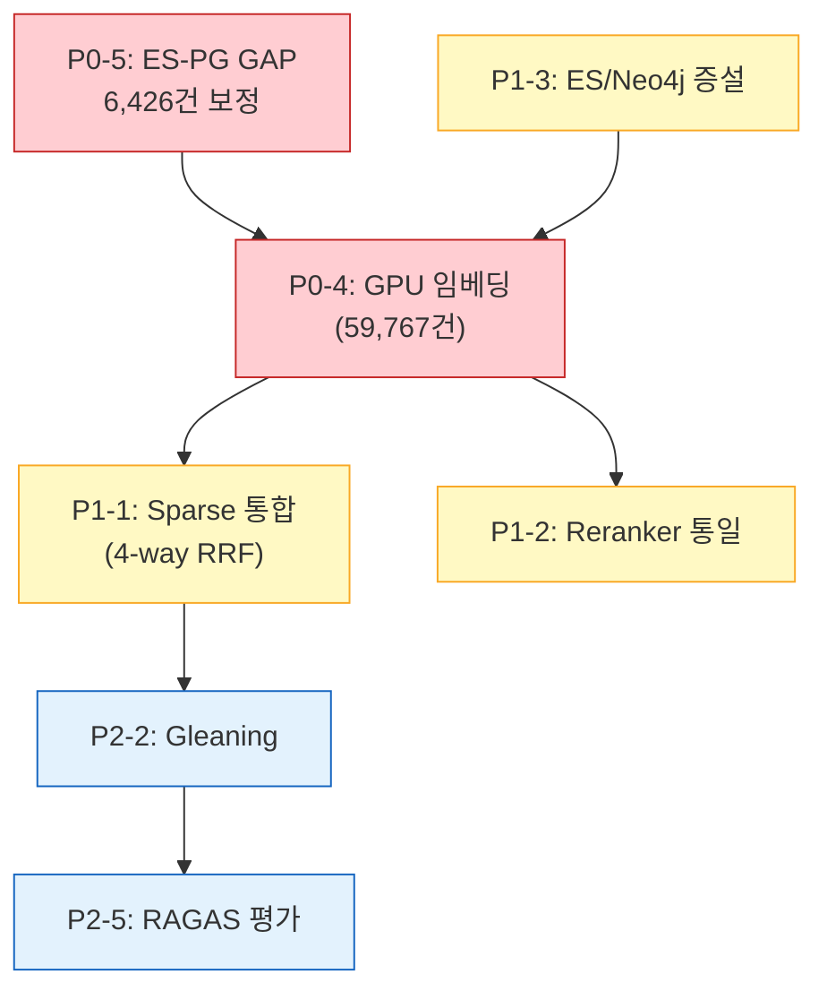

# Sprint 10 Action Tracker - 이행 관리 대장

> **Version**: 1.0
> **Created**: 2026-02-15 10:17 KST
> **Last Updated**: 2026-02-15 10:25 KST
> **Source**: Sprint 10 전원 회의 (PM, TL, Arch, RAG, ETL, Infra, QA 7명)

---

## 이행 현황 요약

| 우선순위 | 전체 | 완료 | 진행중 | 대기 | 완료율 |
|---------|:----:|:----:|:-----:|:----:|:-----:|
| **P0** | 5 | 3 | 0 | 2 | 60% |
| **P1** | 5 | 0 | 0 | 5 | 0% |
| **P2** | 7 | 0 | 0 | 7 | 0% |
| **합계** | **17** | **3** | **0** | **14** | **18%** |

---

## P0 - 즉시 대응 (Sprint 10 내 필수)

| # | 항목 | 발견자 | 담당 | 상태 | 완료일 | 비고 |
|---|------|--------|------|:----:|--------|------|
| P0-1 | 디스크 공간 확보 (97% → 91GB 회수) | Infra | 사용자 | **완료** | 02-15 | `docker_data.vhdx.bak.bak` 91GB 삭제 |
| P0-2 | search.py BM25 필드명 불일치 (`content` → `text`) | TL | 클로드 | **완료** | 02-15 | `content^3` → `text^3`, highlight도 수정 |
| P0-3 | ES 클라이언트 매번 재생성 → 싱글톤화 | TL | 클로드 | **완료** | 02-15 | `_es_client` 인스턴스 변수 + load_all() cleanup |
| P0-4 | Phase 2 GPU 임베딩 (59,767건) | PM/RAG | RAG | 대기 | - | Colab T4, Dense+Sparse 동시 생성 |
| P0-5 | ES-PG 정합성 GAP 6,426건 조사/보정 | Arch | ETL/Arch | 대기 | - | PG 저장 실패 시 ES만 진행하는 코드 결함 |

### P0-2 수정 상세
- **파일**: `knowledge_service/src/app/services/search.py`
- **변경**: L580 `content^3` → `text^3` (BM25 쿼리 필드), L601 highlight `content` → `text`
- **원인**: ES에 `text` 필드로 저장하지만 검색은 `content` 필드를 쿼리 → 매칭 안 됨

### P0-3 수정 상세
- **파일**: `knowledge_service/src/app/services/initial_data_loader.py`
- **변경**: `__init__`에 `self._es_client = None` 추가, `_store_to_elasticsearch()`에서 싱글톤 재사용, `load_all()` 종료 시 cleanup
- **원인**: 매 파일마다 `AsyncElasticsearch()` new + close → TCP 오버헤드

### P0-5 GAP 원인 (Arch 분석)
- `_store_to_elasticsearch()` L1360: PG 저장 실패 시 `non-critical` 경고만 남기고 ES는 계속 저장
- ES에는 청크가 있으나 PG `chunk_count`에 미반영 → SUM 차이 6,426건
- **해결 방향**: 정합성 검증 스크립트 → PG 재동기화 → 주기적 배치 잡

---

## P1 - Sprint 10~11

| # | 항목 | 발견자 | 담당 | 상태 | SP | 비고 |
|---|------|--------|------|:----:|:--:|------|
| P1-1 | Sparse 검색 통합 (4-way RRF) | TL/RAG/Arch | RAG | 대기 | 5 | ES 매핑 추가 + WordPiece vs Nori 리스크 |
| P1-2 | Reranker 모델 통일 (base → v2-m3) | RAG | RAG | 대기 | 3 | SCRUM-102 ONNX 변환 포함 |
| P1-3 | ES/Neo4j 메모리 증설 | Infra | Infra | 대기 | 1 | ES 512→1GB, Neo4j Heap 1GB, PageCache 512MB |
| P1-4 | docling timeout 파라미터 구현 | TL | ETL | 대기 | 1 | 대형 PDF 무한 대기 방지 |
| P1-5 | 테스트 GAP P1 모듈 4개 | QA | QA | 대기 | 3 | llm_service, llm_adapter, background_worker, document_repository |

---

## P2 - Sprint 11+

| # | 항목 | 발견자 | 담당 | 상태 | SP | 비고 |
|---|------|--------|------|:----:|:--:|------|
| P2-1 | pptx 슬라이드 단위 병합 청킹 | ETL | ETL | 대기 | 3 | 50.4% <100tok, 조직도 셀 문제 |
| P2-2 | Phase 3 Gleaning 엔티티 추출 | PM | RAG/ETL | 대기 | 5 | Neo4j Entity 0개, Graph Search 실효성 |
| P2-3 | Pydantic V2 deprecation 수정 | QA | RAG | 대기 | 1 | class Config → model_config 4곳 |
| P2-4 | Neo4j N+1 → UNWIND 배치 쿼리 | TL | ETL | 대기 | 2 | 성능 개선 |
| P2-5 | RAGAS 골든 QA 데이터셋 준비 | QA | QA | 대기 | 3 | 검색 품질 평가 기반 |
| P2-6 | chunker merge threshold 설정화 | TL | ETL | 대기 | 1 | 하드코딩 → config.py |
| P2-7 | 테스트 GAP P2 모듈 10개 | QA | QA | 대기 | 5 | rrf_fusion, bge_reranker 등 |

---

## 의존성 관계

---

## 변경 이력

| 날짜 | 항목 | 변경 내용 | 담당 |
|------|------|----------|------|
| 02-15 10:17 | 전체 | 전원 회의 결과로 초기 작성 (17건) | 클로드 |
| 02-15 10:25 | P0-1 | 디스크 91GB 삭제 완료 | 사용자 |
| 02-15 10:25 | P0-2 | search.py BM25 필드명 수정 완료 | 클로드 |
| 02-15 10:25 | P0-3 | ES 클라이언트 싱글톤화 완료 | 클로드 |

---

*관련 문서*:
- [ETL Phase 1 최종 보고서](./28_etl_phase1_final_report.md)
- [장애보고서 #27](./27_incident_report_2026-02-15_etl_oom_and_md_chunking.md)
- [Sparse 검색 통합 설계서](../02_design/15_sparse_vector_search_integration_design.md)
