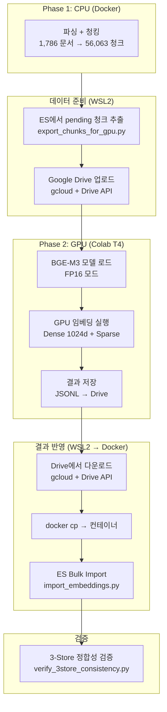
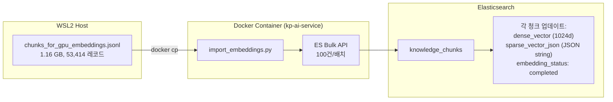
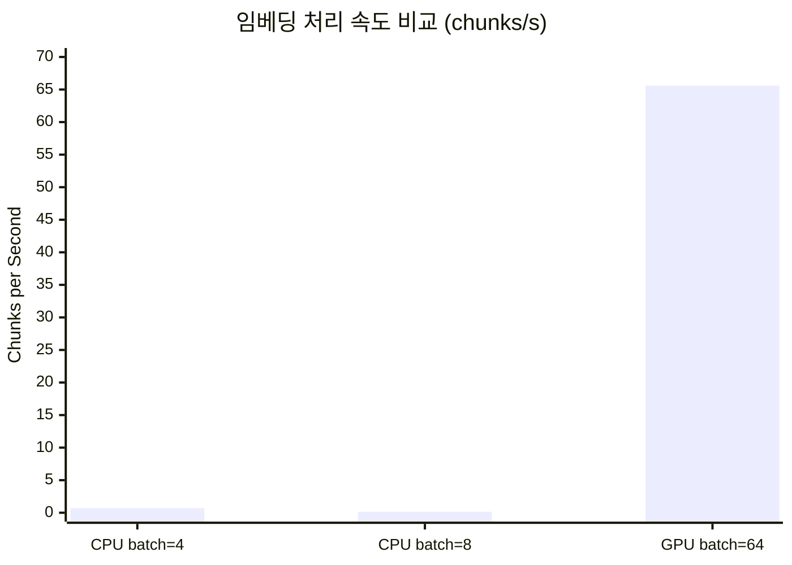

# GPU 임베딩 Colab 실행 매뉴얼 (Phase 2)

> **Version**: 1.0
> **Date**: 2026-02-15
> **Author**: Claude Opus 4.6 (AI Service Team)
> **Sprint**: Sprint 10
> **Status**: Verified (53,414건 실행 완료)

---

## 목차

1. [개요](#1-개요)
2. [사전 준비 - gcloud CLI 설치 및 인증](#2-사전-준비---gcloud-cli-설치-및-인증)
3. [임베딩 대상 데이터 추출](#3-임베딩-대상-데이터-추출)
4. [Google Drive 업로드](#4-google-drive-업로드)
5. [Colab 노트북 실행](#5-colab-노트북-실행)
6. [결과 다운로드 (Drive API)](#6-결과-다운로드-drive-api)
7. [ES Import](#7-es-import)
8. [3-Store 정합성 검증](#8-3-store-정합성-검증)
9. [트러블슈팅](#9-트러블슈팅)
10. [실행 결과 예시 (2026-02-15)](#10-실행-결과-예시-2026-02-15)

---

## 1. 개요

### 1.1 Phase 2 GPU 임베딩의 목적

ETL 3-Phase 파이프라인에서 Phase 2는 Phase 1에서 생성된 청크에 Dense + Sparse 벡터를 부여하는 단계이다. CPU 환경(Docker 컨테이너)에서의 임베딩은 속도가 매우 느리므로, Google Colab의 Tesla T4 GPU를 활용하여 대량 임베딩을 수행한다.

### 1.2 CPU vs GPU 속도 비교

| 환경 | 처리 속도 | 53,414건 예상 소요 | 비고 |
|------|-----------|-------------------|------|
| CPU (Docker, WSL2) | ~0.7 chunks/s | ~21시간 | batch_size=4, max_length=1000 |
| **GPU (Colab T4)** | **~65.6 chunks/s** | **~13.5분** | batch_size=64, fp16=True |
| 속도 차이 | **약 94배** | - | GPU 대비 CPU는 비현실적 |

### 1.3 대상 데이터

- Phase 1에서 생성된 전체 청크 중 `dense_vector` 필드가 미생성된 청크
- 이번 실행(2026-02-15): **53,414건** (전체 56,063건 중 2,649건은 기존 완료)

### 1.4 전체 워크플로우



---

## 2. 사전 준비 - gcloud CLI 설치 및 인증

### 2.1 gcloud SDK 설치 (WSL2)

```bash
# gcloud SDK 다운로드 및 설치
curl -sSL https://sdk.cloud.google.com > /tmp/install_gcloud.sh
bash /tmp/install_gcloud.sh --disable-prompts --install-dir=$HOME

# PATH 설정
export PATH="$HOME/google-cloud-sdk/bin:$PATH"
echo 'export PATH="$HOME/google-cloud-sdk/bin:$PATH"' >> ~/.bashrc
```

### 2.2 인증 (Drive 스코프 포함)

```bash
# Drive API 접근을 포함한 인증
gcloud auth login --enable-gdrive-access
```

브라우저가 열리면 Google 계정으로 로그인하고 권한을 승인한다. WSL2에서 브라우저가 자동으로 열리지 않으면 출력되는 URL을 복사하여 수동으로 접속한다.

### 2.3 프로젝트 설정

```bash
# Google Cloud 프로젝트 ID 설정 (Drive API만 사용하는 경우 선택사항)
gcloud config set project PROJECT_ID
```

### 2.4 인증 확인

```bash
# 토큰 발급 테스트
TOKEN=$(gcloud auth print-access-token)
echo "Token length: ${#TOKEN}"

# Drive API 접근 확인
curl -s -H "Authorization: Bearer $TOKEN" \
  "https://www.googleapis.com/drive/v3/about?fields=user" | python3 -m json.tool
```

---

## 3. 임베딩 대상 데이터 추출

### 3.1 pending 청크 수 확인

```bash
# embedding_status=pending인 청크 수 확인
curl -s 'http://localhost:9200/knowledge_chunks/_count' \
  -H 'Content-Type: application/json' \
  -d '{"query":{"bool":{"must_not":{"exists":{"field":"dense_vector"}}}}}' \
  | python3 -c "import sys,json; print('Pending chunks:', json.load(sys.stdin)['count'])"
```

### 3.2 데이터 추출 스크립트 실행

Docker 컨테이너 내부에서 추출 스크립트를 실행하여 JSONL 파일을 생성한다.

```bash
# 컨테이너 내부에서 Python 스크립트로 추출
docker exec kp-ai-service python3 -u -c "
import json
from elasticsearch import Elasticsearch, helpers

es = Elasticsearch('http://elasticsearch:9200')

query = {
    'bool': {
        'must_not': {'exists': {'field': 'dense_vector'}}
    }
}

chunks = []
for hit in helpers.scan(es, index='knowledge_chunks', query={'query': query},
                        _source=['document_id', 'text'], scroll='5m', size=1000):
    chunks.append({
        'chunk_id': hit['_id'],
        'document_id': hit['_source'].get('document_id', ''),
        'text': hit['_source'].get('text', '')
    })

with open('/tmp/chunks_for_gpu.jsonl', 'w', encoding='utf-8') as f:
    for c in chunks:
        f.write(json.dumps(c, ensure_ascii=False) + '\n')

print(f'Exported {len(chunks)} chunks to /tmp/chunks_for_gpu.jsonl')
es.close()
"
```

### 3.3 호스트로 복사

```bash
# 컨테이너에서 호스트로 파일 복사
docker cp kp-ai-service:/tmp/chunks_for_gpu.jsonl /tmp/chunks_for_gpu.jsonl

# 파일 크기 확인
ls -lh /tmp/chunks_for_gpu.jsonl
wc -l /tmp/chunks_for_gpu.jsonl
```

### 3.4 JSONL 형식

각 라인은 다음 필드를 포함하는 JSON 객체이다.

| 필드 | 타입 | 설명 |
|------|------|------|
| `chunk_id` | string (UUID) | ES 문서 ID (청크 고유 식별자) |
| `document_id` | string (UUID) | 원본 문서 ID (PG FK) |
| `text` | string | 청크 텍스트 내용 |

```json
{"chunk_id":"2a8b3637-aade-454b-83e3-15c28eb70dbe","document_id":"47c0a18c-e315-426d-9a61-9ffacbf30968","text":"프로젝트 일정 관련 내용..."}
```

---

## 4. Google Drive 업로드

### 4.1 Drive API를 통한 업로드

```bash
# 1. 액세스 토큰 발급
TOKEN=$(gcloud auth print-access-token)

# 2. Drive 루트에 파일 업로드
curl -X POST \
  -H "Authorization: Bearer $TOKEN" \
  -F "metadata={\"name\":\"chunks_for_gpu.jsonl\",\"parents\":[\"root\"]};type=application/json" \
  -F "file=@/tmp/chunks_for_gpu.jsonl;type=application/octet-stream" \
  "https://www.googleapis.com/upload/drive/v3/files?uploadType=multipart&fields=id,name,size"
```

### 4.2 업로드 확인

```bash
# 업로드된 파일 확인
curl -s -H "Authorization: Bearer $TOKEN" \
  "https://www.googleapis.com/drive/v3/files?q=name='chunks_for_gpu.jsonl'&fields=files(id,name,size,createdTime)" \
  | python3 -m json.tool
```

### 4.3 기존 파일이 있는 경우

동일 이름의 파일이 이미 Drive에 있으면 중복 파일이 생성된다. 기존 파일을 먼저 삭제하거나, 다른 이름으로 업로드한다.

```bash
# 기존 파일 ID 조회 후 삭제
FILE_ID=$(curl -s -H "Authorization: Bearer $TOKEN" \
  "https://www.googleapis.com/drive/v3/files?q=name='chunks_for_gpu.jsonl'&fields=files(id)" \
  | python3 -c "import sys,json; files=json.load(sys.stdin)['files']; print(files[0]['id'] if files else '')")

if [ -n "$FILE_ID" ]; then
  curl -X DELETE -H "Authorization: Bearer $TOKEN" \
    "https://www.googleapis.com/drive/v3/files/$FILE_ID"
  echo "Deleted existing file: $FILE_ID"
fi
```

---

## 5. Colab 노트북 실행

Colab 노트북은 `knowledge_service/docs/07_maintenance/gpu_embedding_colab.ipynb`에 저장되어 있다. Google Colab에서 열어 실행하거나, 아래 셀을 순서대로 실행한다.

### 5.0 사전 설정

1. Google Colab 접속: https://colab.research.google.com/
2. 런타임 > 런타임 유형 변경 > **T4 GPU** 선택
3. 노트북을 업로드하거나 셀을 수동으로 입력

### 5.1 Cell 1: GPU 확인

GPU가 정상적으로 할당되었는지 확인한다. CUDA가 비활성이면 런타임 유형을 T4 GPU로 변경해야 한다.

```python
import torch
print(f'PyTorch: {torch.__version__}')
print(f'CUDA available: {torch.cuda.is_available()}')
if torch.cuda.is_available():
    print(f'GPU: {torch.cuda.get_device_name(0)}')
    print(f'VRAM: {torch.cuda.get_device_properties(0).total_memory / 1024**3:.1f} GB')
else:
    print('WARNING: GPU not available! Go to Runtime > Change runtime type > T4 GPU')
```

**기대 출력**:
```
PyTorch: 2.9.0+cu128
CUDA available: True
GPU: Tesla T4
VRAM: 14.6 GB
```

### 5.2 Cell 2: 패키지 설치

FlagEmbedding과 transformers는 반드시 버전을 고정해야 한다. 최신 버전 조합은 호환성 오류가 발생한다.

```python
!pip install -q FlagEmbedding==1.3.4 transformers==4.44.2 torch
```

**주의**: 버전 미고정 시 `ImportError: cannot import name 'is_torch_fx_available'` 오류가 발생한다 (Section 9 참조).

### 5.3 Cell 3: Google Drive 마운트

```python
from google.colab import drive
drive.mount('/content/drive')

import os
input_path = '/content/drive/MyDrive/chunks_for_gpu.jsonl'
if os.path.exists(input_path):
    size_mb = os.path.getsize(input_path) / 1024 / 1024
    print(f'Found: {input_path} ({size_mb:.1f} MB)')
else:
    print(f'NOT FOUND: {input_path}')
    print('Upload chunks_for_gpu.jsonl to Google Drive root first!')
```

### 5.4 Cell 4: BGE-M3 모델 로드

FP16(half-precision)으로 모델을 로드하여 GPU VRAM 사용량을 절반으로 줄인다. 최초 실행 시 HuggingFace에서 모델(약 2.3GB)을 다운로드하며, 이후 실행에서는 캐시를 사용한다.

```python
from FlagEmbedding import BGEM3FlagModel
import time

print('Loading BGE-M3 model on GPU with FP16...')
start = time.time()
model = BGEM3FlagModel('BAAI/bge-m3', use_fp16=True)
print(f'Model loaded in {time.time()-start:.1f}s')
```

**기대 소요**: 약 40~60초 (모델 다운로드 포함 시 더 걸릴 수 있음)

### 5.5 Cell 5: 데이터 로드

```python
import json

input_path = '/content/drive/MyDrive/chunks_for_gpu.jsonl'

chunks = []
with open(input_path, 'r', encoding='utf-8') as f:
    for line in f:
        chunks.append(json.loads(line.strip()))

texts = [c['text'] for c in chunks]
print(f'Loaded {len(chunks)} chunks')
print(f'Text lengths: min={min(len(t) for t in texts)}, '
      f'max={max(len(t) for t in texts)}, '
      f'avg={sum(len(t) for t in texts)/len(texts):.0f}')
```

### 5.6 Cell 6: GPU 임베딩 실행

핵심 임베딩 실행 셀이다. Dense(1024차원) + Sparse(lexical_weights) 벡터를 동시에 생성한다.

```python
import time
import numpy as np

BATCH_SIZE = 64     # GPU 최적값 (CPU에서는 4)
MAX_LENGTH = 1000   # 기존 데이터 일관성 유지

print(f'Starting GPU embedding: {len(texts)} chunks')
print(f'  batch_size={BATCH_SIZE}, max_length={MAX_LENGTH}, fp16=True')
print(f'  return_dense=True, return_sparse=True')

start = time.time()

result = model.encode(
    texts,
    batch_size=BATCH_SIZE,
    max_length=MAX_LENGTH,
    return_dense=True,
    return_sparse=True,
    return_colbert_vecs=False
)

elapsed = time.time() - start
print(f'\nDone: {len(texts)} chunks in {elapsed:.1f}s ({len(texts)/elapsed:.1f} chunks/s)')
print(f'Dense shape: {result["dense_vecs"].shape}')
print(f'Sparse count: {len(result["lexical_weights"])}')
```

**파라미터 설명**:

| 파라미터 | 값 | 설명 |
|---------|-----|------|
| `batch_size` | 64 | GPU에서 동시 처리하는 텍스트 수. T4(15GB)에서 64가 최적 |
| `max_length` | 1000 | 텍스트 최대 토큰 길이. CPU 환경과 동일하게 유지 |
| `return_dense` | True | 1024차원 Dense 벡터 생성 |
| `return_sparse` | True | 토큰별 가중치 기반 Sparse 벡터 생성 |
| `return_colbert_vecs` | False | ColBERT 벡터는 미사용 (메모리 절약) |

### 5.7 Cell 7: 결과 저장

임베딩 결과를 JSONL 형식으로 Google Drive에 저장한다.

```python
import json
import numpy as np

output_path = '/content/drive/MyDrive/chunks_for_gpu_embeddings.jsonl'

print(f'Saving results to: {output_path}')

with open(output_path, 'w', encoding='utf-8') as f:
    for i, chunk in enumerate(chunks):
        # Dense vector: numpy array -> list
        dense = result['dense_vecs'][i].tolist()

        # Sparse vector: {token_id: weight} dict
        sparse_raw = result['lexical_weights'][i]
        if hasattr(sparse_raw, 'items'):
            sparse = {str(k): float(v) for k, v in sparse_raw.items()}
        else:
            sparse = {}

        record = {
            'chunk_id': chunk['chunk_id'],
            'document_id': chunk['document_id'],
            'dense_vector': dense,
            'sparse_vector': sparse
        }
        f.write(json.dumps(record, ensure_ascii=False) + '\n')

file_size = os.path.getsize(output_path) / 1024 / 1024
print(f'Saved {len(chunks)} embeddings ({file_size:.1f} MB)')
```

**출력 레코드 형식**:

| 필드 | 타입 | 설명 |
|------|------|------|
| `chunk_id` | string (UUID) | ES 문서 ID |
| `document_id` | string (UUID) | 원본 문서 ID |
| `dense_vector` | float[1024] | 1024차원 Dense 벡터 (L2 정규화됨) |
| `sparse_vector` | dict{string: float} | 토큰 ID별 가중치 (평균 82개 키) |

### 5.8 Cell 8: 검증

저장된 결과의 무결성을 검증한다.

```python
import json
import numpy as np

output_path = '/content/drive/MyDrive/chunks_for_gpu_embeddings.jsonl'

print('=== Verification ===')

# 첫 번째 레코드 확인
with open(output_path, 'r') as f:
    first = json.loads(f.readline())

print(f'chunk_id: {first["chunk_id"]}')
print(f'dense_vector dim: {len(first["dense_vector"])}')
print(f'sparse_vector keys: {len(first["sparse_vector"])}')

# Dense norm 검증 (L2 정규화 확인)
dense_norms = [np.linalg.norm(result['dense_vecs'][i]) for i in range(len(chunks))]
print(f'\nDense norm: min={min(dense_norms):.4f}, max={max(dense_norms):.4f}')
print(f'All norms ~1.0: {all(0.95 < n < 1.05 for n in dense_norms)}')

# 전체 건수 확인
line_count = sum(1 for _ in open(output_path))
print(f'\nTotal records: {line_count}')
print(f'Expected: {len(chunks)}')
print(f'Match: {line_count == len(chunks)}')
```

**검증 기준**:
- Dense 벡터 차원 = 1024
- Dense L2 norm = 0.9995 ~ 1.0000
- 결과 건수 = 입력 건수

---

## 6. 결과 다운로드 (Drive API)

Colab 실행 완료 후 Drive에 저장된 결과 파일을 WSL2 호스트로 다운로드한다.

### 6.1 파일 ID 조회 및 다운로드

```bash
# 1. 액세스 토큰 발급
TOKEN=$(gcloud auth print-access-token)

# 2. 결과 파일 ID 조회
FILE_ID=$(curl -s -H "Authorization: Bearer $TOKEN" \
  "https://www.googleapis.com/drive/v3/files?q=name='chunks_for_gpu_embeddings.jsonl'&fields=files(id,size)" \
  | python3 -c "import sys,json; files=json.load(sys.stdin)['files']; print(files[0]['id'] if files else 'NOT_FOUND')")

echo "File ID: $FILE_ID"

# 3. 파일 다운로드
curl -L -H "Authorization: Bearer $TOKEN" \
  "https://www.googleapis.com/drive/v3/files/$FILE_ID?alt=media" \
  -o /tmp/chunks_for_gpu_embeddings.jsonl
```

### 6.2 다운로드 확인

```bash
# 파일 크기 확인
ls -lh /tmp/chunks_for_gpu_embeddings.jsonl

# 레코드 수 확인
wc -l /tmp/chunks_for_gpu_embeddings.jsonl

# 첫 레코드 샘플 (dense_vector 축약)
head -1 /tmp/chunks_for_gpu_embeddings.jsonl | python3 -c "
import sys, json
rec = json.loads(sys.stdin.readline())
print(f'chunk_id: {rec[\"chunk_id\"]}')
print(f'dense_vector dim: {len(rec[\"dense_vector\"])}')
print(f'sparse_vector keys: {len(rec[\"sparse_vector\"])}')
"
```

---

## 7. ES Import

### 7.1 결과 파일을 컨테이너에 복사

```bash
docker cp /tmp/chunks_for_gpu_embeddings.jsonl kp-ai-service:/tmp/
```

### 7.2 import_embeddings.py 실행

`import_embeddings.py`는 JSONL 파일을 읽어 ES에 Bulk Update를 수행한다. Sparse vector는 **JSON 문자열** (`sparse_vector_json`)로 저장하여 ES 동적 매핑 폭발을 방지한다.

```bash
# 전체 임포트
docker exec kp-ai-service python3 -u scripts/import_embeddings.py /tmp/chunks_for_gpu_embeddings.jsonl

# 이어하기 (이미 completed된 건 건너뜀)
docker exec kp-ai-service python3 -u scripts/import_embeddings.py /tmp/chunks_for_gpu_embeddings.jsonl --skip-completed
```

**스크립트 동작**:
- Bulk 크기: 100건 단위
- 업데이트 필드: `dense_vector`, `sparse_vector_json`(JSON string), `embedding_status`(completed), `embedding_model`(bge-m3)
- `--skip-completed`: 이미 completed인 청크를 건너뛰어 중단 후 재개에 사용
- 완료 후 자동 검증: embedding_status 분포 출력

> **CRITICAL**: Sparse vector를 `sparse_vector` (object)로 저장하면 안 된다. 토큰 ID마다 ES 필드가 생성되어 동적 매핑 폭발 → ES 크래시가 발생한다. 반드시 `sparse_vector_json` (문자열)으로 저장해야 한다. (Section 9.8 참조)

**실제 실행 결과 (2026-02-15)**:
```
Loading embeddings from: /tmp/chunks_for_gpu_embeddings.jsonl
Total records loaded: 53414
  Progress: 100/53414 (557 docs/s, ~2m left)
  ...
  Progress: 53414/53414 (434 docs/s, ~0m left)

Completed in 123.0s (2.1m)
  Updated: 53414
  Failed: 0

Verification:
  Total chunks: 56063
  completed: 53414 (95.3%)
  pending: 2649 (4.7%)
```

### 7.3 나머지 pending 청크 처리

GPU JSONL 추출 시 누락된 2,649건은 컨테이너 내 CPU로 처리한다. 소량이므로 CPU로도 약 32분이면 완료된다.

```bash
# 1. pending 청크 추출
docker exec kp-ai-service python3 -u /tmp/extract_pending.py

# 2. CPU 임베딩 (백그라운드 실행)
docker exec -d kp-ai-service bash -c "nohup python3 -u /tmp/embed_remaining.py > /tmp/embed_remaining.log 2>&1 &"

# 3. 진행 확인
docker exec kp-ai-service tail -5 /tmp/embed_remaining.log

# 4. 완료 후 임포트
docker exec kp-ai-service python3 -u /tmp/import_embeddings.py /tmp/remaining_embeddings.jsonl
```

### 7.4 Import 데이터 흐름



---

## 8. 3-Store 정합성 검증

Import 완료 후 PG, ES, Neo4j 간 데이터 일관성을 검증한다.

### 8.1 검증 스크립트 실행

```bash
docker exec kp-ai-service python3 -u scripts/verify_3store_consistency.py
```

### 8.2 검증 항목

| 검증 대상 | 기대 결과 |
|-----------|-----------|
| PG 문서 수 = ES 고유 document_id 수 | 일치 |
| PG chunk_count 합계 = ES 전체 청크 수 | 일치 |
| PG 문서 수 = Neo4j Document 노드 수 | 일치 |
| PG chunk_count 합계 = Neo4j Chunk 노드 수 | 일치 |
| ES-only orphan (PG에 없는 문서의 청크) | 0건 |
| PG-only (ES에 청크 없는 문서) | 0건 |

### 8.3 정상 출력 예시

```
=== 3-Store Consistency Verification ===

PostgreSQL:    1,437 docs, 56,063 chunks
Elasticsearch: 1,437 docs, 56,063 chunks
Neo4j:         1,437 docs, 56,063 chunks

--- GAP Analysis ---
ES-only orphans:  0 docs (0 chunks)
PG-only (no ES):  0 docs
Count mismatch:   0 docs

*** 3-Store PERFECTLY CONSISTENT ***
```

### 8.4 불일치 발생 시

orphan 청크가 발견되면 `--fix` 플래그로 자동 정리할 수 있다.

```bash
# orphan 청크 자동 삭제
docker exec kp-ai-service python3 -u scripts/verify_3store_consistency.py --fix
```

---

## 9. 트러블슈팅

### 9.1 `total_mem` AttributeError

**증상**:
```python
AttributeError: 'CudaDeviceProperties' object has no attribute 'total_mem'
```

**원인**: PyTorch 2.9+ 에서 `total_mem` 속성이 `total_memory`로 변경됨

**해결**: 코드에서 `total_memory`를 사용
```python
# 올바른 코드
print(f'VRAM: {torch.cuda.get_device_properties(0).total_memory / 1024**3:.1f} GB')
```

### 9.2 FlagEmbedding import 오류

**증상**:
```
ImportError: cannot import name 'is_torch_fx_available' from 'transformers.utils.import_utils'
```

**원인**: FlagEmbedding이 transformers 5.x와 비호환. `is_torch_fx_available` 함수가 transformers 5.0.0에서 제거됨

**해결**: 버전 고정 설치
```python
!pip install -q FlagEmbedding==1.3.4 transformers==4.44.2 torch
```

**검증된 호환 버전 조합**:

| 패키지 | 버전 | 비고 |
|--------|------|------|
| FlagEmbedding | 1.3.4 | 1.3.5도 가능하나 1.3.4 권장 |
| transformers | 4.44.2 | **5.0.0 미만** 필수 |
| torch | 2.9.0+cu128 | Colab 기본 제공 버전 |

### 9.3 Drive 파일을 찾을 수 없음

**증상**: `FileNotFoundError: [Errno 2] No such file or directory`

**원인**: 파일이 Drive 하위 폴더에 있거나, 업로드 경로가 다름

**해결**:
```python
# Drive 루트 파일 목록 확인
import os
for f in sorted(os.listdir('/content/drive/MyDrive/'))[:30]:
    print(f)

# 파일 경로를 직접 지정
input_path = '/content/drive/MyDrive/chunks_for_gpu.jsonl'
```

**권장사항**: 파일은 항상 **Drive 루트**(`MyDrive/`)에 업로드하여 경로 혼동을 방지한다.

### 9.4 ES total_fields limit 초과

**증상**:
```
IllegalArgumentException: Limit of total fields [1000] has been exceeded
```

**원인**: Sparse vector는 토큰 ID(예: `173894`, `9069` 등)를 필드명으로 사용하므로, 고유 토큰 수만큼 필드가 생성된다. 기본 제한(1,000)을 쉽게 초과한다.

**해결**:
```bash
docker exec kp-ai-service python3 -u -c "
from elasticsearch import Elasticsearch
es = Elasticsearch('http://elasticsearch:9200')
es.indices.put_settings(
    index='knowledge_chunks',
    body={'index.mapping.total_fields.limit': 50000}
)
print('total_fields.limit updated to 50000')
es.close()
"
```

### 9.5 Colab 런타임 연결 끊김

**증상**: 장시간 실행 중 Colab 세션이 끊어져 결과가 소실됨

**예방**:
- 브라우저 탭을 활성 상태로 유지
- 배치 중간 결과를 Drive에 주기적으로 저장하는 코드 추가
- Colab Pro 사용 시 런타임 유지 시간이 길어짐

**복구**: 53,414건 기준 약 13.5분이므로 재실행이 현실적이다.

### 9.6 gcloud 토큰 만료

**증상**: `401 Unauthorized` 또는 `Invalid Credentials`

**원인**: `gcloud auth print-access-token`의 토큰은 약 1시간 유효

**해결**:
```bash
# 토큰 재발급
TOKEN=$(gcloud auth print-access-token)
```

### 9.7 ES 동적 매핑 폭발 (mapper_exception)

**증상**:
```
mapper_exception: timed out while waiting for a dynamic mapping update
```
이후 ES 컨테이너가 크래시하고 `Connection refused` 발생.

**원인**: Sparse vector를 `sparse_vector` (object 타입)으로 저장하면, 토큰 ID(예: `173894`, `9069`)가 ES 필드명이 되어 동적 매핑이 생성된다. BGE-M3의 어휘 크기(250,000+)에 비례하여 필드가 누적되면 ES 매핑 업데이트가 타임아웃되고 최종적으로 크래시한다.

```
# 이런 구조로 저장하면 안 됨 (필드가 폭발적으로 증가)
"sparse_vector": {"173894": 0.42, "9069": 0.31, "12874": 0.28, ...}
                    ↓ ES가 각각을 별도 필드로 인식
  sparse_vector.173894 (float)
  sparse_vector.9069   (float)
  sparse_vector.12874  (float)
  ... (23,974개 하위 필드 생성)
```

**해결**: Sparse vector를 **JSON 문자열**로 직렬화하여 단일 text 필드에 저장.

```python
# ✅ 올바른 방법: JSON 문자열 (필드 1개)
sparse_json = json.dumps(sparse, ensure_ascii=False)
doc = {"sparse_vector_json": sparse_json}

# ❌ 잘못된 방법: dict 직접 저장 (필드 N개, N=고유 토큰 수)
doc = {"sparse_vector": sparse}
```

**복구**: ES가 크래시한 경우 `docker-compose restart elasticsearch` 후 `--skip-completed` 플래그로 임포트를 재개한다.

**실제 사고 기록 (2026-02-15)**:
1. 1차 임포트: sparse_vector (object)로 23,974개 하위 필드 생성 → 16,400건에서 mapper_exception 시작 → ES 크래시
2. 수정: `sparse_vector_json` (JSON 문자열)로 변경
3. 2차 임포트: `--skip-completed`로 재개, 53,414건 전체 성공 (434 docs/s)

### 9.8 대용량 파일 Drive 다운로드 실패

**증상**: 1GB 이상 파일 다운로드 시 curl이 빈 파일을 생성하거나 타임아웃

**해결**:
```bash
# --max-time으로 타임아웃 확장 (초 단위)
curl -L --max-time 600 \
  -H "Authorization: Bearer $TOKEN" \
  "https://www.googleapis.com/drive/v3/files/$FILE_ID?alt=media" \
  -o /tmp/chunks_for_gpu_embeddings.jsonl

# 또는 gcloud CLI 직접 사용 (resumable download)
# pip install google-api-python-client 후 Python으로 다운로드
```

---

## 10. 실행 결과 예시 (2026-02-15)

### 10.1 실행 환경

| 항목 | 값 |
|------|-----|
| 실행 날짜 | 2026-02-15 |
| Sprint | Sprint 10 |
| Colab 런타임 | T4 GPU (15GB VRAM) |
| PyTorch | 2.9.0+cu128 |
| FlagEmbedding | 1.3.4 |
| transformers | 4.44.2 |

### 10.2 입력 데이터

| 항목 | 값 |
|------|-----|
| 전체 청크 (ES) | 56,063건 |
| 임베딩 대상 | 53,414건 (pending) |
| 기존 완료 | 2,649건 |
| 입력 파일 크기 | ~53 MB |
| 텍스트 길이 (min/avg/max) | 10 / 650 / 11,183 |

### 10.3 임베딩 결과

| 항목 | 값 |
|------|-----|
| 처리 속도 | **65.6 chunks/s** |
| 소요 시간 | **814.8초 (~13.5분)** |
| Dense 차원 | 1024 |
| Sparse 평균 키 수 | 82개 |
| 결과 파일 크기 | **1,156.2 MB (1.16 GB)** |
| Dense norm 범위 | 0.9995 ~ 1.0000 |
| 정규화 검증 | 전건 PASS (0.95 < norm < 1.05) |

### 10.4 ES Import 결과

| 항목 | 값 |
|------|-----|
| GPU 임베딩 임포트 | 53,414건 (0 실패) |
| 임포트 속도 | **434 docs/s** |
| 임포트 소요 시간 | **123초 (2.1분)** |
| 나머지 CPU 임베딩 | 2,649건 (CPU ~32분) |
| 최종 completed | **56,063건 (100.0%)** |
| 저장 형식 | `sparse_vector_json` (JSON 문자열) |
| 트러블슈팅 | 1차: 동적매핑 폭발 → 2차: JSON 문자열로 해결 |

### 10.5 비용

| 항목 | 값 |
|------|-----|
| Colab 무료 티어 | T4 GPU 사용 가능 |
| 소요 시간 | ~13.5분 (무료 한도 내) |
| 추가 비용 | 없음 |

---

## 관련 문서

| 문서 | 경로 | 설명 |
|------|------|------|
| BGE-M3 운영 매뉴얼 | `docs/07_maintenance/04_bge_m3_embedding_operations.md` | CPU 환경 임베딩 운영 |
| ETL 3-Phase 운영 가이드 | `docs/07_maintenance/22_etl_3phase_operations_guide.md` | Phase 1/2/3 전체 흐름 |
| ETL Phase 1 최종 보고서 | `docs/07_maintenance/28_etl_phase1_final_report.md` | Phase 1 결과 |
| Colab 노트북 | `docs/07_maintenance/gpu_embedding_colab.ipynb` | 실행 가능한 노트북 |
| import_embeddings.py | `knowledge_service/scripts/import_embeddings.py` | ES Bulk Import 스크립트 |
| verify_3store_consistency.py | `knowledge_service/scripts/verify_3store_consistency.py` | 3-Store 정합성 검증 |

---

## Appendix A. GPU vs CPU 임베딩 비교

### A.1 환경 비교

| 항목 | CPU (WSL2 로컬) | GPU (Colab T4) |
|------|:--------------:|:--------------:|
| **하드웨어** | AMD Ryzen / Intel i7 (일반 데스크탑) | NVIDIA Tesla T4 (15GB VRAM) |
| **메모리** | 시스템 RAM 공유 (10GB 제한) | GPU VRAM 15GB 전용 |
| **정밀도** | FP32 (기본) | FP16 (half precision) |
| **비용** | 무료 (로컬) | 무료 (Colab Free Tier, 일일 제한) |
| **네트워크** | 로컬 (전송 불필요) | Google Drive 업/다운로드 필요 |

### A.2 성능 비교



| 지표 | CPU (batch=4) | CPU (batch=8) | GPU T4 (batch=64) |
|------|:------------:|:------------:|:-----------------:|
| **처리 속도** | 0.7 chunks/s | 0.15 chunks/s | 65.6 chunks/s |
| **53,414건 소요** | ~21시간 | ~99시간 | **13.5분** |
| **메모리 사용** | 2.9 GB | 7.3 GB (OOM 위험) | 8.2 GB VRAM |
| **batch_size** | 4 (최적) | 8 (역효과) | 64 (최적) |
| **max_text_length** | 1000 (필수) | 1000 | 1000 |
| **CPU 사용률** | 100% (1코어) | 100%+ (경합) | 최소 (GPU 위임) |

### A.3 CPU 임베딩의 한계

**2026-02-10 실측 데이터 기반**:

1. **batch_size 역효과**: CPU에서 batch_size 8은 4보다 7배 느림 (55초/8건 vs 7초/4건)
2. **멀티워커 무효**: 2워커 실행 시 CPU 경합으로 1워커와 동일 속도
3. **OOM 위험**: max_text_length 1500에서 메모리 7.3GB + OOM Kill 발생
4. **최적 설정**: batch=4, workers=1, max_text_length=1000이 CPU 한계치

```
CPU 최적 설정 (확정):
  batch_size: 4
  max_text_length: 1000
  workers: 1
  처리 속도: 0.7 chunks/s
  53,414건 예상: ~21시간
```

### A.4 GPU 사용이 필수인 이유

| 기준 | CPU | GPU | 결론 |
|------|:---:|:---:|:----:|
| 10,000건 이하 | 4시간 (수용) | 2.5분 | CPU 가능 |
| 10,000~50,000건 | 20시간 (야간) | 8분 | GPU 권장 |
| **50,000건 이상** | **21시간+** | **13분** | **GPU 필수** |
| 100,000건 이상 | 40시간+ | 25분 | GPU 필수 |

### A.5 비용 분석

| 항목 | CPU (로컬) | GPU (Colab Free) | GPU (Colab Pro) | GPU (GCE T4) |
|------|:---------:|:----------------:|:---------------:|:------------:|
| **비용** | 전기세 | 무료 | $11.99/월 | ~$0.35/시간 |
| **GPU 시간** | - | 일일 제한 (~4시간) | 더 긴 세션 | 무제한 |
| **53,414건** | 전기세 ~21시간 | 무료 13.5분 | 무료 13.5분 | ~$0.08 |
| **제약** | 없음 | 일일 할당량 | 우선순위 GPU | 결제 필요 |

> **결론**: 50,000건 이상 임베딩은 Colab Free T4로 충분. 비용 $0, 시간 93배 단축.

### A.6 Dense + Sparse 동시 생성

GPU 임베딩의 또 다른 장점은 Dense와 Sparse 벡터를 **한 번의 forward pass**로 동시 생성한다는 점이다.

| 벡터 타입 | 용도 | 차원/크기 | 검색 방식 |
|----------|------|---------|----------|
| **Dense** | 의미적 유사도 | 1024차원 float | ANN (HNSW) |
| **Sparse** | 키워드 매칭 | 평균 82개 token_id:weight | Inverted Index |

```
BGE-M3 encode() 1회 호출로:
  ├── Dense vector (1024 dim) → ES dense_vector 필드
  ├── Sparse weights (82 avg keys) → ES sparse_vector 필드
  └── (ColBERT vectors → 미사용, return_colbert_vecs=False)
```

CPU에서 두 벡터를 별도로 생성하면 2배 시간이 필요하지만, GPU에서는 단일 모델 추론으로 동시 생성되어 추가 비용이 없다.

---

## 변경 이력

| 날짜 | 버전 | 내용 |
|------|------|------|
| 2026-02-15 | 1.0 | 초기 작성 - 53,414건 GPU 임베딩 실행 결과 기반 |
| 2026-02-15 | 1.1 | Appendix A: GPU vs CPU 비교 추가 |
| 2026-02-15 | 1.2 | ES Import 실제 결과 반영, 동적매핑 폭발 트러블슈팅 추가, sparse_vector_json 문서화 |
