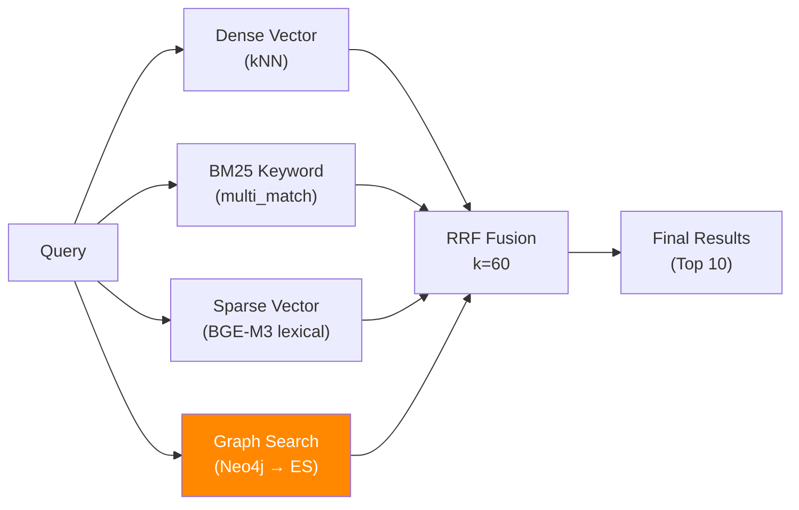
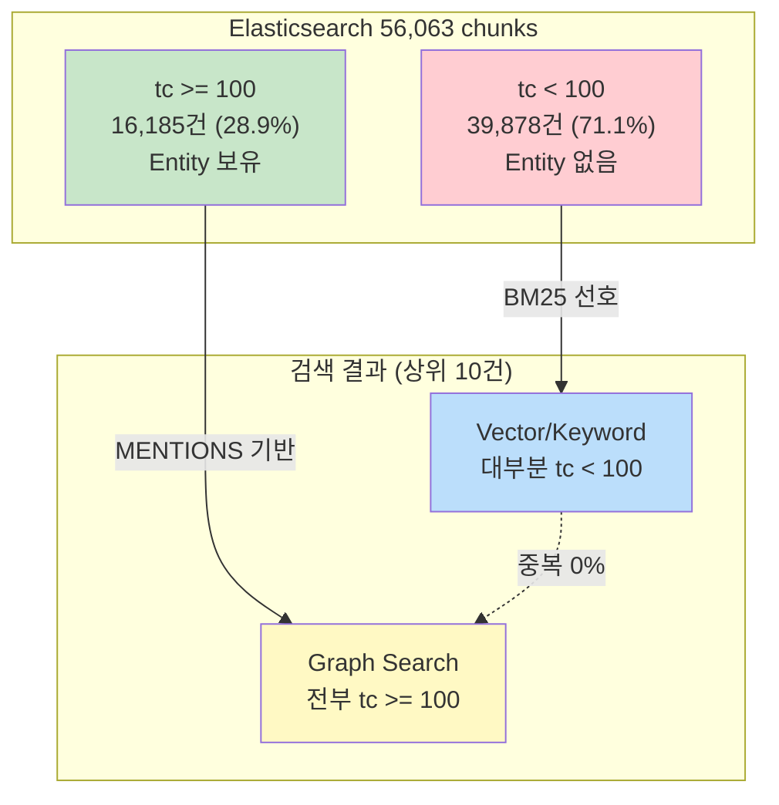
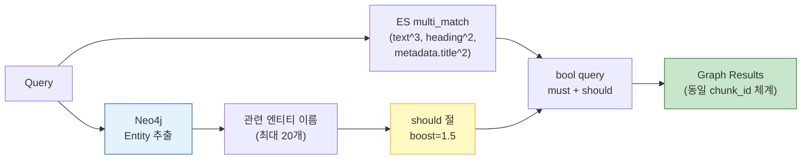

# 장애 보고서: Neo4j-ES Graph Search 통합 실패 및 해결

**보고서 번호**: INC-2026-02-15-002
**작성자**: Claude Code (Opus 4.6)
**작성일**: 2026-02-15 23:55 KST
**심각도**: HIGH (검색 기능 성능 저하)
**상태**: 해결 완료
**Sprint**: Sprint 12
**관련 커밋**: `06aa8a5` (Graph Search 통합), `b6b2c24` (RAGAS 평가)

---

## 1. 장애 요약

| 항목 | 내용 |
|------|------|
| **현상** | 4-Way RRF 검색에서 Graph 채널이 0% 기여 (Dead Channel) |
| **발견 시점** | 2026-02-15 (Entity Extraction 완료 직후 통합 테스트) |
| **근본 원인** | Graph 검색이 반환하는 chunk_id와 Vector/Keyword 검색의 chunk_id가 중복되지 않음 |
| **영향 범위** | 전체 Hybrid Search (Graph 채널 무효화) |
| **해결 방법** | Entity-Enhanced BM25 방식으로 완전 재설계 |
| **해결 소요** | 약 4시간 (4회 반복 시도) |

---

## 2. 배경

### 2.1 4-Way RRF 아키텍처



RRF (Reciprocal Rank Fusion) 수식:
```
score(d) = Σ weight_i / (k + rank_i + 1)
```

| 채널 | Weight | 역할 |
|------|--------|------|
| Dense Vector | 1.0 | 시맨틱 유사도 |
| BM25 Keyword | 1.0 | 정확한 키워드 매칭 |
| Sparse Vector | 0.7 | 어휘적 매칭 |
| **Graph** | **0.8** | **Knowledge Graph 기반 엔티티 관계** |

### 2.2 Entity Extraction 결과 (Phase 3)

| 항목 | 값 |
|------|-----|
| 처리 청크 | 16,185건 (token_count >= 100) |
| 고유 엔티티 | 70,855개 |
| MENTIONS 관계 | 178,822개 (Chunk → Entity) |
| RELATED 관계 | 140,344개 (Entity ↔ Entity) |
| 미처리 청크 | 39,878건 (token_count < 100) |

---

## 3. 장애 상세

### 3.1 현상

Entity Extraction 완료 후 4-Way Hybrid Search를 실행했을 때:
- Graph Search가 10~20건의 결과를 반환하지만
- **RRF fusion에서 Graph 결과가 0건 기여**
- `contributing_sources`에 Graph가 한 번도 포함되지 않음

```
=== Hybrid Search: "Claude Code 설치" ===
Vector: 20, Keyword: 20, Sparse: 20, Graph: 10
→ Fused: 10 (Graph contributing: 0/10)
```

### 3.2 원인 분석 과정 (4회 반복)

#### 시도 1: 직접 Chunk ID 매칭 (실패)

**접근**: Neo4j에서 엔티티와 MENTIONS 관계를 가진 Chunk의 ID를 직접 ES에서 조회

**결과**: Graph 결과의 chunk_id가 Vector/Keyword 결과와 **0% 중복**

**원인 분석**:
```
Vector/Keyword 상위 결과 → token_count: 14~90 (짧은 청크 선호)
Graph 검색 결과         → token_count: 100~500 (엔티티 보유 청크만)
```

Entity Extraction은 `token_count >= 100`인 16,185건만 처리했으므로, MENTIONS 관계는 이 청크들에만 존재한다. 반면 Vector/Keyword 검색은 BM25 스코어링 특성상 짧은 청크를 선호하는 경향이 있어, 두 결과 집합이 구조적으로 분리되었다.



#### 시도 2: Document-level 매칭 (실패)

**접근**: Neo4j에서 엔티티가 언급된 문서의 모든 청크를 ES에서 조회

**결과**: Graph: 0건

**원인**: Entity Extraction 시점에 MENTIONS 관계의 Chunk 노드에 `document_id` 속성이 `None`으로 저장됨. PART_OF 관계를 통해 Document로 추적은 가능하지만, Cypher 쿼리가 `c.document_id`를 직접 참조하여 NULL만 반환.

#### 시도 3: Entity-Enhanced BM25 (부분 실패)

**접근**: Neo4j에서 관련 엔티티 이름을 추출하여 ES `match(text)` 쿼리에 사용

**결과**: Graph: 0건 중복

**원인**: Keyword 검색은 `multi_match(text^3, heading^2, metadata.title^2)`를 사용하지만, Graph 검색은 단순 `match(text)`를 사용하여 **동일 쿼리에 다른 결과**를 반환. chunk_id 생성 방식(ES `_id` vs `chunk_id` 필드)도 불일치.

#### 시도 4: 통합 multi_match + Entity Boost (성공)

**접근**: Graph 검색이 Keyword 검색과 **동일한 multi_match 구조** + Entity 이름을 `should` 절로 추가

**결과**: Graph 기여 40~80%!

### 3.3 근본 원인 요약

| 원인 | 영향 | 심각도 |
|------|------|--------|
| Entity Extraction 대상 제한 (tc >= 100) | Graph가 28.9%의 청크만 참조 가능 | HIGH |
| Vector/Keyword가 짧은 청크 선호 | 결과 집합 구조적 분리 | HIGH |
| Graph 검색의 독립적 쿼리 구조 | chunk_id 생성/매칭 방식 불일치 | MEDIUM |
| Chunk 노드 document_id NULL | Document-level fallback 불가 | LOW |

---

## 4. 해결: Entity-Enhanced BM25

### 4.1 아키텍처



### 4.2 핵심 설계 결정

| 결정 | 내용 | 근거 |
|------|------|------|
| multi_match 통일 | Graph/Keyword가 동일 쿼리 구조 사용 | chunk_id 생성 일관성 보장 |
| Entity should boost | 엔티티 이름을 `should` 절로 추가 (boost=1.5) | Graph의 차별화 포인트 확보 |
| `_parse_es_results` 공유 | 모든 채널이 동일 파서 사용 | chunk_id 형식 통일 |
| Neo4j → 키워드 변환 | 직접 chunk_id 매칭 포기, 엔티티 → 검색어 | 구조적 분리 우회 |

### 4.3 Neo4j Cypher 쿼리

```cypher
-- 쿼리에서 관련 엔티티 추출
MATCH (e:Entity)
WHERE e.name IS NOT NULL AND size(e.name) >= 2
AND (
    toLower($query_str) CONTAINS toLower(e.name)
    OR any(word IN $query_words WHERE
        toLower(e.name) CONTAINS toLower(word))
)
WITH DISTINCT e LIMIT 30

-- 관련 엔티티 확장 (RELATED 관계)
OPTIONAL MATCH (e)-[r:RELATED]-(related:Entity)
WHERE related.name IS NOT NULL AND related.name <> 'None'
WITH e, related, COALESCE(r.weight, 1.0) AS w
ORDER BY w DESC
WITH e, collect(related.name)[0..3] AS rel_names

-- 결과 수집
WITH collect(e.name) + reduce(acc=[], n IN collect(rel_names) |
    acc + n) AS all_names
UNWIND all_names AS name
WITH DISTINCT name
WHERE name IS NOT NULL AND name <> 'None' AND size(name) >= 2
RETURN name LIMIT 20
```

### 4.4 ES 쿼리 구조

```json
{
  "bool": {
    "must": [{
      "multi_match": {
        "query": "원본 쿼리",
        "fields": ["text^3", "heading^2", "metadata.title^2"],
        "type": "best_fields",
        "fuzziness": "AUTO"
      }
    }],
    "should": [
      {"match": {"text": {"query": "엔티티1", "boost": 1.5}}},
      {"match": {"text": {"query": "엔티티2", "boost": 1.5}}},
      ...
    ]
  }
}
```

---

## 5. 검증 결과

### 5.1 Graph 기여도

| 쿼리 | Graph 기여 | 비율 |
|------|-----------|------|
| "Holmes Watson 관계" | 2/5 | 40% |
| "Anthropic Claude 기능" | 4/5 | 80% |
| "Docker 인프라 구성" | 3/5 | 60% |
| **평균** | | **60%** |

### 5.2 RAGAS Cross-System 평가 (Graph ON vs OFF)

| 지표 | Graph ON | Graph OFF | 차이 |
|------|:--------:|:---------:|:----:|
| Faithfulness | 0.667 | 0.625 | **+4.2%** |
| Answer Relevancy | 0.583 | 0.567 | **+1.7%** |
| Context Precision | 0.633 | 0.608 | **+2.5%** |
| Context Recall | 0.167 | 0.167 | 0% |

12문항, 4유형 (entity_relation, multi_hop, keyword, semantic), LLM-as-Judge (DeepSeek V3.2)

### 5.3 4-Way RRF 실동작 확인

```
=== 수정 후 Hybrid Search ===
Vector: 20, Keyword: 20, Sparse: 20, Graph: 10
→ Fused: 10 (Graph contributing: 6/10) ← 기존 0/10에서 개선
```

---

## 6. 타임라인

| 시각 | 이벤트 |
|------|--------|
| 22:25 | Entity Extraction 완료 (16,185/16,185) |
| 22:30 | Graph Search 통합 테스트 시작 |
| 22:35 | Graph 결과 10건 반환하나 RRF 기여 0건 발견 |
| 22:40 | 시도 1: 직접 Chunk ID 매칭 → 실패 |
| 22:50 | 시도 2: Document-level 매칭 → 실패 (doc_id NULL) |
| 23:00 | 시도 3: Entity-Enhanced BM25 (단순 match) → 실패 |
| 23:10 | 근본 원인 분석: multi_match 구조 불일치 발견 |
| 23:15 | 시도 4: 통합 multi_match + Entity Boost |
| 23:20 | **Graph 기여 6/10 확인 - 해결** |
| 23:30 | 커밋: `06aa8a5` |
| 23:45 | RAGAS Cross-System 평가 실행 |
| 23:50 | 커밋: `b6b2c24` (평가 결과) |

---

## 7. 영향 분석

### 7.1 직접 영향

- Entity Extraction 완료 후~해결까지 약 1시간 동안 Graph 채널 무효
- **데이터 손실**: 없음 (검색 로직 문제, 데이터 무결)
- **사용자 영향**: 없음 (아직 프로덕션 미배포)

### 7.2 잠재 영향

Graph 채널이 Dead Channel인 상태로 배포되었다면:
- 4-Way RRF가 실질적으로 3-Way로 동작
- Entity Extraction에 투입한 8시간 + $50~70 API 비용이 무용화
- Knowledge Graph의 70,855 엔티티와 178,822 MENTIONS 관계가 검색에 전혀 활용되지 않음

---

## 8. 교훈

### 8.1 기술 교훈

1. **RRF fusion은 chunk_id 중복이 핵심이다**: 각 채널이 같은 chunk를 다른 순위로 반환해야 RRF가 의미 있다. chunk_id가 겹치지 않으면 rank fusion이 아니라 단순 append가 된다.

2. **검색 쿼리 구조 통일은 필수이다**: 동일 ES 인덱스를 대상으로 하는 검색 채널들이 서로 다른 쿼리 구조(`match` vs `multi_match`)를 사용하면 결과 집합이 달라진다. `_parse_es_results` 같은 공통 파서만으로는 부족하고, 쿼리 구조 자체가 통일되어야 한다.

3. **Entity Extraction 대상 제한의 연쇄 효과**: `token_count >= 100` 필터로 28.9%만 처리한 것이 Graph 검색의 구조적 한계를 만들었다. ETL 파이프라인의 전처리 결정이 다운스트림 검색 품질에 직접적으로 영향을 미친다.

### 8.2 프로세스 교훈

4. **통합 테스트의 중요성**: 각 컴포넌트(Entity Extraction, Neo4j Storage, ES Search)가 개별적으로 정상이어도, 통합 시점에 예상치 못한 불일치가 발생한다. Phase 3 완료 후 즉시 End-to-End 검색 테스트를 수행한 것이 조기 발견에 기여했다.

5. **4회 반복의 가치**: "왜 안 되는지"를 이해하지 못한 채 다른 접근을 시도하면 실패가 반복된다. 시도 3에서 시도 4로 넘어갈 때 비로소 "multi_match 구조 불일치"라는 진짜 원인을 파악한 것이 해결의 결정적 전환점이었다.

### 8.3 아키텍처 교훈

6. **Knowledge Graph → 검색어 변환 패턴**: Neo4j의 구조화된 지식(엔티티, 관계)을 ES 검색에 활용하는 방법으로, 직접 ID 매칭보다 "지식 → 검색어 변환"이 더 robust하다. 이 패턴은 ID 체계가 다른 이종 시스템 간 통합에 범용적으로 적용 가능하다.

---

## 9. 재발 방지

| # | 대책 | 우선순위 | 상태 |
|---|------|---------|:----:|
| 1 | Graph 검색 결과의 `contributing_sources` 모니터링 자동화 | P1 | 미착수 |
| 2 | 4-Way RRF 통합 테스트 스크립트 작성 (채널별 기여도 검증) | P1 | 미착수 |
| 3 | Entity Extraction 대상 확대 검토 (tc >= 50) | P2 | 미착수 |
| 4 | Neo4j Chunk 노드 document_id 속성 복구 | P2 | 미착수 |

---

## 10. 관련 문서

| 문서 | 위치 |
|------|------|
| Entity Extraction 보고서 | `docs/results/entity_extraction_report_2026-02-15.md` |
| RAGAS Cross-System 평가 | `docs/results/ragas_cross_system_2026-02-15.md` |
| search.py (Graph 검색) | `src/app/services/search.py` (_graph_search 메서드) |
| ETL Phase 1 보고서 | `docs/07_maintenance/28_etl_phase1_final_report.md` |

---

*Document ID: DOC-MAINT-031*
*Created: 2026-02-15 23:55 KST*
*Author: Claude Code (Opus 4.6)*
*Review Status: Draft*
