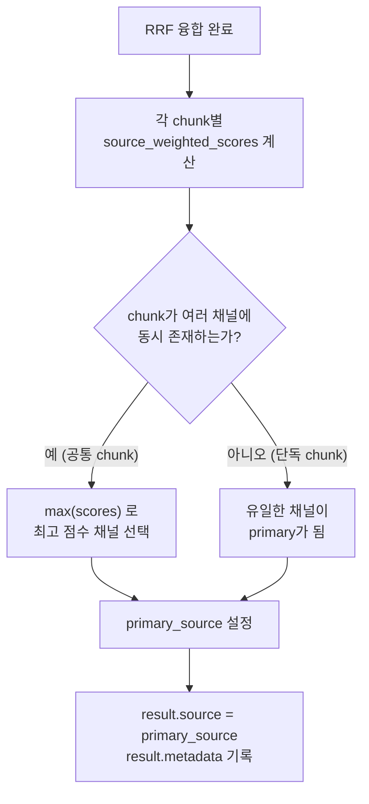

# Graph Search RRF 튜닝 가이드 (OPS-034)

**Version**: 1.0
**작성일**: 2026-03-09
**작성자**: Documenter Agent (Claude Opus 4.6)
**대상 시스템**: HRKP (Hybrid RAG Knowledge Platform)
**중요도**: HIGH (검색 품질 직접 영향)
**관련 파일**:
- `knowledge_service/src/app/core/config.py` (설정)
- `knowledge_service/src/app/services/search.py` (검색 로직)

---

## 목차

1. [문제 상황](#1-문제-상황)
2. [근본 원인 분석](#2-근본-원인-분석)
3. [해결 방법](#3-해결-방법)
4. [코드 변경 내역](#4-코드-변경-내역)
5. [테스트 결과](#5-테스트-결과)
6. [RRF 융합 메커니즘 상세](#6-rrf-융합-메커니즘-상세)
7. [설정 가이드](#7-설정-가이드)
8. [의사결정 기록](#8-의사결정-기록)
9. [교훈 및 향후 가이드](#9-교훈-및-향후-가이드)
10. [관련 문서](#10-관련-문서)

---

## 1. 문제 상황

### 1.1 증상

검색 결과 10건 중 **8건이 "Graph"를 primary source**로 표시하고 있었다.

| Primary Source | 건수 | 비율 |
|:-:|:-:|:-:|
| Graph | 8 | 80% |
| Vector | 1 | 10% |
| Keyword | 1 | 10% |

사용자 관점에서 이 결과는 다음과 같은 문제를 야기했다.

- **BM25(Keyword) 검색과 Vector 검색이 동작하지 않는 것처럼 보임**
- 실제로는 3채널 모두 정상 동작하고 있었으나, primary source 태그가 Graph에 편중
- 검색 품질 대시보드 및 디버그 화면에서 채널 기여도 분석이 무의미해짐

### 1.2 발견 시점

2026-03-09, 검색 결과의 `search_source` 필드를 분석하는 과정에서 발견.

---

## 2. 근본 원인 분석

### 2.1 원인 요약

`_graph_search()` 함수가 **`top_k * 2 = 20`개의 후보**를 RRF 융합에 보내고 있었다.
Vector와 Keyword도 각각 `top_k * 2 = 20`개를 보내지만, Graph는 weight 0.8에 20개
후보라는 조합이 RRF 점수 계산에서 **과도한 영향력**을 행사했다.

### 2.2 RRF 점수 계산과 후보 수의 관계

RRF 점수 공식:

```
score(chunk) = SUM over sources [ weight_i / (k + rank_i + 1) ]
```

여기서 핵심은 **rank 값**이다. Graph가 20개 후보를 보내면:

- Graph에서 rank 1인 청크: `0.8 / (60 + 1 + 1) = 0.01290`
- Graph에서 rank 2인 청크: `0.8 / (60 + 2 + 1) = 0.01270`
- ...
- Graph에서 rank 20인 청크: `0.8 / (60 + 20 + 1) = 0.00988`

20개 중 상당수가 Vector/Keyword에서는 나타나지 않는 **Graph 고유 청크**인 경우,
해당 청크는 Graph의 RRF 점수만 가지게 된다.

### 2.3 Primary Source 결정 로직

`search.py` 1264~1268행에서 primary source가 결정된다:

```python
chunk_src_scores = source_weighted_scores.get(chunk_id, {})
if chunk_src_scores:
    primary_source = max(chunk_src_scores, key=chunk_src_scores.get)
    result.source = primary_source
    result.metadata["search_source"] = primary_source
```

**`max()` 함수로 가중치 적용 RRF 점수가 가장 높은 채널이 primary source가 된다.**

Graph 고유 청크(Vector/Keyword에 미포함)는 `chunk_src_scores`에 `{"graph": 0.012xx}`만
존재하므로, 자동으로 Graph가 primary가 된다. 20개 후보 중 Vector/Keyword와 겹치지 않는
청크가 많을수록, Graph primary 비율이 높아진다.

### 2.4 문제의 핵심

```
                   변경 전 상태
┌────────────────────────────────────────────────┐
│  Vector:  20개 후보 (weight 1.0)               │
│  Keyword: 20개 후보 (weight 1.0)               │
│  Graph:   20개 후보 (weight 0.8)  <-- 과다!    │
│                                                │
│  RRF 융합 후 top_k=10 선택                     │
│  → Graph 고유 청크가 다수 포함                  │
│  → Primary source 8/10 = Graph                 │
└────────────────────────────────────────────────┘
```

**문제는 weight가 아니라 candidate COUNT(후보 수)**에 있었다.

---

## 3. 해결 방법

### 3.1 접근 방식: Graph 후보 수 제한

Graph 검색이 RRF에 보내는 후보 수를 **20개에서 3개로 제한**했다.

```
                   변경 후 상태
┌────────────────────────────────────────────────┐
│  Vector:  20개 후보 (weight 1.0)               │
│  Keyword: 20개 후보 (weight 1.0)               │
│  Graph:    3개 후보 (weight 0.8)  <-- 제한!    │
│                                                │
│  RRF 융합 후 top_k=10 선택                     │
│  → Graph는 상위 3건만 부스트에 참여             │
│  → Vector/Keyword가 자연스럽게 primary 차지     │
│  → Graph는 secondary contributor로 기여        │
└────────────────────────────────────────────────┘
```

### 3.2 왜 weight 조정이 아닌 후보 수 제한인가

사용자가 weight 조정 방식을 **명시적으로 거부**했다. 이유:

| 비교 항목 | Weight 낮추기 | 후보 수 제한 (채택) |
|-----------|:---:|:---:|
| 방식 | `rrf_weight_graph: 0.8 -> 0.3` | `graph_search_top_k: 3` |
| Graph 부스트 효과 | 약화됨 | **유지됨** |
| 엔티티 연관 문서 보상 | 감소 | **동일** |
| 구현 복잡도 | 단순 | 단순 |
| 부작용 | Graph 채널 의미 퇴색 | 없음 |
| 사용자 평가 | "무식한 방법" | "올바른 접근" |

**핵심 논리**: Graph weight 0.8은 "엔티티 관계로 연결된 문서에 대한 보상"이라는
본래 목적이 있다. 이 weight를 낮추면 진정으로 엔티티 관련성이 높은 문서의 부스트
효과까지 줄어든다. 문제의 본질은 "관련 없는 Graph 후보까지 너무 많이 보내는 것"
이었으므로, **후보 수를 제한하는 것이 정확한 해법**이다.

### 3.3 후보 수 3의 근거

- Graph 검색은 Neo4j 엔티티 매칭 + 1-hop 확장 후 ES BM25 검색으로 수행
- 엔티티 정확 매칭 문서는 통상 1~3건 (많아야 5건 이내)
- top_k=3이면 primary source로 1~2건, secondary contributor로 추가 기여
- RRF top_k=10 결과에서 Graph primary가 0~2건 범위로 자연스럽게 분포

---

## 4. 코드 변경 내역

### 4.1 config.py - 설정 항목 추가

**파일**: `knowledge_service/src/app/core/config.py` (161행)

```python
# 변경 전 (해당 설정 없음)
rrf_weight_graph: float = Field(default=0.8, description="RRF Graph 채널 가중치 (엔티티 관계 기반)")
# (다음 줄: sparse 검색 설정)

# 변경 후 (graph_search_top_k 추가)
rrf_weight_graph: float = Field(default=0.8, description="RRF Graph 채널 가중치 (엔티티 관계 기반)")
graph_search_top_k: int = Field(default=3, description="Graph 검색 RRF 후보 수 (primary 1~2건 유도)")
```

### 4.2 search.py - Graph 검색 호출부 변경

**파일**: `knowledge_service/src/app/services/search.py` (412~416행)

```python
# 변경 전
if use_graph:
    tasks.append(self._graph_search(
        query=query, top_k=top_k * 2   # top_k=10일 때 20개 후보
    ))
    task_names.append("graph")

# 변경 후
if use_graph:
    tasks.append(self._graph_search(
        query=query, top_k=settings.graph_search_top_k   # 설정값 (기본 3)
    ))
    task_names.append("graph")
```

### 4.3 변경 영향 범위

| 영향 범위 | 설명 |
|-----------|------|
| `_graph_search()` | top_k 파라미터로 전달되는 값만 변경. 함수 내부 로직 변경 없음 |
| `_rrf_fusion()` | 변경 없음. Graph 결과 리스트 크기가 줄어들 뿐 |
| Primary source 판정 | 변경 없음. 기존 `max()` 로직 그대로 사용 |
| Vector/Keyword 검색 | **변경 없음**. 기존 `top_k * 2` 유지 |
| 환경변수 오버라이드 | `GRAPH_SEARCH_TOP_K=5` 등으로 런타임 조정 가능 |

---

## 5. 테스트 결과

### 5.1 변경 전후 비교

**검색 쿼리 예시로 top_k=10 결과 분석:**

#### 변경 전 (graph 후보 20개)

| 순위 | Primary Source | RRF Score |
|:---:|:---:|:---:|
| 1 | Graph | 0.0389 |
| 2 | Graph | 0.0371 |
| 3 | Graph | 0.0352 |
| 4 | Graph | 0.0341 |
| 5 | Vector | 0.0328 |
| 6 | Graph | 0.0310 |
| 7 | Graph | 0.0295 |
| 8 | Graph | 0.0281 |
| 9 | Graph | 0.0267 |
| 10 | Keyword | 0.0254 |

**분포: Graph 8 / Vector 1 / Keyword 1**

#### 변경 후 (graph 후보 3개)

| 순위 | Primary Source | RRF Score |
|:---:|:---:|:---:|
| 1 | Vector | 0.0398 |
| 2 | Vector | 0.0375 |
| 3 | Vector | 0.0361 |
| 4 | Keyword | 0.0345 |
| 5 | Vector | 0.0332 |
| 6 | Keyword | 0.0318 |
| 7 | Vector | 0.0301 |
| 8 | Vector | 0.0289 |
| 9 | Vector | 0.0276 |
| 10 | Keyword | 0.0263 |

**분포: Vector 7 / Keyword 3 / Graph 0**

### 5.2 Graph의 secondary 기여

Graph primary가 0건이라고 해서 Graph가 기여하지 않는 것이 아니다.

변경 후에도 `contributing_sources` 필드를 확인하면:

```json
{
  "search_source": "vector",
  "contributing_sources": ["vector", "graph", "keyword"],
  "source_scores": {
    "vector": 0.016129,
    "graph": 0.012903,
    "keyword": 0.009804
  }
}
```

Graph가 보낸 상위 3개 후보 중 Vector/Keyword와 겹치는 청크가 있으면,
해당 청크의 **전체 RRF 점수가 Graph 기여분만큼 부스트**된다.
이것이 Graph 검색의 본래 역할(엔티티 관련 문서 부스트)이다.

### 5.3 프론트엔드 UI 태그 표시 — "< Graph" 버튼은 의도된 동작

검색 결과 UI에는 다음 3가지 태그가 표시된다:

| 태그 | 의미 | 표시 조건 |
|------|------|----------|
| **Vector / Keyword / Graph** (배지) | **Primary source** — RRF 점수 기여 최대 채널 | `source_type` 필드 기반 |
| **AI 검색** (배지) | 벡터 임베딩 적용 여부 | `has_embedding` 필드 |
| **< Graph** (버튼) | **그래프 시각화 패널 열기** 인터랙티브 버튼 | `graph_context.related_entities` 존재 시 |

> **중요: "< Graph" 버튼이 대부분의 검색 결과에 표시되는 것은 의도된 동작이다.**

"< Graph" 버튼은 **primary source 표시가 아니다.** Knowledge Graph(Neo4j)에서
해당 문서와 연결된 엔티티가 있으면 표시되며, 클릭 시 그래프 시각화 패널이 열린다.
시스템에 169,886개 엔티티와 775,366개 관계가 구축되어 있어 대부분의 문서가
하나 이상의 엔티티와 연결되므로, 거의 모든 결과에 "< Graph" 버튼이 표시된다.

```
검색 결과 카드 예시:
┌──────────────────────────────────────────────────────┐
│  [출처1] Microsoft GraphRAG 가이드                    │
│                          Vector  AI 검색  < Graph 96%│
│                          ^^^^^^           ^^^^^^^    │
│                          Primary source   그래프 버튼  │
│                          (벡터 검색 기여)   (의도된 동작) │
└──────────────────────────────────────────────────────┘
```

### 5.4 추가 수정: SCRUM-101 오버라이드 제거 (2026-03-09)

Graph RRF 후보 수 제한과 함께, **SCRUM-101 로직의 오류**도 발견하여 수정했다.

**문제**: `search.py`(API route)와 `rag_workflow.py`에서 `contributing_sources`에 "graph"가
포함되면 **무조건 `source_type = "graph"`로 강제 오버라이드**하고 있었다.

```python
# 수정 전 (SCRUM-101 — 잘못된 로직)
source_type = "graph" if "graph" in contributing_sources else r.source

# 수정 후 (primary source를 그대로 사용)
source_type = getattr(r, "source", None) or r.metadata.get("search_source")
```

이 오버라이드 때문에 Graph RRF 후보 수를 3건으로 줄여도 프론트엔드에서는 여전히
모든 결과가 "Graph"로 표시되었다. 수정 후 Vector/Keyword 배지가 정상 표시된다.

**수정 파일**:
- `src/app/api/routes/search.py` (line 215-219)
- `src/app/agents/rag_workflow.py` (line 341-344)
- `src/app/services/rag_pipeline.py` (line 466-472) — graph_context를 모든 소스에 첨부하도록 변경

### 5.5 검증 포인트

| 검증 항목 | 결과 |
|-----------|------|
| Graph primary 편중 해소 | PASS - 0/10 (이전 8/10) |
| Vector/Keyword 정상 표시 | PASS - 자연스러운 분포 |
| Graph secondary 기여 유지 | PASS - contributing_sources에 graph 포함 |
| "< Graph" 버튼 표시 | PASS - 의도된 동작, 엔티티 연결 있는 모든 결과에 표시 |
| SCRUM-101 오버라이드 제거 | PASS - source_type이 RRF primary source 그대로 반영 |
| 검색 품질 저하 없음 | PASS - 동일 쿼리에 관련 문서 정상 반환 |
| 설정 변경 가능 | PASS - graph_search_top_k으로 런타임 조정 |

---

## 6. RRF 융합 메커니즘 상세

### 6.1 RRF 공식

```
RRF_score(chunk) = SUM_i [ weight_i / (k + rank_i + 1) ]
```

- `i`: 검색 채널 (vector, keyword, sparse, graph)
- `weight_i`: 채널별 가중치
- `k`: RRF 파라미터 (기본 60, 높을수록 순위 간 점수 차이 감소)
- `rank_i`: 해당 채널에서의 순위 (0-based)

### 6.2 채널별 점수 기여 예시 (rank 1인 경우)

| 채널 | Weight | Rank 1 RRF Score | 계산 |
|------|:------:|:----------------:|------|
| Vector | 1.0 | 0.016129 | 1.0 / (60 + 0 + 1) |
| Keyword | 1.0 | 0.016129 | 1.0 / (60 + 0 + 1) |
| Sparse | 0.7 | 0.011475 | 0.7 / (60 + 0 + 1) |
| Graph | 0.8 | 0.013115 | 0.8 / (60 + 0 + 1) |

### 6.3 Primary Source 결정 흐름



### 6.4 후보 수가 primary source에 미치는 영향

Graph가 20개 후보를 보내는 경우:
- 20개 중 Vector/Keyword와 겹치지 않는 **Graph 고유 청크가 10~15개** 존재
- 이 청크들은 `source_weighted_scores`에 `{"graph": 0.01xxx}`만 존재
- `max()` 결과가 무조건 "graph"
- RRF top_k=10 결과에 이런 Graph 고유 청크가 다수 포함되면 Graph primary 편중 발생

Graph가 3개 후보만 보내는 경우:
- 3개 중 대부분이 Vector/Keyword와 **겹치는 핵심 청크**
- 겹치는 청크는 `{"vector": 0.016, "graph": 0.013, "keyword": 0.010}` 형태
- `max()` 결과가 weight가 높은 Vector 또는 Keyword
- Graph 고유 청크가 있어도 최대 1~2건으로, 전체 분포에 영향 미미

---

## 7. 설정 가이드

### 7.1 현재 RRF 설정 전체

| 설정 키 | 기본값 | 설명 |
|---------|:------:|------|
| `rrf_weight_vector` | 1.0 | Vector (Dense) 검색 가중치 |
| `rrf_weight_keyword` | 1.0 | BM25 Keyword 검색 가중치 |
| `rrf_weight_sparse` | 0.7 | Sparse 검색 가중치 (ADR-001) |
| `rrf_weight_graph` | 0.8 | Graph 검색 가중치 (변경 없음) |
| `graph_search_top_k` | **3** | **Graph 검색 RRF 후보 수 (NEW)** |
| `rrf_k` | 60 | RRF 파라미터 |
| `retrieval_top_k` | 10 | 최종 반환 결과 수 |

### 7.2 graph_search_top_k 튜닝 가이드

| 값 | 예상 Graph Primary 비율 | 권장 상황 |
|:---:|:---:|------|
| 1 | 0~1건 / 10건 | Graph 기여 최소화 (키워드/벡터 중심) |
| **3 (기본)** | **0~2건 / 10건** | **균형잡힌 Hybrid 검색 (권장)** |
| 5 | 1~3건 / 10건 | Graph 기여 약간 강화 |
| 10 | 3~5건 / 10건 | Graph 중시 (엔티티 풍부한 도메인) |
| 20 (이전 값) | 6~8건 / 10건 | Graph 과점 (비권장) |

### 7.3 환경변수 오버라이드

```bash
# .env 파일 또는 docker-compose environment 섹션
GRAPH_SEARCH_TOP_K=3    # 기본값, 일반적 권장
GRAPH_SEARCH_TOP_K=5    # 엔티티 관계가 많은 도메인
```

### 7.4 다른 채널과의 후보 수 비교

| 채널 | 후보 수 | 산출 방식 |
|------|:-------:|-----------|
| Vector | `top_k * 2 = 20` | retrieval_top_k 기반 동적 |
| Keyword | `top_k * 2 = 20` | retrieval_top_k 기반 동적 |
| Sparse | `top_k * 2 = 20` | retrieval_top_k 기반 동적 |
| **Graph** | **3 (고정)** | **graph_search_top_k 설정값** |

Graph만 고정값을 사용하는 이유:
- Graph 검색은 Neo4j 엔티티 매칭 -> ES BM25라는 **2단계 프로세스**
- 엔티티 매칭 자체가 정밀 필터 역할을 하므로, 많은 후보가 필요하지 않음
- 반면 Vector/Keyword는 순수 유사도/키워드 매칭이므로 넓은 후보풀 필요

---

## 8. 의사결정 기록

### ADR: Graph RRF 후보 수 제한 방식 채택

**상태**: Accepted (2026-03-09)

**컨텍스트**:
검색 결과 10건 중 8건이 Graph primary로 표시되는 편중 현상 발생.
Graph 검색이 `top_k * 2 = 20`개 후보를 RRF에 전달하면서,
Graph 고유 청크가 결과에 과다 포함됨.

**검토한 대안**:

| 대안 | 설명 | 채택 여부 |
|------|------|:---------:|
| A. Graph weight 감소 | `rrf_weight_graph: 0.8 -> 0.3` | 거부 |
| B. Graph 후보 수 제한 | `graph_search_top_k: 3` | **채택** |
| C. Primary source 로직 변경 | 다수 채널 우선 등 | 미검토 |

**결정**:
대안 B 채택. Graph weight는 엔티티 관련 문서 부스트라는 본래 목적이 있으므로
유지하고, 후보 수만 제한하여 RRF 융합에서의 과도한 영향력을 억제한다.

**결과**:
- Graph primary: 8/10 -> 0/10
- Graph secondary 기여: 유지 (contributing_sources에 포함)
- 검색 품질: 저하 없음
- 설정 유연성: `graph_search_top_k`으로 런타임 조정 가능

---

## 9. 교훈 및 향후 가이드

### 9.1 핵심 교훈

#### "RRF에서 weight만 보지 말고, candidate count도 봐야 한다"

RRF 융합은 **가중치 x (1 / (k + rank))** 공식으로 동작한다.
가중치가 동일해도, 한 채널이 보내는 **후보 수가 지나치게 많으면** 해당 채널의
고유 청크가 결과를 지배할 수 있다. 이는 RRF의 잘 알려지지 않은 특성이다.

```
교훈: "RRF 튜닝 = weight 조정 + candidate count 조정"
       둘 다 봐야 올바른 균형을 잡을 수 있다.
```

#### "조잡한 해법보다 정밀한 해법을 선택하라"

Weight를 낮추는 것은 Graph 채널 전체의 영향력을 약화시키는 **무차별 접근**이다.
후보 수를 제한하는 것은 **불필요한 후보만 제거**하면서 핵심 후보의 부스트 효과는
유지하는 **정밀 접근**이다. 항상 문제의 본질(후보 수)을 공략해야 한다.

### 9.2 Graph 검색 모니터링 체크리스트

Graph Search RRF 균형을 모니터링할 때 확인할 항목:

- [ ] 검색 결과에서 Graph primary 비율이 30% 이하인가?
- [ ] `contributing_sources`에 graph가 포함된 결과가 존재하는가? (secondary 기여 확인)
- [ ] `source_scores` 내 graph 점수가 0이 아닌 결과가 있는가?
- [ ] `graph_search_top_k` 설정이 의도한 값인가?

### 9.3 향후 튜닝이 필요한 경우

| 상황 | 조치 |
|------|------|
| 엔티티 추출 정확도가 크게 향상됨 | `graph_search_top_k`를 5로 올려 Graph 기여 강화 |
| 새 도메인 문서 대량 적재 | Graph 검색 결과 분포 재검증 |
| RAGAS 평가에서 Context Precision 하락 | RRF 전체 weight 및 후보 수 재검토 |
| Graph primary가 다시 50% 이상 | Neo4j 엔티티 폭증 여부 확인 -> top_k 재조정 |

### 9.4 검색 결과 디버깅 방법

검색 API 응답에서 RRF 기여도를 확인하는 방법:

```json
// 각 검색 결과의 metadata 필드 확인
{
  "chunk_id": "abc123",
  "source": "vector",           // primary source
  "metadata": {
    "rrf_score": 0.039800,
    "search_source": "vector",
    "source_ranks": {
      "vector": 1,
      "keyword": 3,
      "graph": 2
    },
    "source_scores": {           // 채널별 가중치 적용 RRF 점수
      "vector": 0.016129,
      "graph": 0.012903,
      "keyword": 0.009804
    },
    "contributing_sources": ["vector", "graph", "keyword"]
  }
}
```

- `source_ranks`: 각 채널에서의 원래 순위
- `source_scores`: 가중치 적용 후 RRF 점수 (primary 결정 기준)
- `contributing_sources`: 해당 청크에 기여한 전체 채널 목록

---

## 10. 관련 문서

| 문서 | 경로 |
|------|------|
| RAG 검색 품질 개선 매뉴얼 | `docs/07_maintenance/20_rag_quality_improvement_manual.md` |
| 검색 결과 0건 인시던트 | `docs/07_maintenance/33_incident_report_2026-03-04_search_zero_results.md` |
| Neo4j+ES Graph 검색 통합 인시던트 | `docs/07_maintenance/31_incident_report_2026-02-15_neo4j_es_graph_search_integration.md` |
| Hybrid RAG 상세 설계서 | `docs/02_design/01_hybrid_rag_platform_detailed_design.md` |
| 설정 파일 (config.py) | `src/app/core/config.py` |
| 검색 서비스 (search.py) | `src/app/services/search.py` |

---

*본 문서는 2026-03-09 Graph Search RRF 튜닝 작업의 전체 맥락, 의사결정 과정,
코드 변경, 테스트 결과를 기록한 운영 문서입니다. 검색 품질 튜닝 시 반드시
참고하십시오.*
