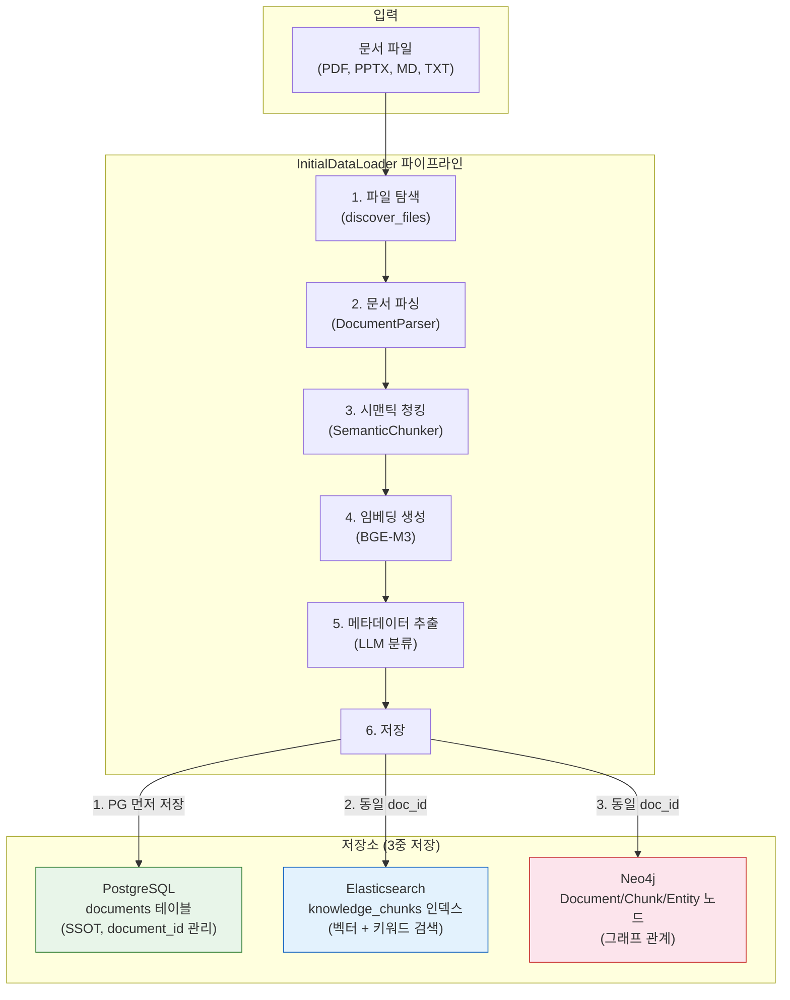

# 문서 데이터 적재 운영 매뉴얼

**작성일**: 2026-02-08
**버전**: 1.0
**관련 스토리**: STORY-099 (ETL document_id 정합성 수정)

---

## 1. 개요

Knowledge Platform에 문서를 적재하는 방법은 **3가지**입니다.

| 방법 | 용도 | 적재 대상 | 실행 방식 |
|------|------|----------|----------|
| **업로드 API** | 개별 문서 업로드 | 사용자가 UI에서 업로드한 파일 | REST API 호출 |
| **InitialDataLoader** | 대량 초기 적재 | 서버 디렉토리의 문서 일괄 적재 | Python 스크립트 |
| **BackgroundWorker** | 업로드 후 자동 처리 | 업로드 API로 등록된 문서 | 30초 주기 자동 |

### 3가지 방법 모두 동일한 저장 패턴을 따릅니다:

```
PostgreSQL (SSOT) → Elasticsearch (벡터/검색) → Neo4j (그래프)
```

- **PostgreSQL**: 문서 메타데이터의 Single Source of Truth (문서 ID 관리)
- **Elasticsearch**: 청크 벡터 임베딩 + 키워드 검색 인덱스
- **Neo4j**: 엔티티 관계 그래프

---

## 2. 사전 준비: 볼륨 마운트

### 2.1 왜 필요한가?

InitialDataLoader는 컨테이너 내부에서 실행됩니다. 호스트의 문서 파일을 컨테이너에서 읽으려면 **Docker 볼륨 마운트**가 필요합니다.

```
호스트 파일 시스템                    Docker 컨테이너 (kp-ai-service)
─────────────────                    ────────────────────────────────
knowledge_data/                      /app/knowledge_data/
├── documents/          ──마운트──>   ├── documents/
│   ├── AI/                          │   ├── AI/
│   ├── 법률자료/                     │   ├── 법률자료/
│   ├── technical/                   │   ├── technical/
│   └── ...                          │   └── ...
```

### 2.2 설정 방법

`infrastructure/docker/docker-compose.yml`의 `ai-service` 섹션:

```yaml
ai-service:
  volumes:
    # 임베딩 모델 캐시
    - /home/claude/.cache/huggingface:/app/.cache/huggingface:ro
    # 초기 적재용 문서 데이터 (추가)
    - ../../knowledge_data:/app/knowledge_data:ro
```

- `../../knowledge_data` = 호스트의 프로젝트 루트 하위 `knowledge_data/` 디렉토리
- `/app/knowledge_data` = 컨테이너 내부 경로
- `:ro` = 읽기 전용 (안전)

### 2.3 적용 (컨테이너 재시작 필요)

```bash
cd infrastructure/docker
docker compose up -d ai-service
```

### 2.4 확인

```bash
# 컨테이너에서 문서 파일이 보이는지 확인
docker exec kp-ai-service ls /app/knowledge_data/documents/

# 기대 출력: AI  guides  policies  presentations  standards  technical  법률자료
```

---

## 3. 문서 디렉토리 구조

```
knowledge_data/documents/
├── technical/          # 기술 문서 (설계서, 계획서)     ← 기본 소스
├── guides/             # 가이드/매뉴얼                   ← 기본 소스
├── presentations/      # 발표 자료                       ← 기본 소스
├── policies/           # 정책/규정                       ← 기본 소스
├── standards/          # 표준/기준                       ← 기본 소스
├── AI/                 # AI/ML 기술 문서                 ← 수동 소스 등록 필요
│   ├── AIAgent/        # AI 에이전트 관련
│   └── RAG/            # RAG 관련
└── 법률자료/           # 법률/법령 자료                  ← 수동 소스 등록 필요
```

- **기본 소스** (5개): `add_default_sources()`로 자동 등록
- **수동 소스**: `add_source()`로 직접 등록 필요

### 새 디렉토리 추가 시

`knowledge_data/documents/` 아래에 새 폴더를 만들고 문서를 넣으면 됩니다.
InitialDataLoader 실행 시 `add_source()`로 등록해야 합니다.

---

## 4. InitialDataLoader 실행 방법

### 4.1 기본 실행 (기본 소스 5개만)

```bash
docker exec kp-ai-service python -c "
import asyncio
from app.services.initial_data_loader import InitialDataLoader

async def run():
    loader = InitialDataLoader()
    loader.add_default_sources()
    result = await loader.load_all()
    print(f'결과: {result.success_count}/{result.total_files} 성공, 청크: {result.total_chunks}')

asyncio.run(run())
"
```

### 4.2 전체 실행 (AI, 법률자료 포함)

```bash
docker exec kp-ai-service python -c "
import asyncio
from app.services.initial_data_loader import InitialDataLoader, DataSource, DocType

async def run():
    loader = InitialDataLoader()
    loader.add_default_sources()

    # AI 문서 추가
    loader.add_source(DataSource(
        name='AI',
        path='/app/knowledge_data/documents/AI',
        doc_type=DocType.TECHNICAL,
        extensions=['.pdf', '.pptx', '.md', '.txt'],
        recursive=True,
        description='AI/ML 기술 문서',
    ))

    # 법률자료 추가
    loader.add_source(DataSource(
        name='법률자료',
        path='/app/knowledge_data/documents/법률자료',
        doc_type=DocType.POLICY,
        extensions=['.pdf', '.docx', '.txt'],
        recursive=True,
        description='법률/법령 자료',
    ))

    result = await loader.load_all()
    print(f'결과: {result.success_count}/{result.total_files} 성공')
    print(f'청크: {result.total_chunks}, 엔티티: {result.total_entities}')
    print(f'소요시간: {result.total_time_ms/1000:.1f}초')

asyncio.run(run())
"
```

### 4.3 단일 디렉토리만 적재

```bash
docker exec kp-ai-service python -c "
import asyncio
from app.services.initial_data_loader import InitialDataLoader, DataSource, DocType

async def run():
    loader = InitialDataLoader()
    loader.add_source(DataSource(
        name='법률자료',
        path='/app/knowledge_data/documents/법률자료',
        doc_type=DocType.POLICY,
        extensions=['.pdf'],
        recursive=True,
    ))
    result = await loader.load_all()
    print(f'결과: {result.success_count}/{result.total_files} 성공')

asyncio.run(run())
"
```

---

## 5. 적재 후 데이터 흐름



### 핵심: document_id 정합성 (STORY-099)

```
PostgreSQL documents.id = ES chunks.document_id = Neo4j Document.id
```

모든 저장소에서 **동일한 UUID**를 사용합니다. PostgreSQL에 먼저 저장하고, 그 ID를 ES/Neo4j에 전달합니다.

---

## 6. 적재 결과 확인

### 6.1 PostgreSQL 확인

```bash
docker exec kp-postgresql psql -U knowledge -d knowledge -c \
  "SELECT id, title, processing_status, es_synced FROM documents ORDER BY created_at;"
```

### 6.2 Elasticsearch 확인

```bash
# 전체 청크 수
docker exec kp-ai-service python -c "
import asyncio
from elasticsearch import AsyncElasticsearch
async def check():
    es = AsyncElasticsearch('http://elasticsearch:9200')
    result = await es.count(index='knowledge_chunks')
    print(f'ES 청크 수: {result[\"count\"]}')
    await es.close()
asyncio.run(check())
"
```

### 6.3 PG-ES 정합성 확인

```bash
docker exec kp-postgresql psql -U knowledge -d knowledge -c \
  "SELECT count(*) as pg_docs FROM documents;"

# ES에서 unique document_id 수 확인
docker exec kp-ai-service python -c "
import asyncio
from elasticsearch import AsyncElasticsearch
async def check():
    es = AsyncElasticsearch('http://elasticsearch:9200')
    result = await es.search(
        index='knowledge_chunks',
        body={'size': 0, 'aggs': {'doc_ids': {'terms': {'field': 'document_id.keyword', 'size': 1000}}}}
    )
    buckets = result['aggregations']['doc_ids']['buckets']
    print(f'ES unique document_ids: {len(buckets)}')
    await es.close()
asyncio.run(check())
"
```

두 숫자가 일치하면 정합성 OK.

---

## 7. 업로드 API를 통한 개별 문서 적재

UI 또는 API로 문서를 업로드하는 경우 자동으로 PG+ES+Neo4j에 저장됩니다.

### 7.1 API 호출

```bash
curl -X POST http://localhost/api/v1/documents/upload \
  -H "Authorization: Bearer <JWT_TOKEN>" \
  -F "file=@/path/to/document.pdf" \
  -F "title=문서 제목"
```

### 7.2 처리 흐름

```
업로드 API → PG documents 저장 (status=uploaded)
           → BackgroundWorker 자동 감지 (30초 주기)
           → document_processing_pipeline 실행
           → PG document_id로 ES/Neo4j 저장
           → PG status=completed 업데이트
```

업로드 API는 이미 PG document_id를 기준으로 ES에 저장하므로 **별도 작업 불필요**합니다.

---

## 8. 데이터 정리

### 8.1 ES 불일치 데이터 삭제

PG에 없는 ES 청크를 삭제합니다 (고아 데이터 정리):

```bash
docker exec kp-ai-service python -c "
import asyncio
from elasticsearch import AsyncElasticsearch

async def cleanup():
    es = AsyncElasticsearch('http://elasticsearch:9200')
    # PG에서 valid document_id 목록 조회 후 ES에서 매칭 안 되는 것 삭제
    # ... (구체적 스크립트는 상황에 따라 조정)
    await es.close()

asyncio.run(cleanup())
"
```

### 8.2 Redis 캐시 초기화

데이터 재적재 후 검색 캐시를 초기화해야 합니다:

```bash
docker exec kp-redis redis-cli FLUSHALL
```

### 8.3 전체 초기화 (주의: 모든 데이터 삭제)

```bash
# ES 인덱스 삭제 후 재생성
docker exec kp-ai-service python -c "
import asyncio
from elasticsearch import AsyncElasticsearch
async def reset():
    es = AsyncElasticsearch('http://elasticsearch:9200')
    await es.indices.delete(index='knowledge_chunks', ignore=[404])
    print('ES 인덱스 삭제 완료')
    await es.close()
asyncio.run(reset())
"

# PG documents 테이블 초기화
docker exec kp-postgresql psql -U knowledge -d knowledge -c \
  "DELETE FROM chunks; DELETE FROM documents;"

# Redis 캐시 초기화
docker exec kp-redis redis-cli FLUSHALL

# init-db 재실행으로 ES 매핑 재생성
docker compose restart init-db

# InitialDataLoader 재실행
# (위 4.2 절 참조)
```

---

## 9. AI 모델 캐시 관리

### 9.1 사용되는 모델 목록

| 모델 | 용도 | 캐시 위치 | 관리 방식 |
|------|------|----------|----------|
| **BGE-M3** (BAAI/bge-m3) | 임베딩 벡터 생성 | HuggingFace 캐시 (bind mount) | 영구 캐시 |
| **Docling Layout Heron** | PDF 레이아웃 분석 | HuggingFace 캐시 (bind mount) | 영구 캐시 |
| **Docling Models** | 문서 구조 파싱 | HuggingFace 캐시 (bind mount) | 영구 캐시 |
| **RapidOCR** (3개 모델) | PDF OCR 텍스트 추출 | Dockerfile 내장 (site-packages) | 이미지 빌드 시 포함 |

### 9.2 HuggingFace 캐시 (bind mount)

```yaml
# docker-compose.yml
ai-service:
  volumes:
    - /home/claude/.cache/huggingface:/app/.cache/huggingface  # 쓰기 가능 (ro 금지!)
```

- **최초 실행 시**: 모델 자동 다운로드 (~2GB)
- **이후 실행 시**: 캐시에서 즉시 로드 (다운로드 없음)
- **주의**: `:ro` (읽기 전용) 마운트 금지! 모델 업데이트/검증 시 쓰기 권한 필요

### 9.3 UID 정합성 (근본 원인 방지)

```dockerfile
# Dockerfile - 호스트 사용자 UID와 동일하게 설정
RUN groupadd -g 1000 appgroup && \
    useradd -u 1000 -g appgroup -m -s /bin/bash appuser
```

| 항목 | 값 | 이유 |
|------|-----|------|
| 호스트 사용자 UID | 1000 | WSL 기본 사용자 |
| 컨테이너 appuser UID | 1000 | bind mount 권한 호환 |

**왜 중요한가?**

bind mount 디렉토리는 호스트와 컨테이너가 파일 시스템을 공유합니다.
UID가 다르면 한쪽에서 만든 파일을 다른 쪽에서 읽지/쓰지 못합니다.

```
# UID 불일치 시 문제:
호스트 (UID 1000)  ←→  컨테이너 (UID 1001)
     ↓                        ↓
Permission denied!   Permission denied!
```

### 9.4 RapidOCR 모델 (Dockerfile 내장)

```dockerfile
# Dockerfile builder 스테이지에서 사전 다운로드
RUN python -c "from rapidocr import RapidOCR; RapidOCR()"
```

RapidOCR 모델 3개 (~40MB):
- `ch_PP-OCRv4_det_infer.pth` (13.8MB) - 텍스트 영역 감지
- `ch_ptocr_mobile_v2.0_cls_infer.pth` (0.6MB) - 텍스트 방향 분류
- `ch_PP-OCRv4_rec_infer.pth` (25.7MB) - 텍스트 인식

### 9.5 모델 관련 트러블슈팅

**Q: "Permission denied: docling-layout-heron"**
```bash
# 컨테이너 내부에서 root로 권한 수정
docker exec -u root kp-ai-service chown -R 1000:1000 /app/.cache/huggingface/
```

**Q: HF 캐시 전체 초기화 (재다운로드)**
```bash
# 호스트에서 실행
rm -rf /home/claude/.cache/huggingface/hub/models--docling-project--*
# 컨테이너 재시작 → 자동 재다운로드
docker compose restart ai-service
```

---

## 10. 메모리 최적화: 임베딩 시 컨테이너 관리

### 10.1 왜 필요한가?

대량 문서 임베딩은 메모리를 많이 사용합니다. WSL2 환경에서 18개 컨테이너가 모두 Running이면
ai-service에 할당되는 실제 가용 메모리가 줄어들어 **OOM Kill (exit code 137)** 이 발생합니다.

```
[사례] WSL2 7.6GB, 18개 컨테이너 전부 Running
→ 2번째 PDF에서 OOM Kill → 임베딩 실패
```

### 10.2 컨테이너 분류

임베딩에 **필수**인 컨테이너와 **일시 중지 가능**한 컨테이너를 구분합니다.

| 구분 | 컨테이너 | 메모리 | 역할 |
|------|---------|--------|------|
| **필수** | ai-service | ~336MB (피크 수GB) | 임베딩 워커 |
| **필수** | elasticsearch | ~1.15GB | 벡터/청크 저장 |
| **필수** | neo4j | ~522MB | 그래프 저장 |
| **필수** | postgresql | ~36MB | SSOT 문서 ID |
| **필수** | redis | ~9MB | 캐시 |
| **필수** | minio | ~93MB | 파일 스토리지 |
| 중지 가능 | kibana | ~498MB | 모니터링 UI |
| 중지 가능 | backend | ~415MB | SpringBoot API |
| 중지 가능 | keycloak | ~264MB | 인증 서버 |
| 중지 가능 | api-gateway | ~197MB | API Gateway |
| 중지 가능 | grafana | ~123MB | 대시보드 |
| 중지 가능 | prometheus | ~92MB | 메트릭 |
| 중지 가능 | loki + promtail | ~89MB | 로그 수집 |
| 중지 가능 | nginx, frontend, jaeger, keycloak-db | ~75MB | 기타 |

**절약 효과: ~1.75GB** → ai-service가 사용할 수 있는 메모리가 그만큼 증가

### 10.3 임베딩 전: 불필요 컨테이너 중지

```bash
cd infrastructure/docker

# 12개 컨테이너 일시 중지 (데이터 보존, stop만 하므로 안전)
docker compose stop \
  kibana backend api-gateway keycloak keycloak-db \
  grafana prometheus loki promtail jaeger nginx frontend
```

`stop`은 컨테이너를 종료할 뿐 삭제하지 않으므로, 볼륨/데이터/설정이 모두 보존됩니다.

### 10.4 임베딩 후: 중지된 컨테이너 자동 복구

```bash
cd infrastructure/docker

# 전체 컨테이너 재시작 (중지된 것만 올라옴, 이미 Running인 것은 영향 없음)
docker compose up -d
```

### 10.5 원커맨드 스크립트 (중지 → 임베딩 → 복구)

```bash
#!/bin/bash
# scripts/run_embedding_optimized.sh
# 임베딩 시 메모리 최적화 실행 스크립트

set -e
COMPOSE_DIR="infrastructure/docker"

echo "=== Step 1: 불필요 컨테이너 중지 (메모리 확보) ==="
docker compose -f $COMPOSE_DIR/docker-compose.yml stop \
  kibana backend api-gateway keycloak keycloak-db \
  grafana prometheus loki promtail jaeger nginx frontend

echo "=== Step 2: 메모리 상태 확인 ==="
free -h

echo "=== Step 3: 문서 임베딩 시작 ==="
docker exec kp-ai-service python -c "
import asyncio
from app.services.initial_data_loader import InitialDataLoader, DataSource, DocType

async def run():
    loader = InitialDataLoader()
    loader.add_default_sources()
    loader.add_source(DataSource(
        name='AI', path='/app/knowledge_data/documents/AI',
        doc_type=DocType.TECHNICAL, extensions=['.pdf', '.pptx', '.md', '.txt'],
        recursive=True, description='AI/ML 기술 문서'))
    loader.add_source(DataSource(
        name='법률자료', path='/app/knowledge_data/documents/법률자료',
        doc_type=DocType.POLICY, extensions=['.pdf', '.docx', '.txt'],
        recursive=True, description='법률/법령 자료'))
    result = await loader.load_all()
    print(f'결과: {result.success_count}/{result.total_files} 성공')
    print(f'청크: {result.total_chunks}, 엔티티: {result.total_entities}')
    print(f'소요시간: {result.total_time_ms/1000:.1f}초')
asyncio.run(run())
"

echo "=== Step 4: 전체 컨테이너 복구 ==="
docker compose -f $COMPOSE_DIR/docker-compose.yml up -d

echo "=== Step 5: Redis 캐시 초기화 ==="
docker exec kp-redis redis-cli FLUSHALL

echo "=== 완료 ==="
docker compose -f $COMPOSE_DIR/docker-compose.yml ps --format "table {{.Name}}\t{{.Status}}"
```

### 10.6 WSL2 메모리 설정 (.wslconfig)

WSL2 기본 메모리는 호스트 RAM의 50% 또는 8GB 중 작은 값입니다.
대량 임베딩에는 **최소 12GB**를 권장합니다.

```powershell
# Windows PowerShell에서 실행
notepad $env:USERPROFILE\.wslconfig
```

```ini
[wsl2]
memory=12GB
swap=4GB
processors=4
```

```powershell
# 설정 적용 (WSL 전체 재시작 필요)
wsl --shutdown
# 이후 WSL 터미널 재실행
```

**확인**:
```bash
free -h
# total이 11Gi 이상이면 적용 완료
```

| WSL 메모리 | 임베딩 안정성 | 비고 |
|-----------|-------------|------|
| 4GB | 거의 불가 | 컨테이너 기동만으로 소진 |
| 8GB | 소형 PDF만 가능 | 대형 PDF에서 OOM |
| **12GB** | **대부분 가능 (권장)** | 컨테이너 중지 병행 시 안정 |
| 16GB+ | 전체 안정 | 컨테이너 중지 불필요 |

> **FAQ: 임베딩 후 메모리를 다시 줄여야 하나요?**
>
> **아니요.** `.wslconfig`의 `memory=12GB` 설정은 WSL이 **최대** 사용할 수 있는 상한선입니다.
> 실제로 사용하지 않는 메모리는 Windows 호스트가 자유롭게 사용합니다.
> 따라서 일상 운영 시에도 12GB 설정을 유지해도 무방합니다.
>
> 메모리를 줄여야 하는 유일한 경우: Windows 호스트에서 다른 고메모리 앱(게임, IDE 등)을
> 동시에 사용할 때 호스트 메모리가 부족한 경우에만 조정하세요.

---

## 11. 지원 파일 형식

| 확장자 | 파서 | 비고 |
|--------|------|------|
| `.pdf` | PyPDF2 / pdfplumber | 대부분의 문서 |
| `.pptx` | python-pptx | 프레젠테이션 |
| `.docx` | python-docx | Word 문서 |
| `.md` | markdown parser | 마크다운 |
| `.txt` | plain text | 텍스트 |
| `.html` / `.htm` | BeautifulSoup | 웹 페이지 |

---

## 12. 트러블슈팅

### Q: 적재 후 검색에 결과가 안 나옴
**A**: Redis 캐시 초기화 필요
```bash
docker exec kp-redis redis-cli FLUSHALL
```

### Q: 다운로드 버튼 클릭 시 404
**A**: ES document_id가 PG에 없는 경우. 위 8.1절 데이터 정리 수행.

### Q: InitialDataLoader 실행 시 "데이터 소스가 등록되지 않았습니다"
**A**: `add_default_sources()` 또는 `add_source()`로 소스 등록 필요.

### Q: 볼륨 마운트 후에도 파일이 안 보임
**A**: 컨테이너를 재시작해야 마운트가 적용됩니다.
```bash
docker compose up -d ai-service
```

### Q: 대용량 PDF 파싱 실패 (OOM Kill, exit 137)
**A**: 메모리 부족. 3단계 대응:
1. **WSL 메모리 증가**: `.wslconfig`에서 `memory=12GB` 설정 → `wsl --shutdown`
2. **컨테이너 중지**: 위 10.3절 참고, ~1.75GB 확보
3. **ai-service 메모리 제한 확인**: `docker-compose.yml`에서 `deploy.resources.limits.memory` 값 확인

### Q: WSL 메모리 증가 후에도 `free -h`가 변하지 않음
**A**: `.wslconfig` 변경 후 반드시 **Windows PowerShell에서 `wsl --shutdown` 실행** 필요.
WSL 터미널에서는 실행할 수 없습니다.

---

## 13. 실제 적재 실행 로그 (2026-02-08)

> 이 섹션은 실제 운영 중 기록된 적재 이력입니다. 향후 적재 시 참고용으로 사용합니다.

### 13.1 환경 정보

```
일시: 2026-02-08 19:19 KST (UTC+9)
WSL 메모리: 11GB (이전 7.6GB → .wslconfig 증가)
Swap: 4GB (사용량 0%)
호스트: Windows 11, WSL2 (Linux 6.6.87.2)
```

### 13.2 사전 준비

```log
[19:17] ai-service 리빌드 시작 (Dockerfile UID 1001→1000 반영)
        DOCKER_BUILDKIT=1 docker compose build ai-service
[19:19] 빌드 완료 (290.2초), 이미지 sha256:6209433e
[19:19] docker compose up -d ai-service → Recreated
[19:19] 불필요 컨테이너 12개 중지 (메모리 ~1.75GB 확보)
        중지 목록: kibana, backend, api-gateway, keycloak, keycloak-db,
                  grafana, prometheus, loki, promtail, jaeger, nginx, frontend
[19:19] 가동 중 컨테이너 6개: ai-service, elasticsearch, neo4j, postgresql, redis, minio
```

### 13.3 메모리 상태 (컨테이너 중지 후)

```
               total        used        free      shared  buff/cache   available
Mem:            11Gi       3.5Gi       2.2Gi        15Mi       6.4Gi       8.2Gi
Swap:          4.0Gi       119Mi       3.9Gi
```

### 13.4 적재 전 데이터 상태

```
PostgreSQL: 6 documents (completed 4, uploaded 2)
Elasticsearch: 91 chunks
데이터 소스: AI (27파일), 법률자료 (11파일), 기본소스 5개 (비어있음)
```

### 13.5 적재 실행 로그

```log
[19:19] InitialDataLoader 시작: 7 data sources
[19:19] technical(0), guides(0), presentations(0), policies(0), standards(0) → 비어있음 스킵
[19:19] AI 소스: 27파일 발견
[19:19] RapidOCR 모델 다운로드 (새 컨테이너, 3개 모델 ~40MB)
        - ch_PP-OCRv4_det_infer.pth (13.83MB)
        - ch_ptocr_mobile_v2.0_cls_infer.pth (0.56MB)
        - ch_PP-OCRv4_rec_infer.pth (25.67MB)
[19:22] BGE-M3 임베딩 모델 로드 (sentence-transformers, 5.92s)
[19:22] [1/N] 5_Levels_Of_AI_Agents.pdf (1.7MB)
        → 파싱 168s, 임베딩 15.5s (23 chunks, 1.5 texts/s)
        → Entity extraction: 15→25 entities (Gleaning 1회, 54.7s)
        → PG 저장 (doc_id=a97866bb) → ES 23 docs → Neo4j 23 chunks + 25 entities
        → 성공 (총 243.8초)
[19:23] [2/N] AI 클라우드 기반의 데이터셋과 SLM 모델 구축_GENCON_20240920.pdf (3.6MB)
        → docling 파싱 ~20분 (한국어 PDF, OCR 처리로 장시간)
        → 임베딩 60 chunks, Entity extraction: 17→35 entities (Gleaning 1회, 77.5s)
        → PG(4eab67a8) → ES 60 docs → Neo4j 60 chunks + 35 entities
        → 성공 (총 1417.1초 ≈ 23.6분) ⚠️ 한국어 대형 PDF는 20분+ 소요
[19:47] [3] AI-900_Examtopics_Kor.pdf (5.5MB) → 378 chunks, 27 entities, 1614s (26.9분)
        ⚠️ 시험문제 PDF, 테이블 17개 → 가장 많은 청크
[20:14] [4] AI_Agent_Workflows_LangGraph.pdf (1.2MB) → 33 chunks, 25 entities, 94s (1.6분)
[20:15] [5] AI_Agents_Are_All_You_Need.pdf (3.2MB) → 46 chunks, 45 entities, 390s (6.5분)
[20:22] [6] AI_Agents_Are_All_You_Need_(Korean).pdf (3.5MB) → 32 chunks, 42 entities, 365s
[20:28] [7] AI_Agents_Intersection_Tool_Calling.pdf (122KB) → 37 chunks, 40 entities, 105s
[20:30] [8] AI_Agents_in_Action_Dynamics.pdf (2.1MB) → 33 chunks, 26 entities, 274s
[20:34] [9] AI_Orchestration_Explained.pdf (519KB) → 41 chunks, 29 entities, 120s
[20:37] [10] AI_에이전트_통합_마스터_클래스.pdf (582KB) → 105 chunks, 32 entities, 145s
[20:39] [11] AI_오케스트레이션이_풀린다.pdf (903KB) → 25 chunks, 31 entities, 118s
[20:41] [12] Agentic AI-Build Tech Research Agent.pdf → 66 chunks, 34 entities, 441s
[20:48] [13] Agentic AI-Build Tech Research Agent.pdf (중복) → 66 chunks, 33 entities, 434s
[20:55] [14] Agentic_Mesh_Future_GenAI.pdf (2.0MB) → 67 chunks, 42 entities, 437s
[21:03] [15] Agentic_Mesh_Korean.pdf (2.3MB) → 40 chunks, 47 entities, 401s
[21:10] [16] OpenAI o1 Fine-Tuned GPT-4o.pdf → 31 chunks, 11 entities, 153s
[21:12] [17] LLM Agent 강의교안.pdf (3.0MB) → 27 chunks, 30 entities, 434s
[21:19] [18] LLM 기반 AI 에이전트 기초와 실습-강의배포용.pdf (11MB)
        → docling 파싱 ~30분 후 **OOM Kill** (메모리 8GB 한계 초과)
        → ❌ 적재 실패. ai-service 자동 재시작됨
        ⚠️ 11MB PDF + 이전 17건 누적 메모리(7.1GB) → 8GB 한계 도달

=== 적재 결과 (최종) ===
- 성공: 17/38 (44.7%)
- 실패: 1건 (OOM), 미처리: 20건
- PG documents: 23건 (기존 6 + 신규 17)
- ES chunks: 1,201개 (기존 91 → 1,201)
- ES unique doc_ids: 21개
- 총 소요시간: 약 120분 (2시간)
- Redis 캐시 FLUSHALL 완료
- 중지된 컨테이너 12개 → 전체 복구 완료 (18개 Running)
```

### 13.6 리소스 사용 추이

| 시점 | ai-service 메모리 | CPU | 시스템 Available |
|------|-------------------|-----|-----------------|
| 적재 시작 | 336MB | 0% | 8.2GB |
| 1번째 PDF 파싱 중 | 3.6GB | 224% | 4.9GB |
| 2번째 PDF 파싱 중 | 3.7GB | 370% | 4.9GB |
| 2번째 PDF 완료 | 3.7GB | 355% | 4.9GB |
| 3번째 PDF 완료 | 5.8GB | 350% | 3.8GB |
| 4번째 PDF (소형) | 5.9GB | ~0% (LLM 대기) | 3.8GB |
| 11~14번째 PDF | 6.4GB | 330% | 3.5GB |
| 15~16번째 PDF | **7.1GB** (피크) | 292% | 3.5GB |
| 16번째 완료 후 GC | 6.95GB | 361% | 3.5GB |
| 17번째 (3MB) 파싱 중 | 7.0GB | 155% | 3.5GB |
| 18번째 (11MB) 파싱 중 | 7.2GB | 351% | 3.5GB |
| **OOM Kill** | **8GB (한계)** | - | - |
| 재시작 후 | 36MB | 3.6% | 복구됨 |

### 13.7 메모리 제한 관련 참고

`docker-compose.yml`에서 ai-service의 메모리 제한: `deploy.resources.limits.memory: 8g`

이 제한은 WSL 7.6GB 환경에서 18개 컨테이너 동시 운영을 위한 배분이었음.
WSL 메모리를 12GB+ 로 증가하고, 임베딩 시 불필요 컨테이너를 중지한다면
**임베딩 전용으로 10g~12g까지 확대** 가능. 다만 대형 PDF(79MB 등)는
8GB로는 부족할 수 있으므로, 필요시 `docker-compose.override.yml`로 임시 증가:

```yaml
# docker-compose.override.yml (임베딩 전용, 사용 후 삭제)
services:
  ai-service:
    deploy:
      resources:
        limits:
          memory: 10g
```

---

### 13.8 미처리 파일 (20건) - 추후 적재 계획

| 크기 범위 | 파일 수 | 적재 전략 |
|----------|---------|----------|
| < 5MB | 11개 | ai-service 재시작 후 바로 재시도 (메모리 초기화됨) |
| 5-10MB | 3개 | 메모리 제한 10g로 임시 확대 후 개별 처리 |
| 10-30MB | 4개 | 메모리 제한 10g + 컨테이너 중지 후 개별 처리 |
| > 30MB | 2개 (69MB, 79MB) | WSL 16GB+ 또는 페이지 분할 파싱 필요 |

**재시도 방법** (ai-service 재시작 후 메모리 초기화된 상태):
```bash
# 1. 메모리 초기화 확인
docker stats --no-stream --format "{{.Name}}\t{{.MemUsage}}" kp-ai-service
# 결과: ~36MB (깨끗한 상태)

# 2. 소형 파일 우선 적재 (5MB 이하)
docker exec kp-ai-service python -c "
import asyncio
from app.services.initial_data_loader import InitialDataLoader, DataSource, DocType
# ... (동일 코드)
"
```

> **교훈**: 17건 연속 적재 후 누적 메모리(7.1GB)가 쌓인 상태에서 11MB PDF를 처리하니 OOM.
> **대응**: 10건 단위로 끊어서 적재하고, 사이에 ai-service 재시작하여 메모리 초기화.

---

*작성: Claude Code (Opus 4.6) | 2026-02-08 v1.4 (적재 17건 완료 + OOM 교훈 + 미처리 계획)*
