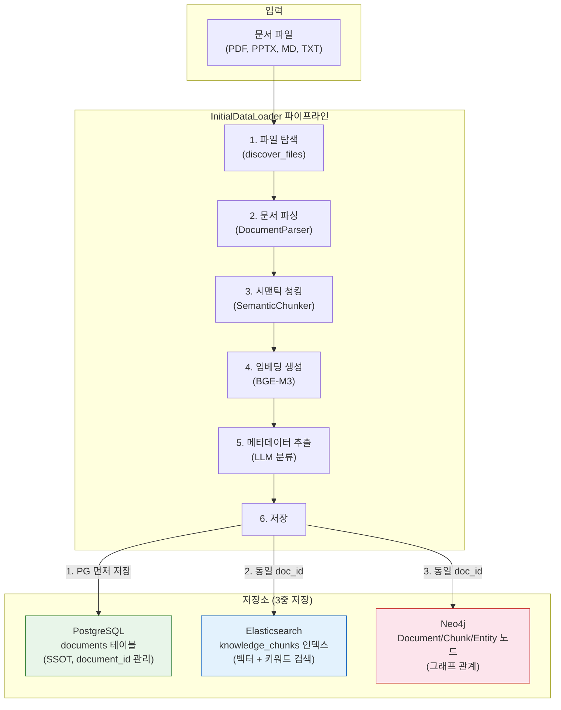

# 문서 데이터 적재 운영 매뉴얼

**작성일**: 2026-02-08
**버전**: 1.0
**관련 스토리**: STORY-099 (ETL document_id 정합성 수정)

---

## 1. 개요

Knowledge Platform에 문서를 적재하는 방법은 **3가지**입니다.

| 방법 | 용도 | 적재 대상 | 실행 방식 |
|------|------|----------|----------|
| **업로드 API** | 개별 문서 업로드 | 사용자가 UI에서 업로드한 파일 | REST API 호출 |
| **InitialDataLoader** | 대량 초기 적재 | 서버 디렉토리의 문서 일괄 적재 | Python 스크립트 |
| **BackgroundWorker** | 업로드 후 자동 처리 | 업로드 API로 등록된 문서 | 30초 주기 자동 |

### 3가지 방법 모두 동일한 저장 패턴을 따릅니다:

```
PostgreSQL (SSOT) → Elasticsearch (벡터/검색) → Neo4j (그래프)
```

- **PostgreSQL**: 문서 메타데이터의 Single Source of Truth (문서 ID 관리)
- **Elasticsearch**: 청크 벡터 임베딩 + 키워드 검색 인덱스
- **Neo4j**: 엔티티 관계 그래프

---

## 2. 사전 준비: 볼륨 마운트

### 2.1 왜 필요한가?

InitialDataLoader는 컨테이너 내부에서 실행됩니다. 호스트의 문서 파일을 컨테이너에서 읽으려면 **Docker 볼륨 마운트**가 필요합니다.

```
호스트 파일 시스템                    Docker 컨테이너 (kp-ai-service)
─────────────────                    ────────────────────────────────
knowledge_data/                      /app/knowledge_data/
├── documents/          ──마운트──>   ├── documents/
│   ├── AI/                          │   ├── AI/
│   ├── 법률자료/                     │   ├── 법률자료/
│   ├── technical/                   │   ├── technical/
│   └── ...                          │   └── ...
```

### 2.2 설정 방법

`infrastructure/docker/docker-compose.yml`의 `ai-service` 섹션:

```yaml
ai-service:
  volumes:
    # 임베딩 모델 캐시
    - /home/claude/.cache/huggingface:/app/.cache/huggingface:ro
    # 초기 적재용 문서 데이터 (추가)
    - ../../knowledge_data:/app/knowledge_data:ro
```

- `../../knowledge_data` = 호스트의 프로젝트 루트 하위 `knowledge_data/` 디렉토리
- `/app/knowledge_data` = 컨테이너 내부 경로
- `:ro` = 읽기 전용 (안전)

### 2.3 적용 (컨테이너 재시작 필요)

```bash
cd infrastructure/docker
docker compose up -d ai-service
```

### 2.4 확인

```bash
# 컨테이너에서 문서 파일이 보이는지 확인
docker exec kp-ai-service ls /app/knowledge_data/documents/

# 기대 출력: AI  guides  policies  presentations  standards  technical  법률자료
```

---

## 3. 문서 디렉토리 구조

```
knowledge_data/documents/
├── technical/          # 기술 문서 (설계서, 계획서)     ← 기본 소스
├── guides/             # 가이드/매뉴얼                   ← 기본 소스
├── presentations/      # 발표 자료                       ← 기본 소스
├── policies/           # 정책/규정                       ← 기본 소스
├── standards/          # 표준/기준                       ← 기본 소스
├── AI/                 # AI/ML 기술 문서                 ← 수동 소스 등록 필요
│   ├── AIAgent/        # AI 에이전트 관련
│   └── RAG/            # RAG 관련
└── 법률자료/           # 법률/법령 자료                  ← 수동 소스 등록 필요
```

- **기본 소스** (5개): `add_default_sources()`로 자동 등록
- **수동 소스**: `add_source()`로 직접 등록 필요

### 새 디렉토리 추가 시

`knowledge_data/documents/` 아래에 새 폴더를 만들고 문서를 넣으면 됩니다.
InitialDataLoader 실행 시 `add_source()`로 등록해야 합니다.

---

## 4. InitialDataLoader 실행 방법

### 4.1 기본 실행 (기본 소스 5개만)

```bash
docker exec kp-ai-service python -c "
import asyncio
from app.services.initial_data_loader import InitialDataLoader

async def run():
    loader = InitialDataLoader()
    loader.add_default_sources()
    result = await loader.load_all()
    print(f'결과: {result.success_count}/{result.total_files} 성공, 청크: {result.total_chunks}')

asyncio.run(run())
"
```

### 4.2 전체 실행 (AI, 법률자료 포함)

```bash
docker exec kp-ai-service python -c "
import asyncio
from app.services.initial_data_loader import InitialDataLoader, DataSource, DocType

async def run():
    loader = InitialDataLoader()
    loader.add_default_sources()

    # AI 문서 추가
    loader.add_source(DataSource(
        name='AI',
        path='/app/knowledge_data/documents/AI',
        doc_type=DocType.TECHNICAL,
        extensions=['.pdf', '.pptx', '.md', '.txt'],
        recursive=True,
        description='AI/ML 기술 문서',
    ))

    # 법률자료 추가
    loader.add_source(DataSource(
        name='법률자료',
        path='/app/knowledge_data/documents/법률자료',
        doc_type=DocType.POLICY,
        extensions=['.pdf', '.docx', '.txt'],
        recursive=True,
        description='법률/법령 자료',
    ))

    result = await loader.load_all()
    print(f'결과: {result.success_count}/{result.total_files} 성공')
    print(f'청크: {result.total_chunks}, 엔티티: {result.total_entities}')
    print(f'소요시간: {result.total_time_ms/1000:.1f}초')

asyncio.run(run())
"
```

### 4.3 단일 디렉토리만 적재

```bash
docker exec kp-ai-service python -c "
import asyncio
from app.services.initial_data_loader import InitialDataLoader, DataSource, DocType

async def run():
    loader = InitialDataLoader()
    loader.add_source(DataSource(
        name='법률자료',
        path='/app/knowledge_data/documents/법률자료',
        doc_type=DocType.POLICY,
        extensions=['.pdf'],
        recursive=True,
    ))
    result = await loader.load_all()
    print(f'결과: {result.success_count}/{result.total_files} 성공')

asyncio.run(run())
"
```

---

## 5. 적재 후 데이터 흐름



### 핵심: document_id 정합성 (STORY-099)

```
PostgreSQL documents.id = ES chunks.document_id = Neo4j Document.id
```

모든 저장소에서 **동일한 UUID**를 사용합니다. PostgreSQL에 먼저 저장하고, 그 ID를 ES/Neo4j에 전달합니다.

---

## 6. 적재 결과 확인

### 6.1 PostgreSQL 확인

```bash
docker exec kp-postgresql psql -U knowledge -d knowledge -c \
  "SELECT id, title, processing_status, es_synced FROM documents ORDER BY created_at;"
```

### 6.2 Elasticsearch 확인

```bash
# 전체 청크 수
docker exec kp-ai-service python -c "
import asyncio
from elasticsearch import AsyncElasticsearch
async def check():
    es = AsyncElasticsearch('http://elasticsearch:9200')
    result = await es.count(index='knowledge_chunks')
    print(f'ES 청크 수: {result[\"count\"]}')
    await es.close()
asyncio.run(check())
"
```

### 6.3 PG-ES 정합성 확인

```bash
docker exec kp-postgresql psql -U knowledge -d knowledge -c \
  "SELECT count(*) as pg_docs FROM documents;"

# ES에서 unique document_id 수 확인
docker exec kp-ai-service python -c "
import asyncio
from elasticsearch import AsyncElasticsearch
async def check():
    es = AsyncElasticsearch('http://elasticsearch:9200')
    result = await es.search(
        index='knowledge_chunks',
        body={'size': 0, 'aggs': {'doc_ids': {'terms': {'field': 'document_id.keyword', 'size': 1000}}}}
    )
    buckets = result['aggregations']['doc_ids']['buckets']
    print(f'ES unique document_ids: {len(buckets)}')
    await es.close()
asyncio.run(check())
"
```

두 숫자가 일치하면 정합성 OK.

---

## 7. 업로드 API를 통한 개별 문서 적재

UI 또는 API로 문서를 업로드하는 경우 자동으로 PG+ES+Neo4j에 저장됩니다.

### 7.1 API 호출

```bash
curl -X POST http://localhost/api/v1/documents/upload \
  -H "Authorization: Bearer <JWT_TOKEN>" \
  -F "file=@/path/to/document.pdf" \
  -F "title=문서 제목"
```

### 7.2 처리 흐름

```
업로드 API → PG documents 저장 (status=uploaded)
           → BackgroundWorker 자동 감지 (30초 주기)
           → document_processing_pipeline 실행
           → PG document_id로 ES/Neo4j 저장
           → PG status=completed 업데이트
```

업로드 API는 이미 PG document_id를 기준으로 ES에 저장하므로 **별도 작업 불필요**합니다.

---

## 8. 데이터 정리

### 8.1 ES 불일치 데이터 삭제

PG에 없는 ES 청크를 삭제합니다 (고아 데이터 정리):

```bash
docker exec kp-ai-service python -c "
import asyncio
from elasticsearch import AsyncElasticsearch

async def cleanup():
    es = AsyncElasticsearch('http://elasticsearch:9200')
    # PG에서 valid document_id 목록 조회 후 ES에서 매칭 안 되는 것 삭제
    # ... (구체적 스크립트는 상황에 따라 조정)
    await es.close()

asyncio.run(cleanup())
"
```

### 8.2 Redis 캐시 초기화

데이터 재적재 후 검색 캐시를 초기화해야 합니다:

```bash
docker exec kp-redis redis-cli FLUSHALL
```

### 8.3 전체 초기화 (주의: 모든 데이터 삭제)

```bash
# ES 인덱스 삭제 후 재생성
docker exec kp-ai-service python -c "
import asyncio
from elasticsearch import AsyncElasticsearch
async def reset():
    es = AsyncElasticsearch('http://elasticsearch:9200')
    await es.indices.delete(index='knowledge_chunks', ignore=[404])
    print('ES 인덱스 삭제 완료')
    await es.close()
asyncio.run(reset())
"

# PG documents 테이블 초기화
docker exec kp-postgresql psql -U knowledge -d knowledge -c \
  "DELETE FROM chunks; DELETE FROM documents;"

# Redis 캐시 초기화
docker exec kp-redis redis-cli FLUSHALL

# init-db 재실행으로 ES 매핑 재생성
docker compose restart init-db

# InitialDataLoader 재실행
# (위 4.2 절 참조)
```

---

## 9. AI 모델 캐시 관리

### 9.1 사용되는 모델 목록

| 모델 | 용도 | 캐시 위치 | 관리 방식 |
|------|------|----------|----------|
| **BGE-M3** (BAAI/bge-m3) | 임베딩 벡터 생성 | HuggingFace 캐시 (bind mount) | 영구 캐시 |
| **Docling Layout Heron** | PDF 레이아웃 분석 | HuggingFace 캐시 (bind mount) | 영구 캐시 |
| **Docling Models** | 문서 구조 파싱 | HuggingFace 캐시 (bind mount) | 영구 캐시 |
| **RapidOCR** (3개 모델) | PDF OCR 텍스트 추출 | Dockerfile 내장 (site-packages) | 이미지 빌드 시 포함 |

### 9.2 HuggingFace 캐시 (bind mount)

```yaml
# docker-compose.yml
ai-service:
  volumes:
    - /home/claude/.cache/huggingface:/app/.cache/huggingface  # 쓰기 가능 (ro 금지!)
```

- **최초 실행 시**: 모델 자동 다운로드 (~2GB)
- **이후 실행 시**: 캐시에서 즉시 로드 (다운로드 없음)
- **주의**: `:ro` (읽기 전용) 마운트 금지! 모델 업데이트/검증 시 쓰기 권한 필요

### 9.3 UID 정합성 (근본 원인 방지)

```dockerfile
# Dockerfile - 호스트 사용자 UID와 동일하게 설정
RUN groupadd -g 1000 appgroup && \
    useradd -u 1000 -g appgroup -m -s /bin/bash appuser
```

| 항목 | 값 | 이유 |
|------|-----|------|
| 호스트 사용자 UID | 1000 | WSL 기본 사용자 |
| 컨테이너 appuser UID | 1000 | bind mount 권한 호환 |

**왜 중요한가?**

bind mount 디렉토리는 호스트와 컨테이너가 파일 시스템을 공유합니다.
UID가 다르면 한쪽에서 만든 파일을 다른 쪽에서 읽지/쓰지 못합니다.

```
# UID 불일치 시 문제:
호스트 (UID 1000)  ←→  컨테이너 (UID 1001)
     ↓                        ↓
Permission denied!   Permission denied!
```

### 9.4 RapidOCR 모델 (Dockerfile 내장)

```dockerfile
# Dockerfile builder 스테이지에서 사전 다운로드
RUN python -c "from rapidocr import RapidOCR; RapidOCR()"
```

RapidOCR 모델 3개 (~40MB):
- `ch_PP-OCRv4_det_infer.pth` (13.8MB) - 텍스트 영역 감지
- `ch_ptocr_mobile_v2.0_cls_infer.pth` (0.6MB) - 텍스트 방향 분류
- `ch_PP-OCRv4_rec_infer.pth` (25.7MB) - 텍스트 인식

### 9.5 모델 관련 트러블슈팅

**Q: "Permission denied: docling-layout-heron"**
```bash
# 컨테이너 내부에서 root로 권한 수정
docker exec -u root kp-ai-service chown -R 1000:1000 /app/.cache/huggingface/
```

**Q: HF 캐시 전체 초기화 (재다운로드)**
```bash
# 호스트에서 실행
rm -rf /home/claude/.cache/huggingface/hub/models--docling-project--*
# 컨테이너 재시작 → 자동 재다운로드
docker compose restart ai-service
```

---

## 10. 지원 파일 형식

| 확장자 | 파서 | 비고 |
|--------|------|------|
| `.pdf` | PyPDF2 / pdfplumber | 대부분의 문서 |
| `.pptx` | python-pptx | 프레젠테이션 |
| `.docx` | python-docx | Word 문서 |
| `.md` | markdown parser | 마크다운 |
| `.txt` | plain text | 텍스트 |
| `.html` / `.htm` | BeautifulSoup | 웹 페이지 |

---

## 11. 트러블슈팅

### Q: 적재 후 검색에 결과가 안 나옴
**A**: Redis 캐시 초기화 필요
```bash
docker exec kp-redis redis-cli FLUSHALL
```

### Q: 다운로드 버튼 클릭 시 404
**A**: ES document_id가 PG에 없는 경우. 위 8.1절 데이터 정리 수행.

### Q: InitialDataLoader 실행 시 "데이터 소스가 등록되지 않았습니다"
**A**: `add_default_sources()` 또는 `add_source()`로 소스 등록 필요.

### Q: 볼륨 마운트 후에도 파일이 안 보임
**A**: 컨테이너를 재시작해야 마운트가 적용됩니다.
```bash
docker compose up -d ai-service
```

### Q: 대용량 PDF 파싱 실패
**A**: 메모리 부족 가능. `docker-compose.yml`에서 ai-service 메모리 제한 확인.

---

*작성: Claude Code (Opus 4.6) | 2026-02-08*
