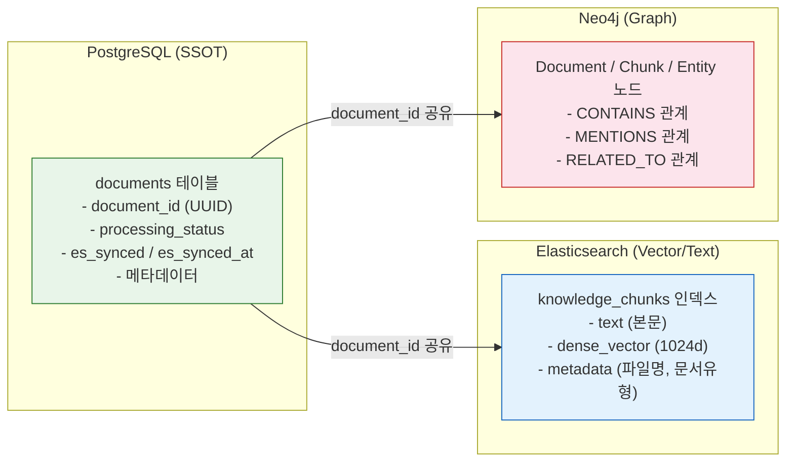
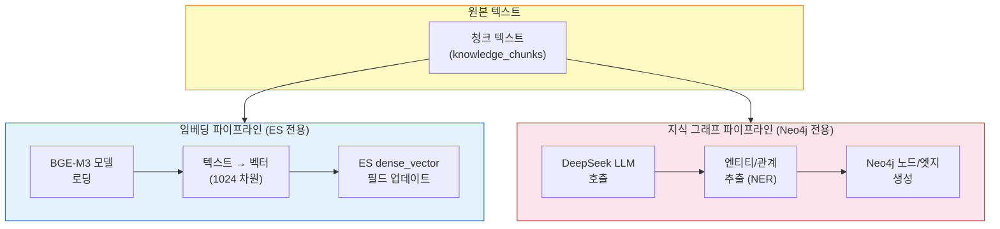
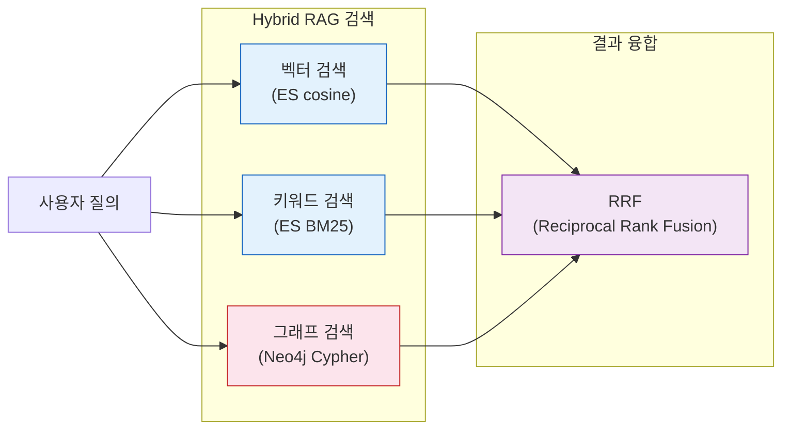
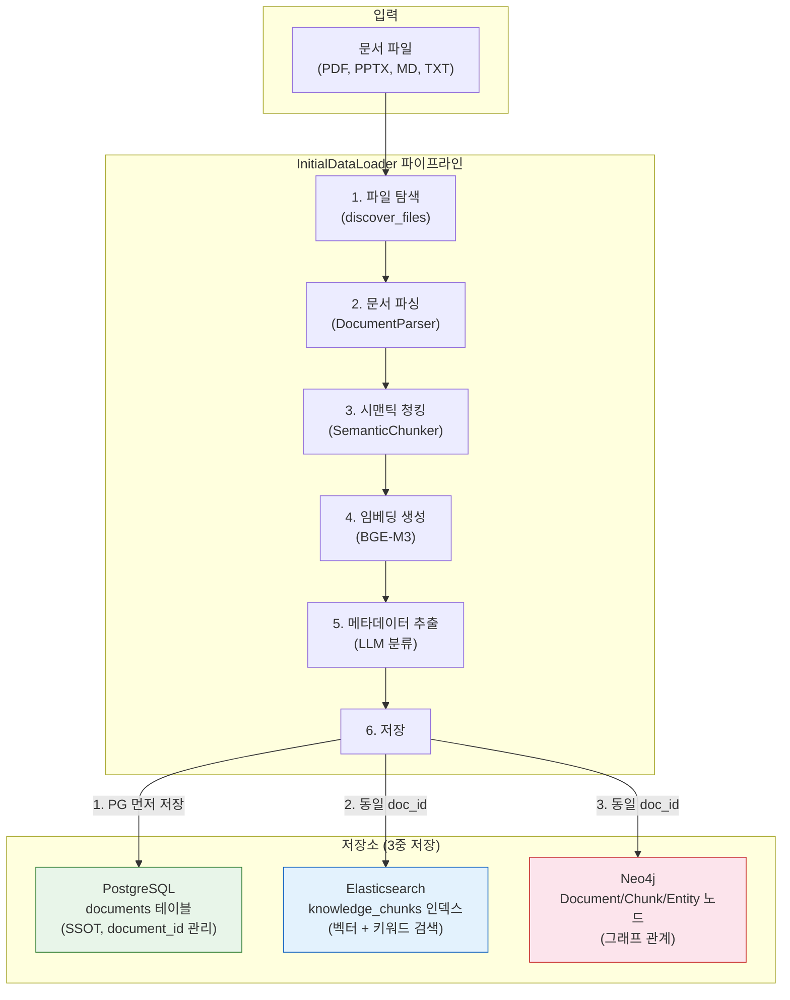
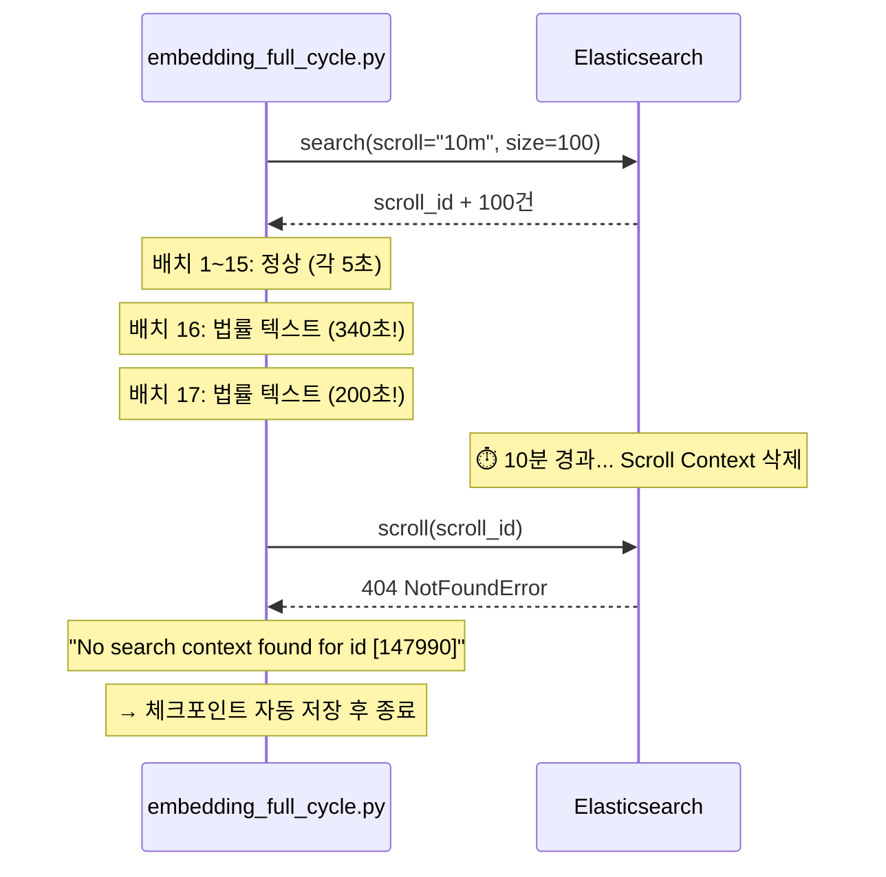
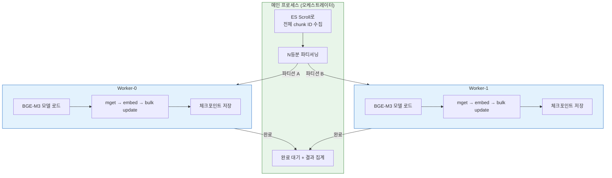

# 문서 데이터 적재 운영 매뉴얼

**작성일**: 2026-02-08
**최종 업데이트**: 2026-02-10
**버전**: 3.2
**관련 스토리**: STORY-099 (ETL document_id 정합성 수정)

---

## 1. 개요

Knowledge Platform에 문서를 적재하는 방법은 **4가지**입니다.

| 방법 | 용도 | 적재 대상 | 실행 방식 |
|------|------|----------|----------|
| **업로드 API** | 개별 문서 업로드 | 사용자가 UI에서 업로드한 파일 | REST API 호출 |
| **InitialDataLoader** | 대량 초기 적재 | 서버 디렉토리의 문서 일괄 적재 | Python 스크립트 |
| **BackgroundWorker** | 업로드 후 자동 처리 | 업로드 API로 등록된 문서 | 30초 주기 자동 |
| **Full Cycle 배치** | 임베딩 누락 보정 | ES에 텍스트만 있고 벡터 없는 청크 | Python 스크립트 |

### 4가지 방법 모두 동일한 저장 패턴을 따릅니다:

```
PostgreSQL (SSOT) → Elasticsearch (벡터/검색) → Neo4j (그래프)
```

- **PostgreSQL**: 문서 메타데이터의 Single Source of Truth (문서 ID 관리)
- **Elasticsearch**: 청크 벡터 임베딩 + 키워드 검색 인덱스
- **Neo4j**: 엔티티 관계 그래프

> 자세한 3-Store 아키텍처 설명은 **§2**를 참조하세요.

---

## 2. 3-Store 아키텍처와 임베딩 배치 범위

### 2.1 아키텍처 개요

이 프로젝트는 **3-Store 아키텍처**를 채택하고 있으며, 각 저장소가 완전히 분리된 역할을 담당합니다.



### 2.2 저장소별 역할과 임베딩 관계

| 저장소 | 저장 데이터 | 임베딩과의 관계 | 생성 파이프라인 |
|--------|-----------|---------------|---------------|
| **Elasticsearch** | 청크 텍스트 + `dense_vector` (임베딩 벡터) | **직접 관련** - 여기에 임베딩 저장 | 텍스트 → BGE-M3 → 1024d vector → ES |
| **Neo4j** | 엔티티/관계 그래프 (Entity, Relationship) | **관련 없음** - 엔티티 추출 결과 저장 | 텍스트 → DeepSeek LLM → Entity/Relation → Neo4j |
| **PostgreSQL** | 문서 메타데이터, 처리 상태 | **간접 관련** - `es_synced` 상태 추적 | ETL 시작 시 최초 저장 (SSOT) |

### 2.3 왜 임베딩 배치에서 Neo4j를 다루지 않는가?

#### 이유 1: 임베딩과 지식 그래프는 완전히 다른 파이프라인



| 비교 항목 | 임베딩 파이프라인 | 지식 그래프 파이프라인 |
|----------|-----------------|-------------------|
| **대상 저장소** | Elasticsearch | Neo4j |
| **처리 방식** | BGE-M3 로컬 모델 추론 | DeepSeek LLM API 호출 |
| **입력** | 청크 텍스트 (text 필드) | 청크 텍스트 (text 필드) |
| **출력** | 1024차원 실수 벡터 | (Subject, Predicate, Object) 트리플 |
| **용도** | 벡터 유사도 검색 (cosine) | 관계 기반 그래프 탐색 |
| **비용** | 로컬 GPU/CPU (무료) | LLM API 호출 (유료) |
| **소요 시간** | ~5초/배치(16개) | ~30초/청크 (LLM 응답 대기) |
| **담당 코드** | `embedding_full_cycle.py` | `initial_data_loader.py` 내 KG 로직 |

#### 이유 2: Neo4j에는 벡터가 들어가지 않음

Neo4j에 저장되는 데이터 구조:

```
(Document {id, title, file_name, ...})
    -[:CONTAINS]->
(Chunk {id, text, chunk_index, ...})
    -[:MENTIONS]->
(Entity {name, type, ...})
    -[:RELATED_TO]->
(Entity {name, type, ...})
```

- Neo4j 노드에는 `dense_vector` 필드가 **존재하지 않음**
- 엔티티(Entity)는 LLM이 텍스트에서 추출한 **고유명사/개념** (예: "개인정보보호법", "금융위원회")
- 관계(Relationship)는 엔티티 간 **의미적 연결** (예: "규제한다", "소속이다")

#### 이유 3: 각 저장소는 독립적으로 쿼리됨



- **벡터 검색**: ES에서 `dense_vector` 필드로 cosine 유사도 계산 → **임베딩 필요**
- **키워드 검색**: ES에서 `text` 필드로 BM25 스코어링 → 임베딩 불필요
- **그래프 검색**: Neo4j에서 Cypher 쿼리로 관계 탐색 → 임베딩 불필요

따라서 임베딩이 없어도 키워드 검색과 그래프 검색은 **정상 동작**합니다.
벡터 검색만 임베딩에 의존하며, 이는 **Elasticsearch 전용 작업**입니다.

### 2.4 임베딩 배치의 정확한 범위

```
Full Cycle 임베딩 배치 범위:
┌─────────────────────────────────────────────────────────────┐
│  ES 쿼리 → 임베딩 생성 → ES 업데이트 → PG 상태 동기화      │
│                                                             │
│  ┌─────────┐    ┌──────────┐    ┌──────────┐    ┌───────┐  │
│  │ ES에서  │    │ BGE-M3   │    │ ES에     │    │ PG    │  │
│  │ 미처리  │ →  │ 벡터     │ →  │ dense_   │ →  │ 상태  │  │
│  │ 청크    │    │ 생성     │    │ vector   │    │ 갱신  │  │
│  │ 조회    │    │          │    │ 저장     │    │       │  │
│  └─────────┘    └──────────┘    └──────────┘    └───────┘  │
│                                                             │
│  ✅ Elasticsearch: dense_vector 필드 업데이트                │
│  ✅ PostgreSQL: es_synced, processing_status 갱신            │
│  ❌ Neo4j: 범위 밖 (별도 KG 파이프라인 담당)                 │
└─────────────────────────────────────────────────────────────┘
```

### 2.5 KG 파이프라인은 언제 실행되는가?

| 시점 | 파이프라인 | 대상 | 실행 코드 |
|------|----------|------|----------|
| 문서 초기 적재 시 | `InitialDataLoader` | PG + ES + Neo4j 동시 처리 | `initial_data_loader.py` |
| 문서 업로드 시 | `BackgroundWorker` | PG + ES + Neo4j 동시 처리 | `background_worker.py` |
| **임베딩 누락 보정** | `embedding_full_cycle.py` | **ES + PG만** (이 배치) | `embedding_full_cycle.py` |
| KG만 보정 필요 시 | 별도 스크립트 | Neo4j만 | (미구현, 향후 과제) |

> **핵심 정리**: 임베딩 배치는 "텍스트 → 벡터 변환 → ES 저장"이라는 **단일 관심사**에 집중합니다.
> Neo4j 지식 그래프는 "텍스트 → LLM 엔티티 추출 → 그래프 저장"이라는 **완전히 별개의 파이프라인**입니다.
> 두 파이프라인은 입력(텍스트)만 공유하고, 출력 대상과 처리 방식이 전혀 다릅니다.

---

## 3. 사전 준비: 볼륨 마운트

### 3.1 왜 필요한가?

InitialDataLoader는 컨테이너 내부에서 실행됩니다. 호스트의 문서 파일을 컨테이너에서 읽으려면 **Docker 볼륨 마운트**가 필요합니다.

```
호스트 파일 시스템                    Docker 컨테이너 (kp-ai-service)
─────────────────                    ────────────────────────────────
knowledge_data/                      /app/knowledge_data/
├── documents/          ──마운트──>   ├── documents/
│   ├── AI/                          │   ├── AI/
│   ├── 법률자료/                     │   ├── 법률자료/
│   ├── technical/                   │   ├── technical/
│   └── ...                          │   └── ...
```

### 3.2 설정 방법

`infrastructure/docker/docker-compose.yml`의 `ai-service` 섹션:

```yaml
ai-service:
  volumes:
    # 임베딩 모델 캐시
    - /home/claude/.cache/huggingface:/app/.cache/huggingface:ro
    # 초기 적재용 문서 데이터 (추가)
    - ../../knowledge_data:/app/knowledge_data:ro
```

- `../../knowledge_data` = 호스트의 프로젝트 루트 하위 `knowledge_data/` 디렉토리
- `/app/knowledge_data` = 컨테이너 내부 경로
- `:ro` = 읽기 전용 (안전)

### 3.3 적용 (컨테이너 재시작 필요)

```bash
cd infrastructure/docker
docker compose up -d ai-service
```

### 3.4 확인

```bash
# 컨테이너에서 문서 파일이 보이는지 확인
docker exec kp-ai-service ls /app/knowledge_data/documents/

# 기대 출력: AI  guides  policies  presentations  standards  technical  법률자료
```

---

## 4. 문서 디렉토리 구조

```
knowledge_data/documents/
├── technical/          # 기술 문서 (설계서, 계획서)     ← 기본 소스
├── guides/             # 가이드/매뉴얼                   ← 기본 소스
├── presentations/      # 발표 자료                       ← 기본 소스
├── policies/           # 정책/규정                       ← 기본 소스
├── standards/          # 표준/기준                       ← 기본 소스
├── AI/                 # AI/ML 기술 문서                 ← 수동 소스 등록 필요
│   ├── AIAgent/        # AI 에이전트 관련
│   └── RAG/            # RAG 관련
└── 법률자료/           # 법률/법령 자료                  ← 수동 소스 등록 필요
```

- **기본 소스** (5개): `add_default_sources()`로 자동 등록
- **수동 소스**: `add_source()`로 직접 등록 필요

### 새 디렉토리 추가 시

`knowledge_data/documents/` 아래에 새 폴더를 만들고 문서를 넣으면 됩니다.
InitialDataLoader 실행 시 `add_source()`로 등록해야 합니다.

---

## 5. InitialDataLoader 실행 방법

### 5.1 기본 실행 (기본 소스 5개만)

```bash
docker exec kp-ai-service python -c "
import asyncio
from app.services.initial_data_loader import InitialDataLoader

async def run():
    loader = InitialDataLoader()
    loader.add_default_sources()
    result = await loader.load_all()
    print(f'결과: {result.success_count}/{result.total_files} 성공, 청크: {result.total_chunks}')

asyncio.run(run())
"
```

### 5.2 전체 실행 (AI, 법률자료 포함)

```bash
docker exec kp-ai-service python -c "
import asyncio
from app.services.initial_data_loader import InitialDataLoader, DataSource, DocType

async def run():
    loader = InitialDataLoader()
    loader.add_default_sources()

    # AI 문서 추가
    loader.add_source(DataSource(
        name='AI',
        path='/app/knowledge_data/documents/AI',
        doc_type=DocType.TECHNICAL,
        extensions=['.pdf', '.pptx', '.md', '.txt'],
        recursive=True,
        description='AI/ML 기술 문서',
    ))

    # 법률자료 추가
    loader.add_source(DataSource(
        name='법률자료',
        path='/app/knowledge_data/documents/법률자료',
        doc_type=DocType.POLICY,
        extensions=['.pdf', '.docx', '.txt'],
        recursive=True,
        description='법률/법령 자료',
    ))

    result = await loader.load_all()
    print(f'결과: {result.success_count}/{result.total_files} 성공')
    print(f'청크: {result.total_chunks}, 엔티티: {result.total_entities}')
    print(f'소요시간: {result.total_time_ms/1000:.1f}초')

asyncio.run(run())
"
```

### 5.3 단일 디렉토리만 적재

```bash
docker exec kp-ai-service python -c "
import asyncio
from app.services.initial_data_loader import InitialDataLoader, DataSource, DocType

async def run():
    loader = InitialDataLoader()
    loader.add_source(DataSource(
        name='법률자료',
        path='/app/knowledge_data/documents/법률자료',
        doc_type=DocType.POLICY,
        extensions=['.pdf'],
        recursive=True,
    ))
    result = await loader.load_all()
    print(f'결과: {result.success_count}/{result.total_files} 성공')

asyncio.run(run())
"
```

---

## 6. 적재 후 데이터 흐름



### 핵심: document_id 정합성 (STORY-099)

```
PostgreSQL documents.id = ES chunks.document_id = Neo4j Document.id
```

모든 저장소에서 **동일한 UUID**를 사용합니다. PostgreSQL에 먼저 저장하고, 그 ID를 ES/Neo4j에 전달합니다.

> 자세한 3-Store 아키텍처 설명과 각 저장소의 역할은 **§2**를 참조하세요.

---

## 7. 적재 결과 확인

### 7.1 PostgreSQL 확인

```bash
docker exec kp-postgresql psql -U knowledge -d knowledge -c \
  "SELECT id, title, processing_status, es_synced FROM documents ORDER BY created_at;"
```

### 7.2 Elasticsearch 확인

```bash
# 전체 청크 수
docker exec kp-ai-service python -c "
import asyncio
from elasticsearch import AsyncElasticsearch
async def check():
    es = AsyncElasticsearch('http://elasticsearch:9200')
    result = await es.count(index='knowledge_chunks')
    print(f'ES 청크 수: {result[\"count\"]}')
    await es.close()
asyncio.run(check())
"
```

### 7.3 PG-ES 정합성 확인

```bash
docker exec kp-postgresql psql -U knowledge -d knowledge -c \
  "SELECT count(*) as pg_docs FROM documents;"

# ES에서 unique document_id 수 확인
docker exec kp-ai-service python -c "
import asyncio
from elasticsearch import AsyncElasticsearch
async def check():
    es = AsyncElasticsearch('http://elasticsearch:9200')
    result = await es.search(
        index='knowledge_chunks',
        body={'size': 0, 'aggs': {'doc_ids': {'terms': {'field': 'document_id.keyword', 'size': 1000}}}}
    )
    buckets = result['aggregations']['doc_ids']['buckets']
    print(f'ES unique document_ids: {len(buckets)}')
    await es.close()
asyncio.run(check())
"
```

두 숫자가 일치하면 정합성 OK.

---

## 8. 업로드 API를 통한 개별 문서 적재

UI 또는 API로 문서를 업로드하는 경우 자동으로 PG+ES+Neo4j에 저장됩니다.

### 8.1 API 호출

```bash
curl -X POST http://localhost/api/v1/documents/upload \
  -H "Authorization: Bearer <JWT_TOKEN>" \
  -F "file=@/path/to/document.pdf" \
  -F "title=문서 제목"
```

### 8.2 처리 흐름

```
업로드 API → PG documents 저장 (status=uploaded)
           → BackgroundWorker 자동 감지 (30초 주기)
           → document_processing_pipeline 실행
           → PG document_id로 ES/Neo4j 저장
           → PG status=completed 업데이트
```

업로드 API는 이미 PG document_id를 기준으로 ES에 저장하므로 **별도 작업 불필요**합니다.

---

## 9. 데이터 정리

### 9.1 ES 불일치 데이터 삭제

PG에 없는 ES 청크를 삭제합니다 (고아 데이터 정리):

```bash
docker exec kp-ai-service python -c "
import asyncio
from elasticsearch import AsyncElasticsearch

async def cleanup():
    es = AsyncElasticsearch('http://elasticsearch:9200')
    # PG에서 valid document_id 목록 조회 후 ES에서 매칭 안 되는 것 삭제
    # ... (구체적 스크립트는 상황에 따라 조정)
    await es.close()

asyncio.run(cleanup())
"
```

### 9.2 Redis 캐시 초기화

데이터 재적재 후 검색 캐시를 초기화해야 합니다:

```bash
docker exec kp-redis redis-cli FLUSHALL
```

### 9.3 전체 초기화 (주의: 모든 데이터 삭제)

```bash
# ES 인덱스 삭제 후 재생성
docker exec kp-ai-service python -c "
import asyncio
from elasticsearch import AsyncElasticsearch
async def reset():
    es = AsyncElasticsearch('http://elasticsearch:9200')
    await es.indices.delete(index='knowledge_chunks', ignore=[404])
    print('ES 인덱스 삭제 완료')
    await es.close()
asyncio.run(reset())
"

# PG documents 테이블 초기화
docker exec kp-postgresql psql -U knowledge -d knowledge -c \
  "DELETE FROM chunks; DELETE FROM documents;"

# Redis 캐시 초기화
docker exec kp-redis redis-cli FLUSHALL

# init-db 재실행으로 ES 매핑 재생성
docker compose restart init-db

# InitialDataLoader 재실행
# (위 5.2 절 참조)
```

---

## 10. AI 모델 캐시 관리

### 10.1 사용되는 모델 목록

| 모델 | 용도 | 캐시 위치 | 관리 방식 |
|------|------|----------|----------|
| **BGE-M3** (BAAI/bge-m3) | 임베딩 벡터 생성 | HuggingFace 캐시 (bind mount) | 영구 캐시 |
| **Docling Layout Heron** | PDF 레이아웃 분석 | HuggingFace 캐시 (bind mount) | 영구 캐시 |
| **Docling Models** | 문서 구조 파싱 | HuggingFace 캐시 (bind mount) | 영구 캐시 |
| **RapidOCR** (3개 모델) | PDF OCR 텍스트 추출 | Dockerfile 내장 (site-packages) | 이미지 빌드 시 포함 |

### 10.2 HuggingFace 캐시 (bind mount)

```yaml
# docker-compose.yml
ai-service:
  volumes:
    - /home/claude/.cache/huggingface:/app/.cache/huggingface  # 쓰기 가능 (ro 금지!)
```

- **최초 실행 시**: 모델 자동 다운로드 (~2GB)
- **이후 실행 시**: 캐시에서 즉시 로드 (다운로드 없음)
- **주의**: `:ro` (읽기 전용) 마운트 금지! 모델 업데이트/검증 시 쓰기 권한 필요

### 10.3 UID 정합성 (근본 원인 방지)

```dockerfile
# Dockerfile - 호스트 사용자 UID와 동일하게 설정
RUN groupadd -g 1000 appgroup && \
    useradd -u 1000 -g appgroup -m -s /bin/bash appuser
```

| 항목 | 값 | 이유 |
|------|-----|------|
| 호스트 사용자 UID | 1000 | WSL 기본 사용자 |
| 컨테이너 appuser UID | 1000 | bind mount 권한 호환 |

**왜 중요한가?**

bind mount 디렉토리는 호스트와 컨테이너가 파일 시스템을 공유합니다.
UID가 다르면 한쪽에서 만든 파일을 다른 쪽에서 읽지/쓰지 못합니다.

```
# UID 불일치 시 문제:
호스트 (UID 1000)  ←→  컨테이너 (UID 1001)
     ↓                        ↓
Permission denied!   Permission denied!
```

### 10.4 RapidOCR 모델 (Dockerfile 내장)

```dockerfile
# Dockerfile builder 스테이지에서 사전 다운로드
RUN python -c "from rapidocr import RapidOCR; RapidOCR()"
```

RapidOCR 모델 3개 (~40MB):
- `ch_PP-OCRv4_det_infer.pth` (13.8MB) - 텍스트 영역 감지
- `ch_ptocr_mobile_v2.0_cls_infer.pth` (0.6MB) - 텍스트 방향 분류
- `ch_PP-OCRv4_rec_infer.pth` (25.7MB) - 텍스트 인식

### 10.5 모델 관련 트러블슈팅

**Q: "Permission denied: docling-layout-heron"**
```bash
# 컨테이너 내부에서 root로 권한 수정
docker exec -u root kp-ai-service chown -R 1000:1000 /app/.cache/huggingface/
```

**Q: HF 캐시 전체 초기화 (재다운로드)**
```bash
# 호스트에서 실행
rm -rf /home/claude/.cache/huggingface/hub/models--docling-project--*
# 컨테이너 재시작 → 자동 재다운로드
docker compose restart ai-service
```

---

## 11. 메모리 최적화: 임베딩 시 컨테이너 관리

### 11.1 왜 필요한가?

대량 문서 임베딩은 메모리를 많이 사용합니다. WSL2 환경에서 18개 컨테이너가 모두 Running이면
ai-service에 할당되는 실제 가용 메모리가 줄어들어 **OOM Kill (exit code 137)** 이 발생합니다.

```
[사례] WSL2 7.6GB, 18개 컨테이너 전부 Running
→ 2번째 PDF에서 OOM Kill → 임베딩 실패
```

### 11.2 컨테이너 분류

임베딩에 **필수**인 컨테이너와 **일시 중지 가능**한 컨테이너를 구분합니다.

| 구분 | 컨테이너 | 메모리 | 역할 |
|------|---------|--------|------|
| **필수** | ai-service | ~336MB (피크 수GB) | 임베딩 워커 |
| **필수** | elasticsearch | ~1.15GB | 벡터/청크 저장 |
| **필수** | neo4j | ~522MB | 그래프 저장 |
| **필수** | postgresql | ~36MB | SSOT 문서 ID |
| **필수** | redis | ~9MB | 캐시 |
| **필수** | minio | ~93MB | 파일 스토리지 |
| 중지 가능 | kibana | ~498MB | 모니터링 UI |
| 중지 가능 | backend | ~415MB | SpringBoot API |
| 중지 가능 | keycloak | ~264MB | 인증 서버 |
| 중지 가능 | api-gateway | ~197MB | API Gateway |
| 중지 가능 | grafana | ~123MB | 대시보드 |
| 중지 가능 | prometheus | ~92MB | 메트릭 |
| 중지 가능 | loki + promtail | ~89MB | 로그 수집 |
| 중지 가능 | nginx, frontend, jaeger, keycloak-db | ~75MB | 기타 |

**절약 효과: ~1.75GB** → ai-service가 사용할 수 있는 메모리가 그만큼 증가

### 11.3 임베딩 전: 불필요 컨테이너 중지

```bash
cd infrastructure/docker

# 12개 컨테이너 일시 중지 (데이터 보존, stop만 하므로 안전)
docker compose stop \
  kibana backend api-gateway keycloak keycloak-db \
  grafana prometheus loki promtail jaeger nginx frontend
```

`stop`은 컨테이너를 종료할 뿐 삭제하지 않으므로, 볼륨/데이터/설정이 모두 보존됩니다.

### 11.4 임베딩 후: 중지된 컨테이너 자동 복구

```bash
cd infrastructure/docker

# 전체 컨테이너 재시작 (중지된 것만 올라옴, 이미 Running인 것은 영향 없음)
docker compose up -d
```

### 11.5 원커맨드 스크립트 (중지 → 임베딩 → 복구)

```bash
#!/bin/bash
# scripts/run_embedding_optimized.sh
# 임베딩 시 메모리 최적화 실행 스크립트

set -e
COMPOSE_DIR="infrastructure/docker"

echo "=== Step 1: 불필요 컨테이너 중지 (메모리 확보) ==="
docker compose -f $COMPOSE_DIR/docker-compose.yml stop \
  kibana backend api-gateway keycloak keycloak-db \
  grafana prometheus loki promtail jaeger nginx frontend

echo "=== Step 2: 메모리 상태 확인 ==="
free -h

echo "=== Step 3: 문서 임베딩 시작 ==="
docker exec kp-ai-service python -c "
import asyncio
from app.services.initial_data_loader import InitialDataLoader, DataSource, DocType

async def run():
    loader = InitialDataLoader()
    loader.add_default_sources()
    loader.add_source(DataSource(
        name='AI', path='/app/knowledge_data/documents/AI',
        doc_type=DocType.TECHNICAL, extensions=['.pdf', '.pptx', '.md', '.txt'],
        recursive=True, description='AI/ML 기술 문서'))
    loader.add_source(DataSource(
        name='법률자료', path='/app/knowledge_data/documents/법률자료',
        doc_type=DocType.POLICY, extensions=['.pdf', '.docx', '.txt'],
        recursive=True, description='법률/법령 자료'))
    result = await loader.load_all()
    print(f'결과: {result.success_count}/{result.total_files} 성공')
    print(f'청크: {result.total_chunks}, 엔티티: {result.total_entities}')
    print(f'소요시간: {result.total_time_ms/1000:.1f}초')
asyncio.run(run())
"

echo "=== Step 4: 전체 컨테이너 복구 ==="
docker compose -f $COMPOSE_DIR/docker-compose.yml up -d

echo "=== Step 5: Redis 캐시 초기화 ==="
docker exec kp-redis redis-cli FLUSHALL

echo "=== 완료 ==="
docker compose -f $COMPOSE_DIR/docker-compose.yml ps --format "table {{.Name}}\t{{.Status}}"
```

### 11.6 WSL2 메모리 설정 (.wslconfig)

WSL2 기본 메모리는 호스트 RAM의 50% 또는 8GB 중 작은 값입니다.
대량 임베딩에는 **최소 12GB**를 권장합니다.

```powershell
# Windows PowerShell에서 실행
notepad $env:USERPROFILE\.wslconfig
```

```ini
[wsl2]
memory=12GB
swap=4GB
processors=4
```

```powershell
# 설정 적용 (WSL 전체 재시작 필요)
wsl --shutdown
# 이후 WSL 터미널 재실행
```

**확인**:
```bash
free -h
# total이 11Gi 이상이면 적용 완료
```

| WSL 메모리 | 임베딩 안정성 | 비고 |
|-----------|-------------|------|
| 4GB | 거의 불가 | 컨테이너 기동만으로 소진 |
| 8GB | 소형 PDF만 가능 | 대형 PDF에서 OOM |
| **12GB** | **대부분 가능 (권장)** | 컨테이너 중지 병행 시 안정 |
| 16GB+ | 전체 안정 | 컨테이너 중지 불필요 |

> **FAQ: 임베딩 후 메모리를 다시 줄여야 하나요?**
>
> **아니요.** `.wslconfig`의 `memory=12GB` 설정은 WSL이 **최대** 사용할 수 있는 상한선입니다.
> 실제로 사용하지 않는 메모리는 Windows 호스트가 자유롭게 사용합니다.
> 따라서 일상 운영 시에도 12GB 설정을 유지해도 무방합니다.
>
> 메모리를 줄여야 하는 유일한 경우: Windows 호스트에서 다른 고메모리 앱(게임, IDE 등)을
> 동시에 사용할 때 호스트 메모리가 부족한 경우에만 조정하세요.

---

## 12. 임베딩 비활성화 모드 (Embedding-Disabled Loading)

> **2026-02-09 Batch 3에서 발견된 핵심 전략**
> WSL 11GB 환경에서 8.5MB 이상 PDF의 OOM 문제를 근본적으로 해결한 방법입니다.

### 12.1 왜 필요한가?

대형 PDF 적재 시 세 가지 메모리 소비원이 동시에 작동합니다:

```
┌─────────────────────────────────────────────────────┐
│          전체 파이프라인 메모리 구성                      │
│                                                     │
│  docling 파싱         ~2.5-3.5GB  (문서 크기에 비례)  │
│  + BGE-M3 모델 로딩    ~2.0GB     (고정)             │
│  + 임베딩 계산          ~3-4GB    (chunk 수에 비례)   │
│  ─────────────────────────────────────              │
│  합계                  ~8-10GB    → OOM Kill!        │
└─────────────────────────────────────────────────────┘
```

임베딩을 비활성화하면 BGE-M3 모델 + 임베딩 계산을 건너뛰어 **~5-6GB를 절감**합니다:

```
┌─────────────────────────────────────────────────────┐
│          임베딩 비활성화 모드                            │
│                                                     │
│  docling 파싱         ~2.5-3.5GB  (동일)             │
│  + 엔티티 추출         ~0.1GB     (DeepSeek API 호출) │
│  ─────────────────────────────────────              │
│  합계                  ~2.3-3.7GB  → 안전!           │
└─────────────────────────────────────────────────────┘
```

### 12.2 OOM 발생 사례 (임베딩 포함 모드)

| 파일 | 크기 | 모드 | Peak RSS | 결과 |
|------|------|------|----------|------|
| 소방시설법 | 8.5MB | embedding=True | 9.3GB | OOM Kill (exit 137) |
| LLM 에이전트 기초실습 | 11MB | embedding=True | 9.6GB | OOM Kill (exit 137) |
| 소방시설법 | 8.5MB | **embedding=False** | **2.9GB** | SUCCESS |
| LLM 에이전트 기초실습 | 11MB | **embedding=False** | **3.7GB** | SUCCESS |
| 알기쉬운법령정비기준 | 79MB | **embedding=False** | **3.2GB** | SUCCESS |

### 12.3 어떤 것이 저장되고 어떤 것이 생략되는가?

| 파이프라인 단계 | embedding=True | embedding=False | 비고 |
|----------------|:--------------:|:---------------:|------|
| 문서 파싱 (docling) | O | O | 동일 |
| 시맨틱 청킹 | O | O | 동일 |
| 엔티티 추출 (DeepSeek API) | O | O | API 호출이므로 메모리 영향 없음 |
| BGE-M3 모델 로딩 | O | **X** | ~2GB 절감 |
| 벡터 임베딩 계산 | O | **X** | ~3-4GB 절감 |
| PG documents 저장 | O | O | document_id, 메타데이터 |
| ES chunks 저장 (텍스트) | O | O | 텍스트 검색 가능 |
| ES chunks 저장 (벡터) | O | **X** | **벡터 검색 불가** |
| Neo4j 그래프 저장 | O | O | Document/Chunk/Entity 노드 |

**결론**: 임베딩 비활성화 모드에서도 **키워드 검색, 그래프 검색, 메타데이터 조회**는 정상 동작합니다.
**벡터 유사도 검색만** 불가하며, 이는 후속 임베딩 배치로 보완합니다.

### 12.4 단일 파일 로더 스크립트

임베딩 비활성화 모드 전용 스크립트: `knowledge_service/scripts/load_single_noembedding.py`

```python
# 핵심 설정
loader = InitialDataLoader(
    chunk_size=500,
    chunk_overlap=50,
    batch_size=32,
    max_retries=2,
    continue_on_error=True,
    enable_embeddings=False,        # BGE-M3 스킵 (~2GB 절감)
    enable_entity_extraction=True,   # DeepSeek API (메모리 영향 없음)
)
```

#### 실행 방법

```bash
# 1. 스크립트를 컨테이너에 복사
docker cp knowledge_service/scripts/load_single_noembedding.py kp-ai-service:/app/

# 2. 단일 파일 적재 실행
docker exec kp-ai-service python3 /app/load_single_noembedding.py \
  "/app/knowledge_data/documents/법률자료/소방시설법.pdf" POLICY

# 3. 출력 예시:
# RESULT: SUCCESS
# CHUNKS: 1469
# ENTITIES: 29
# TIME: 2760s
# MEMORY: 2.9GB
```

#### 사용 인자

| 인자 | 설명 | 예시 |
|------|------|------|
| `file_path` | 컨테이너 내부 경로 | `/app/knowledge_data/documents/AI/file.pdf` |
| `doc_type` | 문서 유형 | `TECHNICAL` 또는 `POLICY` |

### 12.5 대량 파일의 권장 실행 절차

대형 파일 여러 건을 처리할 때는 **파일별 ai-service 재시작** 전략을 사용합니다:

```bash
#!/bin/bash
# 대형 파일 순차 적재 (임베딩 비활성화)

FILES=(
  "/app/knowledge_data/documents/법률자료/소방시설법.pdf|POLICY"
  "/app/knowledge_data/documents/AI/LLM_에이전트_기초실습.pdf|TECHNICAL"
  # ... 추가 파일
)

for entry in "${FILES[@]}"; do
  IFS='|' read -r filepath doctype <<< "$entry"
  filename=$(basename "$filepath")

  echo "=== Processing: $filename ==="

  # 1. ai-service 재시작 (프레시 메모리 ~300MB)
  docker compose -f infrastructure/docker/docker-compose.yml restart ai-service
  sleep 30  # 컨테이너 안정화 대기

  # 2. 스크립트 복사 (재시작 후 /app/ 초기화되므로 필수)
  docker cp knowledge_service/scripts/load_single_noembedding.py kp-ai-service:/app/

  # 3. 적재 실행
  docker exec -t kp-ai-service python3 /app/load_single_noembedding.py "$filepath" "$doctype"

  echo "=== Done: $filename ==="
done
```

**핵심 포인트**:
- 각 파일 처리 후 **ai-service 재시작**: 누적 메모리 문제를 원천 차단
- 재시작 후 **스크립트 재복사 필수**: 컨테이너 내부 `/app/`이 초기화됨
- 재시작 소요 시간 ~30초: OOM Kill 후 데이터 손실 대비 매우 저렴한 비용

### 12.6 파일 유형별 처리 속도 가이드

임베딩 비활성화 모드에서 측정한 실제 처리 시간입니다:

| 파일 유형 | 예시 | 크기 | 시간 | 시간/MB | 특징 |
|----------|------|------|------|---------|------|
| 사전/텍스트 PDF | 법령용어사전 | 19MB | 10min | **0.5min/MB** | OCR 불필요, 가장 빠름 |
| 대형 법령집 | 문화재관계법령집 | 69MB | 76min | 1.1min/MB | 텍스트 중심, 스트리밍 파싱 |
| 대형 법령집 | 알기쉬운법령정비기준 | 79MB | 82min | 1.0min/MB | 텍스트 중심 |
| 프레젠테이션 | LLM 에이전트 실습 | 11MB | 34min | **3.1min/MB** | 이미지 OCR 필요 |
| 법령집 (테이블) | 소방시설법 | 8.5MB | 46min | **5.4min/MB** | TableItem 파싱 집약적 |

> **인사이트**: 파일 크기 ≠ 메모리/시간. 이미지가 많은 11MB 프레젠테이션이
> 텍스트 기반 69MB 법령집보다 peak 메모리가 높습니다 (3.7GB vs 3.0GB).

### 12.7 후속 작업: Full Cycle 임베딩 배치 실행

> **해결됨**: `embedding_full_cycle.py`가 구현되었습니다 (§13 참조).

임베딩 비활성화로 적재한 문서의 벡터를 생성하려면:

```bash
docker exec kp-ai-service python3 /app/scripts/embedding_full_cycle.py \
  --mode all --batch-size 16
```

자세한 사용법은 **§13. Full Cycle 임베딩 배치 프로그램**을 참조하세요.

#### 임베딩 미생성 문서 목록 (후속 배치 대상)

| # | 파일명 | chunks | 임베딩 상태 |
|---|--------|--------|------------|
| 1 | 소방시설법 및 화재예방법령집 | 1,469 | 미생성 |
| 2 | LLM 기반 AI 에이전트 기초와 실습 | 132 | 미생성 |
| 3 | 아키텍처팀 AI프로젝트 이해 워크샵 | 174 | 미생성 |
| 4 | 딥러닝과 RAG 기초과정 | 374 | 미생성 |
| 5 | 법령용어한영사전(법령용어부분) | 2,292 | 미생성 |
| 6 | 법령용어한영사전(부록) | 709 | 미생성 |
| 7 | 문화재관계법령집 | 2,611 | 미생성 |
| 8 | 알기쉬운법령정비기준-7판 | 2,333 | 미생성 |
| | **합계** | **10,094** | |

---

## 13. Full Cycle 임베딩 배치 프로그램 (embedding_full_cycle.py)

### 13.1 개요

기존 `add_embeddings_batch.py`의 한계를 극복한 **Full Cycle** 임베딩 배치 프로그램입니다.

| 항목 | 기존 (`add_embeddings_batch.py`) | 신규 (`embedding_full_cycle.py`) |
|------|------|------|
| ES 임베딩 업데이트 | O | O |
| PG 상태 동기화 | X | **O** (`es_synced`, `processing_status`) |
| 체크포인트/재개 | X | **O** (50배치마다 자동 저장) |
| 실행 모드 | 1개 (전체) | **5개** (all/document/file/reprocess/force) |
| OOM 방지 | X | **O** (GC + 메모리 모니터링) |
| 작업 이력 | X | **O** (JSON 결과 파일) |
| dry-run | X | **O** |
| 병렬 워커 | X | **O** (`--workers N`, 멀티프로세스) |
| 텍스트 절단 | X | **O** (`--max-text-length`, 초장문 O(n²) 방지) |
| 배치 타임아웃 | X | **O** (`--batch-timeout`, 무한 대기 방지) |

### 13.2 실행 방법

#### 기본 실행 (미처리 전체)

```bash
docker exec kp-ai-service python3 /app/scripts/embedding_full_cycle.py \
  --mode all --batch-size 16
```

#### 특정 문서만 처리

```bash
# document_id로 지정 (UUID)
docker exec kp-ai-service python3 /app/scripts/embedding_full_cycle.py \
  --mode document --doc-id "550e8400-e29b-41d4-a716-446655440000" --batch-size 16
```

#### 특정 파일명으로 처리

```bash
docker exec kp-ai-service python3 /app/scripts/embedding_full_cycle.py \
  --mode file --file-name "상법_시행령.pdf" --batch-size 16
```

#### 특정 시점 이후 재처리

```bash
# 2026-02-08 이후 인덱싱된 청크만 재임베딩
docker exec kp-ai-service python3 /app/scripts/embedding_full_cycle.py \
  --mode reprocess --since "2026-02-08T00:00:00" --batch-size 16
```

#### 강제 재처리 (이미 임베딩된 것도 포함)

```bash
# --force 플래그 추가
docker exec kp-ai-service python3 /app/scripts/embedding_full_cycle.py \
  --mode all --force --batch-size 8
```

#### 병렬 워커 + 텍스트 절단 (법률문서 최적화)

```bash
# 2워커 병렬, 텍스트 4000자 절단, 배치 타임아웃 300초
docker exec kp-ai-service python3 /app/scripts/embedding_full_cycle.py \
  --mode all --workers 2 --max-text-length 4000 --batch-size 4 \
  --batch-timeout 300 --stop-service
```

> **v3.2 추가 (2026-02-10)**: 법률 문서 구간에서 420초/배치 발생 → 텍스트 절단 + 병렬 처리로 해결.
> - `--max-text-length 4000`: 4000자(≈1000토큰)로 절단 → O(n²) 어텐션 감소로 420초 → ~5초
> - `--workers 2`: 2개 프로세스가 독립적으로 모델 로드 + 배치 처리 (메모리: ~6GB)
> - `--batch-timeout 300`: 배치가 300초 초과 시 스킵 → 무한 대기 방지

### 13.3 실행 모드 상세

| 모드 | ES 쿼리 조건 | 용도 |
|------|-------------|------|
| `all` | `must_not: exists(dense_vector)` | 미처리 청크 전체 임베딩 |
| `document` | `term(document_id.keyword) + must_not exists` | 특정 문서의 미처리 청크 |
| `file` | `match(metadata.file_name) + must_not exists` | 특정 파일의 미처리 청크 |
| `reprocess` | `range(indexed_at >= since)` | 시점 이후 인덱싱된 청크 재임베딩 |
| `--force` | 위 쿼리에서 `must_not exists` 조건 제거 | 이미 임베딩된 것도 강제 재처리 |

### 13.4 CLI 옵션

```
usage: embedding_full_cycle.py [-h] --mode {all,document,file,reprocess}
                                [--doc-id DOC_ID] [--file-name FILE_NAME]
                                [--since SINCE] [--batch-size BATCH_SIZE]
                                [--scroll-size SCROLL_SIZE]
                                [--scroll-timeout SCROLL_TIMEOUT]
                                [--force] [--dry-run] [--stop-service]
                                [--resume RESUME_PATH]
                                [--max-text-length MAX_TEXT_LENGTH]
                                [--workers WORKERS]
                                [--batch-timeout BATCH_TIMEOUT]

옵션:
  --mode              실행 모드 (필수)
  --doc-id            대상 문서 UUID (mode=document 시 필수)
  --file-name         대상 파일명 (mode=file 시 필수)
  --since             재처리 시작 시점 ISO 형식 (mode=reprocess 시 필수)
  --batch-size        배치 크기 (기본: 16, CPU 시 4 권장)
  --scroll-size       ES scroll 페이지 크기 (기본: 20, 긴 텍스트 시 줄임)
  --scroll-timeout    ES scroll 유지시간 (기본: 60m)
  --force             이미 임베딩된 청크도 재처리
  --dry-run           실제 업데이트 없이 대상 건수만 확인
  --stop-service      임베딩 전 uvicorn 웹 서비스 중지 (메모리 확보)
  --resume            체크포인트 파일 경로로 이전 작업 재개
  --max-text-length   텍스트 최대 길이 절단 (기본: 0=무제한, 권장: 4000)
  --workers           병렬 워커 수 (기본: 1, 2 이상이면 멀티프로세스 모드)
  --batch-timeout     배치별 타임아웃 초 (기본: 300, 0=무제한)
```

### 13.5 체크포인트와 재개

배치 실행 중 50배치(= batch_size × 50건)마다 자동으로 체크포인트를 저장합니다.

```bash
# 체크포인트 파일 확인
docker exec kp-ai-service ls /tmp/embedding_checkpoint_*.json

# 중단된 작업 재개
docker exec kp-ai-service python3 /app/scripts/embedding_full_cycle.py \
  --mode all --batch-size 16 --resume /tmp/embedding_checkpoint_20260209_043600.json
```

체크포인트에 저장되는 정보:
- `scroll_id`: ES scroll 커서 위치
- `processed_ids`: 이미 처리된 청크 ID 집합
- `total_processed`, `total_skipped`, `total_failed`: 누적 통계
- `per_document`: 문서별 처리 결과

### 13.6 OOM 방지 전략

WSL 12GB 메모리 환경에서의 안전한 실행:

| 전략 | 설명 | 적용 |
|------|------|------|
| `--stop-service` | 임베딩 전 uvicorn 중지 (~3GB 확보) | 선택 (컨테이너에 pgrep 필요) |
| 배치별 GC | 매 배치 후 `gc.collect()` 실행 | 자동 |
| 메모리 모니터링 | `psutil.virtual_memory()` 추적 | 자동 (로그 출력) |
| 메모리 임계값 | 85% 초과 시 자동 일시정지 (GC + 30s sleep) | 자동 |
| 작은 batch_size | OOM 발생 시 `--batch-size 4`로 줄임 | 수동 조정 |

**권장 배치 크기**:

> **2026-02-10 실측 확정**: CPU 환경에서 `batch_size=8`은 `batch_size=4`보다 **4배 느립니다**.
> - batch_size=8: 55초/8건 (6.9초/건)
> - batch_size=4: 7초/4건 (1.75초/건)
>
> sentence-transformers는 CPU에서 텍스트를 순차 처리하므로, 큰 배치 = 긴 단일 연산 시간.
> GPU 환경에서만 큰 batch_size의 병렬화 이점이 있습니다.

| 환경 | 권장 batch_size | 권장 max_text_length | 예상 속도 | 비고 |
|------|----------------|---------------------|----------|------|
| CPU (WSL/Docker) | **4** | **1500** | ~0.2-0.5 texts/s | 실측 최적값 (2/10 확정) |
| CPU (네이티브) | 4 | 1500~4000 | ~0.5-1.0 texts/s | OS 오버헤드 적음 |
| GPU (CUDA) | 16~32 | 0 (무제한) | ~10+ texts/s | 병렬 처리 이점 |

### 13.7 작업 이력 (결과 JSON)

실행 완료 시 결과 파일이 생성됩니다:

```bash
# 결과 파일 위치
docker exec kp-ai-service ls /app/docs/results/embedding_batch_*.json

# 내용 확인
docker exec kp-ai-service cat /app/docs/results/embedding_batch_20260209_043600.json | python3 -m json.tool
```

결과 JSON 구조:
```json
{
  "started_at": "2026-02-09T04:36:00",
  "completed_at": "2026-02-09T08:12:00",
  "mode": "all",
  "force": false,
  "total_target": 9798,
  "processed": 9798,
  "skipped": 0,
  "failed": 0,
  "elapsed_seconds": 12960,
  "per_document": {
    "doc-uuid-1": {"title": "문서명", "processed": 633, "failed": 0},
    "doc-uuid-2": {"title": "문서명", "processed": 150, "failed": 0}
  }
}
```

### 13.8 PG 상태 동기화

배치 완료 시 PostgreSQL `documents` 테이블의 다음 필드를 자동 갱신합니다:

| 필드 | 갱신 값 | 조건 |
|------|--------|------|
| `processing_status` | `'completed'` | 해당 문서의 모든 청크가 임베딩 성공 |
| `processing_status` | `'failed'` | 1건 이상 실패 |
| `es_synced` | `TRUE` | 1건 이상 성공 |
| `es_synced_at` | `NOW()` | 1건 이상 성공 |

확인 방법:
```bash
docker exec kp-postgresql psql -U knowledge -d knowledge -c \
  "SELECT id, title, processing_status, es_synced, es_synced_at
   FROM documents WHERE es_synced = true ORDER BY es_synced_at DESC LIMIT 10;"
```

### 13.9 ES Scroll Context 관리

#### Scroll이란?

`embedding_full_cycle.py`는 ES의 **Scroll API**를 사용하여 대량의 청크를 페이지 단위로 조회합니다. 일반 `search`와 달리 Scroll은 쿼리 시점의 스냅샷을 유지하면서 순차적으로 결과를 가져올 수 있습니다.

```
┌─────────────────────────────────────────────────────────────────┐
│  ES Scroll 동작 방식                                              │
│                                                                 │
│  search(scroll="10m", size=100)                                 │
│      → scroll_id 발급 + 첫 100건 반환                            │
│                                                                 │
│  scroll(scroll_id, scroll="10m")                                │
│      → 다음 100건 반환 (scroll 타이머 10분 리셋)                   │
│                                                                 │
│  scroll(scroll_id, scroll="10m")                                │
│      → 다음 100건 반환 (scroll 타이머 10분 리셋)                   │
│      ...반복...                                                  │
│                                                                 │
│  ⚠️ 10분 내에 다음 scroll 호출이 없으면 → Context 만료 (404)      │
└─────────────────────────────────────────────────────────────────┘
```

#### 설정값

| 파라미터 | 기본값 | CLI 인자 | 설명 |
|---------|--------|---------|------|
| `scroll_timeout` | `60m` (60분) | `--scroll-timeout` | Scroll 유지시간 |
| `scroll_size` | `20` | `--scroll-size` | 페이지당 청크 수 |
| `batch_size` | `16` (CPU 권장 4) | `--batch-size` | 임베딩 배치 크기 |

> **v3.1 변경 (2026-02-09)**: 법률 문서 구간에서 반복적 scroll timeout 발생으로 기본값 조정.
> - scroll timeout: `10m` → `60m` (긴 텍스트 배치에 충분한 여유)
> - scroll_size: `100` → `20` (페이지당 배치 수 축소로 안전 마진 확보)

#### 한 페이지 처리 시간 계산

```
scroll_size=20, batch_size=4 → 한 페이지에 5번 임베딩 수행

정상 텍스트:    5 × 5초/배치    =    25초         ✅ 60분 이내
긴 법률 텍스트:  5 × 420초/배치  = 2,100초 (35분)  ✅ 60분 이내
극단적 케이스:   5 × 600초/배치  = 3,000초 (50분)  ✅ 60분 이내
```

**참고 (변경 전)**: scroll_size=100이었을 때 25배치 × 420초 = 175분 > 10분 → 항상 timeout.

#### Scroll Timeout 발생 원인



**실제 발생 사례 (2026-02-09)**:

| 배치 구간 | 텍스트 특성 | 배치 소요시간 | 결과 |
|----------|-----------|-------------|------|
| 1~250번 배치 | 짧은 기술 문서 | ~5초/배치 | 정상 |
| 250번 이후 | 법률 법령집 청크 | 170~340초/배치 | Scroll 만료 |

법률 문서(소방시설법, 법령정비기준 등)의 청크는 텍스트 길이가 수천 토큰에 달하여 BGE-M3 CPU 임베딩에 수 분씩 소요됩니다.

#### 방어 메커니즘

1. **체크포인트 자동 저장**: 50배치(= 200건 at batch_size=4)마다 자동 저장
   - Scroll 만료 시에도 처리된 결과는 보존됨
   - 체크포인트 경로: `/tmp/embedding_checkpoint.json`

2. **Resume 시 새 Scroll 생성**: `--resume` 옵션으로 재개하면
   - 기존 `processed_ids`를 로드하여 이미 처리된 청크를 건너뜀
   - 새로운 Scroll을 생성하므로 타이머가 리셋됨

3. **자동 감지 및 종료**: Scroll 만료 감지 시 자동으로:
   - 현재까지의 결과를 ES에 반영 완료
   - PG 상태를 동기화
   - 체크포인트를 저장
   - Summary를 출력하고 종료

#### Timeout 발생 시 복구 절차

```bash
# 1. 체크포인트 확인 (자동 저장되어 있음)
docker exec kp-ai-service ls -la /tmp/embedding_checkpoint*.json

# 2. 체크포인트에서 재개 (새 scroll 생성)
docker exec kp-ai-service python3 /app/scripts/embedding_full_cycle.py \
  --mode all --batch-size 4 --resume /tmp/embedding_checkpoint.json

# 3. 진행률 확인 (ES에서 직접 카운트)
docker exec kp-ai-service curl -s "http://elasticsearch:9200/knowledge_chunks/_count" \
  -H 'Content-Type: application/json' \
  -d '{"query":{"exists":{"field":"dense_vector"}}}'
```

> **참고**: Scroll timeout은 오류가 아닌 **예상된 동작**입니다. 체크포인트 + 재개 메커니즘이 이를 처리하도록 설계되어 있으므로, timeout 발생 시 단순히 재개하면 됩니다. 수 회 재개가 필요할 수 있으나, 각 재개마다 처리된 청크는 누적되어 결국 전체 완료에 도달합니다.

### 13.10 병렬 워커 모드 (v3.2)

> **2026-02-10 추가**: 법률 문서 구간에서 배치가 9시간 이상 hung 상태 발생. 텍스트 절단 + 멀티프로세스로 해결.

#### 개요

`--workers N` (N ≥ 2) 옵션을 사용하면 **멀티프로세스 병렬 모드**로 전환됩니다.



#### 동작 방식

1. **ID 수집**: Scroll API로 대상 chunk의 ES `_id` 전체를 수집 (빠름, 본문 조회 없음)
2. **파티셔닝**: chunk ID를 N등분하여 각 워커에 할당
3. **독립 프로세스**: 각 워커가 `multiprocessing.Process`로 생성, 독립적으로:
   - BGE-M3 모델 로드 (워커당 ~2GB)
   - ES `mget`으로 배치 텍스트 조회
   - 임베딩 생성 + ES `bulk update`
4. **체크포인트**: 워커별 독립 체크포인트 (`/tmp/embedding_checkpoint_worker_0.json`)
5. **메모리 스태거**: 워커 간 10초 간격으로 모델 로딩하여 메모리 피크 방지

#### 메모리 요구사항

| 워커 수 | BGE-M3 메모리 | 오버헤드 | 총 예상 | WSL 12GB 적합 |
|---------|-------------|---------|--------|:------------:|
| 1 (기본) | ~2GB | ~1GB | ~3GB | O |
| 2 | ~4GB | ~2GB | ~6GB | O (`--stop-service` 권장) |
| 3 | ~6GB | ~3GB | ~9GB | 위험 |

> 2워커 = WSL 11GB 내 안전. 3워커 이상은 GPU 환경에서만 권장.

#### `--max-text-length` (텍스트 절단)

법률 문서 등 초장문 청크는 BGE-M3의 O(n²) self-attention으로 임베딩 시간이 폭증합니다:

| 텍스트 길이 | 토큰 수 (약) | CPU 배치 시간 | 비고 |
|------------|-------------|-------------|------|
| ~1,000자 | ~250 | ~5초 | 일반 기술 문서 |
| ~1,500자 | ~375 | 6~7초 | **권장 절단 기준** |
| ~4,000자 | ~1,000 | ~60초 | 이전 절단 기준 (효과 부족) |
| ~16,000자 | ~4,000 | ~420초 | 법률 문서 (문제 구간) |

> **2026-02-10 실측**: `--max-text-length 4000`은 법률 문서에서 여전히 60초/배치 소요.
> `--max-text-length 1500`으로 변경 시 **6~35초/배치**로 안정화 (기존 대비 12~70배 개선).

**권장**: `--max-text-length 1500` (CPU 환경 최적값)

> **트레이드오프**: 절단된 부분의 의미는 임베딩에 반영되지 않습니다. 그러나 첫 1500자(≈375토큰)에 문서의 핵심 내용이 포함되는 경우가 대부분이며, 검색 품질 저하는 미미합니다.

#### `--batch-timeout` (배치 타임아웃)

개별 배치가 지정 시간(초)을 초과하면 해당 배치를 **스킵**하고 다음으로 진행합니다.

```
--batch-timeout 120  → 배치가 2분 초과 시 스킵 (권장)
--batch-timeout 300  → 배치가 5분 초과 시 스킵
--batch-timeout 0    → 무제한 (타임아웃 없음)
```

스킵된 배치의 청크는 `failed`로 카운트되며, `--resume`으로 재시도할 수 있습니다.

#### 실측 성능 (2026-02-10)

> **중요**: CPU 환경에서 멀티워커(--workers 2)는 CPU 경합으로 **효과 없음** 확인.
> 싱글 워커 + 텍스트 절단이 가장 효과적인 전략입니다.

| 설정 | 법률문서 배치 | 처리 속도 | 비고 |
|------|:----------:|:--------:|------|
| 기존 (절단 없음) | 420초 | ~0.1 chunks/s | hung 발생 |
| `--max-text-length 4000` | ~60초 | ~0.1 chunks/s | 효과 부족 |
| `--workers 2 --max-text-length 4000` | ~60초 | ~0.1 chunks/s | CPU 경합으로 효과 없음 |
| `--batch-size 8 --max-text-length 1500` | ~55초 | ~0.1 chunks/s | batch_size 8은 CPU에서 역효과 |
| **`--max-text-length 1500` (권장)** | **6~35초** | **~0.3 chunks/s** | **최적 (싱글 워커)** |

**CPU 환경 권장 실행 명령**:

```bash
docker exec -d kp-ai-service bash -c 'nohup python3 /app/scripts/embedding_full_cycle.py \
  --mode all --max-text-length 1500 --batch-size 4 --batch-timeout 120 \
  --stop-service > /tmp/embedding_run.log 2>&1 &'
```

> **참고**: `docker exec -d` 대신 컨테이너 내부에서 `nohup ... &`으로 실행해야 셸 연결 끊김에도 지속됩니다.

---

### 13.11 dry-run으로 사전 확인

실제 실행 전에 반드시 dry-run으로 대상 건수를 확인하세요:

```bash
# 미처리 전체 확인
docker exec kp-ai-service python3 /app/scripts/embedding_full_cycle.py \
  --mode all --dry-run

# 특정 문서 확인
docker exec kp-ai-service python3 /app/scripts/embedding_full_cycle.py \
  --mode document --doc-id "UUID" --dry-run

# 출력 예시:
# [DRY-RUN] 9798 chunks would be processed (mode=all, force=False)
```

---

## 14. 지원 파일 형식

| 확장자 | 파서 | 비고 |
|--------|------|------|
| `.pdf` | PyPDF2 / pdfplumber | 대부분의 문서 |
| `.pptx` | python-pptx | 프레젠테이션 |
| `.docx` | python-docx | Word 문서 |
| `.md` | markdown parser | 마크다운 |
| `.txt` | plain text | 텍스트 |
| `.html` / `.htm` | BeautifulSoup | 웹 페이지 |

---

## 15. 트러블슈팅

### Q: 적재 후 검색에 결과가 안 나옴
**A**: Redis 캐시 초기화 필요
```bash
docker exec kp-redis redis-cli FLUSHALL
```

### Q: 다운로드 버튼 클릭 시 404
**A**: ES document_id가 PG에 없는 경우. 위 9.1절 데이터 정리 수행.

### Q: InitialDataLoader 실행 시 "데이터 소스가 등록되지 않았습니다"
**A**: `add_default_sources()` 또는 `add_source()`로 소스 등록 필요.

### Q: 볼륨 마운트 후에도 파일이 안 보임
**A**: 컨테이너를 재시작해야 마운트가 적용됩니다.
```bash
docker compose up -d ai-service
```

### Q: 대용량 PDF 파싱 실패 (OOM Kill, exit 137)
**A**: 메모리 부족. 4단계 대응:
1. **임베딩 비활성화 모드** (가장 효과적): §12 참고, peak 6GB+ → 2.3~3.7GB로 감소
2. **WSL 메모리 증가**: `.wslconfig`에서 `memory=12GB` 설정 → `wsl --shutdown`
3. **컨테이너 중지**: §11.3 참고, ~1.75GB 확보
4. **ai-service 메모리 제한 확인**: `docker-compose.yml`에서 `deploy.resources.limits.memory` 값 확인

### Q: 임베딩 비활성화로 적재한 문서의 벡터 검색이 안 됩니다
**A**: 정상입니다. 임베딩 비활성화 모드는 벡터를 생성하지 않습니다.
- 키워드 검색, 그래프 검색은 정상 동작합니다
- 벡터 검색이 필요하면 §13의 Full Cycle 배치를 실행하세요
- 현재 대상: Batch 3의 8건, 10,094 chunks

### Q: 어떤 문서에 임베딩이 있고 없는지 확인하려면?
**A**: ES에서 벡터 필드 존재 여부로 확인:
```bash
docker exec kp-ai-service python -c "
import asyncio
from elasticsearch import AsyncElasticsearch
async def check():
    es = AsyncElasticsearch('http://elasticsearch:9200')
    # 벡터 없는 chunk 수
    result = await es.count(index='knowledge_chunks', body={
        'query': {'bool': {'must_not': {'exists': {'field': 'dense_vector'}}}}
    })
    print(f'벡터 미생성 chunks: {result[\"count\"]}')
    # 벡터 있는 chunk 수
    result2 = await es.count(index='knowledge_chunks', body={
        'query': {'exists': {'field': 'dense_vector'}}
    })
    print(f'벡터 완료 chunks: {result2[\"count\"]}')
    await es.close()
asyncio.run(check())
"
```

### Q: WSL 메모리 증가 후에도 `free -h`가 변하지 않음
**A**: `.wslconfig` 변경 후 반드시 **Windows PowerShell에서 `wsl --shutdown` 실행** 필요.
WSL 터미널에서는 실행할 수 없습니다.

### Q: Full Cycle 배치가 수시간 hung 상태 (진행 안 됨)
**A**: 법률 문서 등 초장문 청크가 CPU 임베딩에서 수 분/배치 소요. 3단계 대응:
1. **hung 프로세스 Kill**: `docker exec kp-ai-service pkill -f embedding_full_cycle || true`
2. **텍스트 절단 + 병렬 실행**: §13.10 참고
```bash
docker exec kp-ai-service python3 /app/scripts/embedding_full_cycle.py \
  --mode all --workers 2 --max-text-length 4000 --batch-size 4 \
  --batch-timeout 300 --stop-service
```
3. 기존 체크포인트가 있으면 워커가 자동으로 건너뜀

### Q: Full Cycle 배치 중 OOM Kill 발생
**A**: batch_size를 줄이고 체크포인트에서 재개합니다.
```bash
# 1. 컨테이너 상태 확인
docker ps -a | grep kp-ai-service

# 2. OOM 로그 확인
docker inspect kp-ai-service | grep -A5 "OOMKilled"

# 3. batch_size 줄여서 재실행 (체크포인트로 이어서)
docker exec kp-ai-service python3 /app/scripts/embedding_full_cycle.py \
  --mode all --batch-size 4 --resume /tmp/embedding_checkpoint_latest.json
```

### Q: ES Scroll Context 만료 (404 search_phase_execution_exception)
**A**: ES scroll 유지시간(10분) 내에 다음 scroll 호출이 이루어지지 않을 때 발생합니다.
주로 법률 문서 등 **긴 텍스트 청크**의 CPU 임베딩이 170~340초/배치씩 소요되어 누적 시 10분을 초과하는 경우입니다.

```
에러 메시지 예시:
NotFoundError(404, 'search_phase_execution_exception',
  'No search context found for id [147990]')
```

**체크포인트에서 재개하면 해결됩니다** (새 scroll 자동 생성):
```bash
docker exec kp-ai-service python3 /app/scripts/embedding_full_cycle.py \
  --mode all --batch-size 4 --resume /tmp/embedding_checkpoint.json
```

> 상세 메커니즘, 발생 원인 분석, 방어 전략은 **§13.9 ES Scroll Context 관리** 참조.

### Q: --stop-service 옵션 사용 시 pgrep 없다는 오류
**A**: 컨테이너에 procps 패키지가 없어서 발생합니다. 무시하고 진행하거나, Dockerfile에 추가:
```dockerfile
RUN apt-get update && apt-get install -y procps && rm -rf /var/lib/apt/lists/*
```

대안: 웹 서비스를 별도로 중지하고 배치만 실행:
```bash
# 컨테이너 외부에서 서비스 중지 후 배치 실행
docker stop kp-ai-service
docker start kp-ai-service
docker exec kp-ai-service python3 /app/scripts/embedding_full_cycle.py --mode all --batch-size 16
```

---

## 16. 실제 적재 실행 로그

> 이 섹션은 실제 운영 중 기록된 적재 이력입니다. 향후 적재 시 참고용으로 사용합니다.

### 16.1 Batch 1: 초기 적재 (2026-02-08 19:19~21:19)

#### 환경 정보

```
일시: 2026-02-08 19:19 KST (UTC+9)
WSL 메모리: 11GB (이전 7.6GB → .wslconfig 증가)
Swap: 4GB (사용량 0%)
호스트: Windows 11, WSL2 (Linux 6.6.87.2)
```

#### 사전 준비

```log
[19:17] ai-service 리빌드 시작 (Dockerfile UID 1001→1000 반영)
        DOCKER_BUILDKIT=1 docker compose build ai-service
[19:19] 빌드 완료 (290.2초), 이미지 sha256:6209433e
[19:19] docker compose up -d ai-service → Recreated
[19:19] 불필요 컨테이너 12개 중지 (메모리 ~1.75GB 확보)
        중지 목록: kibana, backend, api-gateway, keycloak, keycloak-db,
                  grafana, prometheus, loki, promtail, jaeger, nginx, frontend
[19:19] 가동 중 컨테이너 6개: ai-service, elasticsearch, neo4j, postgresql, redis, minio
```

#### 메모리 상태 (컨테이너 중지 후)

```
               total        used        free      shared  buff/cache   available
Mem:            11Gi       3.5Gi       2.2Gi        15Mi       6.4Gi       8.2Gi
Swap:          4.0Gi       119Mi       3.9Gi
```

#### 적재 전 데이터 상태

```
PostgreSQL: 6 documents (completed 4, uploaded 2)
Elasticsearch: 91 chunks
데이터 소스: AI (27파일), 법률자료 (11파일), 기본소스 5개 (비어있음)
```

#### 적재 실행 로그

```log
[19:19] InitialDataLoader 시작: 7 data sources
[19:19] technical(0), guides(0), presentations(0), policies(0), standards(0) → 비어있음 스킵
[19:19] AI 소스: 27파일 발견
[19:19] RapidOCR 모델 다운로드 (새 컨테이너, 3개 모델 ~40MB)
        - ch_PP-OCRv4_det_infer.pth (13.83MB)
        - ch_ptocr_mobile_v2.0_cls_infer.pth (0.56MB)
        - ch_PP-OCRv4_rec_infer.pth (25.67MB)
[19:22] BGE-M3 임베딩 모델 로드 (sentence-transformers, 5.92s)
[19:22] [1/N] 5_Levels_Of_AI_Agents.pdf (1.7MB)
        → 파싱 168s, 임베딩 15.5s (23 chunks, 1.5 texts/s)
        → Entity extraction: 15→25 entities (Gleaning 1회, 54.7s)
        → PG 저장 (doc_id=a97866bb) → ES 23 docs → Neo4j 23 chunks + 25 entities
        → 성공 (총 243.8초)
[19:23] [2/N] AI 클라우드 기반의 데이터셋과 SLM 모델 구축_GENCON_20240920.pdf (3.6MB)
        → docling 파싱 ~20분 (한국어 PDF, OCR 처리로 장시간)
        → 임베딩 60 chunks, Entity extraction: 17→35 entities (Gleaning 1회, 77.5s)
        → PG(4eab67a8) → ES 60 docs → Neo4j 60 chunks + 35 entities
        → 성공 (총 1417.1초 ≈ 23.6분) ⚠️ 한국어 대형 PDF는 20분+ 소요
[19:47] [3] AI-900_Examtopics_Kor.pdf (5.5MB) → 378 chunks, 27 entities, 1614s (26.9분)
        ⚠️ 시험문제 PDF, 테이블 17개 → 가장 많은 청크
[20:14] [4] AI_Agent_Workflows_LangGraph.pdf (1.2MB) → 33 chunks, 25 entities, 94s (1.6분)
[20:15] [5] AI_Agents_Are_All_You_Need.pdf (3.2MB) → 46 chunks, 45 entities, 390s (6.5분)
[20:22] [6] AI_Agents_Are_All_You_Need_(Korean).pdf (3.5MB) → 32 chunks, 42 entities, 365s
[20:28] [7] AI_Agents_Intersection_Tool_Calling.pdf (122KB) → 37 chunks, 40 entities, 105s
[20:30] [8] AI_Agents_in_Action_Dynamics.pdf (2.1MB) → 33 chunks, 26 entities, 274s
[20:34] [9] AI_Orchestration_Explained.pdf (519KB) → 41 chunks, 29 entities, 120s
[20:37] [10] AI_에이전트_통합_마스터_클래스.pdf (582KB) → 105 chunks, 32 entities, 145s
[20:39] [11] AI_오케스트레이션이_풀린다.pdf (903KB) → 25 chunks, 31 entities, 118s
[20:41] [12] Agentic AI-Build Tech Research Agent.pdf → 66 chunks, 34 entities, 441s
[20:48] [13] Agentic AI-Build Tech Research Agent.pdf (중복) → 66 chunks, 33 entities, 434s
[20:55] [14] Agentic_Mesh_Future_GenAI.pdf (2.0MB) → 67 chunks, 42 entities, 437s
[21:03] [15] Agentic_Mesh_Korean.pdf (2.3MB) → 40 chunks, 47 entities, 401s
[21:10] [16] OpenAI o1 Fine-Tuned GPT-4o.pdf → 31 chunks, 11 entities, 153s
[21:12] [17] LLM Agent 강의교안.pdf (3.0MB) → 27 chunks, 30 entities, 434s
[21:19] [18] LLM 기반 AI 에이전트 기초와 실습-강의배포용.pdf (11MB)
        → docling 파싱 ~30분 후 **OOM Kill** (메모리 8GB 한계 초과)
        → ❌ 적재 실패. ai-service 자동 재시작됨
        ⚠️ 11MB PDF + 이전 17건 누적 메모리(7.1GB) → 8GB 한계 도달

=== 적재 결과 (최종) ===
- 성공: 17/38 (44.7%)
- 실패: 1건 (OOM), 미처리: 20건
- PG documents: 23건 (기존 6 + 신규 17)
- ES chunks: 1,201개 (기존 91 → 1,201)
- ES unique doc_ids: 21개
- 총 소요시간: 약 120분 (2시간)
- Redis 캐시 FLUSHALL 완료
- 중지된 컨테이너 12개 → 전체 복구 완료 (18개 Running)
```

#### 리소스 사용 추이

| 시점 | ai-service 메모리 | CPU | 시스템 Available |
|------|-------------------|-----|-----------------|
| 적재 시작 | 336MB | 0% | 8.2GB |
| 1번째 PDF 파싱 중 | 3.6GB | 224% | 4.9GB |
| 2번째 PDF 파싱 중 | 3.7GB | 370% | 4.9GB |
| 2번째 PDF 완료 | 3.7GB | 355% | 4.9GB |
| 3번째 PDF 완료 | 5.8GB | 350% | 3.8GB |
| 4번째 PDF (소형) | 5.9GB | ~0% (LLM 대기) | 3.8GB |
| 11~14번째 PDF | 6.4GB | 330% | 3.5GB |
| 15~16번째 PDF | **7.1GB** (피크) | 292% | 3.5GB |
| 16번째 완료 후 GC | 6.95GB | 361% | 3.5GB |
| 17번째 (3MB) 파싱 중 | 7.0GB | 155% | 3.5GB |
| 18번째 (11MB) 파싱 중 | 7.2GB | 351% | 3.5GB |
| **OOM Kill** | **8GB (한계)** | - | - |
| 재시작 후 | 36MB | 3.6% | 복구됨 |

#### 메모리 제한 관련 참고

`docker-compose.yml`에서 ai-service의 메모리 제한: `deploy.resources.limits.memory: 8g`

이 제한은 WSL 7.6GB 환경에서 18개 컨테이너 동시 운영을 위한 배분이었음.
WSL 메모리를 12GB+ 로 증가하고, 임베딩 시 불필요 컨테이너를 중지한다면
**임베딩 전용으로 10g~12g까지 확대** 가능. 다만 대형 PDF(79MB 등)는
8GB로는 부족할 수 있으므로, 필요시 `docker-compose.override.yml`로 임시 증가:

```yaml
# docker-compose.override.yml (임베딩 전용, 사용 후 삭제)
services:
  ai-service:
    deploy:
      resources:
        limits:
          memory: 10g
```

---

#### Batch 1 결과

```
- 성공: 17/38 (44.7%)
- 실패: 1건 (OOM, 11MB PDF 누적 메모리 초과)
- 미처리: 20건
- 생성된 chunks: 1,201개
- 총 소요시간: ~2시간
```

> **교훈**: 17건 연속 적재 후 누적 메모리(7.1GB)가 쌓인 상태에서 11MB PDF를 처리하니 OOM.
> **대응**: 10건 단위로 끊어서 적재하고, 사이에 ai-service 재시작하여 메모리 초기화.

---

### 16.2 Batch 2: 미처리 재시도 (2026-02-08 22:00~02/09 00:30)

#### 환경 변경

```
ai-service 메모리: 8GB → 10GB (docker-compose.yml)
12개 불필요 컨테이너 중지 (~1.75GB 절감)
ai-service 재시작 (프레시 369MB/10GB)
```

#### Batch 2-1: 소형 파일 (< 2MB)

| # | 파일명 | 크기 | chunks | entities | 시간 | 결과 |
|---|--------|------|--------|----------|------|------|
| 1 | 대한민국헌법 | 0.2MB | 48 | 30 | 138s | SUCCESS |
| 2 | 형법 | 0.3MB | 140 | 33 | 233s | SUCCESS |
| 3 | 민사소송법 | 0.4MB | 210 | 32 | 316s | SUCCESS |
| 4 | 민법 | 0.5MB | 410 | 41 | 561s | SUCCESS |
| 5 | RAG Approaches | 0.6MB | 16 | 23 | 129s | SUCCESS |
| 6 | 상법 | 0.7MB | 633 | 41 | 817s | SUCCESS |
| 7 | Reranking | 0.8MB | 27 | 29 | 108s | SUCCESS |
| 8 | GPT o1 Reasoning | 0.8MB | - | - | - | CRASH (파일명 특수문자) |

**결과**: 7/11 성공. 파일명 특수문자(`'`, `—`) 이스케이프 이슈로 중단.
**해결**: Python 스크립트 파일(.py) 생성 → docker cp → 컨테이너 내 실행 방식으로 전환.

#### Batch 2-2: 중형 파일 (스크립트 방식)

| # | 파일명 | 크기 | chunks | entities | 시간 | 결과 |
|---|--------|------|--------|----------|------|------|
| 1 | GPT o1 Reasoning | 0.8MB | 26 | 25 | 180s | SUCCESS |
| 2 | Reranking (Korean) | 1.0MB | 18 | 24 | 112s | SUCCESS |
| 3 | RL Search Agent | 1.2MB | 156 | 29 | 630s | SUCCESS |
| 4 | 랭체인코리아 밋업 | 1.9MB | 5 | 19 | 442s | SUCCESS |
| 5 | 2015지방자치 관계법령집 | 4.7MB | 576 | 35 | 2183s | SUCCESS |
| 6 | LLM 서비스 만들기 | 6.8MB | 26 | 32 | 895s | SUCCESS |
| 7 | 소방시설법 화재예방법령집 | 8.5MB | - | - | - | OOM Kill (10GB 초과) |

**결과**: 6/10 성공. 소방시설법(8.5MB) 파싱 중 OOM Kill.

#### Batch 2 종합

```
- 성공: 13건 (Batch 2-1: 7, Batch 2-2: 6)
- OOM Kill: 1건 (소방시설법 8.5MB)
- 미처리: 8건 (8.5MB ~ 79MB)
- 생성된 chunks: ~2,291개
- 총 소요시간: ~2.5시간
- 누적 적재율: 30/38 (79%)
```

---

### 16.3 Batch 3: 임베딩 비활성화 최종 적재 (2026-02-09 01:18~10:40)

> **밤샘 배치 작업** - OOM 문제를 임베딩 비활성화 전략으로 해결하여 38/38 = 100% 달성

#### 전략 전환 과정

1. 소방시설법(8.5MB) 임베딩 포함 시도 → RSS 9.3GB → **OOM Kill**
2. LLM 에이전트 기초실습(11MB) 임베딩 포함 시도 → RSS 9.6GB → **OOM Kill**
3. `load_single_noembedding.py` 작성 (enable_embeddings=False)
4. 이후 8건 전체 성공 (peak 2.3~3.7GB)

#### Batch 3 적재 결과 (8/8 성공, 임베딩 비활성화)

| # | 파일명 | 크기 | chunks | entities | 시간 | peak | 결과 |
|---|--------|------|--------|----------|------|------|------|
| 1 | 소방시설법 및 화재예방법령집 | 8.5MB | 1,469 | 29 | 46min | 2.9GB | SUCCESS |
| 2 | LLM 기반 AI 에이전트 기초와 실습 | 11MB | 132 | 44 | 34min | 3.7GB | SUCCESS |
| 3 | 아키텍처팀 AI프로젝트 이해 워크샵 | 12MB | 174 | 49 | 42min | 2.3GB | SUCCESS |
| 4 | 딥러닝과 RAG 기초과정 | 17MB | 374 | 59 | 63min | 2.7GB | SUCCESS |
| 5 | 법령용어한영사전(법령용어부분) | 19MB | 2,292 | 29 | 10min | 2.6GB | SUCCESS |
| 6 | 법령용어한영사전(부록) | 26MB | 709 | 38 | 36min | 2.8GB | SUCCESS |
| 7 | 문화재관계법령집 | 69MB | 2,611 | 10 | 76min | 3.0GB | SUCCESS |
| 8 | 알기쉬운법령정비기준-7판 | 79MB | 2,333 | 3 | 82min | 3.2GB | SUCCESS |

**실행 방식**: 파일별 ai-service 재시작 + docker cp + load_single_noembedding.py

#### Batch 3 종합

```
- 성공: 8/8 (100%)
- OOM Kill: 2회 (임베딩 포함 시도 → 전략 전환 후 해결)
- 생성된 chunks: 10,094개
- 총 처리 시간: ~6.5시간 (파일 간 재시작 포함)
- ai-service 재시작: 8회
```

#### 후속 작업

**Batch 3의 8건은 벡터 임베딩 없이 적재되었습니다** (§12.7 참조).
- 키워드 검색, 그래프 검색: 정상 동작
- 벡터 유사도 검색: **불가** (후속 임베딩 배치 필요)

---

### 16.4 전체 적재 누적 통계

| 배치 | 세션 | 일시 | 파일 수 | 성공 | chunks | 모드 | 기간 |
|------|------|------|---------|------|--------|------|------|
| Batch 1 | Session 6 | 2/8 19:19~21:19 | 17건 | 17 | 1,201 | 임베딩 포함 | ~2시간 |
| Batch 2-1 | Session 7 | 2/8 22:00~23:00 | 11건 | 7 | ~1,334 | 임베딩 포함 | ~1시간 |
| Batch 2-2 | Session 7 | 2/8 23:00~00:30 | 10건 | 6 | ~957 | 임베딩 포함 | ~1.5시간 |
| Batch 3 | Session 8 | 2/9 01:18~10:40 | 8건 | 8 | 10,094 | **임베딩 비활성화** | ~6.5시간 |
| **합계** | | | **38건** | **38** | **13,586** | | **~11시간** |

### 16.5 최종 데이터 현황 (2026-02-09)

| 스토어 | 값 |
|--------|-----|
| PG documents (고유 제목) | 40건 |
| PG documents (총 행) | 44건 (중복/변형 4건 포함) |
| ES chunks | **13,586건** |
| Neo4j documents | 40건 |
| 적재율 | **38/38 = 100%** |

### 16.6 임베딩 상태 요약

| 범위 | 문서 수 | chunks | 임베딩 상태 |
|------|---------|--------|------------|
| Batch 1+2 (30건) | 30 | 3,492 | 벡터 임베딩 완료 |
| Batch 3 (8건) | 8 | 10,094 | **벡터 미생성 (후속 배치 필요)** |
| **합계** | **38** | **13,586** | 혼합 (25.7% 임베딩 완료) |

---

*작성: Claude Code (Opus 4.6) | 2026-02-10 v3.2*
*변경 이력: v1.0 초안 (2/8) → v1.4 Batch 1 로그 (2/8) → v2.0 Batch 2+3 로그, 임베딩 비활성화 모드 추가 (2/9) → v3.0 전체 재구성: 3-Store 아키텍처, Full Cycle 임베딩 배치 추가, 섹션 재배치 (2/9) → v3.1 ES Scroll Context 관리 섹션 추가, batch_size CPU 실측 데이터 반영 (2/9) → v3.2 병렬 워커 모드, 텍스트 절단, 배치 타임아웃 추가 (2/10)*
