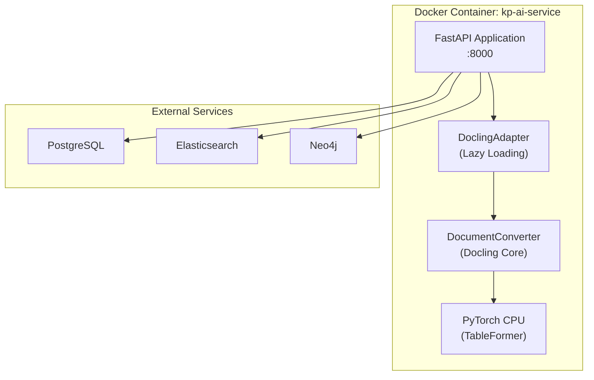

# Docling Docker 이미지 운영 매뉴얼

**STORY-063** | Sprint 04 | Version 1.0

---

## 문서 정보

| 항목 | 값 |
|------|-----|
| **문서** | Docling Docker 이미지 운영 매뉴얼 |
| **버전** | 1.0 |
| **작성일** | 2026-01-28 |
| **관련 스토리** | STORY-063 (Docling Docker 이미지 포함 및 테스트 활성화) |
| **설치 가이드** | [06_deployment/docling_docker_setup.md](../06_deployment/docling_docker_setup.md) |

---

## 목차

1. [개요](#1-개요)
2. [아키텍처](#2-아키텍처)
3. [일상 운영](#3-일상-운영)
4. [빌드 및 배포](#4-빌드-및-배포)
5. [모니터링](#5-모니터링)
6. [트러블슈팅](#6-트러블슈팅)
7. [성능 튜닝](#7-성능-튜닝)
8. [업데이트 절차](#8-업데이트-절차)
9. [백업 및 복구](#9-백업-및-복구)
10. [참고 자료](#10-참고-자료)

---

## 1. 개요

### 1.1 Docling이란?

Docling은 IBM Research에서 개발한 문서 파싱 라이브러리로, PDF/DOCX/PPTX 문서에서 테이블 포함 구조화된 데이터를 추출합니다.

| 기능 | 설명 |
|------|------|
| PDF 파싱 | 레이아웃 분석, 테이블 추출, OCR 지원 |
| DOCX 파싱 | 단락, 표, 이미지 추출 |
| PPTX 파싱 | 슬라이드별 텍스트 및 레이아웃 추출 |
| 테이블 추출 | 97.9% 정확도 (TableFormer 모델) |

### 1.2 Docker 이미지 구성

```
knowledge_service/Dockerfile (Multi-stage Build)
├── Stage 1: builder (python:3.11-slim)
│   ├── 시스템 빌드 의존성 (gcc, libgl1, libglib2.0-0, libpq-dev)
│   ├── Poetry → requirements.txt export
│   ├── PyTorch CPU-only (torch==2.5.1+cpu)
│   └── pip install (docling>=2.60.0 포함)
│
└── Stage 2: runtime (python:3.11-slim)
    ├── 런타임 시스템 의존성 (libgl1, libglib2.0-0, libpq5)
    ├── site-packages 복사 (builder에서)
    ├── 애플리케이션 소스코드
    ├── 비루트 사용자 (appuser:1001)
    └── Health check (:8000/health)
```

### 1.3 리소스 요구사항

| 리소스 | 최소 | 권장 | 비고 |
|--------|------|------|------|
| 메모리 | 4GB | 8GB | 대형 PDF 파싱 시 12GB |
| CPU | 2 cores | 4 cores | 테이블 추출 시 CPU 집중 |
| 디스크 (이미지) | 3GB | 3GB | PyTorch CPU-only 기준 |
| 디스크 (런타임) | 1GB | 5GB | 임시 파싱 데이터 |

---

## 2. 아키텍처

### 2.1 서비스 구조



### 2.2 Lazy Loading 전략

DoclingAdapter는 **지연 초기화** 패턴을 사용합니다:

```python
class DoclingAdapter:
    def __init__(self):
        self._converter = None  # 초기화 시 로드하지 않음

    @property
    def converter(self):
        if self._converter is None:
            # 첫 사용 시 ~10-30초 초기화
            self._converter = DocumentConverter()
        return self._converter
```

- **장점**: 컨테이너 시작 시간 단축 (Docling 초기화 지연)
- **단점**: 첫 번째 문서 파싱 시 cold start (~10-30초)

---

## 3. 일상 운영

### 3.1 컨테이너 상태 확인

```bash
# 서비스 상태 확인
docker compose ps kp-ai-service

# 헬스체크 확인
curl -s http://localhost:8000/health | python3 -m json.tool

# 로그 확인 (최근 100줄)
docker compose logs --tail=100 kp-ai-service

# 실시간 로그 모니터링
docker compose logs -f kp-ai-service
```

### 3.2 Docling 동작 확인

```bash
# Docling import 확인
docker compose exec kp-ai-service python -c \
    "import docling; print(f'Docling {docling.__version__}')"

# DocumentConverter 초기화 테스트
docker compose exec kp-ai-service python -c \
    "from docling.document_converter import DocumentConverter; \
     c = DocumentConverter(); print('OK')"

# DoclingAdapter 동작 확인
docker compose exec kp-ai-service python -c \
    "from app.etl.docling_adapter import DoclingAdapter; \
     a = DoclingAdapter(); print(f'Version: {a.version}')"
```

### 3.3 리소스 모니터링

```bash
# 컨테이너 리소스 사용량
docker stats kp-ai-service --no-stream

# 메모리 상세 확인
docker compose exec kp-ai-service cat /proc/meminfo | head -5

# 디스크 사용량 (임시 파일)
docker compose exec kp-ai-service du -sh /app/tmp /app/data
```

### 3.4 자동 검증 스크립트

```bash
# 전체 검증 (빌드 + 테스트)
./scripts/test_docling_docker.sh

# 검증만 (빌드 건너뛰기)
./scripts/test_docling_docker.sh --skip-build
```

검증 항목:
1. Docling import 성공
2. PyTorch CPU-only 확인 (CUDA 미포함)
3. DocumentConverter 초기화
4. 주요 Python 의존성 (13개 패키지)
5. 이미지 크기 확인
6. DoclingAdapter 애플리케이션 코드 동작

---

## 4. 빌드 및 배포

### 4.1 이미지 빌드

```bash
# Docker Compose로 빌드
cd infrastructure/docker
docker compose build ai-service

# 빌드 캐시 없이 재빌드
docker compose build --no-cache ai-service

# 빌드 로그 상세 출력
docker compose build --progress=plain ai-service
```

### 4.2 빌드 시간 예상

| 단계 | 예상 시간 | 캐시 적중 시 |
|------|-----------|-------------|
| 시스템 패키지 설치 | ~30초 | 건너뜀 |
| Poetry export | ~10초 | 건너뜀 |
| PyTorch CPU 설치 | ~2-5분 | 건너뜀 |
| pip install (나머지) | ~3-8분 | 건너뜀 |
| Docling 검증 | ~5초 | 건너뜀 |
| Runtime stage 구성 | ~30초 | ~10초 |
| **총 빌드 시간** | **~6-15분** | **~1분** |

### 4.3 배포 절차

```bash
# 1. 이미지 빌드
cd infrastructure/docker
docker compose build ai-service

# 2. 검증
./scripts/test_docling_docker.sh --skip-build

# 3. 서비스 업데이트 (무중단)
docker compose up -d ai-service

# 4. 헬스체크 대기
for i in $(seq 1 30); do
    if curl -sf http://localhost:8000/health > /dev/null 2>&1; then
        echo "Service healthy"
        break
    fi
    echo "Waiting... ($i/30)"
    sleep 5
done

# 5. 로그 확인
docker compose logs --tail=20 kp-ai-service
```

### 4.4 이미지 크기 비교

| 구성 | 이미지 크기 |
|------|------------|
| Stub (python:3.11-alpine, 헬스만) | ~60MB |
| Full (PyTorch GPU + Docling) | ~5GB |
| **Optimized (PyTorch CPU + Docling)** | **~3GB** |

---

## 5. 모니터링

### 5.1 핵심 메트릭

| 메트릭 | 경고 기준 | 위험 기준 | 확인 방법 |
|--------|-----------|-----------|-----------|
| 메모리 사용률 | > 70% (5.6GB/8GB) | > 90% (7.2GB/8GB) | `docker stats` |
| CPU 사용률 | > 80% (지속 5분) | > 95% (지속 1분) | `docker stats` |
| 헬스체크 | 1회 실패 | 3회 연속 실패 | Docker healthcheck |
| 응답 시간 | > 5초 (일반 API) | > 30초 | Prometheus/Grafana |
| 문서 파싱 시간 | > 60초/문서 | > 120초/문서 | 로그 분석 |

### 5.2 로그 패턴 모니터링

```bash
# 에러 로그 검색
docker compose logs kp-ai-service 2>&1 | grep -i "error\|exception\|critical"

# Docling 관련 로그
docker compose logs kp-ai-service 2>&1 | grep -i "docling\|document.*converter\|parse"

# OOM (Out of Memory) 확인
docker compose logs kp-ai-service 2>&1 | grep -i "killed\|oom\|memory"
```

### 5.3 Prometheus 메트릭 (계획)

```
# AI Service 커스텀 메트릭 (향후 구현)
ai_service_document_parse_duration_seconds{format="pdf"}
ai_service_document_parse_total{format="pdf",status="success"}
ai_service_docling_converter_init_duration_seconds
ai_service_memory_usage_bytes
```

---

## 6. 트러블슈팅

### 6.1 빌드 실패

#### Poetry export 실패

```
ERROR: poetry export failed
```

**원인**: `poetry.lock` 파일이 없거나 오래됨

**해결**:
```bash
cd knowledge_service
poetry lock
# 재빌드
cd ../infrastructure/docker
docker compose build ai-service
```

#### PyTorch CPU wheel 미발견

```
ERROR: No matching distribution found for torch==2.5.1+cpu
```

**원인**: Python 버전 호환성 또는 인덱스 URL 문제

**해결**:
1. Python 3.11과 호환되는 PyTorch 버전 확인
2. `--extra-index-url https://download.pytorch.org/whl/cpu` 확인
3. 네트워크 프록시 설정 확인

#### libGL 에러

```
ImportError: libGL.so.1: cannot open shared object file
```

**원인**: Runtime stage에 `libgl1` 미설치

**해결**: Dockerfile runtime stage에 아래 확인:
```dockerfile
RUN apt-get install -y --no-install-recommends libgl1 libglib2.0-0
```

### 6.2 런타임 문제

#### DocumentConverter 초기화 느림 (30초+)

**원인**: 정상 동작 (첫 사용 시 모델 로딩)

**대응**:
- Lazy loading으로 컨테이너 시작은 빠름
- 첫 번째 문서 파싱 요청 시 cold start 발생
- 워밍업 스크립트로 선제적 초기화 가능:

```bash
# 워밍업: 컨테이너 시작 후 DocumentConverter 선초기화
docker compose exec kp-ai-service python -c \
    "from docling.document_converter import DocumentConverter; \
     DocumentConverter(); print('Warmed up')"
```

#### OOM (Out of Memory) 발생

```
Killed (signal 9)
```

**원인**: 대형 PDF (100+ 페이지, 테이블 다수) 파싱 시 메모리 부족

**해결**:
```yaml
# docker-compose.yml
services:
  ai-service:
    deploy:
      resources:
        limits:
          memory: 12G    # 8G → 12G 증가
        reservations:
          memory: 6G     # 4G → 6G 증가
```

#### Docling import 실패

```
ModuleNotFoundError: No module named 'docling'
```

**원인**: 이미지 빌드 시 설치 실패 또는 캐시 문제

**해결**:
```bash
# 캐시 없이 재빌드
docker compose build --no-cache ai-service

# 검증
docker compose run --rm kp-ai-service python -c "import docling"
```

### 6.3 네트워크 문제

#### PyTorch 인덱스 접근 불가 (빌드 시)

```
ERROR: Could not find a version that satisfies the requirement
```

**원인**: `download.pytorch.org` 접근 차단 (방화벽/프록시)

**해결**:
```dockerfile
# 프록시 설정 추가
ENV HTTP_PROXY=http://proxy.corp.com:8080
ENV HTTPS_PROXY=http://proxy.corp.com:8080
```

---

## 7. 성능 튜닝

### 7.1 문서 파싱 최적화

| 설정 | 기본값 | 최적화 | 효과 |
|------|--------|--------|------|
| OCR 활성화 | True | False (스캔 문서 없을 때) | 파싱 속도 2-3배 향상 |
| 테이블 구조 분석 | True | True (유지) | 테이블 정확도 97.9% |
| 이미지 추출 | True | False (불필요 시) | 메모리 20-30% 절약 |
| 최대 페이지 수 | 무제한 | 200 (권장) | OOM 방지 |

```python
# DoclingAdapter 설정 예시
adapter = DoclingAdapter(
    ocr_enabled=False,           # OCR 비활성화 (디지털 문서 전용)
    table_structure_enabled=True, # 테이블 추출 유지
    max_pages=200,               # 최대 페이지 제한
)
```

### 7.2 Docker 리소스 튜닝

```yaml
# docker-compose.yml 최적화 예시
services:
  ai-service:
    deploy:
      resources:
        limits:
          cpus: '4'
          memory: 8G
        reservations:
          cpus: '2'
          memory: 4G
    environment:
      # Python 메모리 최적화
      PYTHONMALLOC: malloc
      PYTHONHASHSEED: 0
      # 워커 설정
      UVICORN_WORKERS: 2
```

### 7.3 캐싱 전략

```python
# 파싱 결과 캐싱 (Redis)
import hashlib

def get_cache_key(file_path: str) -> str:
    """파일 해시 기반 캐시 키 생성"""
    with open(file_path, 'rb') as f:
        file_hash = hashlib.sha256(f.read()).hexdigest()
    return f"docling:parse:{file_hash}"
```

---

## 8. 업데이트 절차

### 8.1 Docling 버전 업데이트

```bash
# 1. pyproject.toml에서 버전 변경
#    docling = "^2.60.0" → docling = "^2.70.0"

# 2. Poetry lock 갱신
cd knowledge_service
poetry lock

# 3. 이미지 재빌드
cd ../infrastructure/docker
docker compose build --no-cache ai-service

# 4. 검증
./scripts/test_docling_docker.sh --skip-build

# 5. 배포
docker compose up -d ai-service
```

### 8.2 PyTorch 버전 업데이트

```dockerfile
# Dockerfile에서 직접 수정
RUN pip install --no-cache-dir \
    --extra-index-url https://download.pytorch.org/whl/cpu \
    torch==2.6.0+cpu    # 버전 변경
```

**주의사항**:
- PyTorch 버전 변경 시 `transformers`, `sentence-transformers` 호환성 확인 필수
- CPU-only 빌드에서 `+cpu` 접미사 필수
- 변경 후 전체 검증 스크립트 실행

### 8.3 롤백 절차

```bash
# 이전 이미지로 롤백
docker compose down ai-service

# 이전 빌드 캐시에서 복원 (git checkout)
git checkout HEAD~1 -- knowledge_service/Dockerfile
docker compose build ai-service
docker compose up -d ai-service

# 검증
curl -s http://localhost:8000/health
```

---

## 9. 백업 및 복구

### 9.1 백업 대상

| 대상 | 위치 | 빈도 | 방법 |
|------|------|------|------|
| Dockerfile | `knowledge_service/Dockerfile` | Git 관리 | git commit |
| .dockerignore | `knowledge_service/.dockerignore` | Git 관리 | git commit |
| Docker 이미지 | Docker Engine | 배포 시 | `docker save` |
| 파싱 결과 | PostgreSQL | 일일 | pg_dump |

### 9.2 이미지 백업

```bash
# 이미지 저장
docker save kp-ai-service:latest | gzip > backup/ai-service-$(date +%Y%m%d).tar.gz

# 이미지 복원
docker load < backup/ai-service-20260128.tar.gz
```

---

## 10. 참고 자료

| 자료 | 위치 |
|------|------|
| 설치 가이드 | [06_deployment/docling_docker_setup.md](../06_deployment/docling_docker_setup.md) |
| Dockerfile | `knowledge_service/Dockerfile` |
| .dockerignore | `knowledge_service/.dockerignore` |
| 검증 스크립트 | `scripts/test_docling_docker.sh` |
| Docker Compose | `infrastructure/docker/docker-compose.yml` |
| DoclingAdapter | `knowledge_service/src/app/etl/docling_adapter.py` |
| Docker 트러블슈팅 | [07_maintenance/docker_troubleshooting.md](./docker_troubleshooting.md) |
| STORY-063 | `backlog/stories/STORY-063-docling-docker-setup.md` |
| Docling GitHub | https://github.com/DS4SD/docling |
| PyTorch CPU 설치 | https://pytorch.org/get-started/locally/ |

---

## 변경 이력

| 버전 | 날짜 | 작성자 | 설명 |
|------|------|--------|------|
| 1.0 | 2026-01-28 | Infra + PM | 초기 작성 (STORY-063) |
