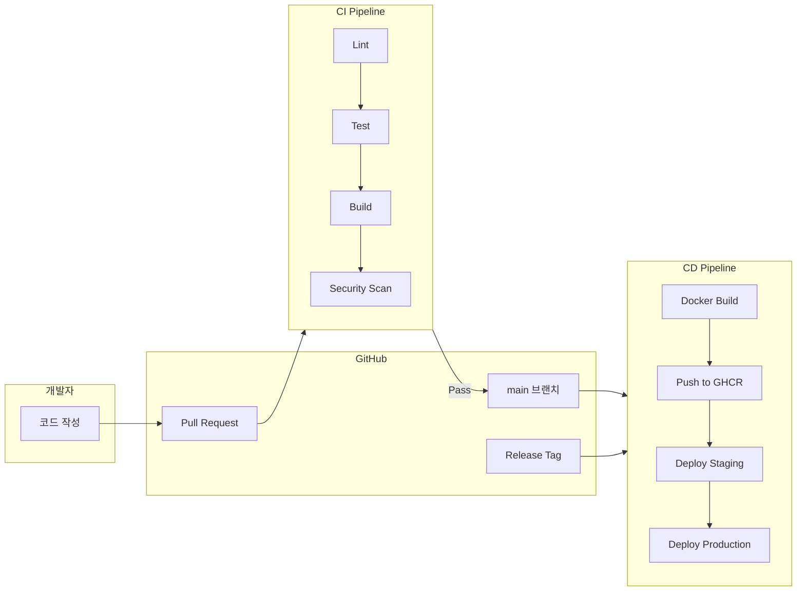
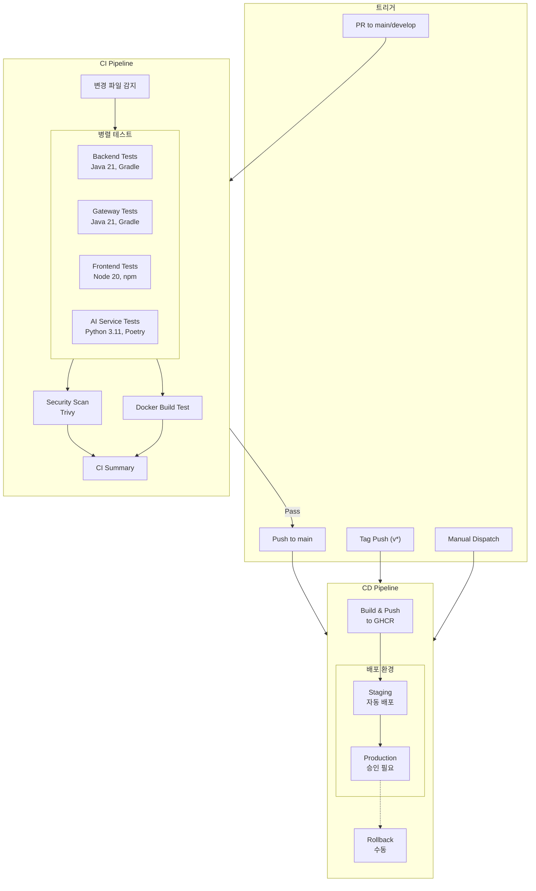
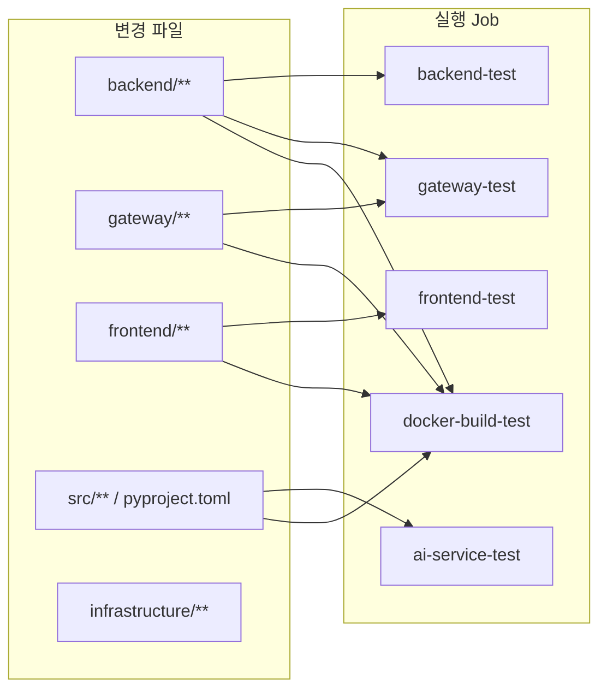
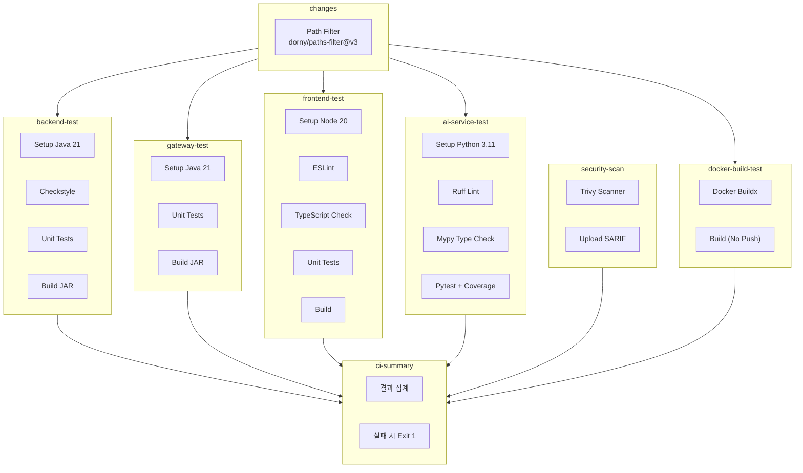
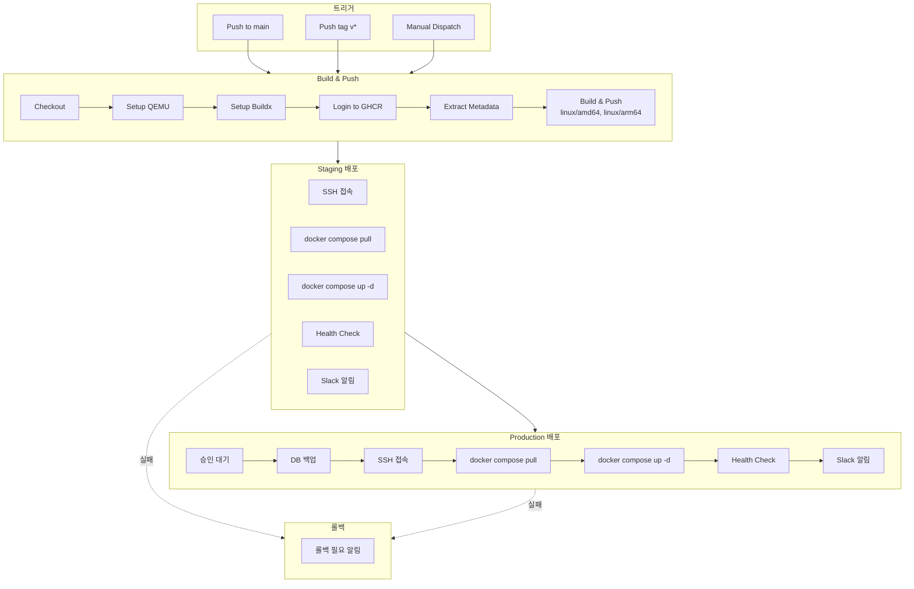
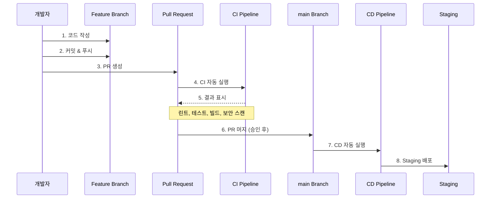
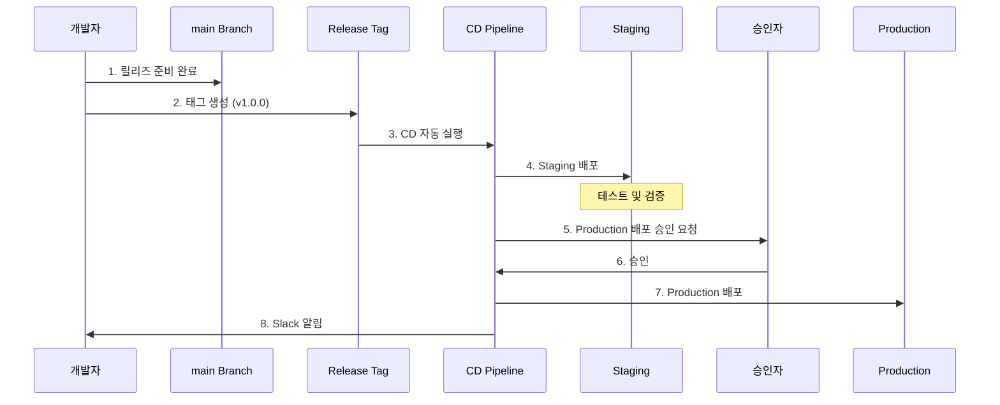
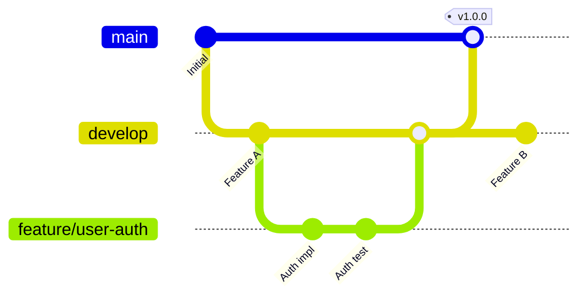

# GitHub Actions CI/CD 가이드

**프로젝트**: Hybrid RAG Knowledge Operations Platform
**버전**: 1.1
**작성일**: 2026-01-22
**최종 수정일**: 2026-01-25
**작성자**: DevOps Agent

---

## 목차

1. [개요](#1-개요)
2. [아키텍처](#2-아키텍처)
3. [워크플로우 구성](#3-워크플로우-구성)
4. [CI Pipeline (ci.yml)](#4-ci-pipeline-ciyml)
5. [CD Pipeline (cd.yml)](#5-cd-pipeline-cdyml)
6. [PR Build (pr-build.yml)](#6-pr-build-pr-buildyml)
7. [Docker Build (docker-build.yml)](#7-docker-build-docker-buildyml)
8. [Code Quality (code-quality.yml)](#8-code-quality-code-qualityyml)
9. [Branch Protection Rules](#9-branch-protection-rules)
10. [환경 변수 및 Secrets](#10-환경-변수-및-secrets)
11. [사용 가이드](#11-사용-가이드)
12. [트러블슈팅](#12-트러블슈팅)
13. [베스트 프랙티스](#13-베스트-프랙티스)

---

## 1. 개요

### 1.1 CI/CD 파이프라인 목적

| 파이프라인 | 목적 | 파일 |
|------------|------|------|
| **CI Pipeline** | PR 검증, 코드 품질 보장 | `.github/workflows/ci.yml` |
| **CD Pipeline** | Docker 이미지 빌드 및 배포 | `.github/workflows/cd.yml` |
| **PR Build** | PR 시 빌드 및 테스트 검증 | `.github/workflows/pr-build.yml` |
| **Docker Build** | Docker 이미지 빌드 (멀티 아키텍처) | `.github/workflows/docker-build.yml` |
| **Code Quality** | 린트, 포맷, 정적 분석 | `.github/workflows/code-quality.yml` |

### 1.2 지원 서비스

| 서비스 | 기술 스택 | 디렉토리 |
|--------|----------|----------|
| **Backend** | Spring Boot 3.x, Java 21 | `knowledge_service/backend/` |
| **Gateway** | Spring Cloud Gateway | `knowledge_service/gateway/` |
| **Frontend** | React 18, TypeScript | `knowledge_service/frontend/` |
| **AI Service** | FastAPI, Python 3.11 | `knowledge_service/src/` |

### 1.3 전체 흐름



---

## 2. 아키텍처

### 2.1 CI/CD 전체 아키텍처



### 2.2 변경 감지 기반 선택적 실행

CI 파이프라인은 **변경된 파일에 따라 필요한 Job만 실행**합니다:



---

## 3. 워크플로우 구성

### 3.1 워크플로우 파일 목록

```
.github/workflows/
  - ci.yml           # 통합 CI 파이프라인 (기존)
  - cd.yml           # 배포 파이프라인 (기존)
  - pr-build.yml     # PR 빌드 전용 (NEW)
  - docker-build.yml # Docker 빌드 전용 (NEW)
  - code-quality.yml # 코드 품질 전용 (NEW)
```

### 3.2 워크플로우별 역할

| 워크플로우 | 트리거 | 주요 역할 |
|------------|--------|----------|
| `ci.yml` | PR, push to develop | 종합 CI (린트, 테스트, 보안 스캔) |
| `cd.yml` | push to main, tags | 배포 (Staging, Production) |
| `pr-build.yml` | PR only | PR 빌드 및 테스트 검증 |
| `docker-build.yml` | push, PR, manual | Docker 이미지 빌드 |
| `code-quality.yml` | PR, push to develop | 코드 품질 체크만 |

---

## 4. CI Pipeline (ci.yml)

### 4.1 트리거 조건

| 이벤트 | 브랜치 | 조건 |
|--------|--------|------|
| `pull_request` | main, develop | opened, synchronize, reopened |
| `push` | develop | - |

### 4.2 Job 구성



### 4.3 각 서비스별 테스트 상세

#### Backend (Spring Boot)

| 단계 | 명령어 | 설명 |
|------|--------|------|
| Lint | `./gradlew checkstyleMain checkstyleTest` | Checkstyle 검사 |
| Test | `./gradlew test` | JUnit 5 테스트 |
| Build | `./gradlew build -x test` | JAR 빌드 |
| Report | JaCoCo | 커버리지 리포트 |

#### Frontend (React)

| 단계 | 명령어 | 설명 |
|------|--------|------|
| Install | `npm ci` | 의존성 설치 |
| Lint | `npm run lint` | ESLint 검사 |
| Type Check | `npm run type-check` | TypeScript 검사 |
| Test | `npm test -- --coverage` | Jest 테스트 |
| Build | `npm run build` | 프로덕션 빌드 |

#### AI Service (FastAPI)

| 단계 | 명령어 | 설명 |
|------|--------|------|
| Lint | `poetry run ruff check` | Ruff 린트 |
| Format | `poetry run ruff format --check` | 포맷 검사 |
| Type | `poetry run mypy src/` | 타입 검사 |
| Test | `poetry run pytest --cov` | pytest + 커버리지 |

### 4.4 보안 스캔

**Trivy** 취약점 스캐너를 사용하여 의존성 취약점을 검사합니다:

```yaml
- name: Run Trivy vulnerability scanner
  uses: aquasecurity/trivy-action@master
  with:
    scan-type: 'fs'
    severity: 'CRITICAL,HIGH'
    format: 'sarif'
```

결과는 GitHub Security 탭에서 확인할 수 있습니다.

---

## 5. CD Pipeline (cd.yml)

### 5.1 트리거 조건

| 이벤트 | 조건 | 결과 |
|--------|------|------|
| `push` to main | - | Staging 자동 배포 |
| `push` tag `v*` | - | Staging + Production 배포 |
| `workflow_dispatch` | environment 선택 | 수동 배포 |

### 5.2 배포 흐름



### 5.3 Docker 이미지 태깅

Docker Metadata Action을 사용한 자동 태깅:

| 태그 패턴 | 예시 | 조건 |
|-----------|------|------|
| `branch` | `main` | 브랜치 푸시 시 |
| `pr-{number}` | `pr-123` | PR 생성 시 |
| `{version}` | `v1.0.0` | 태그 푸시 시 |
| `{major}.{minor}` | `1.0` | 태그 푸시 시 |
| `sha-{7chars}` | `sha-abc1234` | 항상 |
| `latest` | `latest` | main 브랜치 시 |

### 5.4 배포 환경

| 환경 | 트리거 | 승인 | URL (예시) |
|------|--------|------|------------|
| **Staging** | main 푸시 | 자동 | https://staging.knowledge.example.com |
| **Production** | 태그 또는 수동 | 수동 승인 필요 | https://knowledge.example.com |

### 5.5 롤백 전략

Production 배포 전 자동 백업:

```bash
# 배포 전 DB 백업
docker compose exec -T postgresql pg_dumpall -U knowledge > /backup/pre-deploy-$(date +%Y%m%d_%H%M%S).sql
```

---

## 6. PR Build (pr-build.yml)

### 6.1 개요

PR 빌드 전용 워크플로우로, PR 생성/업데이트 시 빌드 및 테스트를 검증합니다.

### 6.2 트리거

```yaml
on:
  pull_request:
    branches: [main, develop]
    types: [opened, synchronize, reopened]
```

### 6.3 Job 구성

| Job | 조건 | 작업 내용 |
|-----|------|----------|
| `changes` | 항상 | 변경 파일 감지 |
| `python-build` | Python 파일 변경 시 | Poetry 빌드, pytest 실행 |
| `java-build` | Java 파일 변경 시 | Gradle 빌드, 테스트 실행 |
| `typescript-build` | TypeScript 파일 변경 시 | npm 빌드, Vitest 실행 |
| `pr-summary` | 항상 | 결과 요약 |

### 6.4 출력

- `python-test-results` - Python 테스트 결과 및 커버리지
- `gateway-test-results` - Gateway 테스트 결과
- `backend-test-results` - Backend 테스트 결과
- `frontend-build` - Frontend 빌드 산출물
- `frontend-coverage` - Frontend 테스트 커버리지

---

## 7. Docker Build (docker-build.yml)

### 7.1 개요

Docker 이미지 빌드 전용 워크플로우로, 멀티 아키텍처 빌드를 지원합니다.

### 7.2 트리거

```yaml
on:
  push:
    branches: [main, develop]
    tags: ['v*']
    paths:
      - 'knowledge_service/**'
      - 'infrastructure/docker/**'
  pull_request:
    branches: [main]
    paths:
      - 'knowledge_service/**'
      - 'infrastructure/docker/**'
  workflow_dispatch:
    inputs:
      push_images:
        description: 'Push images to registry'
        type: boolean
      platform:
        description: 'Build platform'
        type: choice
        options:
          - linux/amd64
          - linux/arm64
          - linux/amd64,linux/arm64
```

### 7.3 빌드 대상

| 이미지 | Dockerfile 위치 | 컨텍스트 |
|--------|----------------|----------|
| `ai-service` | `knowledge_service/Dockerfile` 또는 `infrastructure/docker/ai-service/Dockerfile` | `knowledge_service/` |
| `gateway` | `knowledge_service/gateway/Dockerfile` | `knowledge_service/gateway/` |
| `frontend` | `knowledge_service/frontend/Dockerfile` | `knowledge_service/frontend/` |
| `backend` | `knowledge_service/backend/Dockerfile` | `knowledge_service/backend/` |

### 7.4 이미지 푸시 조건

| 조건 | 푸시 여부 |
|------|----------|
| PR | No (빌드만) |
| push to main | Yes |
| push tag v* | Yes |
| manual with push_images=true | Yes |

---

## 8. Code Quality (code-quality.yml)

### 8.1 개요

코드 품질 체크 전용 워크플로우로, 린트, 포맷, 정적 분석을 수행합니다.

### 8.2 트리거

```yaml
on:
  pull_request:
    branches: [main, develop]
  push:
    branches: [develop]
```

### 8.3 Python 품질 체크

| 도구 | 목적 | 명령어 |
|------|------|--------|
| **Black** | 코드 포맷팅 | `poetry run black --check src/` |
| **isort** | import 정렬 | `poetry run isort --check-only src/` |
| **Ruff** | 린트 (flake8 대체) | `poetry run ruff check src/` |
| **flake8** | 린트 (백업) | `poetry run flake8 src/` |
| **mypy** | 타입 체크 | `poetry run mypy src/` |

### 8.4 Java 품질 체크

| 도구 | 목적 | 명령어 |
|------|------|--------|
| **Checkstyle** | 코드 스타일 | `./gradlew checkstyleMain checkstyleTest` |
| **SpotBugs** | 버그 탐지 | `./gradlew spotbugsMain` |
| **Compile Check** | 컴파일 검증 | `./gradlew compileJava` |

### 8.5 TypeScript 품질 체크

| 도구 | 목적 | 명령어 |
|------|------|--------|
| **ESLint** | 린트 | `npm run lint` |
| **Prettier** | 포맷팅 | `npm run format:check` |
| **TypeScript** | 타입 체크 | `npx tsc --noEmit` |

### 8.6 빠른 수정 명령어

#### Python
```bash
cd knowledge_service
poetry run black src/
poetry run isort src/
poetry run ruff check src/ --fix
```

#### TypeScript
```bash
cd knowledge_service/frontend
npm run lint:fix
npm run format
```

---

## 9. Branch Protection Rules

### 9.1 개요

Branch Protection Rules를 설정하면 빌드 실패 시 PR 머지를 차단할 수 있습니다.

### 9.2 설정 방법

1. **Repository Settings** 이동
2. **Branches** 메뉴 선택
3. **Add branch protection rule** 클릭
4. 다음과 같이 설정:

#### main 브랜치 보호 규칙

| 설정 | 값 | 설명 |
|------|-----|------|
| **Branch name pattern** | `main` | 보호할 브랜치 |
| **Require a pull request before merging** | Yes | 직접 푸시 방지 |
| **Require approvals** | 1 | 최소 1명 승인 필요 |
| **Dismiss stale pull request approvals** | Yes | 새 커밋 시 승인 무효화 |
| **Require status checks to pass** | Yes | CI 통과 필수 |
| **Require branches to be up to date** | Yes | 최신 상태 필수 |
| **Status checks that are required** | (아래 참조) | 필수 체크 목록 |

#### 필수 Status Checks

다음 체크를 필수로 설정합니다:

```
- CI Summary (ci.yml의 ci-summary job)
- PR Build Summary (pr-build.yml의 pr-summary job)
- Quality Summary (code-quality.yml의 quality-summary job)
```

또는 개별 Job을 지정:

```
- Backend Tests
- Gateway Tests
- Frontend Tests
- AI Service Tests
- Docker Build Test
- Python Quality
- Java Quality
- TypeScript Quality
```

### 9.3 develop 브랜치 보호 규칙

| 설정 | 값 | 설명 |
|------|-----|------|
| **Branch name pattern** | `develop` | 보호할 브랜치 |
| **Require a pull request before merging** | Yes | 직접 푸시 방지 |
| **Require status checks to pass** | Yes | CI 통과 필수 |
| **Status checks that are required** | CI Summary | 필수 체크 |

### 9.4 설정 스크린샷 가이드

```
Settings > Branches > Add rule

[x] Require a pull request before merging
    [x] Require approvals: 1
    [x] Dismiss stale pull request approvals when new commits are pushed

[x] Require status checks to pass before merging
    [x] Require branches to be up to date before merging

    Search for status checks:
    - [x] CI Summary
    - [x] PR Build Summary
    - [x] Quality Summary

[x] Do not allow bypassing the above settings
```

### 9.5 확인 방법

PR 페이지에서 다음과 같이 표시됩니다:

| 상태 | 표시 | 머지 가능 |
|------|------|----------|
| 모든 체크 통과 | All checks have passed | Yes |
| 일부 체크 실패 | Some checks were not successful | No |
| 체크 진행 중 | Some checks haven't completed yet | No |
| 승인 필요 | Review required | No |

### 9.6 Ruleset (대안)

GitHub의 새로운 Ruleset 기능을 사용할 수도 있습니다:

1. **Settings > Rules > Rulesets** 이동
2. **New ruleset** 클릭
3. 더 세밀한 규칙 설정 가능

---

## 10. 환경 변수 및 Secrets

### 10.1 필수 Secrets

GitHub Repository Settings → Secrets and variables → Actions에서 설정:

| Secret | 용도 | 필수 |
|--------|------|------|
| `STAGING_HOST` | Staging 서버 호스트 | Staging 배포 시 |
| `STAGING_USER` | Staging SSH 사용자 | Staging 배포 시 |
| `STAGING_SSH_KEY` | Staging SSH 개인키 | Staging 배포 시 |
| `PRODUCTION_HOST` | Production 서버 호스트 | Production 배포 시 |
| `PRODUCTION_USER` | Production SSH 사용자 | Production 배포 시 |
| `PRODUCTION_SSH_KEY` | Production SSH 개인키 | Production 배포 시 |
| `SLACK_BOT_TOKEN` | Slack 알림용 토큰 | 선택 |
| `SLACK_CHANNEL_ALERTS` | Slack 알림 채널 ID | 선택 |

### 10.2 자동 제공 Secrets

| Secret | 설명 |
|--------|------|
| `GITHUB_TOKEN` | GitHub API 접근용 (자동 생성) |

### 10.3 환경 변수

| 변수 | 값 | 용도 |
|------|-----|------|
| `PYTHON_VERSION` | 3.11 | Python 버전 |
| `JAVA_VERSION` | 21 | Java 버전 |
| `NODE_VERSION` | 20 | Node.js 버전 |
| `REGISTRY` | ghcr.io | 컨테이너 레지스트리 |

### 10.4 GitHub Environments 설정

**Repository Settings → Environments**에서 환경별 보호 규칙 설정:

#### Staging Environment
- 보호 규칙: 없음 (자동 배포)

#### Production Environment
- **Required reviewers**: 1명 이상 승인 필요
- **Wait timer**: 선택적 대기 시간
- **Deployment branches**: `main` 및 `v*` 태그만 허용

---

## 11. 사용 가이드

### 11.1 일반 개발 워크플로우



### 11.2 릴리즈 워크플로우



### 11.3 태그 생성 방법

```bash
# 버전 태그 생성
git tag v1.0.0
git push origin v1.0.0

# 또는 GitHub Releases에서 생성
# 1. Releases 탭 이동
# 2. "Draft a new release" 클릭
# 3. 태그 및 릴리즈 노트 작성
# 4. "Publish release" 클릭
```

### 11.4 수동 배포

1. **GitHub Actions 탭** 이동
2. 좌측에서 **CD Pipeline** 선택
3. **Run workflow** 버튼 클릭
4. 환경 선택 후 실행

### 11.5 CI 상태 확인

PR 페이지에서 CI 상태 확인:

| 상태 | 의미 | 조치 |
|------|------|------|
| All checks passed | 모든 검증 통과 | 머지 가능 |
| Some checks failed | 일부 검증 실패 | 실패 원인 확인 후 수정 |
| Some checks pending | 검증 진행 중 | 완료 대기 |
| Skipped | 해당 없음 | 변경된 파일 없음 |

---

## 12. 트러블슈팅

### 12.1 CI 실패 원인별 해결

#### Backend Test 실패

```bash
# 로컬에서 테스트 실행
cd knowledge_service/backend
./gradlew test

# Checkstyle 확인
./gradlew checkstyleMain
```

#### Frontend Test 실패

```bash
# 로컬에서 테스트 실행
cd knowledge_service/frontend
npm ci
npm run lint
npm run type-check
npm test
```

#### AI Service Test 실패

```bash
# 로컬에서 테스트 실행
cd knowledge_service
poetry install
poetry run ruff check src/
poetry run pytest src/tests/ -v
```

#### Docker Build 실패

```bash
# 로컬에서 빌드 테스트
docker build -t test-image ./knowledge_service/backend
```

### 12.2 CD 실패 원인별 해결

#### SSH 연결 실패

1. Secrets 설정 확인 (`STAGING_HOST`, `STAGING_USER`, `STAGING_SSH_KEY`)
2. 서버 방화벽 설정 확인
3. SSH 키 권한 확인

#### 이미지 푸시 실패

1. `GITHUB_TOKEN` 권한 확인 (packages:write)
2. Repository Settings → Actions → General → Workflow permissions 확인

#### 배포 후 Health Check 실패

1. 서버 로그 확인: `docker compose logs -f`
2. 컨테이너 상태 확인: `docker compose ps`
3. 네트워크 설정 확인

### 12.3 일반적인 문제

| 문제 | 원인 | 해결 |
|------|------|------|
| "Resource not accessible" | 권한 부족 | Workflow permissions 확인 |
| "Context deadline exceeded" | 타임아웃 | 작업 분할 또는 타임아웃 증가 |
| "Cache not found" | 캐시 키 불일치 | 캐시 키 패턴 확인 |
| "No space left on device" | 디스크 공간 부족 | 이미지 정리 (`docker image prune`) |

---

## 13. 베스트 프랙티스

### 13.1 브랜치 전략



### 13.2 커밋 메시지 규칙

```
[TYPE] 간단한 설명

- 상세 변경사항 1
- 상세 변경사항 2

관련 이슈: #123
```

### 13.3 PR 체크리스트

- [ ] 로컬에서 테스트 통과 확인
- [ ] 린트 오류 없음
- [ ] 타입 체크 통과
- [ ] 문서 업데이트 (필요 시)
- [ ] 적절한 리뷰어 지정

### 13.4 CI/CD 최적화 팁

1. **캐시 활용**: 의존성 캐시로 빌드 시간 단축
2. **병렬 실행**: 독립적인 Job은 병렬로 실행
3. **선택적 실행**: 변경된 파일에 따라 필요한 Job만 실행
4. **concurrency 설정**: 동일 브랜치 중복 실행 방지

```yaml
concurrency:
  group: ci-${{ github.ref }}
  cancel-in-progress: true
```

### 13.5 보안 권장사항

1. **Secrets 관리**: 민감 정보는 반드시 GitHub Secrets 사용
2. **최소 권한**: 필요한 최소 권한만 부여
3. **환경 보호**: Production 환경에 승인 필수 설정
4. **의존성 스캔**: Trivy, Dependabot 활용
5. **코드 스캔**: CodeQL 또는 추가 보안 스캐너 고려

---

## 참고 자료

### 프로젝트 내 문서

- [DevOps 상세 설계서](../02_design/devops_detailed_design.md)
- [Infrastructure 상세 설계서](../02_design/infrastructure_detailed_design.md)
- [Docker Troubleshooting](./docker_troubleshooting.md)

### 외부 문서

- [GitHub Actions Documentation](https://docs.github.com/en/actions)
- [GitHub Packages (GHCR)](https://docs.github.com/en/packages)
- [Docker Build Push Action](https://github.com/docker/build-push-action)
- [Trivy Scanner](https://github.com/aquasecurity/trivy-action)
- [Branch Protection Rules](https://docs.github.com/en/repositories/configuring-branches-and-merges-in-your-repository/managing-protected-branches/managing-a-branch-protection-rule)

---

## 변경 이력

| 버전 | 날짜 | 변경 내용 |
|------|------|----------|
| 1.0 | 2026-01-22 | 초기 작성 |
| 1.1 | 2026-01-25 | pr-build.yml, docker-build.yml, code-quality.yml 추가, Branch Protection Rules 섹션 추가 |

---

**작성자**: DevOps Agent
**검토자**: TechLead Agent
