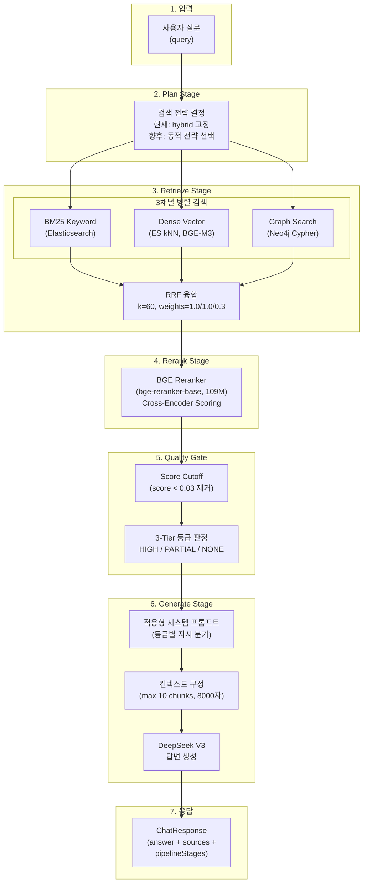
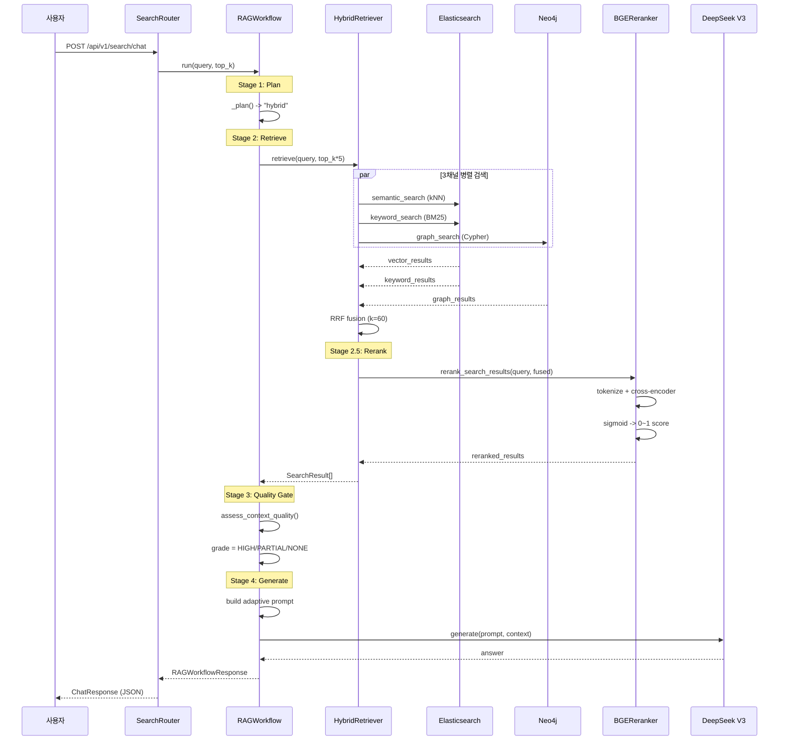
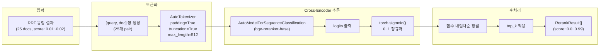
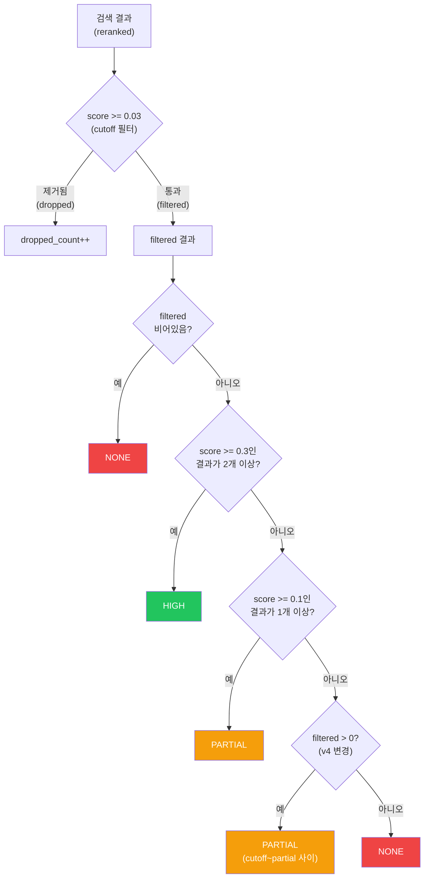
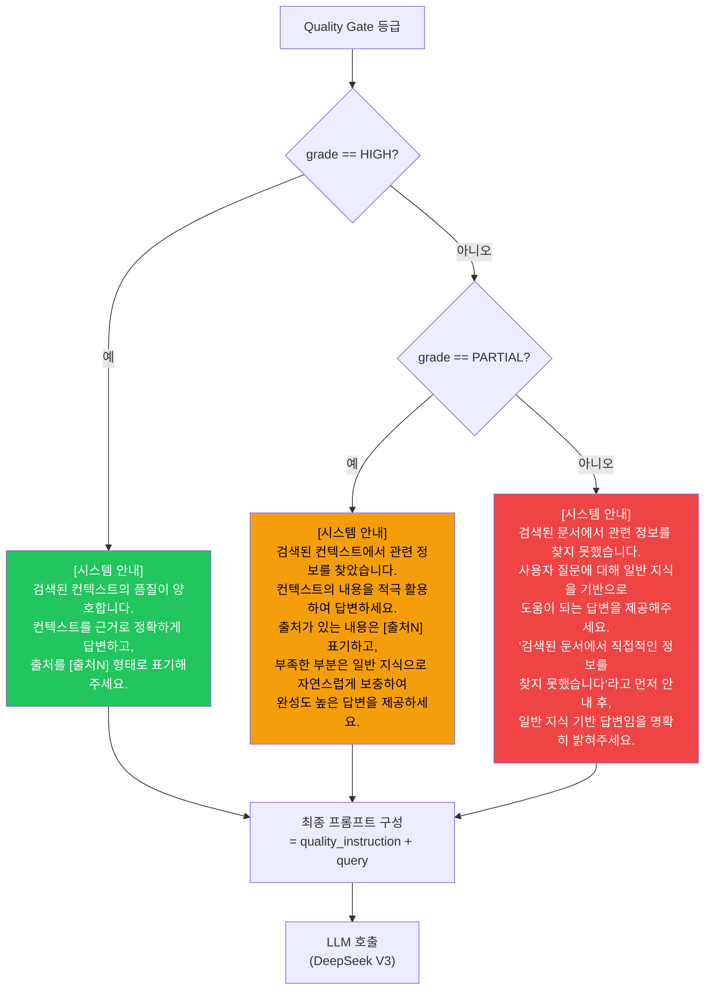
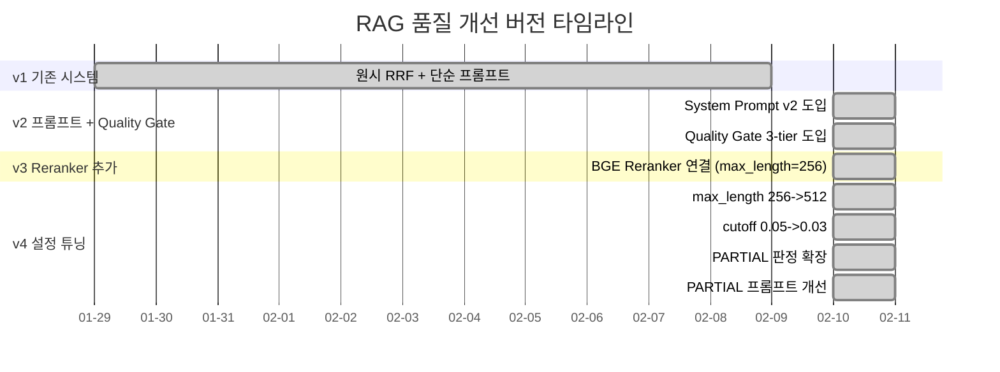
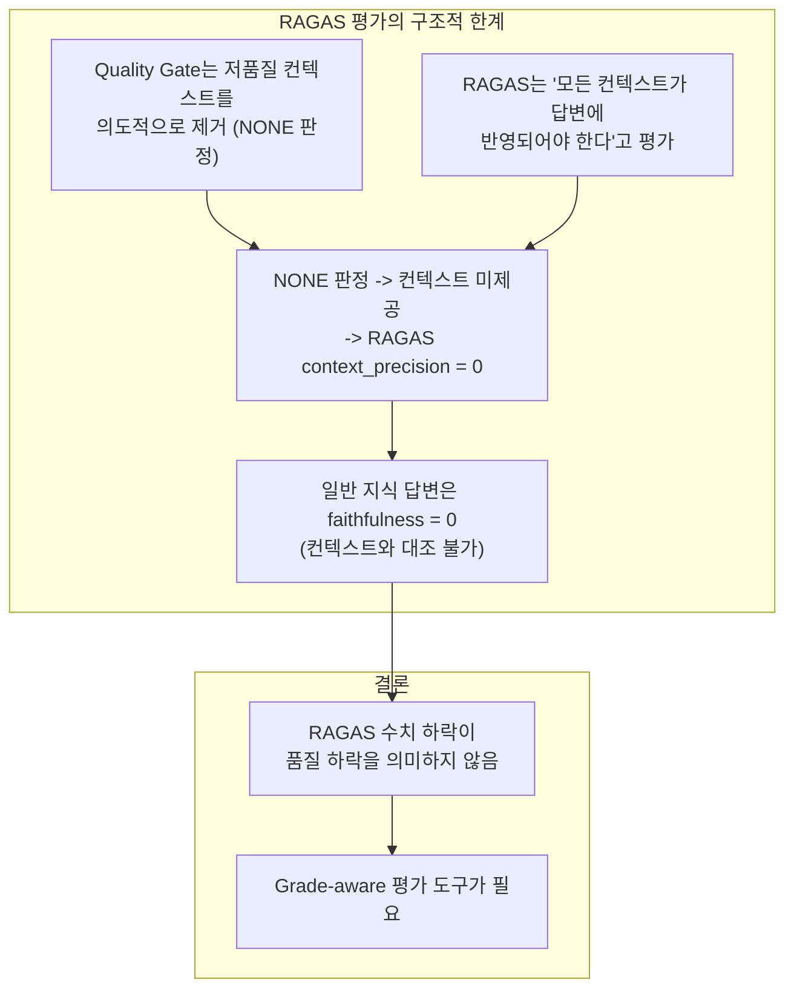
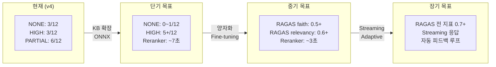

# RAG 검색 품질 개선 매뉴얼 (상세설계서)

**Version**: 2.0
**작성일**: 2026-02-10
**최종 수정**: 2026-02-10
**작성자**: Documenter Agent (Claude Opus 4.6)
**대상 시스템**: HRKP (Hybrid RAG Knowledge Platform)
**문서 수준**: 상세설계서 (Detailed Design Specification)

---

## 목차

1. [전체 RAG 파이프라인 아키텍처](#1-전체-rag-파이프라인-아키텍처)
2. [BGE Reranker 상세](#2-bge-reranker-상세)
3. [Quality Gate 상세](#3-quality-gate-상세)
4. [System Prompt v2 (적응형 3단계)](#4-system-prompt-v2-적응형-3단계)
5. [버전별 개선 이력 (v1 ~ v4)](#5-버전별-개선-이력-v1--v4)
6. [RAGAS 크로스시스템 평가 결과](#6-ragas-크로스시스템-평가-결과)
7. [설정 튜닝 가이드](#7-설정-튜닝-가이드)
8. [API 응답 구조](#8-api-응답-구조)
9. [향후 개선 로드맵](#9-향후-개선-로드맵)
10. [관련 파일 맵](#10-관련-파일-맵)

---

## 1. 전체 RAG 파이프라인 아키텍처

> **핵심 요약**: 사용자 쿼리가 3채널 Hybrid 검색 -> RRF 융합 -> BGE Reranker -> Quality Gate -> 적응형 프롬프트 -> LLM 순으로 처리되며, 각 단계에서 검색 결과의 품질을 점진적으로 정제합니다.

### 1.1 파이프라인 전체 흐름도



### 1.2 단계별 데이터 흐름

| 단계 | 입력 | 처리 | 출력 | 코드 위치 |
|------|------|------|------|----------|
| **Plan** | query (str) | 검색 전략 결정 | strategy ("hybrid") | `rag_workflow.py` `_plan()` |
| **Retrieve** | query, top_k, filters | 3채널 병렬 검색 + RRF | `List[SearchResult]` (fused) | `retriever.py` `HybridRetriever.retrieve()` |
| **Rerank** | query, fused results | Cross-encoder scoring | `List[SearchResult]` (reranked) | `bge_reranker.py` `rerank_search_results()` |
| **Quality Gate** | reranked results | Score cutoff + Grade | grade, filtered_results | `rag_workflow.py` `assess_context_quality()` |
| **Generate** | query, filtered results, grade | 적응형 프롬프트 + LLM | answer (str) | `rag_workflow.py` `_generate()` |

### 1.3 시퀀스 다이어그램



---

## 2. BGE Reranker 상세

> **핵심 요약**: BAAI/bge-reranker-base (109M params) 모델 기반 Cross-Encoder 리랭커. RRF 융합 결과(max 0.016)를 의미적 관련성 점수(max 0.99)로 재순위화하여, Quality Gate 통과율을 극적으로 향상시킵니다.

### 2.1 모델 스펙

| 항목 | 값 | 비고 |
|------|-----|------|
| **모델** | `BAAI/bge-reranker-base` | HuggingFace 호스팅 |
| **파라미터** | 109M | bge-reranker-v2-m3 (568M) 대비 80% 경량 |
| **아키텍처** | Cross-Encoder (Sequence Classification) | Bi-Encoder와 달리 쿼리-문서 쌍을 동시 인코딩 |
| **max_length** | 512 tokens | v3에서 256, **v4에서 512로 변경** |
| **batch_size** | 32 | 기본값 |
| **출력 범위** | 0.0 ~ 1.0 | Sigmoid 정규화 |
| **한국어 지원** | O | 다국어 모델 |
| **디바이스** | CPU / CUDA 자동감지 | 현재 CPU 운영 |
| **CPU 성능** | ~15초/쿼리 (25 docs) | ~9초/쿼리 (5 docs) |
| **모델 캐시** | `/home/claude/.cache/huggingface` | Docker 볼륨 마운트 |

### 2.2 max_length 변경 이력과 효과

| 버전 | max_length | Q3 max_score | Q12 max_score | 비고 |
|------|:----------:|:-----------:|:------------:|------|
| **v3** | 256 | 0.0388 (NONE) | 0.0311 (NONE) | 긴 문서 잘림, 의미 손실 |
| **v4** | **512** | **0.5378** (PARTIAL) | **0.0311** (PARTIAL) | Q3: 0.04->0.54 (13배 향상) |

> **변경 근거**: max_length=256에서는 쿼리+문서 합계가 256 토큰을 초과하는 경우 문서 후반부가 잘려서 핵심 내용을 놓치는 문제가 발생했습니다. 512로 확장하여 긴 한국어 문서의 의미적 매칭 정확도가 대폭 향상되었습니다.

### 2.3 Reranker 처리 흐름



### 2.4 싱글톤 패턴

```python
# src/app/rag/bge_reranker.py

# 전역 싱글톤
_reranker: Optional[BGEReranker] = None

def get_reranker(
    model_name: str = "BAAI/bge-reranker-base",
    device: Optional[str] = None,
    batch_size: int = 32,
    max_length: int = 512,
) -> BGEReranker:
    """BGEReranker 싱글톤 인스턴스 반환"""
    global _reranker
    if _reranker is None:
        _reranker = BGEReranker(
            model_name=model_name,
            device=device,
            batch_size=batch_size,
            max_length=max_length,
        )
    return _reranker

def reset_reranker() -> None:
    """싱글톤 인스턴스 초기화 (테스트용)"""
    global _reranker
    _reranker = None
```

### 2.5 비동기 실행 모델

| 메서드 | 용도 | 특징 |
|--------|------|------|
| `rerank()` | 기본 리랭킹 | `asyncio.to_thread()` 래핑, non-blocking |
| `arerank_with_timeout()` | 타임아웃 보호 | timeout=15초, 초과 시 원본 순서 fallback |
| `rerank_search_results()` | SearchResult 직접 리랭킹 | Pydantic 모델 호환, score/metadata 업데이트 |

### 2.6 모델 비교 (채택 근거)

| 모델 | 파라미터 | CPU 5문서 | CPU 25문서 | 한국어 | 채택 |
|------|:-------:|:---------:|:----------:|:-----:|:----:|
| `bge-reranker-v2-m3` | 568M | ~64초 | ~300초+ | O | X (너무 느림) |
| **`bge-reranker-base`** | **109M** | **~9초** | **~15초** | **O** | **O** |
| `ms-marco-MiniLM-L-6-v2` | 22M | ~1초 | ~3초 | X | X (영어만) |

---

## 3. Quality Gate 상세

> **핵심 요약**: 검색 결과를 3-tier 등급(HIGH/PARTIAL/NONE)으로 분류하여, 등급에 따라 LLM에 전달할 컨텍스트와 지시사항을 적응적으로 변경합니다. v4에서 cutoff~partial 사이 결과도 PARTIAL로 판정하도록 개선하여 NONE 비율을 50% 감소시켰습니다.

### 3.1 설정값 (config.py)

| 환경변수 | 설정 키 | 기본값 | v3 값 | v4 값 | 설명 |
|---------|--------|:------:|:-----:|:-----:|------|
| `CONTEXT_QUALITY_HIGH_THRESHOLD` | `context_quality_high_threshold` | 0.3 | 0.3 | **0.3** | HIGH 등급 임계값 |
| `CONTEXT_QUALITY_PARTIAL_THRESHOLD` | `context_quality_partial_threshold` | 0.1 | 0.1 | **0.1** | PARTIAL 등급 임계값 |
| `CONTEXT_MIN_SCORE_CUTOFF` | `context_min_score_cutoff` | 0.03 | 0.05 | **0.03** | 최소 점수 컷오프 |
| `CONTEXT_QUALITY_MIN_HIGH_COUNT` | `context_quality_min_high_count` | 2 | 2 | **2** | HIGH 판정 필요 최소 고품질 결과 수 |

> **v4 변경사항**: `context_min_score_cutoff`를 0.05에서 **0.03**으로 하향 조정. cutoff~partial 사이(0.03~0.1)의 경계 결과도 컨텍스트로 활용하여 NONE 판정 비율을 줄임.

### 3.2 등급 판정 알고리즘



### 3.3 v4 핵심 변경: PARTIAL 확장

```python
# src/app/agents/rag_workflow.py - assess_context_quality()

# v3 코드 (기존)
if high_count >= min_high_count:
    grade = "HIGH"
elif partial_count > 0:
    grade = "PARTIAL"
else:
    grade = "NONE"

# v4 코드 (현재) - cutoff 이상이면 최소 PARTIAL
if high_count >= min_high_count:
    grade = "HIGH"
elif partial_count > 0 or len(filtered) > 0:
    # cutoff 이상 결과가 있으면 최소 PARTIAL로 판정
    # (cutoff~partial 사이 결과도 컨텍스트로 활용)
    grade = "PARTIAL"
else:
    grade = "NONE"
```

### 3.4 등급별 동작 요약

| 등급 | 조건 | 컨텍스트 | LLM 지시 | 기대 답변 패턴 |
|------|------|---------|---------|--------------|
| **HIGH** | score >= 0.3 결과가 2개+ | filtered 전체 (max 10) | "컨텍스트 근거로 정확 답변, [출처N] 표기" | "[출처1]에 따르면..." |
| **PARTIAL** | score >= 0.1 결과 1개+ 또는 filtered > 0 | filtered 전체 (max 10) | "컨텍스트 적극 활용 + 일반 지식 보충" | "컨텍스트에서 ... + 참고로..." |
| **NONE** | filtered == 0 | 없음 (빈 문자열) | "일반 지식 기반 답변, 검색 미발견 안내" | "검색된 문서에서 직접적인 정보를 찾지 못했습니다..." |

### 3.5 assess_context_quality() 반환 구조

```python
{
    "grade": "HIGH" | "PARTIAL" | "NONE",
    "filtered_results": List[SearchResult],   # cutoff 이상 결과
    "high_count": int,                        # score >= 0.3 결과 수
    "max_score": float,                       # 전체 결과 중 최고 점수
    "avg_score": float,                       # filtered 결과 평균 점수
    "dropped_count": int,                     # cutoff 미만 제외 결과 수
}
```

---

## 4. System Prompt v2 (적응형 3단계)

> **핵심 요약**: Quality Gate 등급에 따라 LLM에 전달하는 시스템 지시를 동적으로 변경합니다. HIGH는 출처 기반 정확 답변, PARTIAL은 컨텍스트 적극 활용 + 일반 지식 보충, NONE은 일반 지식 기반 답변을 지시합니다.

### 4.1 프롬프트 분기 흐름



### 4.2 v4 PARTIAL 프롬프트 개선

| 항목 | v3 (이전) | v4 (현재) |
|------|----------|----------|
| **어조** | "소극적 활용" | **"적극 활용"** |
| **지시** | "컨텍스트에서 관련 정보를 찾았으나 충분하지 않습니다" | "컨텍스트에서 관련 정보를 찾았습니다. **적극 활용**하여 답변하세요" |
| **보충 지시** | "일반 지식으로 보충하되 구분 표기" | "부족한 부분은 일반 지식으로 **자연스럽게 보충**하여 **완성도 높은 답변** 제공" |
| **효과** | PARTIAL 등급에서 불완전한 답변 | PARTIAL 등급에서도 충실한 답변 생성 |

### 4.3 기본 시스템 프롬프트 (LLM Adapter)

Quality Gate 지시와 별도로, LLM Adapter의 기본 시스템 프롬프트가 3단계 답변 원칙을 정의합니다.

```
## 답변 원칙

### 1단계: 컨텍스트에 답이 있는 경우
- 컨텍스트 내용을 근거로 정확하게 답변합니다.
- 사용한 출처를 [출처N] 형태로 표기합니다.
- 컨텍스트의 내용을 그대로 나열하지 말고, 질문에 맞게 재구성하여 답변합니다.

### 2단계: 컨텍스트에 부분적으로 답이 있는 경우
- 컨텍스트에서 찾은 내용을 먼저 답변합니다 (출처 표기).
- 부족한 부분은 일반 지식으로 보충하되,
  "참고로 컨텍스트 외 일반 정보입니다"라고 구분합니다.

### 3단계: 컨텍스트에 답이 없는 경우
- "검색된 문서에서 직접적인 정보를 찾지 못했습니다"라고 먼저 안내합니다.
- 그 후 일반 지식으로 도움이 될 수 있는 답변을 제공합니다.
- 일반 지식 답변임을 명확히 표시합니다.
```

---

## 5. 버전별 개선 이력 (v1 ~ v4)

> **핵심 요약**: v1의 "거부 머신" 문제에서 출발하여, v2(프롬프트 개선 + Quality Gate), v3(BGE Reranker 추가), v4(설정 튜닝 + PARTIAL 확장)까지 점진적으로 개선했습니다. NONE 등급이 v3의 6개에서 v4의 3개로 50% 감소했습니다.

### 5.1 버전 타임라인



### 5.2 버전별 상세 비교

| 항목 | v1 (기존) | v2 | v3 | v4 (현재) |
|------|----------|-----|-----|----------|
| **검색** | RRF only | RRF only | RRF + Reranker | RRF + Reranker |
| **Reranker** | 없음 | 없음 | bge-reranker-base (max_length=256) | bge-reranker-base (**max_length=512**) |
| **Quality Gate** | 없음 | 3-tier (cutoff=0.05) | 3-tier (cutoff=0.05) | 3-tier (**cutoff=0.03**) |
| **PARTIAL 로직** | - | partial_count > 0만 | partial_count > 0만 | **filtered > 0이면 최소 PARTIAL** |
| **System Prompt** | "컨텍스트만 기반" | v2 (3단계) | v2 (3단계) | v2 (**PARTIAL 적극 활용**) |
| **핵심 문제** | "거부 머신" | 점수 너무 낮아 NONE 다발 | NONE 6/12 | NONE **3/12** (50% 감소) |
| **max_score 범위** | 0.01~0.02 | 0.01~0.02 | 0.002~0.99 | **0.007~0.99** |

### 5.3 각 버전의 핵심 문제와 해결

#### v1: "거부 머신" 문제

```
문제: 시스템 프롬프트가 "컨텍스트에만 기반하여 답변"을 엄격히 요구
     -> 컨텍스트 부족 시 "답변할 수 없습니다"만 반복
     -> 사실상 "거부 기계(refusal machine)"
해결: v2에서 3단계 적응형 프롬프트 도입
```

#### v2: RRF 점수 극저

```
문제: RRF 융합 결과 max_score가 0.016 수준
     -> Quality Gate cutoff(0.05) 이하로 전부 NONE 판정
     -> "Garbage In, Garbage Out" 근본 미해결
해결: v3에서 BGE Reranker 도입 (score 0.016 -> 0.43)
```

#### v3: max_length 부족 + NONE 과다

```
문제: max_length=256이 한국어 문서에 부족
     -> 긴 문서에서 핵심 내용 잘림
     -> Q3: 0.04 (NONE), cutoff 0.05가 경계 결과 과도 제거
     -> 12쿼리 중 6개 NONE (50%)
해결: v4에서 max_length=512, cutoff=0.03, PARTIAL 확장
```

#### v4: 현재 최적 상태

```
결과: NONE 6개 -> 3개 (50% 감소)
     Q3 max_score: 0.04 -> 0.54 (13배 향상)
     PARTIAL 3개 -> 6개 (컨텍스트 활용 극대화)
     남은 NONE: Q5(K8s/SpringBoot), Q7(Docker), Q9(RAGAS 메트릭)
     -> KB에 해당 문서 부재가 원인
```

---

## 6. RAGAS 크로스시스템 평가 결과

> **핵심 요약**: v3->v4에서 Quality Gate의 NONE이 50% 감소하고 max_score가 대폭 향상되었으나, RAGAS 수치에는 제한적으로 반영됨. 이는 Quality Gate의 "의도적 필터링"이 RAGAS의 "모든 컨텍스트 활용" 평가 기준과 상충하기 때문입니다.

### 6.1 RAGAS 메트릭 추이

| 메트릭 | v2 baseline | v3-FULL | v4-FULL | v3->v4 변화 |
|--------|:----------:|:-------:|:-------:|:----------:|
| faithfulness | 0.0833 | 0.0833 | 0.0833 | +0.0000 (=) |
| answer_relevancy | 0.4000 | 0.0750 | 0.1500 | +0.0750 (UP) |
| context_precision | 0.5083 | 0.2917 | 0.1500 | -0.1417 (DOWN) |
| context_recall | 0.0833 | 0.0625 | 0.0625 | +0.0000 (=) |

### 6.2 Grade 분포 비교 (v3 vs v4)

| Grade | v3 (12쿼리) | v4 (12쿼리) | 변화 |
|:-----:|:-----------:|:-----------:|:----:|
| **HIGH** | 3 | 3 | = |
| **PARTIAL** | 3 | **6** | **+3** |
| **NONE** | **6** | 3 | **-3** |

### 6.3 쿼리별 상세 비교

| Q# | 질문 (축약) | v3 Grade | v3 max_score | v4 Grade | v4 max_score | 변화 |
|:--:|-----------|:--------:|:----------:|:--------:|:----------:|:----:|
| Q1 | Neo4j vs Elasticsearch | PARTIAL | 0.3837 | PARTIAL | 0.4791 | score UP |
| Q2 | LangGraph vs LangChain | HIGH | 0.9958 | HIGH | 0.9958 | = |
| Q3 | FastAPI+PostgreSQL+RAGAS | **NONE** | 0.0388 | **PARTIAL** | **0.5378** | **NONE->PARTIAL** |
| Q4 | BGE-M3 임베딩 역할 | **NONE** | 0.0032 | **PARTIAL** | **0.0373** | **NONE->PARTIAL** |
| Q5 | K8s+SpringBoot 배포 | NONE | 0.0020 | NONE | 0.0185 | score UP |
| Q6 | Agentic AI 설계 패턴 | HIGH | 0.9964 | HIGH | 0.9964 | = |
| Q7 | Docker Compose 설정 | NONE | 0.0222 | NONE | 0.0222 | = |
| Q8 | RRF 알고리즘 역할 | PARTIAL | 0.1369 | PARTIAL | 0.1493 | score UP |
| Q9 | RAGAS 평가 메트릭 | NONE | 0.0072 | NONE | 0.0072 | = |
| Q10 | 대규모 문서 처리 | HIGH | 0.9116 | HIGH | 0.9116 | = |
| Q11 | 검색 성능 최적화 | PARTIAL | 0.1958 | PARTIAL | 0.1958 | = |
| Q12 | 환경변수 관리 | **NONE** | 0.0311 | **PARTIAL** | **0.0311** | **NONE->PARTIAL** |

### 6.4 RAGAS 한계 분석



| 상황 | RAGAS 판정 | 실제 품질 | 괴리 원인 |
|------|:--------:|:-------:|----------|
| NONE + 일반 지식 답변 | 0점 (context 미사용) | 양호 (정확한 일반 답변) | RAGAS는 context 기반 답변만 평가 |
| PARTIAL + 보충 답변 | 낮음 (일부만 인용) | 우수 (종합적 답변) | RAGAS는 인용 비율만 측정 |
| HIGH + 출처 기반 답변 | 높음 | 우수 | 평가 의도와 일치 |

---

## 7. 설정 튜닝 가이드

> **핵심 요약**: 각 설정값의 의미를 이해하고, 현재 환경(CPU/GPU)에 맞게 조정할 수 있는 가이드입니다.

### 7.1 Quality Gate 설정

| 설정 | 기본값 | 올리면 | 내리면 | 권장 범위 |
|------|:------:|--------|--------|:--------:|
| `context_quality_high_threshold` | 0.3 | HIGH 판정 엄격화, PARTIAL 증가 | HIGH 판정 관대화, 저품질 포함 위험 | 0.2 ~ 0.5 |
| `context_quality_partial_threshold` | 0.1 | NONE 증가, 엄격한 필터링 | PARTIAL 증가, 경계 컨텍스트 활용 | 0.05 ~ 0.2 |
| `context_min_score_cutoff` | 0.03 | 노이즈 제거 강화, NONE 증가 | 더 많은 결과 활용, 노이즈 유입 위험 | 0.01 ~ 0.1 |
| `context_quality_min_high_count` | 2 | HIGH 판정 더 어렵게 | HIGH 판정 관대화 | 1 ~ 3 |

### 7.2 RRF 설정

| 설정 | 기본값 | 설명 | 조정 가이드 |
|------|:------:|------|----------|
| `rrf_k` | 60 | RRF 융합 파라미터 | 높을수록 순위 차이 완화 |
| `rrf_weight_vector` | 1.0 | Dense Vector 채널 가중치 | 의미 검색 품질이 높으면 유지 |
| `rrf_weight_keyword` | 1.0 | BM25 Keyword 채널 가중치 | 키워드 매칭 중요 시 유지 |
| `rrf_weight_graph` | 0.3 | Graph 채널 가중치 | **0.3으로 하향 (과점유 방지)** |

> **주의**: `rrf_weight_graph`는 기존 1.0에서 0.3으로 하향되었습니다. Graph 채널이 RRF 점수에서 과점유하여 다른 채널의 관련 결과를 밀어내는 문제가 발견되어 조정한 것입니다.

### 7.3 Reranker 설정

| 설정 | 기본값 | CPU 권장 | GPU 권장 | 조정 효과 |
|------|:------:|:-------:|:-------:|----------|
| `model_name` | bge-reranker-base | bge-reranker-base | bge-reranker-v2-m3 | GPU는 더 큰 모델 사용 가능 |
| `max_length` | 512 | 512 | 512~1024 | 긴 문서 매칭 정확도 향상 |
| `batch_size` | 32 | 32 | 64 | GPU 메모리에 맞게 조정 |
| `timeout` | 15초 | 15~20초 | 5~10초 | CPU는 여유있게 설정 |

### 7.4 환경별 권장 설정

#### CPU 환경 (현재 운영)

```bash
# .env
CONTEXT_QUALITY_HIGH_THRESHOLD=0.3
CONTEXT_QUALITY_PARTIAL_THRESHOLD=0.1
CONTEXT_MIN_SCORE_CUTOFF=0.03
CONTEXT_QUALITY_MIN_HIGH_COUNT=2
# Reranker: bge-reranker-base, max_length=512
# 예상 레이턴시: ~15초/쿼리 (25 docs reranking)
```

#### GPU 환경 (권장 미래)

```bash
# .env
CONTEXT_QUALITY_HIGH_THRESHOLD=0.3
CONTEXT_QUALITY_PARTIAL_THRESHOLD=0.1
CONTEXT_MIN_SCORE_CUTOFF=0.03
CONTEXT_QUALITY_MIN_HIGH_COUNT=2
# Reranker: bge-reranker-v2-m3, max_length=512
# 예상 레이턴시: ~1초/쿼리 (25 docs reranking)
```

### 7.5 트러블슈팅 체크리스트

#### 문제 1: 모든 쿼리에서 grade=NONE

| 점검 항목 | 확인 방법 | 해결 |
|----------|----------|------|
| Reranker 활성화 여부 | `health_check()` -> `is_loaded` | 모델 로딩 확인 |
| cutoff 값 | config.py 확인 | 0.03 이하로 조정 |
| 임베딩 품질 | Hybrid 검색 직접 테스트 | 도메인 임베딩 fine-tuning |
| KB 커버리지 | 질문 관련 문서 존재 여부 | 관련 문서 추가 적재 |

#### 문제 2: grade=HIGH인데 답변 품질 낮음

| 점검 항목 | 확인 방법 | 해결 |
|----------|----------|------|
| Reranker 점수 정확성 | rerank_score vs 실제 관련성 비교 | max_length 확장, 모델 변경 |
| high_threshold 설정 | 현재 0.3 | 0.5로 상향 |
| 컨텍스트 구성 | build_context_from_results 로그 | max_chunks 조정 |

#### 문제 3: 응답 시간 > 30초

| 점검 항목 | 확인 방법 | 해결 |
|----------|----------|------|
| Reranker 레이턴시 | pipelineStages.retrieve.latency_ms | fetch_k 줄이기 (top_k*5 -> top_k*3) |
| LLM 응답 시간 | pipelineStages.generate.latency_ms | llm_max_tokens 줄이기 |
| 모델 첫 로딩 | 첫 요청 시 ~60초 | 사전 워밍업 |

#### 문제 4: Reranker 모델 로딩 실패

```bash
# 모델 캐시 확인
ls -la /home/claude/.cache/huggingface/hub/models--BAAI--bge-reranker-base/

# Docker 볼륨 마운트 확인
docker inspect kp-ai-service | grep -A5 "Mounts"

# 수동 모델 다운로드
python3 -c "from transformers import AutoTokenizer; AutoTokenizer.from_pretrained('BAAI/bge-reranker-base')"
```

---

## 8. API 응답 구조

> **핵심 요약**: `/api/v1/search/chat` 엔드포인트의 응답에 `pipelineStages` 필드가 포함되어, Quality Gate 등급/점수/필터링 정보를 클라이언트에서 직접 확인할 수 있습니다.

### 8.1 ChatResponse 모델

```python
class ChatResponse(BaseModel):
    """대화형 검색 응답 모델"""
    answer: str                           # 생성된 답변
    sources: List[Dict[str, Any]]         # 출처 정보
    conversationId: Optional[str]         # 대화 세션 ID
    latencyMs: Optional[float]            # 처리 소요 시간 (ms)
    turnCount: Optional[int]              # 대화 턴 수
    pipelineStages: Optional[Dict]        # 파이프라인 단계별 정보
```

### 8.2 pipelineStages 구조 상세

```json
{
  "pipelineStages": {
    "plan": {
      "strategy": "hybrid",
      "latency_ms": 0.01
    },
    "retrieve": {
      "result_count": 25,
      "latency_ms": 15234.56
    },
    "quality_gate": {
      "grade": "PARTIAL",
      "high_count": 0,
      "max_score": 0.5378,
      "avg_score": 0.1245,
      "filtered_count": 5,
      "dropped_count": 20,
      "latency_ms": 0.02
    },
    "generate": {
      "answer_length": 1500,
      "context_length": 3200,
      "latency_ms": 25000.0
    }
  }
}
```

### 8.3 quality_gate 필드 설명

| 필드 | 타입 | 설명 | 예시 |
|------|------|------|------|
| `grade` | string | 품질 등급 | "HIGH", "PARTIAL", "NONE" |
| `high_count` | int | score >= 0.3 결과 수 | 2 |
| `max_score` | float | 전체 결과 중 최고 Reranker 점수 | 0.5378 |
| `avg_score` | float | filtered 결과 평균 점수 | 0.1245 |
| `filtered_count` | int | cutoff 이상 통과 결과 수 | 5 |
| `dropped_count` | int | cutoff 미만 제외 결과 수 | 20 |
| `latency_ms` | float | Quality Gate 판정 소요 시간 | 0.02 |

### 8.4 sources 필드 구조

```json
{
  "sources": [
    {
      "index": 1,
      "chunk_id": "chunk-abc123",
      "document_id": "doc-xyz789",
      "title": "Hybrid RAG 상세설계서",
      "score": 0.5378,
      "source_type": "vector",
      "snippet": "Elasticsearch는 대규모 텍스트 및 벡터 데이터의...",
      "is_primary": true,
      "graph_context": {
        "related_entities": ["Elasticsearch", "Neo4j"]
      }
    }
  ]
}
```

### 8.5 등급별 예상 응답 패턴

| 등급 | sources 수 | 답변 시작 패턴 | context_length |
|------|:---------:|--------------|:------------:|
| HIGH | 2~10 | "[출처1]에 따르면..." | 2000~8000 |
| PARTIAL | 1~6 | "컨텍스트에서 ... + 참고로 컨텍스트 외 일반 정보입니다" | 500~5000 |
| NONE | 0 | "검색된 문서에서 직접적인 정보를 찾지 못했습니다..." | 0 |

---

## 9. 향후 개선 로드맵

> **핵심 요약**: KB 확장으로 NONE 추가 감소, ONNX 양자화로 레이턴시 개선, Grade-aware RAGAS로 정확한 품질 측정을 목표로 합니다.

### 9.1 단기 (Sprint 09~10)

| 우선순위 | 항목 | 현재 상태 | 기대 효과 |
|:-------:|------|:-------:|----------|
| **P0** | KB 확장 (K8s/Docker/RAGAS 메트릭 문서) | 미적용 | NONE 3개 추가 감소 |
| **P0** | Semantic Chunking 도입 | 기본 크기 고정 청킹 | context_recall +10~15% |
| **P1** | Entity-Chunk 직접 연결 (MENTIONED_IN) | 미적용 | Graph 검색 정밀도 향상 |
| **P1** | ONNX Runtime 변환 | PyTorch 직접 추론 | Reranker 레이턴시 50% 감소 |

### 9.2 중기 (Sprint 10~11)

| 우선순위 | 항목 | 기대 효과 |
|:-------:|------|----------|
| **P1** | INT8 양자화 (Reranker) | 메모리 50% 감소, 속도 2배 |
| **P1** | Grade-aware RAGAS 평가 도구 | 정확한 품질 측정 |
| **P2** | RRF 가중치 자동 튜닝 | 전체 메트릭 균형 |
| **P2** | 임베딩 Fine-tuning (도메인 특화) | context_recall +20% |
| **P2** | Gleaning 기법 적용 | faithfulness +10% |

### 9.3 장기 (Sprint 12+)

| 우선순위 | 항목 | 기대 효과 |
|:-------:|------|----------|
| **P2** | Streaming 응답 지원 | 체감 레이턴시 대폭 감소 |
| **P2** | 멀티홉 추론 (Graph Traversal + LLM) | 복합 질문 품질 향상 |
| **P3** | Adaptive Retrieval (동적 채널 선택) | 전체 메트릭 최적화 |
| **P3** | 답변 품질 자동 피드백 루프 | 자동 학습/개선 |

### 9.4 개선 기대 효과 로드맵



---

## 10. 관련 파일 맵

> **핵심 요약**: RAG 품질 개선에 관련된 모든 소스 코드, 설정, 문서 파일의 위치와 역할을 한눈에 확인합니다.

### 10.1 코드 파일

| 파일 경로 | 역할 | 핵심 함수/클래스 |
|----------|------|----------------|
| `src/app/rag/bge_reranker.py` | BGE Reranker 구현 | `BGEReranker`, `get_reranker()`, `reset_reranker()` |
| `src/app/rag/retriever.py` | Hybrid 검색 + RRF 융합 | `HybridRetriever`, `ElasticsearchRetriever`, `Neo4jRetriever` |
| `src/app/rag/__init__.py` | RAG 모듈 export | BGEReranker export |
| `src/app/agents/rag_workflow.py` | RAG 워크플로우 (Quality Gate 포함) | `RAGWorkflow`, `assess_context_quality()`, `build_context_from_results()` |
| `src/app/agents/state.py` | AgentState, SearchResult 정의 | `AgentState`, `SearchResult` |
| `src/app/services/llm_adapter.py` | LLM 호출 + 시스템 프롬프트 | `LLMAdapter`, `_default_system_prompt()` |
| `src/app/api/routes/search.py` | REST API 엔드포인트 | `ChatResponse`, `chat_search()` |
| `src/app/core/config.py` | 설정 관리 (환경변수) | `Settings` (Quality Gate 4개, RRF 4개 설정) |

### 10.2 설정 파일

| 파일 경로 | 역할 |
|----------|------|
| `knowledge_service/.env` | 환경변수 (API 키, Quality Gate 임계값 등) |
| `infrastructure/docker/docker-compose.yml` | 컨테이너 설정 (모델 캐시 볼륨 마운트) |

### 10.3 문서 파일

| 파일 경로 | 역할 |
|----------|------|
| `docs/07_maintenance/rag_quality_improvement_manual.md` | **이 문서** |
| `docs/results/ragas/RAGAS_평가_총평.md` | RAGAS 평가 전체 요약 |
| `docs/results/ragas/hrkp_vs_rcsv_report_2026-02-10_v4.md` | v4 크로스시스템 평가 상세 |
| `docs/results/ragas/hrkp_vs_rcsv_report_2026-02-10_v3.md` | v3 크로스시스템 평가 상세 |
| `docs/02_design/hybrid_rag_platform_detailed_design.md` | 전체 시스템 상세설계서 |

### 10.4 테스트/평가 스크립트

| 파일 경로 | 역할 |
|----------|------|
| `scripts/rcsv_comparison_eval_v3.py` | HRKP vs RCSV 크로스시스템 평가 (STORY-111) |

---

## 부록 A: 검색 점수 분석 방법

### A.1 Hybrid Search 직접 테스트

```bash
# 1. 로그인
TOKEN=$(curl -s -X POST http://localhost:8000/api/v1/auth/login \
  -H 'Content-Type: application/json' \
  -d '{"email":"admin@example.com","password":"admin123!"}' \
  | python3 -c "import sys,json; print(json.load(sys.stdin)['accessToken'])")

# 2. Hybrid 검색 (RAG workflow 없이 순수 검색)
curl -s -X POST http://localhost:8000/api/v1/search/hybrid \
  -H "Content-Type: application/json" \
  -H "Authorization: Bearer $TOKEN" \
  -d '{"query":"사기죄","top_k":5}' | python3 -m json.tool
```

### A.2 Chat 검색 (Quality Gate 포함)

```bash
curl -s -X POST http://localhost:8000/api/v1/search/chat \
  -H "Content-Type: application/json" \
  -H "Authorization: Bearer $TOKEN" \
  -d '{"query":"사기죄에 대해 설명해주세요","topK":5}' | python3 -c "
import sys, json
r = json.load(sys.stdin)
qg = r.get('pipelineStages', {}).get('quality_gate', {})
print(f'Grade: {qg.get(\"grade\")}')
print(f'Max Score: {qg.get(\"max_score\")}')
print(f'Filtered/Total: {qg.get(\"filtered_count\")}/{qg.get(\"filtered_count\",0)+qg.get(\"dropped_count\",0)}')
print(f'Answer: {r.get(\"answer\",\"\")[:200]}')
"
```

### A.3 컨테이너 로그에서 Quality Gate 확인

```bash
docker logs kp-ai-service 2>&1 | grep "Quality gate"
# 출력 예: Quality gate - grade=PARTIAL, filtered=5/25, max_score=0.5378, dropped=20
```

---

## 부록 B: 변경 이력

| 일시 | 버전 | 변경 내용 |
|------|:----:|----------|
| 2026-02-10 | 1.0 | 초판 작성 (시스템 프롬프트 v2 + Quality Gate) |
| 2026-02-10 | 1.1 | Reranker 연결 (bge-reranker-base, CPU 9초/5문서) |
| 2026-02-10 | **2.0** | **상세설계서 수준 전면 개편** - 아키텍처 도식, BGE Reranker 상세, Quality Gate 알고리즘, v1~v4 이력, RAGAS 분석, 설정 튜닝 가이드, API 응답 구조, 관련 파일 맵 |

---

*Generated: 2026-02-10*
*Author: Documenter Agent (Claude Opus 4.6)*
*Document Level: Detailed Design Specification*
