# 시스템 아키텍처 설명서

**프로젝트명**: Hybrid RAG Knowledge Operations
**작성일**: 2026-02-18
**버전**: 1.0

---

## 1. 시스템 개요

Hybrid RAG Knowledge Operations는 기업 내부 문서를 자동 처리하여 4-Way Hybrid Search로 최적의 검색 결과를 제공하는 지능형 지식 검색 시스템이다.

### 1.1 전체 시스템 구성

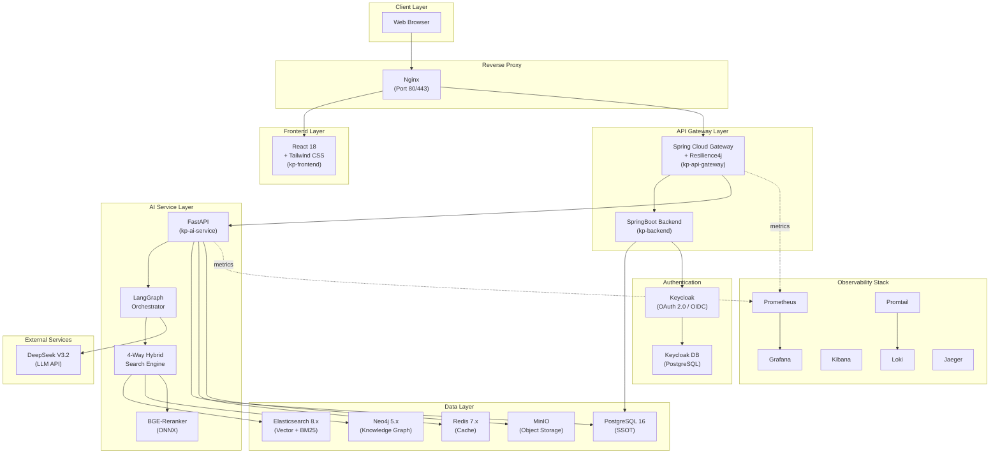

### 1.2 핵심 설계 원칙

| 원칙 | 설명 | 구현 |
|------|------|------|
| **비용 효율성** | LLM 비용 95% 절감 | DeepSeek V3.2 단일 모델 ($0.27/1M input) |
| **제로 조인** | DB 간 조인 제거 | ES 메타데이터 비정규화 |
| **단일 진실 공급원** | 데이터 일관성 보장 | PostgreSQL 마스터 레코드 |
| **16GB RAM 운영** | 제한된 리소스 최적화 | Slim Graph 전략, 배치 처리 |
| **서비스 분리** | 비즈니스/AI 로직 분리 | SpringBoot(비즈니스) + FastAPI(AI) |

---

## 2. 레이어 구조

### 2.1 5-Tier 아키텍처

```mermaid
flowchart LR
    subgraph L1["Layer 1<br/>Presentation"]
        Browser["Browser"]
        React["React 18"]
    end

    subgraph L2["Layer 2<br/>Reverse Proxy"]
        Nginx["Nginx"]
    end

    subgraph L3["Layer 3<br/>Application"]
        GW["API Gateway<br/>(SpringBoot)"]
        Backend["Backend<br/>(SpringBoot)"]
        AI["AI Service<br/>(FastAPI)"]
    end

    subgraph L4["Layer 4<br/>AI Processing"]
        LG["LangGraph"]
        Search["Hybrid Search"]
        Rerank["Reranker"]
    end

    subgraph L5["Layer 5<br/>Data"]
        PG["PostgreSQL"]
        ES["Elasticsearch"]
        Neo["Neo4j"]
        RD["Redis"]
    end

    L1 --> L2 --> L3 --> L4 --> L5
```

### 2.2 레이어별 상세

| Layer | 컴포넌트 | 포트 | 역할 |
|:-----:|----------|:----:|------|
| **L1** | React 18 + Tailwind CSS | - | SPA, SSE 스트리밍, Keycloak SSO |
| **L2** | Nginx | 80, 443 | 리버스 프록시, 정적 파일 서빙, CORS |
| **L3** | API Gateway (SpringBoot) | 8080 | JWT 검증, 라우팅, Rate Limiting |
| **L3** | Backend (SpringBoot) | 8081 | CRUD, 사용자 관리, 감사 로그 |
| **L3** | AI Service (FastAPI) | 8000 | 검색, RAG, ETL, 임베딩 |
| **L4** | LangGraph + DeepSeek | - | 쿼리 분석, 답변 합성, 엔티티 추출 |
| **L4** | Hybrid Search + Reranker | - | 4-Way 검색, RRF 퓨전, Cross-encoder |
| **L5** | PostgreSQL | 5432 | SSOT (17개 테이블) |
| **L5** | Elasticsearch | 9200 | 벡터 검색 + BM25 (Nori 한국어 분석기) |
| **L5** | Neo4j | 7687 | Knowledge Graph (169K 노드, 775K 관계) |
| **L5** | Redis | 6379 | 검색 결과 캐시 |

### 2.3 서비스 간 통신

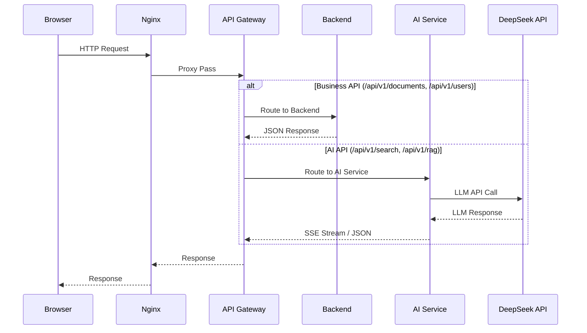

---

## 3. 4-Way Hybrid Search 아키텍처

### 3.1 검색 파이프라인

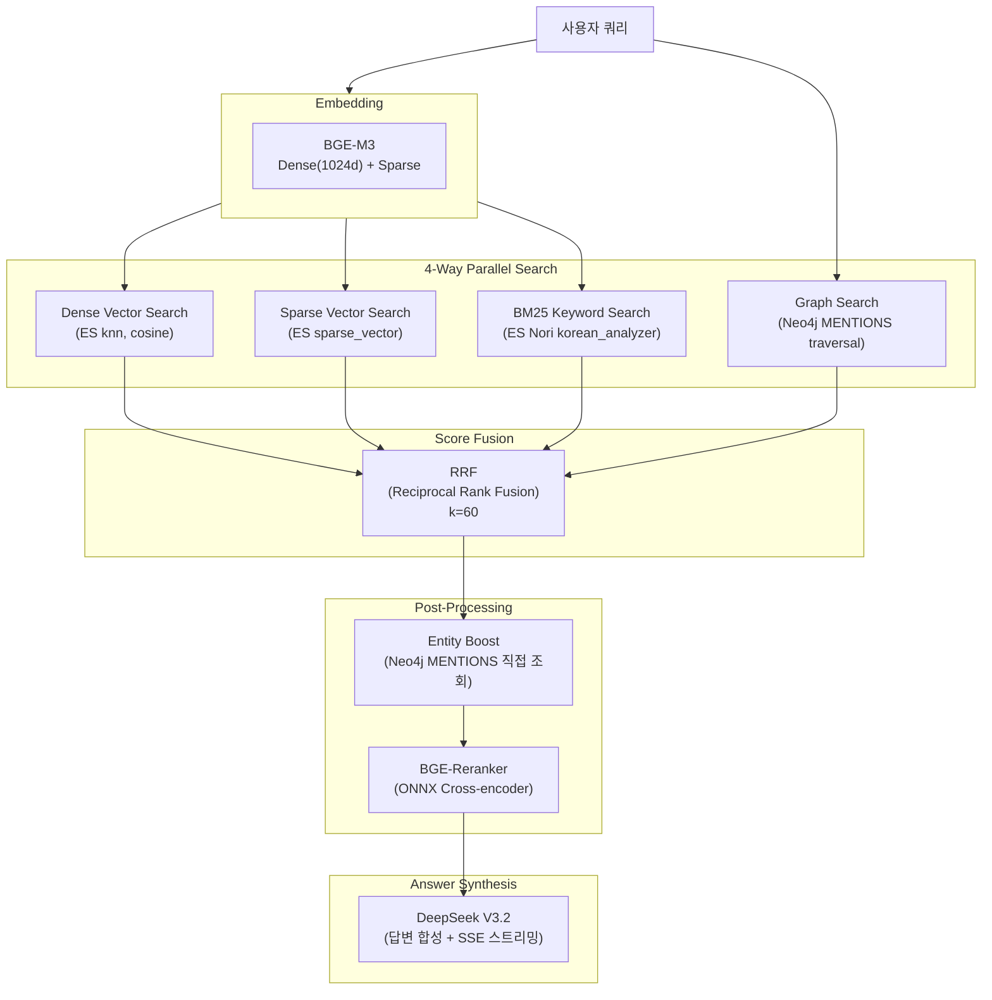

### 3.2 검색 방식별 상세

| 방식 | 저장소 | 기술 | 강점 |
|------|--------|------|------|
| **Dense Vector** | Elasticsearch | BGE-M3 1024d, cosine similarity | 의미적 유사도 (동의어, 패러프레이즈) |
| **Sparse Vector** | Elasticsearch | BGE-M3 sparse_vector | 키워드 가중치 기반 정밀 매칭 |
| **BM25 (Nori)** | Elasticsearch | nori_tokenizer + nori_part_of_speech | 한국어 형태소 분석 기반 키워드 검색 |
| **Graph Search** | Neo4j | Cypher traversal (MENTIONS) | 엔티티 관계 기반 검색 (A->B->C 경로) |

### 3.3 RRF Fusion 알고리즘

```
RRF_score(d) = SUM( 1 / (k + rank_i(d)) )  for i in [dense, sparse, bm25, graph]
k = 60 (smoothing constant)
```

각 검색 방식의 결과를 순위 기반으로 통합한다. 절대 점수가 아닌 상대 순위를 사용하므로 이질적인 스코어 체계를 자연스럽게 결합할 수 있다.

### 3.4 Reranker 파이프라인

RRF 퓨전 결과 상위 N개에 대해 BGE-Reranker(ONNX)로 Cross-encoder 재순위를 수행한다. 쿼리-문서 쌍을 동시에 인코딩하여 Bi-encoder보다 정밀한 관련도 판정이 가능하다.

**효과** (v10 -> v11):
- Context Precision: +26.4% (0.489 -> 0.618)
- Context Recall: +41.8% (0.474 -> 0.672)

---

## 4. 3-Phase ETL 파이프라인

### 4.1 전체 흐름

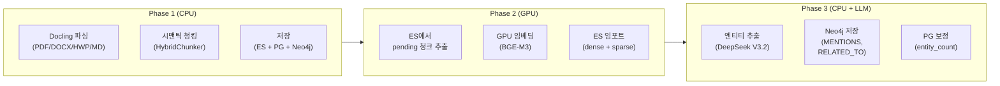

### 4.2 Phase별 상세

| Phase | 환경 | 입력 | 출력 | 처리량 |
|:-----:|------|------|------|-------:|
| **Phase 1** | CPU (Docker) | 원본 문서 1,437건 | 56,063 청크 -> ES/PG/Neo4j | ~2시간 |
| **Phase 2** | GPU (Colab 무료) | ES pending 청크 | Dense(1024d) + Sparse 벡터 | ~4시간 (42K건) |
| **Phase 3** | CPU + DeepSeek API | 텍스트 청크 | Entity/Technology/Person 노드 + 관계 | ~8시간 (23,074건) |

### 4.3 데이터 정제

Phase 1 후 쓰레기 청크(token_count < 50)를 일괄 삭제하여 데이터 품질을 확보했다.

| 단계 | 청크 수 | 비고 |
|------|--------:|------|
| Phase 1 완료 | 56,063 | 전체 파싱 결과 |
| 쓰레기 청크 삭제 | -13,601 | tc < 50 제거 (ES/Neo4j/PG 동시) |
| **최종** | **42,462** | **Phase 2/3 대상** |

### 4.4 CPU/GPU 분리 전략

GPU가 없는 로컬 개발 환경에서도 Colab 무료 GPU를 활용하여 대규모 임베딩을 수행하는 현실적인 아키텍처다.

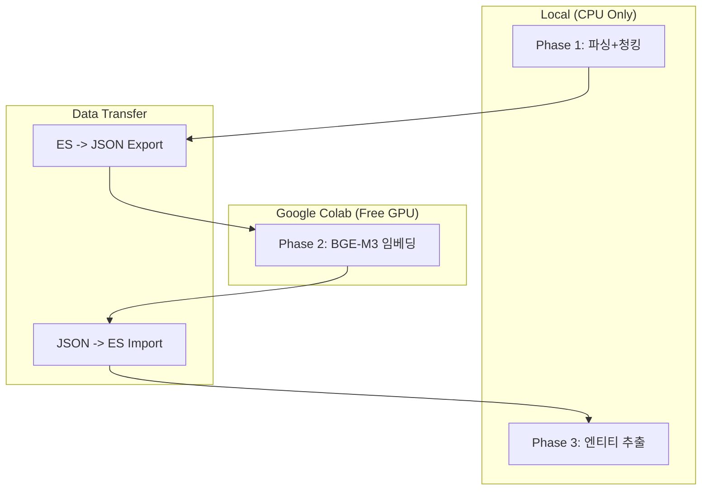

---

## 5. Triple-Store 데이터 아키텍처

### 5.1 역할 분담

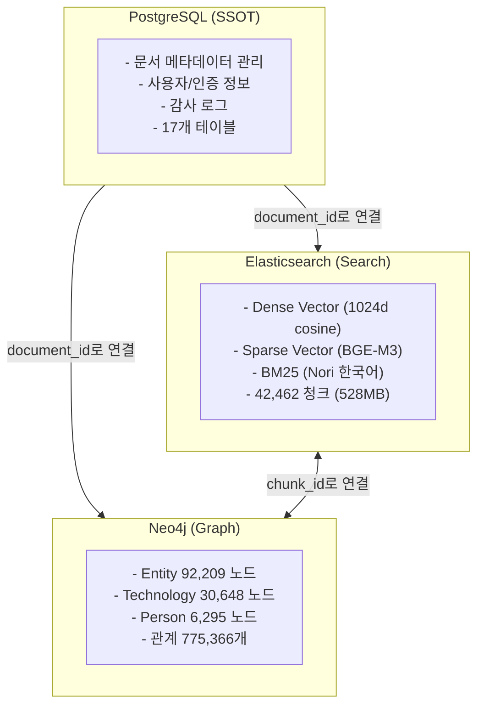

### 5.2 데이터 흐름

| Source | Target | 동기화 키 | 방향 | 시점 |
|--------|--------|----------|:----:|------|
| PG documents | ES knowledge_chunks | document_id | PG -> ES | ETL Phase 1 |
| PG documents | Neo4j Document 노드 | document_id | PG -> Neo4j | ETL Phase 1 |
| ES chunks | Neo4j Chunk 노드 | chunk_id | ES -> Neo4j | ETL Phase 1 |
| ES chunks | ES dense/sparse_vector | chunk_id | ES <- Colab | ETL Phase 2 |
| ES chunk text | Neo4j Entity/관계 | chunk_id | ES -> Neo4j | ETL Phase 3 |

### 5.3 실측 데이터 현황 (2026-02-18)

| Store | 항목 | 수량 | 용량 |
|-------|------|-----:|-----:|
| **PG** | documents 테이블 | 1,437건 | - |
| **PG** | 전체 테이블 | 17개 | - |
| **ES** | knowledge_chunks_v2 인덱스 | 42,462건 | 528.2 MB |
| **ES** | rcsv-pdf-documents 인덱스 | 12,918건 | 252.8 MB |
| **Neo4j** | Entity 노드 | 92,209개 | - |
| **Neo4j** | Chunk 노드 | 39,297개 | - |
| **Neo4j** | Technology 노드 | 30,648개 | - |
| **Neo4j** | Person 노드 | 6,295개 | - |
| **Neo4j** | Document 노드 | 1,437개 | - |
| **Neo4j** | MENTIONS 관계 | 419,066개 | - |
| **Neo4j** | RELATED_TO 관계 | 317,003개 | - |
| **Neo4j** | PART_OF 관계 | 39,297개 | - |

---

## 6. Redis 캐시 아키텍처

Redis 7.x는 시스템의 두 가지 독립적인 캐시 레이어를 담당한다.

### 6.1 캐시 레이어 구성

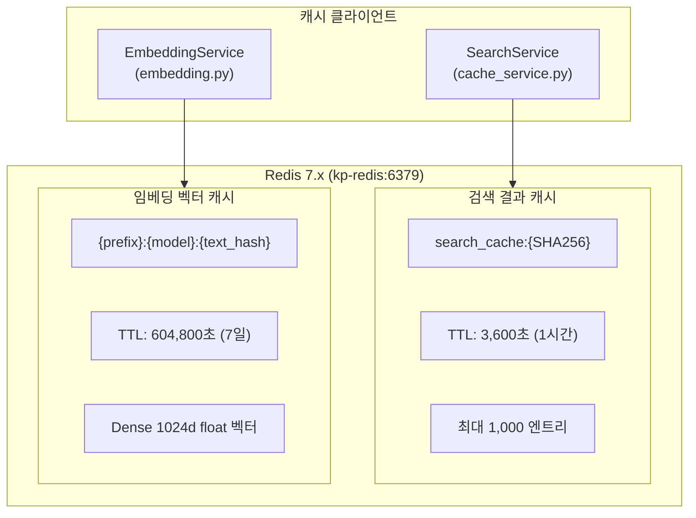

### 6.2 검색 결과 캐시 (Search Cache)

Hybrid Search 결과를 캐싱하여 **LLM 비용 절감** 및 **응답 속도 향상**을 제공한다. 동일 쿼리+필터 조합에 대해 DeepSeek API 호출을 생략할 수 있다.

| 항목 | 설정값 | 환경변수 |
|------|--------|----------|
| 활성화 | `True` | `SEARCH_CACHE_ENABLED` |
| TTL | 3,600초 (1시간) | `SEARCH_CACHE_TTL` |
| 최대 엔트리 | 1,000개 | `SEARCH_CACHE_MAX_SIZE` |
| 키 접두사 | `search_cache:` | - |
| 키 생성 | SHA256(query + filters + top_k + search_type + use_graph + use_vector) | - |
| 백엔드 | Redis (primary) / InMemory LRU (fallback) | - |

**캐시 Hit/Miss 프로세스**:

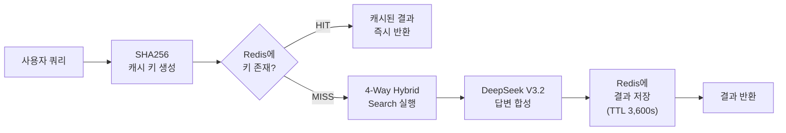

**폴백 전략**: Redis 연결 실패 시 InMemory LRU 캐시(OrderedDict 기반)로 자동 폴백한다. 서비스 가용성이 Redis 장애에 영향받지 않도록 설계되어 있다.

### 6.3 임베딩 벡터 캐시 (Embedding Cache)

BGE-M3 모델의 Dense 임베딩 결과(1024차원 float 벡터)를 캐싱하여 **동일 텍스트 재임베딩을 방지**한다. 임베딩은 결정적(deterministic) 결과이므로 장기간 캐싱이 가능하다.

| 항목 | 설정값 | 환경변수 |
|------|--------|----------|
| TTL | 604,800초 (7일) | `REDIS_EMBEDDING_CACHE_TTL` |
| 키 생성 | `{prefix}:{model_name}:{SHA256(text)}` | - |
| 저장 형식 | JSON 직렬화 float 배열 (1024d) | - |
| 배치 지원 | `mget`/pipeline 기반 배치 조회/저장 | - |

**배치 임베딩 캐시 프로세스**:

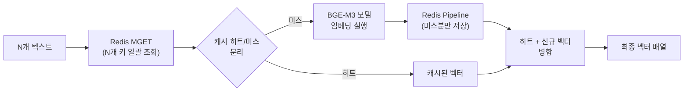

### 6.4 캐시 관리 API

관리자는 REST API를 통해 캐시를 모니터링하고 관리할 수 있다.

| API | 메서드 | 설명 |
|-----|:------:|------|
| `/api/v1/cache/stats` | GET | 캐시 히트/미스율, 크기, 백엔드 정보 |
| `/api/v1/cache/status` | GET | 캐시 활성화 여부 및 상태 |
| `/api/v1/cache/clear` | DELETE | 캐시 전체 삭제 |
| `/api/v1/cache/invalidate?pattern=*` | DELETE | 패턴 기반 캐시 무효화 |
| `/api/v1/cache/stats/reset` | POST | 통계 카운터 초기화 (데이터 유지) |

### 6.5 캐시 무효화 전략

| 트리거 | 무효화 범위 | 방법 |
|--------|------------|------|
| TTL 만료 | 개별 키 | Redis 자동 만료 |
| 문서 업로드/삭제 | 전체 검색 캐시 | 업로드 API에서 자동 호출 |
| 관리자 수동 | 전체 또는 패턴 | Admin UI 또는 API 직접 호출 |
| 임베딩 모델 변경 | 전체 임베딩 캐시 | 수동 (키 접두사에 모델명 포함) |

---

## 7. 인프라 구성

### 7.1 Docker Compose 컨테이너 목록

18개 컨테이너 + 1개 init 컨테이너로 구성된다.

| # | 컨테이너명 | 서비스 | 포트 | 역할 |
|:-:|-----------|--------|:----:|------|
| 1 | kp-nginx | Reverse Proxy | 80, 443 | URL 라우팅, 정적 파일 |
| 2 | kp-frontend | React 18 | - | SPA 웹 애플리케이션 |
| 3 | kp-api-gateway | SpringBoot Gateway | 8080 | JWT 검증, 라우팅 |
| 4 | kp-backend | SpringBoot Backend | 8081 | 비즈니스 로직, CRUD |
| 5 | kp-ai-service | FastAPI | 8000 | AI 처리, 검색, ETL |
| 6 | kp-keycloak | Keycloak | 8180 | OAuth 2.0 / OIDC SSO |
| 7 | kp-keycloak-db | PostgreSQL | - | Keycloak 전용 DB |
| 8 | kp-postgresql | PostgreSQL 16 | 5432 | 메인 SSOT 데이터베이스 |
| 9 | kp-neo4j | Neo4j 5.x | 7474, 7687 | Knowledge Graph |
| 10 | kp-elasticsearch | Elasticsearch 8.x | 9200 | 벡터/전문검색 (Nori 포함) |
| 11 | kp-kibana | Kibana | 5601 | ES 데이터 시각화 |
| 12 | kp-redis | Redis 7.x | 6379 | 캐시 |
| 13 | kp-minio | MinIO | 9000, 9001 | 원본 문서 저장 |
| 14 | kp-prometheus | Prometheus | 9090 | 메트릭 수집 |
| 15 | kp-grafana | Grafana | 3001 | 메트릭 시각화 |
| 16 | kp-loki | Loki | 3100 | 로그 수집 |
| 17 | kp-promtail | Promtail | - | 로그 전송 에이전트 |
| 18 | kp-jaeger | Jaeger | 16686, 14268 | 분산 추적 |
| init | kp-init-db | Init Container | - | DB 스키마/데이터 초기화 |

### 7.2 네트워크

| 네트워크 | 대상 | 용도 |
|----------|------|------|
| frontend | Nginx, Frontend, Gateway | 프론트엔드 통신 |
| backend | Gateway, Backend, AI Service | 백엔드 서비스 간 통신 |
| database | Backend, AI Service, PG, ES, Neo4j, Redis | 데이터 계층 접근 |
| monitoring | Prometheus, Grafana, Loki, Promtail, Jaeger | 모니터링 스택 |

### 7.3 볼륨

Docker Compose에서 명명된 볼륨을 사용하여 데이터를 영속화한다.

| 볼륨 | 마운트 대상 | 용도 |
|------|------------|------|
| postgresql_data | /var/lib/postgresql/data | PG 데이터 |
| neo4j_data | /data | Neo4j 그래프 데이터 |
| elasticsearch_data | /usr/share/elasticsearch/data | ES 인덱스 |
| redis_data | /data | Redis 스냅샷 |
| minio_data | /data | 원본 문서 파일 |
| prometheus_data | /prometheus | 메트릭 시계열 |
| grafana_data | /var/lib/grafana | 대시보드 설정 |
| loki_data | /loki | 로그 저장소 |
| keycloak_db_data | /var/lib/postgresql/data | Keycloak DB |

### 7.4 Elasticsearch 커스텀 빌드

Nori 한국어 분석기를 포함한 커스텀 Docker 이미지를 사용한다.

```dockerfile
FROM docker.elastic.co/elasticsearch/elasticsearch:8.17.0
RUN elasticsearch-plugin install analysis-nori
```

이 Dockerfile이 없으면 Nori 플러그인이 설치되지 않아 BM25 한국어 검색이 standard analyzer(공백 분리)로만 동작한다. (2026-02-13 사고 교훈)

---

## 8. Observability

### 8.1 4 Pillars of Observability

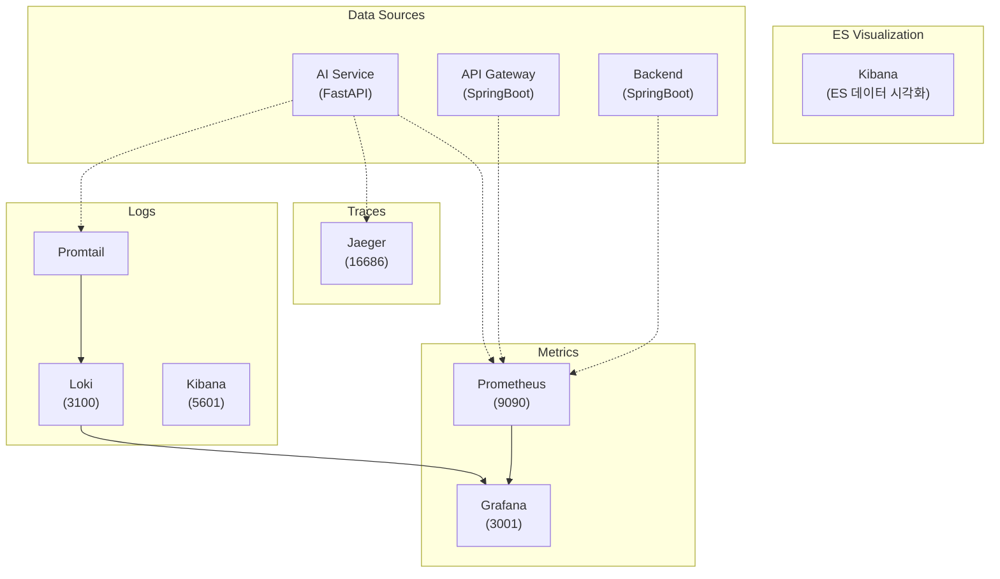

### 8.2 모니터링 대시보드

| 도구 | URL | 용도 | 인증 |
|------|-----|------|------|
| Grafana | http://localhost:3001 | 메트릭 시각화, 알림 | admin / test1234 |
| Kibana | http://localhost:5601 | ES 데이터 탐색, 쿼리 | 불필요 |
| Prometheus | http://localhost:9090 | 메트릭 쿼리, 타겟 상태 | 불필요 |
| Jaeger | http://localhost:16686 | 분산 추적 조회 | 불필요 |

### 8.3 수집 메트릭

| 카테고리 | 메트릭 | 소스 |
|----------|--------|------|
| API 성능 | 요청 수, 응답 시간, 에러율 | FastAPI, SpringBoot |
| 검색 품질 | 검색 시간, 결과 수, 캐시 히트율 | AI Service |
| 리소스 | CPU, Memory, Disk | Docker cAdvisor |
| DB 상태 | 커넥션 풀, 쿼리 시간 | PG, ES, Neo4j |

---

## 9. 보안

### 9.1 인증 아키텍처

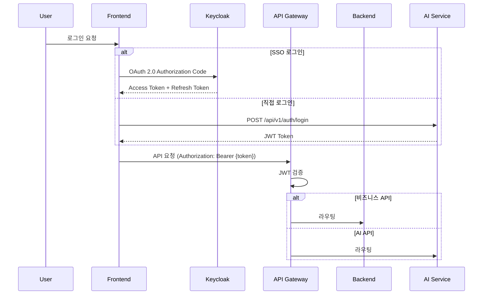

### 9.2 보안 구성 요소

| 요소 | 기술 | 역할 |
|------|------|------|
| **SSO** | Keycloak (OAuth 2.0 / OIDC) | 중앙 인증, 사용자 관리 |
| **JWT** | API Gateway 검증 | 모든 데이터 API 인증 필수 |
| **API Gateway** | SpringBoot + Resilience4j | Rate Limiting, Circuit Breaker |
| **CORS** | Nginx 설정 | 허용 도메인 제한 |
| **Password** | bcrypt ($2b$12$) | 비밀번호 해싱 |
| **API Key** | 환경변수 (.env) | DeepSeek API 키 관리 (git 제외) |
| **감사 로그** | audit_logs 테이블 | 모든 사용자 행동 기록 |

### 9.3 API Gateway 라우팅

| 경로 패턴 | 대상 | 인증 |
|-----------|------|:----:|
| `/api/v1/auth/**` | AI Service | 불필요 |
| `/api/v1/search/**` | AI Service | JWT 필수 |
| `/api/v1/rag/**` | AI Service | JWT 필수 |
| `/api/v1/documents/**` | Backend | JWT 필수 |
| `/api/v1/users/**` | Backend | JWT 필수 |
| `/actuator/health` | Gateway | 불필요 |
| `/swagger-ui.html` | Gateway | 불필요 |

---

*작성: Claude Code (Opus 4.6) | 2026-02-19 (v1.1 - Redis 캐시 아키텍처 섹션 추가)*
