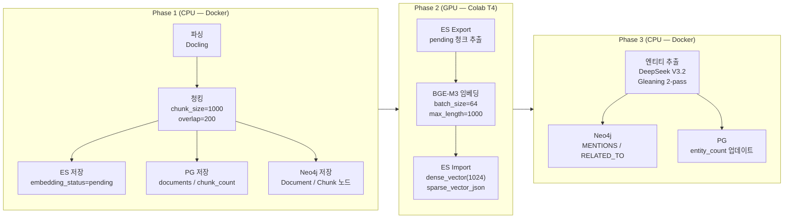

# 운영자 매뉴얼

**시스템**: Hybrid RAG Knowledge Platform
**버전**: 1.4
**작성일**: 2026-02-19
**최종 수정**: 2026-02-20 — 검색 메커니즘(11장), 데이터 조회 가이드(12장) 추가

---

## 목차

1. [시스템 개요](#1-시스템-개요)
2. [접속 정보](#2-접속-정보)
3. [시스템 시작/종료](#3-시스템-시작종료)
4. [일상 운영](#4-일상-운영)
5. [모니터링](#5-모니터링)
6. [ETL 파이프라인 운영](#6-etl-파이프라인-운영)
7. [장애 대응](#7-장애-대응)
8. [백업/복구](#8-백업복구)
9. [주요 설정 파일](#9-주요-설정-파일)
10. [타임아웃 설정 가이드](#10-타임아웃-설정-가이드)
11. [4-Way Hybrid Search 메커니즘](#11-4-way-hybrid-search-메커니즘)
12. [3-Store 데이터 조회 가이드](#12-3-store-데이터-조회-가이드)

---

## 1. 시스템 개요

### 1.1 시스템 설명

Hybrid RAG Knowledge Platform은 기업 내부 문서를 자동 처리(파싱, 청킹, 임베딩, 엔티티 추출)하고, 4-Way Hybrid Search(Dense + Sparse + BM25 + Graph)를 RRF로 통합하여 최적의 검색 결과를 제공하는 지능형 지식 검색 시스템입니다.

### 1.2 구성 요소 (18개 컨테이너)

| # | 컨테이너명 | 레이어 | 역할 | 포트 |
|---|-----------|--------|------|------|
| 1 | kp-nginx | Application | 리버스 프록시 (진입점) | 80, 443 |
| 2 | kp-frontend | Application | React 18 프론트엔드 | (nginx 경유) |
| 3 | kp-api-gateway | Application | Spring Cloud Gateway | 8080 |
| 4 | kp-backend | Application | Spring Boot 비즈니스 로직 | 8081 |
| 5 | kp-ai-service | Application | FastAPI AI/RAG 서비스 (핵심) | 8000 |
| 6 | kp-keycloak | Auth | OAuth 2.0 / OIDC 인증 | 8180 |
| 7 | kp-keycloak-db | Auth | Keycloak 전용 PostgreSQL | (내부) |
| 8 | kp-postgresql | Data | 메인 데이터베이스 (SSOT) | 5432 |
| 9 | kp-neo4j | Data | Knowledge Graph (169K 노드, 775K 관계) | 7474, 7687 |
| 10 | kp-elasticsearch | Data | 벡터/전문검색 (42,462 청크) | 9200 |
| 11 | kp-kibana | Data | ES 데이터 시각화 | 5601 |
| 12 | kp-redis | Data | 캐시 서버 | 6379 |
| 13 | kp-minio | Data | 오브젝트 스토리지 (원본 문서) | 9000, 9001 |
| 14 | kp-prometheus | Observability | 메트릭 수집/저장 (TSDB) | 9090 |
| 15 | kp-grafana | Observability | 메트릭 시각화 (4개 대시보드) | 3001 |
| 16 | kp-loki | Observability | 경량 로그 저장 | 3100 |
| 17 | kp-promtail | Observability | 컨테이너 로그 수집 에이전트 | (내부) |
| 18 | kp-jaeger | Observability | 분산 추적 (Tracing) | 16686 |

### 1.3 아키텍처 개요

```
사용자 (브라우저)
    |
    v
[kp-nginx :80] ── Reverse Proxy
    |         \
    v          v
[kp-frontend]  [kp-api-gateway :8080]
                    |           \
                    v            v
            [kp-backend :8081]  [kp-keycloak :8180]
                    |
                    v
            [kp-ai-service :8000]  ── 핵심 AI/RAG 서비스
                /       |       \
               v        v        v
    [kp-elasticsearch] [kp-neo4j] [kp-postgresql]
         :9200          :7687        :5432
```

### 1.4 데이터 현황

| 항목 | 수치 |
|------|------|
| 문서 수 | 1,437개 |
| 청크 수 | 42,462개 |
| 엔티티 노드 | 169,886 (Entity + Technology + Person) |
| 관계 수 | 775,366 (MENTIONS + RELATED_TO + HAS_ENTITY + PART_OF) |
| Dense + Sparse 임베딩 | 100% 완료 |
| Entity Extraction | 100% 완료 |

### 1.5 핵심 서비스 우선순위

장애 복구 시 아래 순서로 복구하면 연쇄 영향을 최소화할 수 있습니다.

```
postgresql > redis > elasticsearch > neo4j > keycloak > ai-service > backend > api-gateway > nginx
```

### 1.6 컨테이너 재시작 순서 (의존성 기준)

컨테이너를 수동으로 개별 재시작해야 하는 경우, 아래 순서를 따릅니다.

```
1. PostgreSQL      (다른 모든 서비스의 SSOT)
2. Elasticsearch   (검색 인덱스, ai-service 의존)
3. Neo4j           (Knowledge Graph, ai-service 의존)
4. Redis           (캐시, Gateway Rate Limiter 의존)
5. AI Service      (RAG 파이프라인 핵심, 위 4개에 의존)
6. Backend         (비즈니스 로직, PostgreSQL/Keycloak 의존)
7. Gateway         (API 라우팅, Backend/AI Service 의존)
8. Nginx           (리버스 프록시, Gateway/Frontend 의존)
9. Frontend        (UI, Nginx 경유 접근)
```

```bash
# 전체 수동 순차 재시작 (필요 시)
docker compose restart postgresql && sleep 10 && \
docker compose restart elasticsearch && sleep 15 && \
docker compose restart neo4j && sleep 15 && \
docker compose restart redis && sleep 5 && \
docker compose restart ai-service && sleep 60 && \
docker compose restart backend && sleep 15 && \
docker compose restart api-gateway && sleep 10 && \
docker compose restart nginx && sleep 5 && \
docker compose restart frontend
```

> `docker compose up -d`는 `depends_on` + `condition: service_healthy` 설정으로 자동 순서 관리를 수행하므로, 전체 시작 시에는 수동 순서를 신경 쓸 필요가 없습니다.

---

## 2. 접속 정보

### 2.1 서비스 URL 및 인증 정보

| 서비스 | URL | ID / Password | 비고 |
|--------|-----|---------------|------|
| **Frontend (브라우저)** | http://localhost | (아래 AI Service 또는 SSO) | 메인 접속 |
| **AI Service Login** | http://localhost:8000/api/v1/auth/login | `admin@example.com` / `admin123!` | JWT 발급 |
| **AI Service Docs** | http://localhost:8000/docs | (인증 불필요) | FastAPI Swagger |
| **Keycloak SSO** | Frontend SSO 버튼 | `admin` / `admin123` | 또는 `test` / `password123` |
| **Keycloak Admin** | http://localhost:8180/admin | `admin` / `keycloak_admin_2026!` | Realm: `hybrid-rag` |
| **Grafana** | http://localhost:3001 | `admin` / `test1234` | 모니터링 대시보드 |
| **Kibana** | http://localhost:5601 | (인증 불필요) | ES 데이터 조회 |
| **Neo4j Browser** | http://localhost:7474 | `neo4j` / `neo4j_dev_2026!` | Knowledge Graph |
| **MinIO Console** | http://localhost:9001 | `minioadmin` / `minio_dev_2026!` | 문서 스토리지 |
| **Prometheus** | http://localhost:9090 | (인증 불필요) | 메트릭 조회 |
| **Jaeger UI** | http://localhost:16686 | (인증 불필요) | 트레이싱 |
| **PostgreSQL** | localhost:5432 | `knowledge` / `knowledge_dev_2026!` | DB: `knowledge` |
| **Redis** | localhost:6379 | (비밀번호 없음) | 캐시 |
| **Gateway Health** | http://localhost:8080/actuator/health | (인증 불필요) | 상태 확인 |
| **Backend Health** | http://localhost:8081/actuator/health | (인증 불필요) | 상태 확인 |
| **Swagger UI** | http://localhost:8080/swagger-ui.html | (인증 불필요) | API 문서 |

### 2.2 주요 DB 접속

```bash
# PostgreSQL
docker exec -it kp-postgresql psql -U knowledge -d knowledge

# Neo4j (Cypher Shell)
docker exec -it kp-neo4j cypher-shell -u neo4j -p 'neo4j_dev_2026!'

# Redis
docker exec -it kp-redis redis-cli

# Elasticsearch
curl http://localhost:9200/_cluster/health?pretty
```

---

## 3. 시스템 시작/종료

### 3.1 전체 시작

```bash
cd infrastructure/docker
docker compose up -d
```

Docker Compose의 `depends_on` + `condition: service_healthy`가 아래 순서를 자동 관리합니다.

| 단계 | 서비스 | 설명 |
|------|--------|------|
| Phase 1 | postgresql, keycloak-db, neo4j, elasticsearch, redis, minio | 데이터 레이어 (의존성 없음) |
| Phase 2 | keycloak, kibana, loki, prometheus, jaeger | 인증 + 모니터링 |
| Phase 3 | promtail, grafana | 로그 수집 |
| Phase 4 | backend, ai-service | 애플리케이션 |
| Phase 5 | frontend, api-gateway | 게이트웨이 + 프론트엔드 |
| Phase 6 | nginx | 리버스 프록시 |

### 3.2 자동 점검 (startup_check.sh)

시스템 기동 후 전체 상태를 자동으로 점검하는 스크립트입니다.

```bash
# 전체 기동 + 점검
bash scripts/startup_check.sh

# 이미 기동된 상태에서 점검만
bash scripts/startup_check.sh --skip-compose

# 상세 로그 출력
bash scripts/startup_check.sh --skip-compose --verbose
```

**5 Phase 점검 항목**:

| Phase | 점검 내용 | 상세 |
|-------|----------|------|
| **Phase 1** | 인프라 기동 + Health Check | Docker 데몬, docker-compose.yml, .env 존재 확인. kp-elasticsearch, kp-postgresql, kp-neo4j, kp-redis 4종 헬스체크. Redis PING/PONG 확인 |
| **Phase 2** | 애플리케이션 서비스 기동 | kp-ai-service 헬스체크. `/api/v1/health` 엔드포인트 호출. ES/Neo4j/PostgreSQL 연결 상태 파싱. 연결 실패 시 ai-service 1회 재시작 시도 |
| **Phase 3** | 검색 API 자동 테스트 | JWT 로그인(admin@example.com). Keyword/Hybrid/Semantic 3종 검색 실행. 검색 실패 시 Redis FLUSHALL + ai-service 재시작 후 재시도 |
| **Phase 4** | Nori Analyzer 검증 | ES `_analyze` API로 한국어 형태소 분석 확인. `"프로젝트관리시스템구축"` 입력 -> 4토큰 분리 검증 |
| **Phase 5** | 최종 리포트 | PASS/FAIL/WARN 집계. 18개 컨테이너 상태 테이블 출력. 전체 판정 (ALL PASS / PARTIAL / CRITICAL) |

**주요 옵션**:

| 옵션 | 설명 |
|------|------|
| `--skip-compose` | docker-compose up 건너뛰기 (이미 기동된 상태에서 점검만) |
| `--verbose` | 상세 디버그 로그 출력 |

**WSL2 환경 자동 감지**: WSL2에서 실행 시 `docker-compose.wsl2.yml` 오버라이드를 자동 적용합니다.

**자동 복구 기능**:
- Phase 2에서 의존성 연결 실패 시 ai-service 자동 재시작 (1회)
- Phase 3에서 검색 0건 반환 시 Redis FLUSHALL + ai-service 재시작 후 재시도

### 3.3 선택적 기동 (WSL2 메모리 제한 시)

전체 18개 컨테이너는 약 15.5GB RAM(reservations)을 요구합니다. WSL2 메모리가 부족할 경우 선택적으로 기동합니다.

```bash
# 핵심 서비스만 (검색 기능)
docker compose up -d postgresql neo4j elasticsearch redis ai-service

# 핵심 + 프론트엔드 (UI 사용)
docker compose up -d postgresql neo4j elasticsearch redis ai-service \
    keycloak keycloak-db backend frontend api-gateway nginx

# 모니터링 추가
docker compose up -d grafana prometheus kibana

# 불필요한 서비스 중지 (메모리 확보)
docker compose stop grafana kibana jaeger promtail loki
```

**서비스별 메모리 사용량 (상위)**:

| 서비스 | Memory Limit | Memory Reservation |
|--------|:-----------:|:------------------:|
| ai-service | 8G | 4G |
| postgresql | 4G | 2G |
| neo4j | 4G | 2G |
| elasticsearch | 4G | 2G |
| backend | 2G | 1G |

### 3.4 종료

```bash
cd infrastructure/docker

# 전체 종료 (데이터 유지)
docker compose down

# 전체 종료 + 볼륨 삭제 (모든 데이터 삭제 - 주의!)
docker compose down -v
```

> `docker compose down`은 의존관계를 고려하여 자동으로 역순 종료합니다.

---

## 4. 일상 운영

### 4.1 Health Check

**AI Service 종합 헬스체크** (가장 중요):

```bash
curl -s http://localhost:8000/api/v1/health | python3 -m json.tool
```

응답에서 각 dependency 상태를 확인합니다:
- `elasticsearch`: connected/disconnected
- `neo4j`: connected/disconnected
- `postgresql`: connected/disconnected
- `deepseek`: API 연결 상태

**전체 컨테이너 상태 확인**:

```bash
# 서비스 단위 상태
docker compose ps

# 포맷 지정 상태
docker ps --format "table {{.Names}}\t{{.Status}}" | grep kp-

# 리소스 사용량 (스냅샷)
docker stats --no-stream --format "table {{.Name}}\t{{.CPUPerc}}\t{{.MemUsage}}\t{{.MemPerc}}" | grep kp-
```

**개별 서비스 헬스체크**:

```bash
# Application Layer
curl -s http://localhost:8000/api/v1/health    # ai-service
curl -s http://localhost:8081/actuator/health   # backend
curl -s http://localhost:8080/actuator/health   # api-gateway

# Data Layer
docker exec kp-postgresql pg_isready -U knowledge -d knowledge
docker exec kp-redis redis-cli ping
curl -s http://localhost:9200/_cluster/health?pretty   # ES
curl -s http://localhost:7474                           # Neo4j

# Auth Layer
curl -s http://localhost:8180/health/ready     # keycloak

# Observability Layer
curl -s http://localhost:9090/-/healthy        # prometheus
curl -s http://localhost:3001/api/health       # grafana
curl -s http://localhost:3100/ready            # loki
```

### 4.2 로그 확인

```bash
# 특정 서비스 최근 로그
docker compose logs --tail=100 ai-service

# 실시간 로그 스트리밍
docker compose logs -f ai-service

# 특정 시간 이후 로그
docker logs --since="2026-02-18T09:00:00" kp-ai-service

# 에러만 필터링
docker compose logs ai-service 2>&1 | grep -i "error\|exception\|traceback"

# 여러 서비스 동시 확인
docker compose logs -f ai-service backend api-gateway
```

### 4.3 Redis 캐시 관리

#### 4.3.1 CLI 직접 관리

```bash
# Redis 접속
docker exec -it kp-redis redis-cli

# 캐시 키 목록 확인
docker exec kp-redis redis-cli KEYS "*"

# 캐시 항목 수 확인
docker exec kp-redis redis-cli DBSIZE

# 메모리 사용량 확인
docker exec kp-redis redis-cli INFO memory | head -10

# 전체 캐시 플러시 (검색 결과 stale 시 사용)
docker exec kp-redis redis-cli FLUSHALL
```

> 검색 결과가 이상할 때(stale cache), `FLUSHALL` 후 재검색하면 해결되는 경우가 많습니다.

#### 4.3.2 REST API를 통한 캐시 관리

AI Service에서 제공하는 캐시 관리 API를 활용할 수 있습니다.

**캐시 통계 확인**:

```bash
# JWT 토큰 획득 후 실행
curl -s -X GET http://localhost:8000/api/v1/cache/stats \
  -H "Authorization: Bearer $TOKEN" | python3 -m json.tool
```

**캐시 초기화**:

```bash
curl -s -X DELETE http://localhost:8000/api/v1/cache/clear \
  -H "Authorization: Bearer $TOKEN" | python3 -m json.tool
```

#### 4.3.3 캐시 TTL 설정

| 캐시 유형 | TTL (초) | TTL (사람 읽기) | 설정 위치 |
|-----------|:--------:|:---------------:|----------|
| **검색 결과 캐시** | 3,600 | 1시간 | `config.py` > `search_cache_ttl` |
| **임베딩 캐시** | 604,800 | 7일 | `config.py` > `redis_embedding_cache_ttl` |

> 검색 캐시 TTL은 데이터 업데이트 빈도에 맞춰 조정하세요. ETL 실행 직후에는 `FLUSHALL` 또는 `/api/v1/cache/clear`로 캐시를 초기화하는 것을 권장합니다.

### 4.4 일일 점검 체크리스트

```
[ ] 전체 컨테이너 상태 확인: docker compose ps
[ ] 비정상 컨테이너 유무 확인 (Restarting, Exit 상태)
[ ] ai-service /api/v1/health 정상 여부
[ ] 로그에서 ERROR/WARN 패턴 점검
[ ] 디스크 사용량 점검: df -h /
```

---

## 5. 모니터링

### 5.1 Grafana (http://localhost:3001)

**로그인**: `admin` / `test1234`

**제공 대시보드 (4개)**:

| 대시보드 | UID | 설명 |
|----------|-----|------|
| Application Metrics | `kp-application-metrics` | HTTP 요청 수, 응답 시간, 에러율 |
| Database Metrics | `kp-database-metrics` | DB 연결 풀, 쿼리 성능 |
| RAG & SLA Dashboard | `kp-rag-sla` | RAG 파이프라인 성능 |
| System Overview | `kp-system-overview` | 전체 시스템 리소스 |

**데이터 소스**: Prometheus (http://prometheus:9090), Loki (http://loki:3100)

**주요 PromQL 쿼리**:

```promql
# HTTP 요청 수 (분당)
sum(rate(http_server_requests_seconds_count[1m])) by (uri, method)

# HTTP 응답 시간 (95th percentile)
histogram_quantile(0.95, sum(rate(http_server_requests_seconds_bucket[5m])) by (le, uri))

# 에러율
sum(rate(http_server_requests_seconds_count{status=~"5.."}[5m]))
/ sum(rate(http_server_requests_seconds_count[5m])) * 100
```

### 5.2 Kibana (http://localhost:5601)

인증 없이 접속 가능합니다.

**주요 사용 메뉴**:
- **Analytics > Discover**: ES 데이터 검색 및 탐색
- **Management > Dev Tools**: ES 쿼리 콘솔

**Dev Tools 필수 쿼리**:

```json
// 클러스터 상태 (single-node: yellow이 정상)
GET _cluster/health

// 인덱스 목록
GET _cat/indices?v&s=index

// knowledge_chunks 인덱스 상태
GET knowledge_chunks/_stats

// 문서 수 확인
GET knowledge_chunks/_count

// Nori 분석기 동작 확인
POST knowledge_chunks/_analyze
{
  "field": "text",
  "text": "프로젝트관리시스템구축"
}
// 기대 결과: 4토큰 (프로젝트, 관리, 시스템, 구축)

// 키워드 검색 테스트
GET knowledge_chunks/_search
{
  "query": { "match": { "text": "프로젝트 관리" } },
  "size": 5
}
```

### 5.3 Prometheus (http://localhost:9090)

인증 없이 접속 가능합니다.

**주요 메뉴**:
- **Status > Targets**: 스크래핑 대상 상태 (UP/DOWN 확인)
- **Graph**: PromQL 쿼리 실행

**현재 Targets 상태**:

| 타겟 | 상태 | 비고 |
|------|------|------|
| prometheus | UP | Self-monitoring |
| api-gateway | UP | Spring Boot Actuator |
| backend | UP | Spring Boot Actuator |
| grafana | UP | |
| loki | UP | |
| jaeger | UP | |

```bash
# Targets API 조회
curl -s http://localhost:9090/api/v1/targets | python3 -m json.tool | head -30

# 메트릭 직접 조회
curl "http://localhost:9090/api/v1/query?query=up"
```

### 5.4 Jaeger (http://localhost:16686)

인증 없이 접속 가능합니다.

**트레이스 검색 방법**:
1. Service 드롭다운에서 서비스 선택
2. Operation 선택 (선택사항)
3. Lookback 시간 범위 설정
4. Find Traces 클릭

```bash
# 서비스 목록 조회
curl -s http://localhost:16686/api/services | python3 -m json.tool
```

---

## 6. ETL 파이프라인 운영

### 6.1 3-Phase 파이프라인 개요



**Phase별 실적 요약 (실측값)**:

| Phase | 환경 | 소요 시간 | 처리량 | 비용 |
|-------|------|---------|--------|------|
| Phase 1 | CPU (Docker) | ~6시간 / 1,786파일 | 파싱(Docling) + 청킹 -> ES/PG/Neo4j | 0원 |
| Phase 2 | GPU (Colab T4) | 13.5분 / 53,414청크 | BGE-M3 Dense+Sparse 임베딩, 65.6 c/s | 0원 (Colab 무료) |
| Phase 3 | CPU (Docker) | ~43시간 (3워커) / ~128시간 (1워커) | DeepSeek V3.2 엔티티 추출 -> Neo4j | ~$52 |

**Phase 전환 원칙**: Phase 1이 완전히 완료된 후 Phase 2를 시작하고, Phase 2 완료 후 Phase 3를 시작합니다. Phase 순서를 바꾸면 안 됩니다.

---

### 6.2 Phase 1: 파싱 + 청킹

#### 6.2.1 실행 전 준비

```bash
# 컨테이너 최신 빌드 (코드 변경이 있었을 때 필수)
cd infrastructure/docker
docker compose build ai-service
docker compose up -d ai-service

# ai-service 헬스체크 (약 60초 대기)
sleep 60
curl -s http://localhost:8000/api/v1/health | python3 -m json.tool
```

#### 6.2.2 Phase 1 실행

```bash
# nohup 필수 — docker exec -d는 셸이 끊기면 프로세스도 종료됨
docker exec kp-ai-service bash -c \
  "nohup python3 /app/scripts/run_etl_phase1_chunks.py > /tmp/etl_phase1.log 2>&1 &"
```

> **중요**: `docker exec -d`가 아니라 컨테이너 내부에서 `nohup ... &` 조합으로 실행해야 합니다. `docker exec -d`는 외부 셸이 끊기면 프로세스가 함께 종료됩니다.

#### 6.2.3 핵심 파라미터 (run_etl_phase1_chunks.py 실측 확정값)

| 파라미터 | 값 | 비고 |
|---------|:--:|------|
| `chunk_size` | 1000 | 토큰 단위 |
| `chunk_overlap` | 200 | 오버랩 토큰 수 |
| `batch_size` | **4** | CPU 환경 최적값. 8은 역효과 (55초 vs 7초) |
| `max_retries` | 2 | 파일 처리 실패 시 재시도 |
| `continue_on_error` | True | 단일 파일 실패 시 나머지 계속 처리 |
| `enable_embeddings` | False | Phase 2에서 처리 (이 단계에서 OFF 필수) |
| `enable_entity_extraction` | False | Phase 3에서 처리 |

**파일 크기별 처리 정책**:
- 30MB 초과: 자동 스킵 (OOM 방지)
- 5-30MB: OCR 비활성화 모드로 처리
- 5MB 미만: 전체 기능 (OCR + 테이블)

**처리 순서**: MD/TXT -> HTML -> IPYNB -> DOCX -> PPTX -> PDF (경량 파일 우선)

#### 6.2.4 진행 상황 확인

```bash
# 실시간 로그 확인
docker exec kp-ai-service tail -20 /tmp/etl_phase1.log

# 진행 상황 JSON 파일 (자동 생성)
docker exec kp-ai-service cat /app/knowledge_data/etl_phase1_progress.json

# ES 청크 수 실시간 확인
curl -s http://localhost:9200/knowledge_chunks/_count | \
  python3 -c "import sys,json; print('ES chunks:', json.load(sys.stdin)['count'])"

# PG 문서 수 확인
docker exec kp-postgresql psql -U knowledge -d knowledge -t -c \
  "SELECT count(*), sum(chunk_count) FROM documents;"
```

#### 6.2.5 완료 확인

```bash
# 완료 문자열 확인 (이 줄이 있으면 Phase 1 정상 완료)
docker exec kp-ai-service grep "Phase 1 Completed" /tmp/etl_phase1.log

# 최종 통계 확인
docker exec kp-ai-service tail -30 /tmp/etl_phase1.log
```

#### 6.2.6 Phase 1 모니터링 스크립트

```bash
# 모니터 시작 (15분 간격, Slack dev 채널 자동 보고)
# 위치: knowledge_service/scripts/etl_phase1_monitor.sh
nohup bash knowledge_service/scripts/etl_phase1_monitor.sh \
  > /tmp/etl_phase1_monitor.log 2>&1 &

# 모니터 PID 확인
ps aux | grep "etl_phase1_monitor" | grep -v grep

# 모니터 종료
kill <PID>
```

**etl_phase1_monitor.sh 보고 항목**:
- 진행률 바 (0-100%)
- 성공/스킵/실패 파일 수
- ES 청크 수 및 15분 증분
- PG 문서 수
- 컨테이너 CPU/메모리
- 현재 처리 중인 파일명
- 예상 완료 시각 (ETA)
- ETL 프로세스 사망 감지 (3회 연속 변화 없으면 alerts 채널 경보)

---

### 6.3 Phase 2: GPU 임베딩 (Google Colab)

GPU가 없는 환경에서는 Google Colab 무료 T4 GPU를 활용합니다.

#### 6.3.1 Phase 2 준비 — pending 청크 수 확인

```bash
# embedding_status=pending인 청크 수 확인 (Phase 1 완료 후)
curl -s 'http://localhost:9200/knowledge_chunks/_count' \
  -H 'Content-Type: application/json' \
  -d '{"query":{"term":{"embedding_status":"pending"}}}' | \
  python3 -c "import sys,json; print('Pending chunks:', json.load(sys.stdin)['count'])"
```

#### 6.3.2 Colab용 청크 파일 확인

Phase 1 실행 결과 `knowledge_service/scripts/all_chunks_for_gpu.jsonl` 파일이 생성됩니다. Colab에서 이 파일을 사용합니다.

```bash
# 파일 크기 확인
ls -lh knowledge_service/scripts/all_chunks_for_gpu.jsonl

# 라인 수 (청크 수)
wc -l knowledge_service/scripts/all_chunks_for_gpu.jsonl
```

#### 6.3.3 Colab BGE-M3 임베딩 파라미터 (확정값)

```python
# Google Colab T4 GPU 환경 — gpu_embedding_colab.ipynb 참고
from FlagEmbedding import BGEM3FlagModel

model = BGEM3FlagModel("BAAI/bge-m3", use_fp16=True)  # T4 GPU

embeddings = model.encode(
    texts,
    batch_size=64,         # GPU 최적값 (CPU는 4)
    max_length=1000,       # 1500은 OOM 발생 (7.3GB+)
    return_dense=True,     # Dense vector (1024차원)
    return_sparse=True,    # Sparse vector 동시 생성
)
```

**주의**: Sparse vector를 ES object로 저장하면 동적 매핑 폭발이 발생합니다. 반드시 JSON 문자열(`sparse_vector_json` 필드)로 저장해야 합니다.

#### 6.3.4 임베딩 결과 ES 임포트

Colab에서 생성된 임베딩 JSONL 파일을 호스트로 가져온 후 임포트합니다.

```bash
# 임베딩 결과 파일을 컨테이너로 복사
docker cp embeddings_result.jsonl kp-ai-service:/tmp/

# 임포트 실행 (컨테이너 내부에서)
docker exec kp-ai-service python3 /app/scripts/import_embeddings.py \
  /tmp/embeddings_result.jsonl

# 이어서 처리 (이미 completed인 항목은 건너뜀)
docker exec kp-ai-service python3 /app/scripts/import_embeddings.py \
  /tmp/embeddings_result.jsonl --skip-completed
```

**import_embeddings.py 위치**: `knowledge_service/scripts/import_embeddings.py`

#### 6.3.5 임베딩 완료 확인

```bash
# embedding_status 분포 확인
curl -s 'http://localhost:9200/knowledge_chunks/_search' \
  -H 'Content-Type: application/json' \
  -d '{
    "size": 0,
    "aggs": {
      "status": {
        "terms": {"field": "embedding_status.keyword", "size": 10}
      }
    }
  }' | python3 -m json.tool

# completed 건수만 확인
curl -s 'http://localhost:9200/knowledge_chunks/_count' \
  -H 'Content-Type: application/json' \
  -d '{"query":{"term":{"embedding_status":"completed"}}}' | \
  python3 -c "import sys,json; print('Completed:', json.load(sys.stdin)['count'])"
```

#### 6.3.6 임베딩 모니터링 스크립트

```bash
# 임베딩 전용 모니터 (10분 간격, Slack dev 채널 보고)
# 위치: knowledge_service/scripts/embedding_monitor.sh
nohup bash knowledge_service/scripts/embedding_monitor.sh \
  > /tmp/embedding_monitor.log 2>&1 &

# 커스텀 간격 (5분)
INTERVAL=300 nohup bash knowledge_service/scripts/embedding_monitor.sh \
  > /tmp/embedding_monitor.log 2>&1 &

# 전체 청크 수 오버라이드 (기본값 13430, 실제 청크 수로 지정)
TOTAL_CHUNKS=42462 nohup bash knowledge_service/scripts/embedding_monitor.sh \
  > /tmp/embedding_monitor.log 2>&1 &

# PID 확인 및 종료
ps aux | grep "embedding_monitor" | grep -v grep
kill <PID>
```

---

### 6.4 Phase 3: 엔티티 추출

#### 6.4.1 단일 워커 실행

가장 간단한 방법입니다. API Key가 1개일 때 사용합니다.

```bash
# 단일 워커 실행 (nohup 필수)
docker exec kp-ai-service bash -c \
  'nohup bash -c "ENTITY_MIN_TOKENS=50 ENTITY_CONCURRENCY=3 \
  python3 /app/scripts/batch_entity_extraction.py" \
  > /tmp/entity_extraction.log 2>&1 &'

# 로그 확인
docker exec kp-ai-service tail -20 /tmp/entity_extraction.log
```

#### 6.4.2 3-워커 병렬 실행 (권장, ~3배 속도)

DeepSeek API Key 3개가 필요합니다. 파티셔닝으로 각 워커가 겹치지 않게 처리합니다.

```bash
# Step 1: 체크포인트 시딩 (기존 완료 ID를 워커별 체크포인트로 복사)
docker exec kp-ai-service python3 -c "
import json, shutil
try:
    cp = json.load(open('/tmp/entity_checkpoint.json'))
    ids = cp.get('processed_ids', [])
except FileNotFoundError:
    ids = []
for w in range(3):
    d = {
        'processed_ids': ids,
        'stats': {
            'total_entities': 0, 'total_relationships': 0,
            'total_chunks_processed': 0, 'total_errors': 0,
            'start_time': None, 'last_save_time': None
        }
    }
    json.dump(d, open('/tmp/entity_checkpoint_w%d.json' % w, 'w'))
print('Checkpoint seeded for 3 workers, base IDs:', len(ids))
"

# Step 2: 워커 0 실행 (파티션 0/3 — 3개 중 첫째)
docker exec kp-ai-service bash -c \
  'nohup bash -c "ENTITY_MIN_TOKENS=50 ENTITY_CONCURRENCY=3 ENTITY_PARTITION=0/3 \
  ENTITY_CHECKPOINT_FILE=/tmp/entity_checkpoint_w0.json \
  DEEPSEEK_API_KEY=<API_KEY_1> \
  python3 /app/scripts/batch_entity_extraction.py" \
  > /tmp/entity_w0.log 2>&1 &'

# Step 3: 워커 1 실행 (파티션 1/3)
docker exec kp-ai-service bash -c \
  'nohup bash -c "ENTITY_MIN_TOKENS=50 ENTITY_CONCURRENCY=3 ENTITY_PARTITION=1/3 \
  ENTITY_CHECKPOINT_FILE=/tmp/entity_checkpoint_w1.json \
  DEEPSEEK_API_KEY=<API_KEY_2> \
  python3 /app/scripts/batch_entity_extraction.py" \
  > /tmp/entity_w1.log 2>&1 &'

# Step 4: 워커 2 실행 (파티션 2/3)
docker exec kp-ai-service bash -c \
  'nohup bash -c "ENTITY_MIN_TOKENS=50 ENTITY_CONCURRENCY=3 ENTITY_PARTITION=2/3 \
  ENTITY_CHECKPOINT_FILE=/tmp/entity_checkpoint_w2.json \
  DEEPSEEK_API_KEY=<API_KEY_3> \
  python3 /app/scripts/batch_entity_extraction.py" \
  > /tmp/entity_w2.log 2>&1 &'
```

#### 6.4.3 핵심 파라미터 (batch_entity_extraction.py)

| 파라미터 | 환경변수 | 기본값 | 권장값 | 설명 |
|---------|---------|-------|:------:|------|
| 최소 토큰 | `ENTITY_MIN_TOKENS` | 150 | **50** | 처리 대상 최소 token_count. 50 미만은 쓰레기 데이터(테이블 셀 조각 등) |
| 동시 처리 | `ENTITY_CONCURRENCY` | 3 | 3 | 워커당 동시 LLM 호출 수 |
| 배치 크기 | `ENTITY_BATCH_SIZE` | 50 | 50 | 체크포인트 저장 간격 |
| 파티셔닝 | `ENTITY_PARTITION` | "" | "0/3" | "ID/TOTAL" — 3워커 중 0번째 |
| 체크포인트 | `ENTITY_CHECKPOINT_FILE` | /tmp/entity_checkpoint.json | 워커별 분리 | 중단/재개 지원 |
| Gleaning | `ENTITY_MAX_GLEANINGS` | 1 | 1 | 2-pass 추출 (1차 + 누락 보완) |
| API Key | `DEEPSEEK_API_KEY` | 컨테이너 env | 워커별 다른 키 | 멀티워커 병렬 처리 시 |

**비용**: DeepSeek V3.2 API 호출 약 $52 (23,074건 기준, 3워커 43시간)

#### 6.4.4 Gleaning (반복 추출) 상세

Gleaning은 LLM 기반 엔티티 추출의 재현율(Recall)을 높이기 위한 **다중 패스(Multi-pass) 추출 기법**입니다. 1차 추출 결과를 LLM에 다시 보여주며 "누락된 엔티티가 있는지" 재질문하여, 한 번에 놓친 엔티티를 추가로 발견합니다.

**동작 원리**:

```
1차 추출 (Pass 0)
  LLM에게 원본 텍스트를 주고 엔티티 추출 요청
  → 결과: [엔티티 A, B, C]

Gleaning Pass 1
  LLM에게 원본 텍스트 + "이미 추출된 [A, B, C]" 를 보여주고
  "누락된 엔티티가 있는지" 재질문
  → 추가 발견: [엔티티 D, E]

Gleaning Pass 2 (max_gleanings=2일 때)
  LLM에게 원본 텍스트 + "이미 추출된 [A, B, C, D, E]" 를 보여주고
  한 번 더 재질문
  → 추가 발견 없음 → 조기 종료

최종 결과: [A, B, C, D, E] (중복 제거 후)
```

**설정 파라미터**:

| 파라미터 | 위치 | 기본값 | 설명 |
|---------|------|:------:|------|
| `max_gleanings` | `config.py` | 2 | Gleaning 최대 반복 횟수 |
| `ENTITY_MAX_GLEANINGS` | 환경변수 | 1 | 배치 스크립트에서의 Gleaning 횟수 |
| `enable_gleaning` | `extract_entities()` 인자 | True | Gleaning 활성화 여부 |

> **배치 실행 시 기본값이 1인 이유**: 대량 처리(23,074건)에서 Gleaning 2회는 LLM 호출이 3배로 증가하여 비용과 시간이 크게 늘어납니다. 실측 결과 1회 Gleaning만으로도 Recall +33% 효과를 얻었으므로, 배치에서는 1로 설정하고 개별 고품질 추출이 필요할 때만 2를 사용합니다.

**핵심 코드 위치**:

| 파일 | 함수/메서드 | 역할 |
|------|-----------|------|
| `src/app/services/entity_extraction.py` | `extract_entities()` | 1차 추출 + Gleaning 루프 |
| `src/app/services/entity_extraction.py` | `_gleaning_pass()` | Gleaning 패스 (누락 엔티티 재질문) |
| `src/app/core/config.py` | `max_gleanings` | 설정값 정의 |
| `scripts/batch_entity_extraction.py` | `process_chunk()` | 배치에서 `enable_gleaning=True` 호출 |

**Gleaning 프롬프트 구조** (`GLEANING_PROMPT`):

```
아래 텍스트에서 이미 추출된 엔티티 목록입니다:
{existing_entities_json}

원본 텍스트를 다시 읽고, 위 목록에 빠진 엔티티가 있으면 추가로 추출해주세요.
(이미 추출된 엔티티는 제외하고 새로운 것만 반환)
```

**조기 종료 조건**: Gleaning 패스에서 새로운 엔티티를 0건 발견하면 나머지 패스를 건너뛰고 즉시 종료합니다. 이를 통해 불필요한 LLM 호출을 방지합니다.

**Gleaning 효과 (실측)**:

| 지표 | Gleaning OFF | Gleaning ON (1-pass) | 변화 |
|------|:-----------:|:-------------------:|:----:|
| 추출 엔티티 수 | ~69K | ~92K | **+33%** |
| LLM 호출 수 | 1x | ~1.7x | +70% (조기종료 포함) |
| API 비용 | ~$31 | ~$52 | +68% |

> Gleaning 1-pass로 엔티티 수 33% 증가, 비용 68% 증가. **Recall 대비 비용 효율이 우수**합니다.

**Gleaning 비활성화 방법** (비용 절감이 필요한 경우):

```bash
# 방법 1: 환경변수로 0 설정
docker exec kp-ai-service bash -c \
  'nohup bash -c "ENTITY_MAX_GLEANINGS=0 ENTITY_MIN_TOKENS=50 \
  python3 /app/scripts/batch_entity_extraction.py" \
  > /tmp/entity_extraction.log 2>&1 &'

# 방법 2: API 호출 시 enable_gleaning=False 전달
# (코드에서 extract_entities(text, enable_gleaning=False))
```

#### 6.4.5 중단 후 재개 (체크포인트 기반)

```bash
# 워커 재시작 (체크포인트 파일이 있으면 자동으로 이어서 처리)
docker exec kp-ai-service bash -c \
  'nohup bash -c "ENTITY_MIN_TOKENS=50 ENTITY_CONCURRENCY=3 ENTITY_PARTITION=0/3 \
  ENTITY_CHECKPOINT_FILE=/tmp/entity_checkpoint_w0.json \
  DEEPSEEK_API_KEY=<API_KEY_1> \
  python3 /app/scripts/batch_entity_extraction.py" \
  > /tmp/entity_w0.log 2>&1 &'
```

체크포인트 파일이 존재하면 이미 처리한 chunk_id를 건너뛰고 나머지만 처리합니다.

#### 6.4.6 진행 상황 확인

```bash
# 각 워커 로그 확인
docker exec kp-ai-service tail -5 /tmp/entity_w0.log
docker exec kp-ai-service tail -5 /tmp/entity_w1.log
docker exec kp-ai-service tail -5 /tmp/entity_w2.log

# 각 워커 체크포인트 처리 완료 수 (시드 제외)
SEED=16171  # Phase 1 이전에 이미 처리된 ID 수
docker exec kp-ai-service bash -c "
for w in 0 1 2; do
  COUNT=\$(python3 -c \"
import json
d = json.load(open('/tmp/entity_checkpoint_w\${w}.json'))
print(len(d.get('processed_ids', [])) - ${SEED})
\" 2>/dev/null || echo 0)
  echo \"Worker \${w}: \${COUNT}건\"
done
"

# Neo4j MENTIONS 관계 수 확인
docker exec kp-ai-service python3 -c "
from neo4j import GraphDatabase
d = GraphDatabase.driver('bolt://neo4j:7687', auth=('neo4j', 'neo4j_dev_2026!'))
with d.session() as s:
    r = s.run('MATCH ()-[m:MENTIONS]->() RETURN count(m) as cnt')
    print('MENTIONS:', r.single()['cnt'])
d.close()
"

# Neo4j 전체 노드 수 확인
docker exec kp-neo4j cypher-shell -u neo4j -p 'neo4j_dev_2026!' \
  "MATCH (n) RETURN labels(n) AS label, count(n) AS cnt ORDER BY cnt DESC;"
```

#### 6.4.7 Phase 3 모니터링 스크립트

```bash
# Phase 3 전용 모니터 (15분 간격, Slack dev 채널 보고)
# 위치: knowledge_service/scripts/phase3_monitor_slack.sh
nohup bash knowledge_service/scripts/phase3_monitor_slack.sh \
  > /tmp/phase3_slack_monitor.log 2>&1 &

# 또는 entity_monitor_slack.sh 사용 (scripts/에 위치)
nohup bash scripts/entity_monitor_slack.sh \
  > /tmp/entity_monitor.log 2>&1 &

# PID 확인 및 종료
ps aux | grep "phase3_monitor\|entity_monitor" | grep -v grep
kill <PID>
```

**phase3_monitor_slack.sh 보고 항목**:
- 전체 진행률 (W0 + W1 + W2 합산)
- 워커별 처리 수
- 처리 속도 (건/분)
- 활성 워커 수
- 잔여 건수 및 예상 완료 시각 (ETA)

---

### 6.5 모니터링 스크립트 종합 관리

#### 6.5.1 스크립트 목록

| 스크립트 | 경로 | 간격 | 용도 |
|---------|------|:----:|------|
| `etl_phase1_monitor.sh` | `knowledge_service/scripts/` | 15분 | Phase 1 진행 모니터링 |
| `etl_v2_monitor.sh` | `knowledge_service/scripts/` | 15분 | ETL 전체 v2 모니터링 (로그: `/tmp/etl_full_v2.log`) |
| `embedding_monitor.sh` | `knowledge_service/scripts/` | 10분 | Phase 2 임베딩 완료 모니터링 |
| `phase3_monitor_slack.sh` | `knowledge_service/scripts/` | 15분 | Phase 3 엔티티 추출 모니터링 |
| `entity_monitor_slack.sh` | `scripts/` | - | 엔티티 추출 Slack 알림 |

#### 6.5.2 세션 전환 시 모니터 관리

```bash
# 1. 실행 중인 모니터 전부 확인
ps aux | grep -E "etl.*monitor|embedding.*monitor|phase3.*monitor|entity.*monitor" | grep -v grep

# 2. 이전 세션의 낡은 모니터 종료 (PID로)
kill <OLD_PID>

# 3. 새 모니터 시작
nohup bash knowledge_service/scripts/etl_phase1_monitor.sh \
  > /tmp/etl_phase1_monitor.log 2>&1 &
echo "Monitor PID: $!"
```

> **주의**: 세션 전환 시 이전 모니터 프로세스가 계속 실행되어 낡은 데이터를 Slack에 보내는 경우가 있습니다. 새 세션 시작 시 반드시 기존 모니터를 확인하고 정리하세요.

#### 6.5.3 로그 파일 위치

| 로그 파일 | 설명 |
|---------|------|
| `/tmp/etl_phase1.log` | Phase 1 ETL 실행 로그 (컨테이너 내부) |
| `/tmp/etl_phase1_monitor.log` | Phase 1 모니터 로그 (호스트) |
| `/tmp/etl_full_v2.log` | ETL v2 전체 실행 로그 (컨테이너 내부) |
| `/tmp/etl_v2_monitor.log` | ETL v2 모니터 로그 (호스트) |
| `/tmp/embedding_monitor.log` | 임베딩 모니터 로그 (호스트) |
| `/tmp/entity_extraction.log` | Phase 3 단일 워커 로그 (컨테이너 내부) |
| `/tmp/entity_w0.log`, `_w1.log`, `_w2.log` | Phase 3 워커별 로그 (컨테이너 내부) |
| `/tmp/phase3_slack_monitor.log` | Phase 3 모니터 로그 (호스트) |
| `/app/knowledge_data/etl_phase1_progress.json` | Phase 1 진행 상황 JSON (컨테이너 내부) |
| `/tmp/entity_checkpoint_w{0,1,2}.json` | Phase 3 워커별 체크포인트 (컨테이너 내부) |

---

### 6.6 ETL 장애 대응

#### 6.6.1 OOM (메모리 부족) 발생 시

```bash
# OOM 여부 확인
docker inspect --format='{{.State.OOMKilled}}' kp-ai-service

# 메모리 사용량 확인
docker stats --no-stream --format "table {{.Name}}\t{{.MemUsage}}\t{{.MemPerc}}" | grep kp-

# 대응: batch_size 축소 후 재실행
# run_etl_phase1_chunks.py에서 batch_size=4 -> batch_size=2로 조정
# max_text_length도 1000 -> 800으로 축소 고려
```

#### 6.6.2 ETL 프로세스 갑자기 종료 시

```bash
# 1. 프로세스 생존 확인
docker exec kp-ai-service bash -c \
  'cat /proc/*/cmdline 2>/dev/null | tr "\0" " " | grep -c "run_etl_phase1" || echo "0"'

# 2. 로그 마지막 100줄로 원인 파악
docker exec kp-ai-service tail -100 /tmp/etl_phase1.log | grep -E "ERROR|Exception|Traceback"

# 3. 체크포인트 기반 재시작
# Phase 1: 이미 PG에 저장된 문서는 SHA-256 해시 중복 검사로 자동 스킵됨
docker exec kp-ai-service bash -c \
  "nohup python3 /app/scripts/run_etl_phase1_chunks.py > /tmp/etl_phase1.log 2>&1 &"

# Phase 3: 체크포인트 파일 기반 자동 재개
# (체크포인트 파일이 있으면 이미 처리한 청크 스킵)
```

#### 6.6.3 PG chunk_count 수동 보정

Phase 1 코드 버그 등으로 PG의 chunk_count가 실제 ES 청크 수와 불일치할 경우:

```bash
# 1. ES aggregation으로 문서별 실제 청크 수 추출
curl -s 'http://localhost:9200/knowledge_chunks/_search' \
  -H 'Content-Type: application/json' \
  -d '{"size":0,"aggs":{"by_doc":{"terms":{"field":"document_id","size":3000}}}}' \
  > /tmp/es_agg.json

# 2. Python으로 UPDATE SQL 생성
python3 -c "
import json
with open('/tmp/es_agg.json') as f:
    data = json.load(f)
buckets = data['aggregations']['by_doc']['buckets']
with open('/tmp/fix_chunk_count.sql', 'w') as f:
    f.write('BEGIN;\n')
    for b in buckets:
        f.write(f\"UPDATE documents SET chunk_count = {b['doc_count']} WHERE id = '{b['key']}'::uuid;\n\")
    f.write('COMMIT;\n')
print(f'{len(buckets)} UPDATE statements generated')
"

# 3. SQL 실행
docker cp /tmp/fix_chunk_count.sql kp-postgresql:/tmp/fix_chunk_count.sql
docker exec kp-postgresql psql -U knowledge -d knowledge -f /tmp/fix_chunk_count.sql

# 4. 결과 검증
docker exec kp-postgresql psql -U knowledge -d knowledge -t -c \
  "SELECT count(*), sum(chunk_count) FROM documents;"
```

#### 6.6.4 nohup 실행 필수 이유

```bash
# ❌ 잘못된 방법 — 외부 셸이 끊기면 프로세스도 종료됨
docker exec -d kp-ai-service python3 /app/scripts/run_etl_phase1_chunks.py

# ✅ 올바른 방법 — 셸이 끊겨도 계속 실행됨
docker exec kp-ai-service bash -c \
  "nohup python3 /app/scripts/run_etl_phase1_chunks.py > /tmp/etl_phase1.log 2>&1 &"
```

`docker exec -d`는 데몬처럼 보이지만, 실제로는 외부 셸 세션에 종속됩니다. 터미널이 닫히거나 SSH 세션이 끊기면 프로세스가 함께 종료됩니다. 반드시 컨테이너 내부에서 `nohup ... &` 조합을 사용해야 합니다.

---

### 6.7 데이터 검증

#### 6.7.1 3-Store 정합성 검증

```bash
# PG vs ES vs Neo4j 전체 정합성 검증 (자동 스크립트)
docker exec kp-ai-service python3 /app/scripts/verify_3store_consistency.py

# orphan(고아) 데이터 자동 정리 포함
docker exec kp-ai-service python3 /app/scripts/verify_3store_consistency.py --fix
```

**verify_3store_consistency.py 위치**: `knowledge_service/scripts/verify_3store_consistency.py`

#### 6.7.2 수동 검증 쿼리

```bash
# ES 전체 청크 수
curl -s http://localhost:9200/knowledge_chunks/_count | \
  python3 -c "import sys,json; print('ES total chunks:', json.load(sys.stdin)['count'])"

# ES 임베딩 상태 분포
curl -s 'http://localhost:9200/knowledge_chunks/_search' \
  -H 'Content-Type: application/json' \
  -d '{
    "size": 0,
    "aggs": {"status": {"terms": {"field": "embedding_status.keyword", "size": 5}}}
  }' | python3 -c "
import sys, json
d = json.load(sys.stdin)
for b in d['aggregations']['status']['buckets']:
    print(f'  {b[\"key\"]}: {b[\"doc_count\"]}')
"

# PG 문서 및 청크 수 요약
docker exec kp-postgresql psql -U knowledge -d knowledge -t -c \
  "SELECT count(*) AS docs, sum(chunk_count) AS chunks, sum(entity_count) AS entities FROM documents;"

# Neo4j 노드 및 관계 수
docker exec kp-neo4j cypher-shell -u neo4j -p 'neo4j_dev_2026!' \
  "MATCH (n) RETURN labels(n) AS label, count(n) AS cnt ORDER BY cnt DESC;"
docker exec kp-neo4j cypher-shell -u neo4j -p 'neo4j_dev_2026!' \
  "MATCH ()-[r]->() RETURN type(r) AS rel, count(r) AS cnt ORDER BY cnt DESC;"

# Nori 분석기 동작 확인 (ETL 후 반드시 검증)
curl -s -X POST "http://localhost:9200/knowledge_chunks/_analyze" \
  -H "Content-Type: application/json" \
  -d '{"field":"text","text":"프로젝트관리시스템구축"}' | \
  python3 -c "
import sys, json
d = json.load(sys.stdin)
tokens = [t['token'] for t in d['tokens']]
print('Tokens:', tokens)
print('Count:', len(tokens), '(expected 4)')
"
# 기대: ['프로젝트', '관리', '시스템', '구축'] — 1토큰이면 Nori 미적용
```

#### 6.7.3 curl 명령에서 특수문자 주의

```bash
# ❌ 잘못된 방법 — ! 문자가 bash 히스토리 확장으로 변환됨
curl -d '{"password":"admin123!"}'

# ✅ 올바른 방법 — 임시 파일 사용
cat > /tmp/req.json << 'ENDJSON'
{"email":"admin@example.com","password":"admin123!"}
ENDJSON
curl -s -X POST http://localhost:8000/api/v1/auth/login \
  -H 'Content-Type: application/json' \
  -d @/tmp/req.json
```

---

## 7. 장애 대응

### 7.1 컨테이너 재시작

```bash
# 특정 서비스 재시작
docker compose restart ai-service

# 재시작 후 헬스체크 확인
docker inspect --format='{{.State.Health.Status}}' kp-ai-service

# 빌드 후 재시작 (코드 변경 반영)
docker compose up -d --build ai-service
```

### 7.2 검색 0건 반환 시

검색 API가 결과 0건을 반환하는 경우의 대응 절차:

```bash
# 1단계: ES에 데이터가 있는지 직접 확인
curl -s "http://localhost:9200/knowledge_chunks/_count" | python3 -m json.tool

# 2단계: ES 직접 검색 테스트
curl -s -X POST "http://localhost:9200/knowledge_chunks/_search" \
  -H "Content-Type: application/json" \
  -d '{"query":{"match":{"text":"프로젝트 관리"}},"size":3}' | python3 -m json.tool

# 3단계: Redis 캐시 플러시
docker exec kp-redis redis-cli FLUSHALL

# 4단계: ai-service 재시작
docker compose restart ai-service

# 5단계: 60초 대기 후 검색 재시도
sleep 60
# JWT 로그인 후 검색 API 호출
```

### 7.3 ES 인덱스 문제

```bash
# 클러스터 상태 확인 (single-node: yellow이 정상)
curl -s http://localhost:9200/_cluster/health?pretty

# 인덱스 목록 및 크기
curl -s "http://localhost:9200/_cat/indices?v&s=index"

# 인덱스 매핑 확인 (text 필드의 analyzer가 korean_analyzer인지)
curl -s "http://localhost:9200/knowledge_chunks/_mapping" | python3 -m json.tool | head -50

# Nori 분석기 동작 확인
curl -s -X POST "http://localhost:9200/knowledge_chunks/_analyze" \
  -H "Content-Type: application/json" \
  -d '{"field":"text","text":"프로젝트관리시스템구축"}' | python3 -m json.tool
# 기대: 4토큰 (프로젝트, 관리, 시스템, 구축)
# 1토큰이면 Nori 미적용 상태 -> Reindex 필요
```

### 7.4 메모리 부족 (WSL2)

```bash
# 1. 시스템 메모리 확인
free -h

# 2. 컨테이너별 메모리 사용량
docker stats --no-stream --format "table {{.Name}}\t{{.MemUsage}}\t{{.MemPerc}}" | grep kp-

# 3. OOM 여부 확인
docker inspect --format='{{.State.OOMKilled}}' kp-ai-service

# 4. 불필요한 서비스 중지 (서비스 운영에 영향 없음)
docker compose stop grafana kibana jaeger promtail loki

# 5. WSL2 메모리 제한 증가 (Windows %USERPROFILE%/.wslconfig)
# [wsl2]
# memory=16GB
# swap=4GB
```

### 7.5 ai-service 모델 로드 실패

BGE-M3 또는 BGE-Reranker 모델 로드 실패 시:

```bash
# 1. 로그에서 에러 확인
docker compose logs --tail=50 ai-service | grep -i "error\|model\|load"

# 2. HuggingFace 캐시 디렉토리 확인
docker exec kp-ai-service ls -la /root/.cache/huggingface/hub/

# 3. 컨테이너 재시작 (모델 재다운로드)
docker compose restart ai-service

# 4. 재시작 후 모델 로드 대기 (2-3분 소요)
sleep 180
curl -s http://localhost:8000/api/v1/health | python3 -m json.tool
```

### 7.6 Exit Code 해석

| Exit Code | 의미 | 대응 |
|:---------:|------|------|
| 0 | 정상 종료 | - |
| 1 | 애플리케이션 에러 | 로그 확인 |
| 127 | Command Not Found | Dockerfile 확인, 재빌드 |
| 137 | OOM Kill | 메모리 증가 (7.4 참조) |
| 143 | SIGTERM | 정상 종료 신호, 재시작 정책 확인 |

---

## 8. 백업/복구

### 8.1 PostgreSQL

```bash
# 백업
docker exec kp-postgresql pg_dump -U knowledge -d knowledge > backup_pg_$(date +%Y%m%d).sql

# 복구
docker exec -i kp-postgresql psql -U knowledge -d knowledge < backup_pg_20260218.sql

# 특정 테이블 백업
docker exec kp-postgresql pg_dump -U knowledge -d knowledge -t documents > backup_documents.sql
```

**주요 백업 대상 테이블**:
- `documents`: 문서 메타데이터 (1,437건)
- `users`: 사용자 정보
- `sessions`: 세션 데이터

### 8.2 Elasticsearch

```bash
# 스냅샷 저장소 등록 (최초 1회)
curl -X PUT "http://localhost:9200/_snapshot/backup_repo" \
  -H "Content-Type: application/json" \
  -d '{"type":"fs","settings":{"location":"/usr/share/elasticsearch/data/backups"}}'

# 스냅샷 생성
curl -X PUT "http://localhost:9200/_snapshot/backup_repo/snapshot_$(date +%Y%m%d)?wait_for_completion=true"

# 스냅샷 목록 확인
curl -s "http://localhost:9200/_snapshot/backup_repo/_all?pretty"

# 스냅샷 복구
curl -X POST "http://localhost:9200/_snapshot/backup_repo/snapshot_20260218/_restore"
```

**대안: 인덱스 데이터 파일 직접 복사**:

```bash
# ES 데이터 볼륨 위치 확인
docker volume inspect kp-elasticsearch-data

# Docker 볼륨 백업
docker run --rm -v kp-elasticsearch-data:/data -v $(pwd):/backup \
  alpine tar czf /backup/es_backup_$(date +%Y%m%d).tar.gz /data
```

### 8.3 Neo4j

```bash
# 데이터베이스 덤프 (컨테이너 중지 후)
docker compose stop neo4j
docker exec kp-neo4j neo4j-admin database dump neo4j --to-path=/tmp/
docker cp kp-neo4j:/tmp/neo4j.dump ./backup_neo4j_$(date +%Y%m%d).dump
docker compose start neo4j

# 복구
docker compose stop neo4j
docker cp backup_neo4j_20260218.dump kp-neo4j:/tmp/neo4j.dump
docker exec kp-neo4j neo4j-admin database load neo4j --from-path=/tmp/ --overwrite-destination=true
docker compose start neo4j
```

### 8.4 중요 볼륨 목록

| 볼륨명 | 설명 | 백업 주기 |
|--------|------|----------|
| `kp-postgresql-data` | 메인 DB (SSOT) | 일일 |
| `kp-elasticsearch-data` | 벡터/텍스트 인덱스 | 주간 |
| `kp-neo4j-data` | Knowledge Graph | 주간 |
| `kp-keycloak-db-data` | Keycloak 인증 DB | 주간 |
| `kp-minio-data` | 업로드된 원본 문서 | 일일 |

> `docker volume prune`은 중지된 컨테이너의 볼륨도 삭제할 수 있습니다. 실행 전 반드시 `docker volume ls`로 대상을 확인하세요.

---

## 9. 주요 설정 파일

### 9.1 파일 목록

| 파일 | 위치 | 설명 |
|------|------|------|
| `docker-compose.yml` | `infrastructure/docker/` | 18개 컨테이너 정의 (메인) |
| `docker-compose.wsl2.yml` | `infrastructure/docker/` | WSL2 오버라이드 |
| `docker-compose.prod.yml` | `infrastructure/docker/` | 프로덕션 오버라이드 |
| `.env` | `infrastructure/docker/` | 환경변수 (비밀번호, 포트, API 키) |
| `nginx.conf` | `infrastructure/docker/nginx/` | Nginx 리버스 프록시 설정 |
| `default.conf` | `infrastructure/docker/nginx/conf.d/` | Nginx 서버 블록 (타임아웃 포함) |
| `prometheus.yml` | `infrastructure/docker/prometheus/` | Prometheus 스크래핑 설정 |
| `config.py` | `knowledge_service/src/app/core/` | AI Service 핵심 설정 |
| `es_storage.py` | `knowledge_service/src/app/services/` | ES 인덱스 매핑 정의 |
| `application.yml` | `knowledge_service/gateway/src/main/resources/` | Spring Cloud Gateway 설정 |

### 9.2 .env 파일 주요 항목

| 변수 | 값 | 설명 |
|------|-----|------|
| `COMPOSE_PROJECT_NAME` | knowledge-platform | Docker Compose 프로젝트명 |
| `DB_NAME` / `DB_USERNAME` / `DB_PASSWORD` | knowledge / knowledge / knowledge_dev_2026! | 메인 PostgreSQL |
| `NEO4J_USER` / `NEO4J_PASSWORD` | neo4j / neo4j_dev_2026! | Neo4j |
| `DEEPSEEK_API_KEY` | sk-7c3024... | DeepSeek LLM API 키 |
| `KEYCLOAK_ADMIN` / `KEYCLOAK_ADMIN_PASSWORD` | admin / keycloak_admin_2026! | Keycloak 관리자 |
| `GRAFANA_ADMIN_PASSWORD` | test1234 | Grafana 관리자 |

### 9.3 Docker 네트워크 구성

| 네트워크 | 연결된 서비스 |
|----------|-------------|
| kp-frontend | nginx, frontend, api-gateway, keycloak, grafana |
| kp-backend | api-gateway, backend, ai-service, prometheus, jaeger |
| kp-database | api-gateway, backend, ai-service, keycloak, keycloak-db, postgresql, neo4j, elasticsearch, kibana, redis, minio |
| kp-monitoring | prometheus, grafana, loki, promtail, jaeger, kibana |

### 9.4 Admin UI "System Settings"와 실제 설정의 관계

> **주의**: Admin 페이지의 System Settings는 실제 AI Service 동작에 영향을 주지 않습니다.

| 구분 | Admin UI (System Settings) | AI Service (실제 동작) |
|------|:--------------------------:|:---------------------:|
| **저장소** | PostgreSQL `system_config` 테이블 | `config.py` + 환경변수 (`.env`) |
| **관리 주체** | Spring Boot Backend | Python FastAPI |
| **설정 변경 방법** | Admin UI에서 Save | `.env` 수정 + 컨테이너 재빌드 |
| **실제 영향** | 없음 (표시용) | 실제 파이프라인에 적용됨 |

**현재 설정값 (config.py 기준)**:

| 항목 | 값 | 설명 |
|------|:--:|------|
| `chunk_size` | 600 | 청크 크기 (토큰) |
| `chunk_overlap` | 100 | 청크 오버랩 (토큰) |
| `embedding_model` | BAAI/bge-m3 | BGE-M3 임베딩 모델 |
| `embedding_dimension` | 1024 | 임베딩 벡터 차원 |
| `elasticsearch_index` | knowledge_chunks | ES 인덱스명 (Nori 적용) |
| `docling_parse_timeout` | 1200.0 | PDF 파싱 타임아웃 (초) |

**설정 변경이 필요한 경우**:

```bash
# 1. .env 또는 config.py 수정
# 2. 컨테이너 재빌드
cd infrastructure/docker
docker compose build --no-cache ai-service
docker compose up -d ai-service

# 3. 60초 대기 후 헬스체크
sleep 60
curl -s http://localhost:8000/api/v1/health | python3 -m json.tool
```

### 9.5 Quick Reference 명령어

```
=======================================================================
  Knowledge Platform - 운영자 Quick Reference
=======================================================================

--- 시작/종료 ---
docker compose up -d                        # 전체 시작
docker compose down                         # 전체 종료
bash scripts/startup_check.sh --skip-compose # 점검만

--- 상태 확인 ---
docker compose ps                           # 서비스 상태
docker stats --no-stream | grep kp-         # 리소스 사용량
curl localhost:8000/api/v1/health           # ai-service 상태

--- 로그 ---
docker compose logs --tail=100 ai-service   # 최근 로그
docker compose logs -f ai-service           # 실시간 로그

--- 긴급 대응 ---
docker compose restart ai-service           # 서비스 재시작
docker exec kp-redis redis-cli FLUSHALL     # 캐시 초기화

--- 캐시 관리 (API) ---
curl -s GET localhost:8000/api/v1/cache/stats -H "Authorization: Bearer $TOKEN"
curl -s -X DELETE localhost:8000/api/v1/cache/clear -H "Authorization: Bearer $TOKEN"

--- 백업 ---
docker exec kp-postgresql pg_dump -U knowledge -d knowledge > backup.sql

--- 디스크 ---
docker system df                            # Docker 디스크 사용량
docker system prune -f                      # 안전한 정리

=======================================================================
  작업 디렉토리: infrastructure/docker/
  환경 변수: infrastructure/docker/.env
=======================================================================
```

---

## 10. 타임아웃 설정 가이드

### 10.1 End-to-End 타임아웃 체인

대용량 PDF 파싱이나 임베딩 등 장시간 요청이 정상 처리되려면, 요청 경로상의 모든 레이어에서 타임아웃이 충분히 설정되어 있어야 합니다.

```
Browser ──> Nginx ──> Spring Cloud Gateway ──> AI Service (FastAPI)
                                                      |
                                                  Docling 파싱
```

### 10.2 현재 타임아웃 설정

| 레이어 | 설정 항목 | 현재 값 | 설정 파일 |
|--------|----------|:-------:|----------|
| **Frontend (Vite dev proxy)** | server.proxy timeout | (Vite 기본값) | `frontend/vite.config.ts` |
| **Nginx** (일반 API) | `proxy_read_timeout` | **1,200초** | `nginx/conf.d/default.conf` |
| **Nginx** (검색) | `proxy_read_timeout` | 120초 | `nginx/conf.d/default.conf` |
| **Nginx** (업로드) | `proxy_read_timeout` | **1,200초** | `nginx/conf.d/default.conf` |
| **Nginx** (WebSocket) | `proxy_read_timeout` | 3,600초 | `nginx/conf.d/default.conf` |
| **Spring Cloud Gateway** | Resilience4j TimeLimiter (AI) | **60초** | `application.yml` |
| **Spring Cloud Gateway** | Resilience4j TimeLimiter (Backend) | 30초 | `application.yml` |
| **AI Service** | `docling_parse_timeout` | **1,200초** | `config.py` |
| **AI Service** | `llm_timeout` | 60초 | `config.py` |

### 10.3 주의: Spring Cloud Gateway 병목

> Spring Cloud Gateway의 Resilience4j TimeLimiter가 AI Service 경유 요청에 대해 **60초**로 설정되어 있습니다. Nginx(1,200초)와 AI Service(1,200초)에 비해 상대적으로 짧아서, 대용량 PDF 업로드 후 파싱 등 장시간 작업에서 Gateway 타임아웃이 먼저 발생할 수 있습니다.

**영향 범위**: 문서 업로드 후 파싱이 60초를 초과하는 경우, Gateway에서 503 응답 반환.

**임시 대응**: 대용량 문서 처리 시 AI Service API(`localhost:8000`)를 직접 호출하여 Gateway를 우회할 수 있습니다.

**영구 해결 (권장)**: `application.yml`에서 AI Service용 TimeLimiter 타임아웃을 증가시킵니다.

```yaml
# application.yml - resilience4j.timelimiter.instances
ai-service-circuit-breaker:
  timeout-duration: 1200s   # 현재 60s -> 1200s 증가 권장
```

### 10.4 타임아웃 수정 방법

```bash
# Nginx 타임아웃 변경
# 1. infrastructure/docker/nginx/conf.d/default.conf 수정
# 2. Nginx 재시작
docker compose restart nginx

# AI Service 타임아웃 변경
# 1. knowledge_service/src/app/core/config.py 수정
# 2. 컨테이너 재빌드
docker compose build --no-cache ai-service
docker compose up -d ai-service

# Gateway 타임아웃 변경
# 1. knowledge_service/gateway/src/main/resources/application.yml 수정
# 2. 컨테이너 재빌드
docker compose build --no-cache api-gateway
docker compose up -d api-gateway
```

---

## 11. 4-Way Hybrid Search 메커니즘

본 시스템은 4개 검색 채널을 RRF로 융합한 뒤, BGE Reranker로 재순위화하는 파이프라인을 사용합니다.

### 11.1 검색 파이프라인 전체 흐름

```
사용자 질의
    │
    ├──────────────────────────────────────────────────┐
    │                                                  │
    v                                                  v
┌──────────────┐  ┌──────────────┐  ┌──────────┐  ┌──────────────┐
│ 1. Dense     │  │ 2. BM25      │  │ 3. Graph │  │ 4. Sparse    │
│ (kNN Vector) │  │ (Nori 기반)  │  │ (Neo4j)  │  │ (BGE-M3)     │
│ weight=1.0   │  │ weight=1.0   │  │ weight=0.8│  │ weight=0.7   │
└──────┬───────┘  └──────┬───────┘  └────┬─────┘  └──────┬───────┘
       │                 │               │               │
       v                 v               v               v
    ┌──────────────────────────────────────────────────────┐
    │              RRF (Reciprocal Rank Fusion)             │
    │    score = Σ weight_i / (k + rank_i + 1),  k=60      │
    └────────────────────────┬─────────────────────────────┘
                             │
                             v
    ┌──────────────────────────────────────────────────────┐
    │         BGE Reranker (Cross-Encoder, top_k×2)         │
    │         Post-RRF 재순위화 (timeout: 30초)              │
    └────────────────────────┬─────────────────────────────┘
                             │
                             v
    ┌──────────────────────────────────────────────────────┐
    │    Post-RRF Entity Enrichment (Neo4j MENTIONS 조회)   │
    │    chunk_id → Neo4j 직접 조회 → matched_entities 할당  │
    └────────────────────────┬─────────────────────────────┘
                             │
                             v
                      최종 검색 결과 (top_k)
```

### 11.2 채널 1: Dense Vector Search (의미 기반)

**역할**: 쿼리와 문서 청크의 의미적 유사도를 벡터 공간에서 측정합니다.

| 항목 | 설명 |
|------|------|
| **임베딩 모델** | BGE-M3 (1024차원 Dense + Sparse 동시 생성) |
| **ES 필드** | `embedding` (dense_vector, dims=1024, cosine) |
| **검색 방식** | ES kNN (Approximate Nearest Neighbor) |
| **강점** | 동의어, 유사 표현, 다국어 의미 매칭 |
| **약점** | 고유명사, 정확한 키워드 매칭에 상대적으로 약함 |

```bash
# Dense Vector 검색 직접 테스트 (ES kNN)
curl -s 'http://localhost:9200/knowledge_chunks/_search' \
  -H 'Content-Type: application/json' \
  -d '{
    "knn": {
      "field": "embedding",
      "query_vector": [0.1, 0.2, ...],
      "k": 10,
      "num_candidates": 100
    },
    "_source": ["text", "document_id", "heading"]
  }' | python3 -c "
import sys, json
d = json.load(sys.stdin)
for hit in d['hits']['hits'][:3]:
    print(f'score={hit[\"_score\"]:.4f}  {hit[\"_source\"][\"text\"][:80]}...')
"
```

### 11.3 채널 2: BM25 Keyword Search (Nori 형태소 분석)

**역할**: 한국어 형태소 분석(Nori) 기반 키워드 매칭으로, 정확한 용어 검색에 강합니다.

| 항목 | 설명 |
|------|------|
| **분석기** | `korean_analyzer` (Nori tokenizer + 불용어 필터) |
| **ES 필드** | `text^3`, `heading^2`, `metadata.title^2` |
| **검색 방식** | `multi_match` (best_fields, fuzziness=AUTO) |
| **강점** | 정확한 키워드, 고유명사, 한국어 조사 분리 |
| **약점** | 동의어, 의미 유사어 매칭 불가 |

```bash
# BM25 검색 직접 테스트
curl -s 'http://localhost:9200/knowledge_chunks/_search' \
  -H 'Content-Type: application/json' \
  -d '{
    "query": {
      "multi_match": {
        "query": "프로젝트 관리 시스템",
        "fields": ["text^3", "heading^2", "metadata.title^2"],
        "type": "best_fields",
        "fuzziness": "AUTO"
      }
    },
    "size": 5,
    "_source": ["text", "heading", "document_id"]
  }' | python3 -c "
import sys, json
d = json.load(sys.stdin)
print(f'Total hits: {d[\"hits\"][\"total\"][\"value\"]}')
for hit in d['hits']['hits'][:3]:
    print(f'score={hit[\"_score\"]:.4f}  {hit[\"_source\"][\"text\"][:80]}...')
"
```

### 11.4 채널 3: Graph Search (Neo4j 엔티티 확장)

**역할**: Knowledge Graph에서 쿼리 관련 엔티티를 추출하고, RELATED_TO 1-hop 확장으로 맥락적으로 관련된 청크를 찾습니다.

#### 11.4.1 엔티티 추출 프로세스 (ETL Phase 3)

```
문서 청크 (text)
    │
    v
DeepSeek V3.2 LLM (엔티티 추출 프롬프트)
    │
    ├── Pass 0: 초기 추출 (Person, Organization, Technology, Project, Concept)
    ├── Gleaning Pass 1: 누락 엔티티 재추출 (max_gleanings=1~2)
    └── Gleaning Pass 2: 추가 추출 (새 엔티티 0개 시 조기 종료)
    │
    v
Neo4j 저장:
    ├── Entity 노드 (MERGE — 동일 이름이면 기존 노드 재사용)
    ├── MENTIONS 관계: (Document/Chunk) → (Entity)
    └── RELATED_TO 관계: (Entity) ↔ (Entity) — 동일 청크 내 공출현 기반
```

#### 11.4.2 Graph Search 검색 메커니즘

```
Step 1: 쿼리 → Neo4j 엔티티 매칭
    ├── 정확 매칭 (우선): e.name = query_word
    └── 부분 매칭 (보조): e.name CONTAINS query_word

Step 2: RELATED_TO 1-hop 확장
    └── 매칭된 엔티티 → RELATED_TO 관계 → 관련 엔티티 (상위 3개/엔티티)
    └── 총 최대 20개 엔티티명 수집

Step 3: ES BM25 검색 (엔티티 부스트)
    ├── must: 원래 쿼리로 multi_match 검색 (keyword_search와 동일한 청크 풀)
    └── should: 엔티티명으로 match (boost=1.5) → 엔티티 관련 청크 상위 노출
    → keyword_search와 동일한 chunk_id가 겹치면 RRF에서 이중 부스트
```

**핵심 포인트**: Graph Search는 독립적인 검색 채널이지만, keyword_search와 동일한 ES BM25를 사용하므로 chunk_id가 겹칠 수 있습니다. 겹치는 청크는 RRF 융합 시 2개 채널에서 동시에 기여하여 순위가 상승합니다.

```bash
# Neo4j 엔티티 매칭 직접 확인
docker exec kp-neo4j cypher-shell -u neo4j -p 'neo4j_dev_2026!' \
  "MATCH (e:Entity)
   WHERE toLower(e.name) CONTAINS '프로젝트'
   AND size(e.name) >= 2
   OPTIONAL MATCH (e)-[:RELATED_TO]-(rel:Entity)
   RETURN e.name AS entity, collect(DISTINCT rel.name)[0..3] AS related
   LIMIT 10;"
```

#### 11.4.3 Graph 검색 품질 영향

| 측면 | 효과 |
|------|------|
| **Context Recall** | 엔티티 관계 확장으로 관련 문서 발굴률 향상 |
| **다중 소스 부스트** | Graph + Keyword 동시 매칭 청크가 RRF 상위로 이동 |
| **Post-RRF 엔티티 표시** | 최종 결과에 matched_entities 할당 → UI "Graph" 버튼 표시 |
| **엔티티 필터링** | 코드 경로(.py, .ts 등), 심볼(()), /) 자동 제외 |

### 11.5 채널 4: Sparse Vector Search (어휘 기반)

**역할**: BGE-M3의 Sparse 벡터(어휘 가중치)를 활용하여 중요 단어 기반 매칭을 수행합니다.

#### 11.5.1 Sparse Vector 저장 구조

```
BGE-M3 모델 출력:
    ├── Dense Vector (1024차원) → ES "embedding" 필드
    └── Sparse Vector {token_id: weight} → ES "sparse_vector_json" 필드 (JSON 문자열)

예시 sparse_vector_json:
    {"12345": 0.82, "7890": 0.65, "3456": 0.41, ...}
    (token_id는 BGE-M3 vocab의 정수 인덱스, weight는 해당 토큰의 중요도)
```

#### 11.5.2 2-Phase Sparse 검색 메커니즘

Sparse Vector는 ES의 native sparse_vector 필드가 아닌 JSON 문자열로 저장되어 있으므로, Application-level에서 2단계로 검색합니다.

```
Phase 1: 후보 선별
    ├── Dense kNN + BM25 검색 결과에서 후보 chunk_id 수집
    └── 이미 검증된 청크만 대상 (cold-start 방지)

Phase 2: Sparse 스코어링
    ├── ES mget으로 후보 청크의 sparse_vector_json 일괄 조회
    ├── 쿼리 Sparse 프루닝: top_tokens=50, min_weight=0.1
    └── Dot-product: score = Σ query_sparse[token] × doc_sparse[token]
```

| 파라미터 | 기본값 | 설명 |
|----------|--------|------|
| `sparse_search_enabled` | `True` | Sparse 검색 활성화 |
| `sparse_top_tokens` | 50 | 쿼리에서 사용할 최대 토큰 수 |
| `sparse_min_weight` | 0.1 | 최소 가중치 (프루닝 임계값) |

#### 11.5.3 Sparse 검색 품질 영향

| 측면 | 효과 |
|------|------|
| **정밀도** | Dense와 BM25 사이의 중간 특성 — 어휘 기반이지만 가중치 활용 |
| **보완 역할** | Dense가 놓치는 키워드 매칭 + BM25가 놓치는 가중치 매칭 보완 |
| **RRF 기여** | weight=0.7 (가장 낮음) — 보조 채널로 설계 |
| **레이턴시** | mget + dot-product = 수십ms (ES 검색 대비 경량) |

### 11.6 RRF (Reciprocal Rank Fusion) 융합

4개 검색 채널의 결과를 하나의 순위로 통합합니다.

#### 11.6.1 RRF 공식

```
score(chunk) = Σ weight_i / (k + rank_i + 1)

여기서:
  - k = 60 (기본값, 높을수록 하위 순위 영향 감소)
  - rank_i = 해당 채널에서의 순위 (0-based)
  - weight_i = 채널별 가중치
```

#### 11.6.2 채널별 가중치 (config.py)

| 채널 | 설정 키 | 가중치 | 설정 근거 |
|------|---------|--------|----------|
| Dense (Vector) | `rrf_weight_vector` | **1.0** | 핵심 시맨틱 채널 |
| BM25 (Keyword) | `rrf_weight_keyword` | **1.0** | 핵심 키워드 채널 |
| Graph | `rrf_weight_graph` | **0.8** | 엔티티 보강 (BM25 기반이므로 약간 감쇠) |
| Sparse | `rrf_weight_sparse` | **0.7** | 보조 채널 (ADR-001) |

#### 11.6.3 가중치 조정 방법

```bash
# 환경변수 또는 .env 파일로 조정 (컨테이너 재빌드 필요)
RRF_WEIGHT_VECTOR=1.0
RRF_WEIGHT_KEYWORD=1.0
RRF_WEIGHT_GRAPH=0.8
RRF_WEIGHT_SPARSE=0.7
RRF_K=60
```

### 11.7 BGE Reranker (Post-RRF 재순위화)

RRF 융합 후, Cross-Encoder Reranker로 최종 재순위화합니다.

| 항목 | 설명 |
|------|------|
| **모델** | BGE-Reranker (Cross-Encoder) |
| **입력** | RRF 상위 top_k × 2 청크 |
| **출력** | Reranker 점수 기준 top_k 청크 |
| **타임아웃** | 30초 (초과 시 RRF 순서 유지) |
| **Fallback** | Reranker 실패 시 RRF 결과 그대로 반환 (non-critical) |

**검색 품질 개선 효과** (RAGAS 평가):

| 메트릭 | Reranker 미적용 | Reranker 적용 | 개선 |
|--------|:---------------:|:-------------:|:----:|
| Context Precision | 0.58 | 0.73 | +26% |
| Context Recall | 0.52 | 0.74 | +42% |
| Faithfulness | 0.82 | 0.89 | +9% |

### 11.8 Post-RRF Entity Enrichment

Reranker 적용 후, 최종 top_k 결과에 대해 Neo4j에서 chunk별 엔티티를 직접 조회하여 할당합니다.

```
최종 결과 chunk_id 리스트
    │
    v
Neo4j MENTIONS 관계 조회:
    MATCH (c:Chunk {chunk_id: $id})-[:MENTIONS]->(e:Entity)
    RETURN e.name, e.type
    │
    v
각 SearchResult.metadata["matched_entities"]에 할당
    → UI에서 "Graph" 버튼으로 시각화
```

이 방식은 Graph Search 단계에서 할당하는 것이 아니라, 최종 결과에 대해서만 Neo4j를 조회하므로 정확도가 높고 불필요한 조회를 줄입니다.

---

## 12. 3-Store 데이터 조회 가이드

### 12.1 PostgreSQL (SSOT — 메타데이터 관리)

PostgreSQL은 문서 메타데이터, 사용자, 세션 등 **구조화된 데이터의 단일 진실 소스(SSOT)** 입니다.

#### 12.1.1 기본 접속

```bash
# psql 접속 (컨테이너 경유)
docker exec -it kp-postgresql psql -U knowledge -d knowledge

# 또는 외부에서 직접 접속 (포트 5432 노출 시)
psql -h localhost -p 5432 -U knowledge -d knowledge
```

#### 12.1.2 문서 조회

```sql
-- 전체 문서 수 및 요약
SELECT count(*) AS total_docs,
       sum(chunk_count) AS total_chunks,
       sum(entity_count) AS total_entities
FROM documents;

-- 최근 등록 문서 10건
SELECT id, title, file_type, chunk_count, entity_count, created_at
FROM documents
ORDER BY created_at DESC
LIMIT 10;

-- 파일 유형별 문서 수
SELECT file_type, count(*) AS cnt, sum(chunk_count) AS chunks
FROM documents
GROUP BY file_type
ORDER BY cnt DESC;

-- 특정 문서 상세 조회 (제목 검색)
SELECT id, title, file_type, file_size, chunk_count, entity_count,
       source_path, created_at, updated_at
FROM documents
WHERE title ILIKE '%프로젝트%'
ORDER BY created_at DESC;

-- 청크가 없는 문서 (이상 데이터 확인)
SELECT id, title, file_type, created_at
FROM documents
WHERE chunk_count = 0 OR chunk_count IS NULL;
```

#### 12.1.3 사용자 및 세션 조회

```sql
-- 사용자 목록
SELECT id, email, full_name, is_active, created_at
FROM users
ORDER BY created_at DESC;

-- 검색 세션 이력 (최근 20건)
SELECT id, user_id, query, search_type, result_count, created_at
FROM search_sessions
ORDER BY created_at DESC
LIMIT 20;

-- 사용자별 검색 횟수 통계
SELECT u.email, count(s.id) AS search_count
FROM users u
LEFT JOIN search_sessions s ON u.id = s.user_id
GROUP BY u.email
ORDER BY search_count DESC;
```

#### 12.1.4 통계 쿼리

```sql
-- 테이블별 행 수 (빠른 추정)
SELECT relname AS table_name, n_live_tup AS row_count
FROM pg_stat_user_tables
ORDER BY n_live_tup DESC;

-- DB 크기
SELECT pg_size_pretty(pg_database_size('knowledge')) AS db_size;

-- 테이블별 크기
SELECT relname AS table_name,
       pg_size_pretty(pg_total_relation_size(relid)) AS total_size
FROM pg_stat_user_tables
ORDER BY pg_total_relation_size(relid) DESC;
```

### 12.2 Elasticsearch (벡터 + 전문검색)

Elasticsearch는 문서 청크의 **텍스트, 임베딩 벡터, Sparse 벡터**를 저장하며, 실제 검색이 수행되는 엔진입니다.

#### 12.2.1 기본 상태 확인

```bash
# 클러스터 상태 (single-node: yellow이 정상)
curl -s http://localhost:9200/_cluster/health | python3 -m json.tool

# 인덱스 목록 및 크기
curl -s 'http://localhost:9200/_cat/indices?v&s=index'

# knowledge_chunks 인덱스 상세
curl -s 'http://localhost:9200/knowledge_chunks/_stats' | \
  python3 -c "
import sys, json
d = json.load(sys.stdin)
idx = d['indices']['knowledge_chunks']
print(f'Docs: {idx[\"primaries\"][\"docs\"][\"count\"]}')
print(f'Size: {idx[\"primaries\"][\"store\"][\"size_in_bytes\"] / 1024 / 1024:.1f} MB')
"
```

#### 12.2.2 청크 데이터 조회

```bash
# 전체 청크 수
curl -s http://localhost:9200/knowledge_chunks/_count | \
  python3 -c "import sys,json; print('Total:', json.load(sys.stdin)['count'])"

# 특정 문서의 청크 목록
curl -s 'http://localhost:9200/knowledge_chunks/_search' \
  -H 'Content-Type: application/json' \
  -d '{
    "query": {"term": {"document_id": "문서ID"}},
    "size": 5,
    "sort": [{"chunk_index": "asc"}],
    "_source": ["text", "heading", "chunk_index", "embedding_status"]
  }' | python3 -m json.tool

# 텍스트 내용으로 청크 검색
curl -s 'http://localhost:9200/knowledge_chunks/_search' \
  -H 'Content-Type: application/json' \
  -d '{
    "query": {
      "match": {
        "text": {
          "query": "검색할 키워드",
          "analyzer": "korean_analyzer"
        }
      }
    },
    "size": 5,
    "_source": ["text", "heading", "document_id", "chunk_index"]
  }' | python3 -m json.tool
```

#### 12.2.3 임베딩 상태 확인

```bash
# 임베딩 상태별 분포 (pending / completed / failed)
curl -s 'http://localhost:9200/knowledge_chunks/_search' \
  -H 'Content-Type: application/json' \
  -d '{
    "size": 0,
    "aggs": {
      "status": {
        "terms": {"field": "embedding_status.keyword", "size": 5}
      }
    }
  }' | python3 -c "
import sys, json
d = json.load(sys.stdin)
for b in d['aggregations']['status']['buckets']:
    print(f'  {b[\"key\"]}: {b[\"doc_count\"]}')
"

# 임베딩이 없는 청크 (pending) 확인
curl -s 'http://localhost:9200/knowledge_chunks/_search' \
  -H 'Content-Type: application/json' \
  -d '{
    "query": {"term": {"embedding_status.keyword": "pending"}},
    "size": 3,
    "_source": ["document_id", "text", "chunk_index"]
  }' | python3 -m json.tool
```

#### 12.2.4 문서별 청크 수 집계

```bash
# 문서별 청크 수 (상위 20개)
curl -s 'http://localhost:9200/knowledge_chunks/_search' \
  -H 'Content-Type: application/json' \
  -d '{
    "size": 0,
    "aggs": {
      "by_doc": {
        "terms": {"field": "document_id", "size": 20, "order": {"_count": "desc"}}
      }
    }
  }' | python3 -c "
import sys, json
d = json.load(sys.stdin)
for b in d['aggregations']['by_doc']['buckets']:
    print(f'  {b[\"key\"][:36]}  chunks={b[\"doc_count\"]}')
"
```

#### 12.2.5 매핑 및 분석기 확인

```bash
# 인덱스 매핑 확인 (필드 타입, 분석기 설정)
curl -s 'http://localhost:9200/knowledge_chunks/_mapping' | python3 -m json.tool

# Nori 분석기 동작 테스트
curl -s -X POST "http://localhost:9200/knowledge_chunks/_analyze" \
  -H "Content-Type: application/json" \
  -d '{"field":"text","text":"프로젝트관리시스템구축"}' | \
  python3 -c "
import sys, json
d = json.load(sys.stdin)
tokens = [t['token'] for t in d['tokens']]
print(f'Tokens: {tokens}')
print(f'Count: {len(tokens)} (expected: 4)')
"
# 기대: ['프로젝트', '관리', '시스템', '구축']

# 특정 필드의 분석기 확인
curl -s 'http://localhost:9200/knowledge_chunks/_mapping' | \
  python3 -c "
import sys, json
m = json.load(sys.stdin)
props = list(m.values())[0]['mappings']['properties']
for field in ['text', 'heading', 'embedding', 'sparse_vector_json']:
    info = props.get(field, {})
    print(f'{field}: type={info.get(\"type\", \"N/A\")}, analyzer={info.get(\"analyzer\", \"N/A\")}')
"
```

#### 12.2.6 Sparse Vector 데이터 확인

```bash
# 특정 청크의 sparse_vector_json 확인
curl -s 'http://localhost:9200/knowledge_chunks/_search' \
  -H 'Content-Type: application/json' \
  -d '{
    "query": {"term": {"embedding_status.keyword": "completed"}},
    "size": 1,
    "_source": ["sparse_vector_json"]
  }' | python3 -c "
import sys, json
d = json.load(sys.stdin)
sv = d['hits']['hits'][0]['_source'].get('sparse_vector_json', '')
sparse = json.loads(sv) if sv else {}
print(f'Sparse vector tokens: {len(sparse)}')
# 상위 5개 토큰 (가중치 기준)
top5 = sorted(sparse.items(), key=lambda x: float(x[1]), reverse=True)[:5]
for token_id, weight in top5:
    print(f'  token_id={token_id}  weight={weight}')
"
```

### 12.3 Neo4j (Knowledge Graph)

Neo4j는 엔티티(Person, Organization, Technology, Project, Concept)와 그 관계(MENTIONS, RELATED_TO)를 저장하는 **그래프 데이터베이스**입니다.

#### 12.3.1 기본 접속

```bash
# Cypher Shell 접속
docker exec -it kp-neo4j cypher-shell -u neo4j -p 'neo4j_dev_2026!'

# 또는 Neo4j Browser: http://localhost:7474
```

#### 12.3.2 노드 및 관계 통계

```bash
# 노드 라벨별 수 (전체)
docker exec kp-neo4j cypher-shell -u neo4j -p 'neo4j_dev_2026!' \
  "MATCH (n) RETURN labels(n) AS label, count(n) AS cnt ORDER BY cnt DESC;"

# 관계 타입별 수 (전체)
docker exec kp-neo4j cypher-shell -u neo4j -p 'neo4j_dev_2026!' \
  "MATCH ()-[r]->() RETURN type(r) AS rel, count(r) AS cnt ORDER BY cnt DESC;"

# 엔티티 타입별 수 (Entity 노드의 type 속성)
docker exec kp-neo4j cypher-shell -u neo4j -p 'neo4j_dev_2026!' \
  "MATCH (e:Entity) RETURN e.type AS entity_type, count(e) AS cnt ORDER BY cnt DESC;"
```

#### 12.3.3 엔티티 검색

```bash
# 특정 엔티티 검색 (이름 기반)
docker exec kp-neo4j cypher-shell -u neo4j -p 'neo4j_dev_2026!' \
  "MATCH (e:Entity)
   WHERE e.name CONTAINS '프로젝트'
   RETURN e.name, e.type, e.mention_count
   ORDER BY e.mention_count DESC
   LIMIT 10;"

# 엔티티의 관련 엔티티 (RELATED_TO 1-hop)
docker exec kp-neo4j cypher-shell -u neo4j -p 'neo4j_dev_2026!' \
  "MATCH (e:Entity {name: 'DeepSeek'})-[:RELATED_TO]-(related:Entity)
   RETURN related.name, related.type, related.mention_count
   ORDER BY related.mention_count DESC
   LIMIT 15;"

# 특정 엔티티가 언급된 청크 (MENTIONS 관계)
docker exec kp-neo4j cypher-shell -u neo4j -p 'neo4j_dev_2026!' \
  "MATCH (c:Chunk)-[:MENTIONS]->(e:Entity {name: 'Elasticsearch'})
   RETURN c.chunk_id, c.document_id
   LIMIT 10;"
```

#### 12.3.4 문서-엔티티 관계 조회

```bash
# 특정 문서의 모든 엔티티
docker exec kp-neo4j cypher-shell -u neo4j -p 'neo4j_dev_2026!' \
  "MATCH (d:Document {document_id: '문서ID'})-[:HAS_ENTITY]->(e:Entity)
   RETURN e.name, e.type
   ORDER BY e.type, e.name;"

# 엔티티가 가장 많은 문서 (상위 10)
docker exec kp-neo4j cypher-shell -u neo4j -p 'neo4j_dev_2026!' \
  "MATCH (d:Document)-[:HAS_ENTITY]->(e:Entity)
   WITH d, count(e) AS entity_count
   RETURN d.document_id, entity_count
   ORDER BY entity_count DESC
   LIMIT 10;"
```

#### 12.3.5 그래프 분석 쿼리

```bash
# 가장 많이 언급된 엔티티 (상위 20)
docker exec kp-neo4j cypher-shell -u neo4j -p 'neo4j_dev_2026!' \
  "MATCH (e:Entity)
   WHERE e.mention_count IS NOT NULL
   RETURN e.name, e.type, e.mention_count
   ORDER BY e.mention_count DESC
   LIMIT 20;"

# RELATED_TO 관계가 가장 많은 엔티티 (허브 노드)
docker exec kp-neo4j cypher-shell -u neo4j -p 'neo4j_dev_2026!' \
  "MATCH (e:Entity)-[r:RELATED_TO]-()
   WITH e, count(r) AS rel_count
   WHERE rel_count > 5
   RETURN e.name, e.type, rel_count
   ORDER BY rel_count DESC
   LIMIT 15;"

# 두 엔티티 간 최단 경로 (관계 탐색)
docker exec kp-neo4j cypher-shell -u neo4j -p 'neo4j_dev_2026!' \
  "MATCH path = shortestPath(
     (a:Entity {name: 'PostgreSQL'})-[*..5]-(b:Entity {name: 'Elasticsearch'})
   )
   RETURN [n IN nodes(path) | n.name] AS path_nodes,
          length(path) AS hops;"

# 타입별 RELATED_TO 관계 분포
docker exec kp-neo4j cypher-shell -u neo4j -p 'neo4j_dev_2026!' \
  "MATCH (a:Entity)-[:RELATED_TO]-(b:Entity)
   RETURN a.type AS from_type, b.type AS to_type, count(*) AS cnt
   ORDER BY cnt DESC
   LIMIT 10;"
```

#### 12.3.6 데이터 정합성 확인

```bash
# 고아 엔티티 (MENTIONS 관계가 없는 Entity)
docker exec kp-neo4j cypher-shell -u neo4j -p 'neo4j_dev_2026!' \
  "MATCH (e:Entity)
   WHERE NOT (e)<-[:MENTIONS]-()
   RETURN count(e) AS orphan_entities;"

# MENTIONS 관계 없이 RELATED_TO만 있는 엔티티
docker exec kp-neo4j cypher-shell -u neo4j -p 'neo4j_dev_2026!' \
  "MATCH (e:Entity)-[:RELATED_TO]-()
   WHERE NOT (e)<-[:MENTIONS]-()
   RETURN e.name, e.type
   LIMIT 10;"
```

---

*작성: Claude Code (Opus 4.6) | 2026-02-19*
