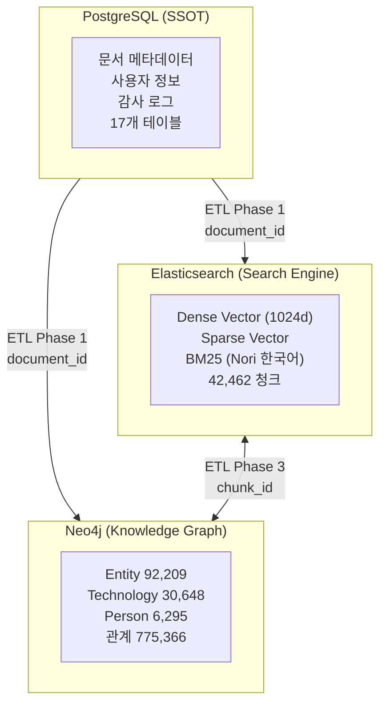
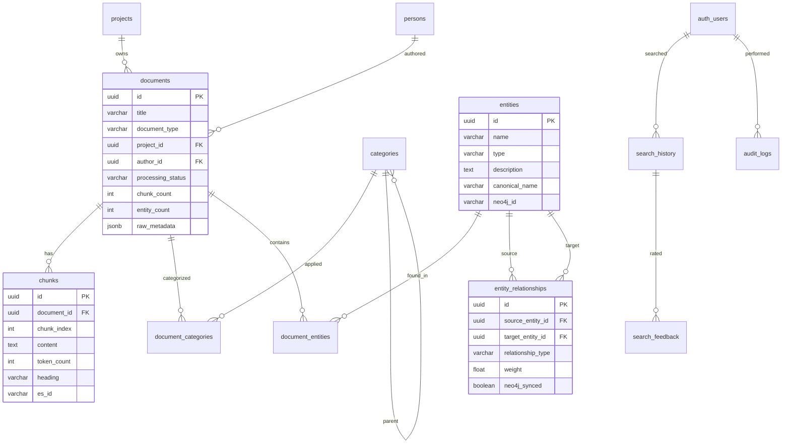
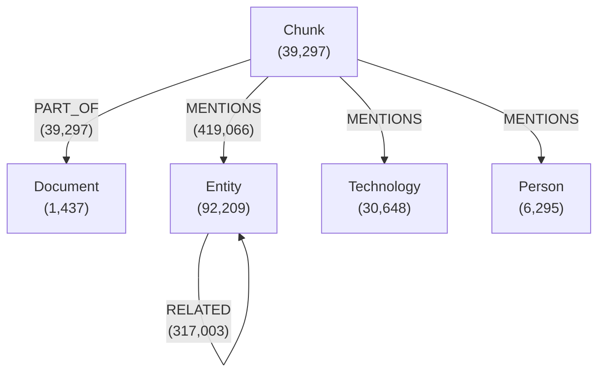
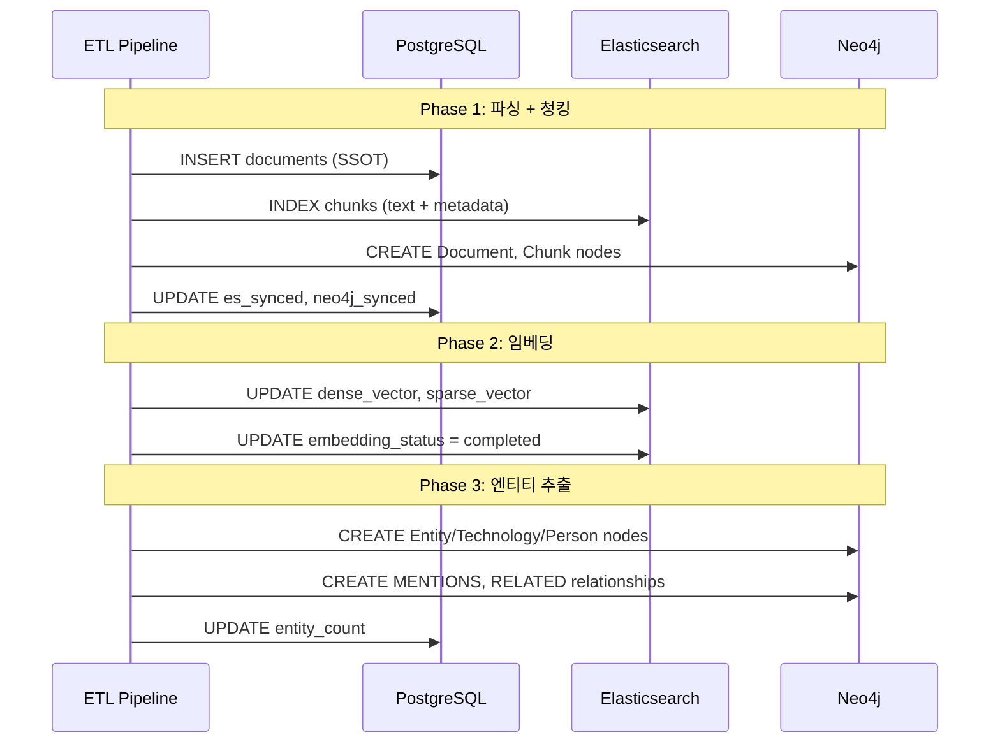

# 데이터베이스 설계서

**프로젝트명**: Hybrid RAG Knowledge Operations
**작성일**: 2026-02-18
**버전**: 1.0

---

## 1. Triple-Store 전략

본 시스템은 세 가지 데이터베이스를 역할별로 분리하여 운영한다. 각 DB는 자신의 강점에 집중하며, 데이터 일관성은 PostgreSQL을 SSOT(Single Source of Truth)로 보장한다.



### 역할 분담 매트릭스

| 기능 | PostgreSQL | Elasticsearch | Neo4j |
|------|:----------:|:-------------:|:-----:|
| 문서 메타데이터 CRUD | **Primary** | 비정규화 복사 | Document 노드 |
| 텍스트 전문검색 (한국어) | - | **Primary** (Nori) | - |
| 벡터 유사도 검색 | - | **Primary** (knn) | - |
| 엔티티 관계 탐색 | - | - | **Primary** (Cypher) |
| 사용자/인증 관리 | **Primary** | - | - |
| 감사 로그 | **Primary** | - | - |
| 검색 이력/피드백 | **Primary** | - | - |
| LLM 비용 추적 | **Primary** | - | - |
| 검색 결과 캐시 | **Redis** | - | - |

---

## 2. PostgreSQL (SSOT)

### 2.1 접속 정보

| 항목 | 값 |
|------|-----|
| 컨테이너명 | kp-postgresql |
| 포트 | 5432 |
| 데이터베이스명 | knowledge |
| 사용자 | knowledge |
| 비밀번호 | knowledge_dev_2026! |
| 접속 예시 | `psql -h localhost -U knowledge -d knowledge` |

### 2.2 ERD (Entity Relationship Diagram)



### 2.3 테이블 상세 (17개)

#### 핵심 테이블

**documents** -- 문서 마스터 테이블 (SSOT)

| 컬럼 | 타입 | 설명 |
|------|------|------|
| id | uuid (PK) | 문서 고유 식별자 |
| title | varchar | 문서 제목 |
| document_type | varchar | 문서 유형 (pdf, docx, md 등) |
| project_id | uuid (FK) | 소속 프로젝트 |
| author_id | uuid (FK) | 작성자 |
| uploaded_by | uuid (FK) | 업로드한 사용자 |
| valid_start_date | date | 유효 시작일 |
| valid_end_date | date | 유효 종료일 |
| file_path | text | 파일 저장 경로 |
| file_name | varchar | 원본 파일명 |
| file_size | bigint | 파일 크기 (bytes) |
| file_type | varchar | MIME 타입 |
| file_hash | varchar | 파일 해시 (중복 방지) |
| processing_status | varchar | 처리 상태 (pending/processing/completed/failed) |
| processing_error | text | 처리 에러 메시지 |
| processed_at | timestamp | 처리 완료 시각 |
| chunk_count | integer | 생성된 청크 수 |
| entity_count | integer | 추출된 엔티티 수 |
| raw_metadata | jsonb | 원본 메타데이터 (유연한 확장) |
| es_synced | boolean | ES 동기화 여부 |
| es_synced_at | timestamp | ES 동기화 시각 |
| neo4j_synced | boolean | Neo4j 동기화 여부 |
| neo4j_synced_at | timestamp | Neo4j 동기화 시각 |
| created_at | timestamp | 생성 시각 |
| updated_at | timestamp | 수정 시각 |

실측: 1,437건 (전체 processing_status = completed)

**chunks** -- 청크 테이블

| 컬럼 | 타입 | 설명 |
|------|------|------|
| id | uuid (PK) | 청크 고유 식별자 |
| document_id | uuid (FK) | 소속 문서 |
| chunk_index | integer | 문서 내 청크 순서 |
| content | text | 청크 텍스트 내용 |
| token_count | integer | 토큰 수 |
| start_char | integer | 원문 시작 위치 |
| end_char | integer | 원문 종료 위치 |
| heading | varchar | 청크가 속한 제목/헤딩 |
| es_id | varchar | Elasticsearch 문서 ID |
| created_at | timestamp | 생성 시각 |

**entities** -- 엔티티 테이블

| 컬럼 | 타입 | 설명 |
|------|------|------|
| id | uuid (PK) | 엔티티 고유 식별자 |
| name | varchar | 엔티티 이름 |
| type | varchar | 유형 (Entity/Technology/Person) |
| description | text | 설명 |
| canonical_name | varchar | 정규화된 이름 (중복 방지) |
| neo4j_id | varchar | Neo4j 노드 ID |
| created_at | timestamp | 생성 시각 |
| updated_at | timestamp | 수정 시각 |

**entity_relationships** -- 엔티티 관계 테이블

| 컬럼 | 타입 | 설명 |
|------|------|------|
| id | uuid (PK) | 관계 고유 식별자 |
| source_entity_id | uuid (FK) | 출발 엔티티 |
| target_entity_id | uuid (FK) | 도착 엔티티 |
| relationship_type | varchar | 관계 유형 (MENTIONS, RELATED_TO 등) |
| description | text | 관계 설명 |
| weight | double precision | 관계 가중치 |
| neo4j_synced | boolean | Neo4j 동기화 여부 |
| created_at | timestamp | 생성 시각 |

#### 인증/사용자 테이블

**auth_users** -- AI Service 인증 사용자

| 컬럼 | 타입 | 설명 |
|------|------|------|
| id | integer (PK) | 사용자 ID |
| email | varchar | 이메일 (로그인 ID) |
| username | varchar | 사용자명 |
| password_hash | varchar | bcrypt 해시 ($2b$12$) |
| first_name | varchar | 이름 |
| last_name | varchar | 성 |
| roles | varchar | 역할 (admin, user) |
| is_active | boolean | 활성 여부 |
| is_locked | boolean | 잠금 여부 |
| failed_login_attempts | integer | 로그인 실패 횟수 |
| locked_until | timestamp | 잠금 해제 시각 |
| last_login_at | timestamp | 마지막 로그인 |
| created_at | timestamp | 생성 시각 |
| updated_at | timestamp | 수정 시각 |

**persons** -- 문서 작성자/담당자

| 컬럼 | 타입 | 설명 |
|------|------|------|
| id | uuid (PK) | 인물 ID |
| name | varchar | 이름 |
| email | varchar | 이메일 |
| department | varchar | 부서 |
| position | varchar | 직위 |
| user_id | uuid (FK) | auth_users 연결 |
| created_at | timestamp | 생성 시각 |
| updated_at | timestamp | 수정 시각 |

#### 분류/카테고리 테이블

**categories** -- 계층형 카테고리

| 컬럼 | 타입 | 설명 |
|------|------|------|
| id | uuid (PK) | 카테고리 ID |
| name | varchar | 카테고리명 |
| code | varchar | 카테고리 코드 |
| description | text | 설명 |
| parent_id | uuid (FK, self) | 상위 카테고리 (계층 구조) |
| level | integer | 계층 깊이 |
| sort_order | integer | 정렬 순서 |
| is_active | boolean | 활성 여부 |
| created_at | timestamp | 생성 시각 |
| updated_at | timestamp | 수정 시각 |

**document_categories** -- 문서-카테고리 매핑

| 컬럼 | 타입 | 설명 |
|------|------|------|
| document_id | uuid (FK) | 문서 ID |
| category_id | uuid (FK) | 카테고리 ID |
| confidence | double precision | 분류 신뢰도 |
| created_at | timestamp | 생성 시각 |

**document_entities** -- 문서-엔티티 매핑

| 컬럼 | 타입 | 설명 |
|------|------|------|
| document_id | uuid (FK) | 문서 ID |
| entity_id | uuid (FK) | 엔티티 ID |
| relevance_score | double precision | 관련도 점수 |
| mention_count | integer | 언급 횟수 |
| created_at | timestamp | 생성 시각 |

#### 검색/피드백 테이블

**search_history** -- 검색 이력

| 컬럼 | 타입 | 설명 |
|------|------|------|
| id | uuid (PK) | 검색 ID |
| user_id | uuid (FK) | 검색한 사용자 |
| query_text | text | 검색 쿼리 |
| query_hash | varchar | 쿼리 해시 (캐시 키) |
| intent | varchar | 검색 의도 |
| filters | jsonb | 적용된 필터 |
| result_count | integer | 결과 수 |
| search_duration_ms | integer | 검색 소요 시간 (ms) |
| cached | boolean | 캐시 히트 여부 |
| created_at | timestamp | 검색 시각 |

**search_feedback** -- 검색 결과 피드백

| 컬럼 | 타입 | 설명 |
|------|------|------|
| id | uuid (PK) | 피드백 ID |
| search_id | uuid (FK) | 검색 이력 참조 |
| user_id | uuid (FK) | 피드백 제공 사용자 |
| document_id | uuid (FK) | 평가 대상 문서 |
| rating | integer | 평점 (1-5) |
| feedback_type | varchar | 피드백 유형 |
| comment | text | 피드백 코멘트 |
| created_at | timestamp | 생성 시각 |

#### 운영/감사 테이블

**audit_logs** -- 감사 로그

| 컬럼 | 타입 | 설명 |
|------|------|------|
| id | uuid (PK) | 로그 ID |
| user_id | uuid (FK) | 수행한 사용자 |
| action | varchar | 수행 행동 (CREATE/READ/UPDATE/DELETE) |
| resource_type | varchar | 대상 리소스 유형 |
| resource_id | uuid | 대상 리소스 ID |
| old_value | jsonb | 변경 전 값 |
| new_value | jsonb | 변경 후 값 |
| ip_address | varchar | 요청 IP |
| user_agent | text | 브라우저 정보 |
| request_path | text | 요청 경로 |
| status | varchar | 결과 (success/failure) |
| error_message | text | 에러 메시지 |
| duration_ms | integer | 처리 시간 (ms) |
| created_at | timestamp | 발생 시각 |

**llm_cost_logs** -- LLM 비용 추적

| 컬럼 | 타입 | 설명 |
|------|------|------|
| id | uuid (PK) | 로그 ID |
| task_type | varchar | 작업 유형 (entity_extraction, answer_synthesis 등) |
| model_name | varchar | 사용 모델명 (deepseek-chat 등) |
| input_tokens | integer | 입력 토큰 수 |
| output_tokens | integer | 출력 토큰 수 |
| total_tokens | integer | 총 토큰 수 |
| unit_price_per_1m_tokens | numeric | 100만 토큰당 단가 |
| cost_usd | numeric | 비용 (USD) |
| cache_hit | boolean | 캐시 히트 여부 |
| cache_discount_percent | integer | 캐시 할인율 |
| execution_timestamp | timestamp | 실행 시각 |
| date_key | date | 날짜 키 (일별 집계용) |

**system_config** -- 시스템 설정 (Key-Value)

| 컬럼 | 타입 | 설명 |
|------|------|------|
| key | varchar (PK) | 설정 키 |
| value | jsonb | 설정 값 |
| description | text | 설명 |
| updated_by | uuid | 수정한 사용자 |
| updated_at | timestamp | 수정 시각 |

**projects** -- 프로젝트 관리

| 컬럼 | 타입 | 설명 |
|------|------|------|
| id | uuid (PK) | 프로젝트 ID |
| name | varchar | 프로젝트명 |
| code | varchar | 프로젝트 코드 |
| description | text | 설명 |
| start_date | date | 시작일 |
| end_date | date | 종료일 |
| status | varchar | 상태 |
| owner_id | uuid (FK) | 프로젝트 오너 |
| created_at | timestamp | 생성 시각 |
| updated_at | timestamp | 수정 시각 |

**activity_log** (audit 스키마) -- 활동 로그

별도 audit 스키마에서 관리하는 활동 추적 테이블.

---

## 3. Elasticsearch

### 3.1 접속 정보

| 항목 | 값 |
|------|-----|
| 컨테이너명 | kp-elasticsearch |
| 포트 | 9200 |
| 인증 | 불필요 (개발 환경) |
| 접속 예시 | `curl http://localhost:9200` |
| 시각화 | Kibana (http://localhost:5601) |

### 3.2 인덱스 현황

| 인덱스명 | 문서 수 | 크기 | 용도 |
|----------|--------:|-----:|------|
| knowledge_chunks_v2 | 42,462 | 528.2 MB | 메인 청크 인덱스 (alias: knowledge_chunks) |
| rcsv-pdf-documents | 12,918 | 252.8 MB | 보조 PDF 인덱스 |

### 3.3 knowledge_chunks 매핑

| 필드 | 타입 | Analyzer | 설명 |
|------|------|----------|------|
| chunk_id | keyword | - | 청크 고유 ID |
| document_id | keyword | - | 소속 문서 ID (PG 연결) |
| text | text | **korean_analyzer** | 청크 본문 (BM25 검색 대상) |
| text.keyword | keyword | - | 정확 매칭용 |
| text.standard | text | text_analyzer | 영문/범용 검색용 |
| heading | text | korean_analyzer | 청크 제목/헤딩 |
| dense_vector | dense_vector (1024d) | - | BGE-M3 Dense 임베딩 (cosine similarity) |
| sparse_vector | sparse_vector | - | BGE-M3 Sparse 임베딩 |
| sparse_vector_json | - | - | Sparse 벡터 JSON 백업 |
| chunk_index | integer | - | 문서 내 청크 순서 |
| token_count | integer | - | 토큰 수 |
| original_text_length | integer | - | 원본 텍스트 길이 |
| embedding_model | keyword | - | 임베딩 모델명 |
| embedding_status | keyword | - | 임베딩 상태 (completed/pending) |
| chunker_version | keyword | - | 청커 버전 |
| created_at | date | - | 생성 시각 |
| metadata | object | - | 문서 메타데이터 (비정규화) |
| metadata.document_type | keyword | - | 문서 유형 |
| metadata.file_name | text + keyword | - | 파일명 |
| metadata.categories | keyword | - | 카테고리 목록 |

### 3.4 Analyzer 설정

#### korean_analyzer (BM25 검색용)

```json
{
  "korean_analyzer": {
    "type": "custom",
    "tokenizer": "nori_tokenizer",
    "filter": ["lowercase", "nori_part_of_speech"]
  }
}
```

**nori_tokenizer** 설정:
- decompound_mode: `mixed` (복합어 분해 + 원본 유지)
- user_dictionary_rules: `검색엔진`, `벡터검색`, `하이브리드검색`, `머신러닝`, `딥러닝`, `임베딩`, `쿠버네티스`, `도커`, `마이크로서비스`, `엘라스틱서치`, `네오포제이`, `포스트그레스`, `지식그래프`, `청킹`, `리랭킹`, `파이프라인`, `프레임워크`

**nori_part_of_speech** 필터 (제거 대상):
- E(어미), IC(감탄사), J(조사), MAG(일반부사), MM(관형사), SP(공백)
- SSC(닫는 괄호), SSO(여는 괄호), SC(구분자), SE(줄임표)
- XPN(접두사), XSA/XSN/XSV(접미사), UNA(미분석), NA(미정)

#### text_analyzer (영문/범용 검색용)

```json
{
  "text_analyzer": {
    "type": "custom",
    "tokenizer": "standard",
    "filter": ["lowercase", "asciifolding"]
  }
}
```

### 3.5 검색 쿼리 패턴

**Dense Vector Search (knn)**:
```json
{
  "knn": {
    "field": "dense_vector",
    "query_vector": [0.1, 0.2, ...],
    "k": 10,
    "num_candidates": 100
  }
}
```

**BM25 Keyword Search (Nori)**:
```json
{
  "query": {
    "match": {
      "text": {
        "query": "프로젝트 일정 관리",
        "analyzer": "korean_analyzer"
      }
    }
  }
}
```

**Sparse Vector Search**:
```json
{
  "query": {
    "sparse_vector": {
      "field": "sparse_vector",
      "inference_id": ".elser_model_2",
      "query": "프로젝트 일정"
    }
  }
}
```

---

## 4. Neo4j (Knowledge Graph)

### 4.1 접속 정보

| 항목 | 값 |
|------|-----|
| 컨테이너명 | kp-neo4j |
| Bolt 포트 | 7687 |
| Browser 포트 | 7474 |
| 사용자 | neo4j |
| 비밀번호 | neo4j_dev_2026! |
| Browser URL | http://localhost:7474 |
| Cypher Shell | `cypher-shell -u neo4j -p "neo4j_dev_2026!"` |

### 4.2 노드 라벨

| 라벨 | 수량 | 설명 | 주요 속성 |
|------|-----:|------|----------|
| **Entity** | 92,209 | 추출된 엔티티 (일반) | name, type, description |
| **Chunk** | 39,297 | 문서 청크 | chunk_id, text (요약), document_id |
| **Technology** | 30,648 | 기술/도구 엔티티 | name, description |
| **Person** | 6,295 | 인물 엔티티 | name, department, role |
| **Document** | 1,437 | 문서 | document_id, title, document_type |
| **합계** | **169,886** | | |

### 4.3 관계 유형

| 관계 | 수량 | 시작 노드 | 끝 노드 | 설명 |
|------|-----:|----------|---------|------|
| **MENTIONS** | 419,066 | Chunk | Entity/Technology/Person | 청크가 엔티티를 언급 |
| **RELATED** | 317,003 | Entity | Entity | 엔티티 간 관련성 |
| **PART_OF** | 39,297 | Chunk | Document | 청크가 문서에 소속 |
| **합계** | **775,366** | | | |

### 4.4 그래프 스키마



### 4.5 주요 Cypher 쿼리 패턴

**엔티티 관계 탐색** (Graph Search):
```cypher
MATCH (c:Chunk)-[:MENTIONS]->(e:Entity)
WHERE e.name CONTAINS $query_term
RETURN c.chunk_id, c.text, e.name, e.type
LIMIT 20
```

**2-hop 관계 탐색** (Multi-hop):
```cypher
MATCH (e1:Entity)-[:RELATED]-(e2:Entity)-[:RELATED]-(e3:Entity)
WHERE e1.name = $entity_name
RETURN e1.name, e2.name, e3.name,
       type(r1) as rel1, type(r2) as rel2
LIMIT 50
```

**Post-RRF 엔티티 보강** (chunk_id 기반):
```cypher
MATCH (c:Chunk)-[:MENTIONS]->(e:Entity)
WHERE c.chunk_id IN $chunk_ids
RETURN c.chunk_id, collect(e.name) as entities
```

### 4.6 Slim Graph 전략

16GB RAM 환경에서 Neo4j를 운영하기 위해 Slim Graph 전략을 적용한다.

| 원칙 | 설명 |
|------|------|
| 최소 속성 | 노드에 name, type, description만 저장 |
| 텍스트 외부화 | 청크 전문은 ES에 저장, Neo4j에는 요약만 |
| 배치 쿼리 | chunk_id 목록으로 일괄 조회 |
| 인덱스 최적화 | name, chunk_id, document_id에 인덱스 생성 |

---

## 5. Redis (캐시)

### 5.1 접속 정보

| 항목 | 값 |
|------|-----|
| 컨테이너명 | kp-redis |
| 포트 | 6379 |
| 비밀번호 | 없음 (개발 환경) |
| 접속 예시 | `redis-cli -h localhost -p 6379` |

### 5.2 캐시 전략

| 캐시 대상 | TTL | 키 패턴 | 설명 |
|----------|:---:|---------|------|
| 검색 결과 | 300초 | `search:{query_hash}` | 동일 쿼리 반복 시 캐시 반환 |
| LLM 응답 | 600초 | `llm:{prompt_hash}` | 동일 프롬프트 반복 시 캐시 |
| 문서 메타 | 3600초 | `doc:{document_id}` | 자주 참조되는 문서 메타 |
| 사용자 세션 | 86400초 | `session:{user_id}` | JWT 검증 결과 캐시 |

### 5.3 캐시 무효화

| 이벤트 | 무효화 대상 | 방법 |
|--------|------------|------|
| 문서 업로드/수정 | 관련 검색 캐시 | 패턴 삭제 (`search:*`) |
| ETL 재실행 | 전체 검색 캐시 | FLUSHDB |
| 설정 변경 | 시스템 캐시 | 키별 삭제 |

---

## 6. 데이터 정합성

### 6.1 3-Store 동기화 흐름



### 6.2 정합성 보장 방법

| 방법 | 설명 |
|------|------|
| **document_id 기준** | PG의 UUID를 ES, Neo4j에 동일하게 저장 |
| **chunk_id 기준** | ES chunk_id와 Neo4j Chunk.chunk_id 일치 |
| **동기화 플래그** | PG의 es_synced, neo4j_synced로 동기화 상태 추적 |
| **삭제 동기화** | 쓰레기 청크 삭제 시 ES + Neo4j + PG 3-Store 동시 삭제 |
| **ES Aggregation 보정** | ES aggregation으로 실제 청크 수 확인 후 PG chunk_count 보정 |

### 6.3 현재 정합성 상태 (2026-02-18)

| 기준 | PG | ES | Neo4j | 일치 |
|------|---:|---:|------:|:----:|
| 문서 수 | 1,437 | - | 1,437 | 일치 |
| 청크 수 | 42,484 (chunk_count 합계) | 42,462 | 39,297 | 근사 |
| 임베딩 완료 | - | 42,462 (100%) | - | 완료 |

PG chunk_count 합계(42,484)와 ES 실측(42,462)의 22건 차이는 일부 문서의 chunk_count 보정 미반영에 의한 것으로, 운영에 영향 없음. Neo4j Chunk 노드(39,297)는 쓰레기 청크 삭제 후 일부 노드가 남아있어 차이 발생.

---

*작성: Claude Code (Opus 4.6) | 2026-02-18*
