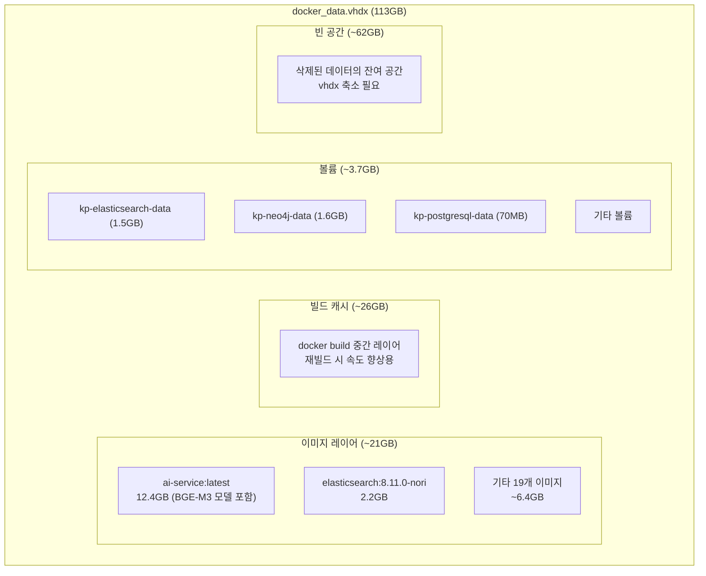
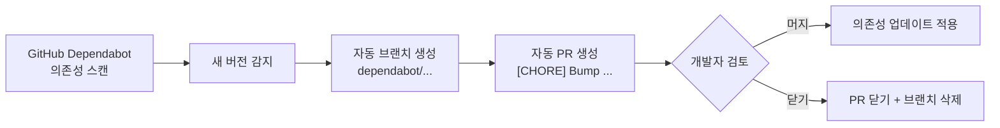

# Docker 디스크 관리 및 인프라 유지보수 가이드

**시스템**: Hybrid RAG Knowledge Platform
**버전**: 1.0
**작성일**: 2026-02-25

---

## 목차

1. [개요](#1-개요)
2. [Docker 디스크 구조 이해](#2-docker-디스크-구조-이해)
3. [디스크 사용량 분석](#3-디스크-사용량-분석)
4. [안전한 디스크 정리](#4-안전한-디스크-정리)
5. [vhdx 파일 축소](#5-vhdx-파일-축소)
6. [GitHub 리포지토리 관리](#6-github-리포지토리-관리)
7. [시연 환경 유지보수 체크리스트](#7-시연-환경-유지보수-체크리스트)

---

## 1. 개요

### 1.1 배경

Docker Desktop은 WSL2 환경에서 가상 디스크 파일(`docker_data.vhdx`)에 모든 데이터를 저장한다. 이 파일은 데이터가 추가될 때 자동으로 커지지만, 데이터를 삭제해도 **자동으로 줄어들지 않는다**. 프로젝트 운영 중 빌드를 반복하면 빌드 캐시가 누적되어 디스크가 빠르게 소진된다.

### 1.2 이 프로젝트의 디스크 현황 (2026-02-25 기준)

| 항목 | 크기 | 비고 |
|------|-----:|------|
| `docker_data.vhdx` 파일 | **113 GB** | D:\Docker\DockerDesktopWSL\disk\ |
| Docker 이미지 (21개) | ~21 GB | ai-service 12.4GB가 최대 |
| 빌드 캐시 | **26 GB** | 안전하게 삭제 가능 |
| 볼륨 (DB 데이터 등) | ~3.7 GB | ES 1.5GB, Neo4j 1.6GB 등 |
| vhdx 오버헤드 (빈 공간) | ~62 GB | 축소 필요 |

---

## 2. Docker 디스크 구조 이해

### 2.1 저장소 계층

Docker의 데이터는 4가지 계층으로 나뉘며, 각각 독립적으로 관리된다.



### 2.2 핵심 개념: 빌드 캐시 vs 이미지 vs 볼륨

| 구분 | 빌드 캐시 | 이미지 | 볼륨 |
|------|----------|--------|------|
| **용도** | `docker build` 속도 향상 | 컨테이너 실행에 필요한 파일시스템 | 컨테이너의 영속 데이터 |
| **생성 시점** | `docker build` 실행 시 | `docker build` 완료 시 | `docker-compose up` 시 |
| **삭제 영향** | 다음 빌드가 느려짐 | 컨테이너 실행 불가 | **DB 데이터 소실** |
| **재생성** | 다시 빌드하면 자동 생성 | 다시 빌드하면 재생성 | ETL 재실행 필요 |
| **이 프로젝트** | 26GB (안전 삭제 가능) | 21GB (시연에 필요) | 3.7GB (시연에 필수) |

### 2.3 임베딩 모델(BGE-M3)은 어디에 저장되는가?

BGE-M3 모델(~2.3GB)은 Docker **이미지** 안에 포함되어 있다.

```
ai-service:latest (12.4GB)
├── Python 3.11 런타임
├── FastAPI / LangGraph / LangChain 등 패키지
├── BGE-M3 임베딩 모델 (~2.3GB)  ← 이미지 레이어에 포함
├── BGE-Reranker ONNX 모델 (~1GB)
└── 애플리케이션 코드
```

**빌드 캐시를 삭제해도 이미지는 그대로 유지**되므로 모델은 영향받지 않는다.

| 작업 | 모델 영향 | 비고 |
|------|:---------:|------|
| `docker builder prune -a` (빌드 캐시 삭제) | **영향 없음** | 이미지는 그대로 |
| `docker rmi ai-service` (이미지 삭제) | **모델 삭제됨** | 재빌드 필요 (~10분) |
| `docker volume prune` (볼륨 삭제) | **영향 없음** | 모델은 볼륨에 없음 |

> **결론**: 시연만 하고 ai-service를 다시 빌드할 일이 없으면, 빌드 캐시 26GB는 안전하게 삭제 가능하다.

---

## 3. 디스크 사용량 분석

### 3.1 전체 현황 확인

```powershell
# PowerShell 또는 WSL에서 실행
docker system df
```

출력 예시:
```
TYPE            TOTAL     ACTIVE    SIZE      RECLAIMABLE
Images          21        18        21.3GB    192MB (0%)
Containers      18        0         316.5MB   316.5MB (100%)
Local Volumes   18        14        3.76GB    2.18MB (0%)
Build Cache     131       0         25.98GB   25.98GB
```

### 3.2 상세 분석

```powershell
# 이미지별 크기 (큰 순서)
docker images --format "table {{.Repository}}\t{{.Tag}}\t{{.Size}}" | sort -k3 -rh

# 볼륨별 크기
docker system df -v
```

### 3.3 이 프로젝트의 이미지 목록 (2026-02-25)

| 이미지 | 크기 | 용도 | 시연 필요 |
|--------|-----:|------|:---------:|
| knowledge-platform/ai-service | **12.4 GB** | AI/RAG 서비스 (BGE-M3 포함) | **필수** |
| kp-elasticsearch (8.11.0-nori) | **2.2 GB** | ES + Nori 한국어 분석기 | **필수** |
| docker.elastic.co/kibana/kibana | **1.7 GB** | ES 데이터 시각화 | 선택 |
| neo4j:5.15-community | 799 MB | Knowledge Graph | **필수** |
| quay.io/keycloak/keycloak | 733 MB | OAuth 2.0 인증 | **필수** |
| knowledge-platform/backend | 584 MB | Spring Boot 비즈니스 로직 | **필수** |
| grafana/grafana | 538 MB | 메트릭 시각화 | 선택 |
| knowledge-platform/api-gateway | 462 MB | Spring Cloud Gateway | **필수** |
| postgres:16-alpine | 395 MB | PostgreSQL (×2) | **필수** |
| prom/prometheus | 349 MB | 메트릭 수집 | 선택 |
| grafana/promtail | 286 MB | 로그 수집 | 선택 |
| minio/minio | 241 MB | 오브젝트 스토리지 | 선택 |
| node:20-alpine | 192 MB | 빌드 전용 (실행 불필요) | 삭제 가능 |
| jaegertracing/all-in-one | 109 MB | 분산 추적 | 선택 |
| knowledge-platform/frontend | 100 MB | React 프론트엔드 | **필수** |
| grafana/loki | 101 MB | 로그 저장 | 선택 |
| knowledge-platform/nginx | 74 MB | 리버스 프록시 | **필수** |
| redis:7.2-alpine | 60 MB | 캐시 서버 | **필수** |
| ghcr.io/github/github-mcp-server | 56 MB | GitHub MCP (개발용) | 삭제 가능 |
| alpine:latest | 13 MB | 빌드 전용 | 삭제 가능 |

### 3.4 볼륨 목록 (시연 데이터)

| 볼륨 | 크기 | 내용 | 삭제 가능 |
|------|-----:|------|:---------:|
| kp-neo4j-data | **1.6 GB** | Knowledge Graph (169K 노드, 775K 관계) | **삭제 금지** |
| kp-elasticsearch-data | **1.5 GB** | 42K+ 청크 + Dense/Sparse 벡터 | **삭제 금지** |
| kp-prometheus-data | 293 MB | 메트릭 시계열 데이터 | 삭제 가능 |
| kp-redis-data | 121 MB | 임베딩 캐시 | 삭제 가능 (재생성됨) |
| kp-postgresql-data | 70 MB | SSOT 문서/사용자 테이블 | **삭제 금지** |
| kp-keycloak-db-data | 70 MB | SSO 사용자/Realm 설정 | **삭제 금지** |
| kp-loki-data | 23 MB | 로그 데이터 | 삭제 가능 |
| kp-grafana-data | 3 MB | 대시보드 설정 | 삭제 시 재설정 필요 |
| (이름 없는 볼륨 6개) | ~2 MB | 임시/미사용 | 삭제 가능 |

---

## 4. 안전한 디스크 정리

### 4.1 정리 순서 (시연 환경 유지)

아래 순서대로 실행하면 시연 데이터를 보존하면서 디스크를 확보할 수 있다.

#### Step 1: 빌드 캐시 정리 (예상 회수: ~26GB)

```powershell
docker builder prune -a
```

- **영향**: 다음 `docker-compose build` 시 처음부터 빌드 (모델 다운로드 포함 ~10분)
- **시연 영향**: 없음 (이미 빌드된 이미지는 그대로)
- **다시 빌드할 일이 없으면**: 완전히 안전

#### Step 2: dangling 이미지 삭제 (예상 회수: ~50MB)

```powershell
# 태그 없는 중간 이미지 삭제
docker image prune
```

- **영향**: 없음 (태그가 없는 이미지 = 사용되지 않는 이미지)

#### Step 3: 미사용 이미지 삭제 — 선택사항 (예상 회수: ~260MB)

```powershell
# 빌드 전용 이미지 삭제 (시연에 불필요)
docker rmi node:20-alpine alpine:latest ghcr.io/github/github-mcp-server:latest
```

- **영향**: 재빌드 시 다시 pull 필요
- **시연 영향**: 없음

#### Step 4: 미사용 볼륨 삭제 — 선택사항 (예상 회수: ~2MB)

```powershell
# 이름 없는 미사용 볼륨만 삭제 (kp-* 볼륨은 유지됨)
docker volume prune
```

- **주의**: 확인 프롬프트에서 삭제 대상을 반드시 확인
- `kp-*` 이름이 붙은 볼륨은 현재 컨테이너에 연결되어 있어 prune 대상이 아님

### 4.2 절대 하면 안 되는 것

```powershell
# ❌ 전체 초기화 (모든 이미지 + 볼륨 삭제)
docker system prune -a --volumes    # 시연 데이터 전부 소실!

# ❌ 특정 데이터 볼륨 삭제
docker volume rm kp-elasticsearch-data   # 42K 청크 + 벡터 소실!
docker volume rm kp-neo4j-data           # 169K 엔티티 그래프 소실!
docker volume rm kp-postgresql-data      # 문서 메타데이터 소실!

# ❌ ai-service 이미지 삭제
docker rmi knowledge-platform/ai-service:latest   # BGE-M3 모델 소실!
```

### 4.3 예상 정리 결과

| 단계 | 작업 | 회수량 | 누적 |
|:----:|------|-------:|-----:|
| 1 | 빌드 캐시 정리 | 26 GB | 26 GB |
| 2 | dangling 이미지 | 0.05 GB | 26 GB |
| 3 | 미사용 이미지 | 0.26 GB | 26.3 GB |
| 4 | 미사용 볼륨 | 0.002 GB | 26.3 GB |
| **5** | **vhdx 축소 (Section 5)** | **20~40 GB** | **46~66 GB** |

---

## 5. vhdx 파일 축소

### 5.1 왜 필요한가?

Docker 내부에서 데이터를 삭제해도 `docker_data.vhdx` 파일 크기는 줄어들지 않는다. 빈 공간을 실제로 회수하려면 vhdx 파일을 **별도로 축소**해야 한다.

예: 빌드 캐시 26GB를 삭제해도 vhdx 파일은 113GB 그대로 → 축소 후 70~80GB로 감소

### 5.2 사전 조건

> **중요**: vhdx 축소는 반드시 **Windows PowerShell(관리자)**에서 실행해야 한다.
> WSL 내부(Linux 셸, Claude Code 등)에서는 실행할 수 없다.
> `wsl --shutdown` 실행 시 **모든 WSL 세션이 종료**되므로, WSL에서 작업 중인 내용은 미리 저장해야 한다.

### 5.3 축소 절차

아래 명령을 **Windows PowerShell (관리자 권한)**에서 순서대로 실행한다.

#### Step 1: Docker Desktop 및 WSL 종료

```powershell
# Docker Desktop 종료: 트레이 아이콘 → Quit Docker Desktop
# 또는 PowerShell에서:
wsl --shutdown
```

#### Step 2: 축소 전 크기 확인

```powershell
# 현재 vhdx 파일 크기 (GB 단위)
[math]::Round((Get-Item "D:\Docker\DockerDesktopWSL\disk\docker_data.vhdx").Length / 1GB, 2)
```

#### Step 3: vhdx 축소 실행 (방법 택 1)

**방법 A: Hyper-V가 있는 경우 (Windows Pro/Enterprise)**

```powershell
Optimize-VHD -Path "D:\Docker\DockerDesktopWSL\disk\docker_data.vhdx" -Mode Full
```

**방법 B: Hyper-V가 없는 경우 (Windows Home)**

```powershell
diskpart
```

diskpart 프롬프트에서 아래 명령을 순서대로 입력:

```
select vdisk file="D:\Docker\DockerDesktopWSL\disk\docker_data.vhdx"
attach vdisk readonly
compact vdisk
detach vdisk
exit
```

#### Step 4: 축소 후 크기 확인

```powershell
[math]::Round((Get-Item "D:\Docker\DockerDesktopWSL\disk\docker_data.vhdx").Length / 1GB, 2)
```

#### Step 5: Docker Desktop 재시작

Docker Desktop을 실행하면 WSL도 자동으로 다시 올라오고 정상 동작한다.

### 5.4 주의사항

| 항목 | 설명 |
|------|------|
| **실행 환경** | 반드시 Windows PowerShell (관리자). WSL 내부에서 실행 불가 |
| **WSL 세션 종료** | `wsl --shutdown` 시 모든 WSL 인스턴스 (Ubuntu, Claude Code 등) 즉시 종료 |
| **Docker Desktop** | 실행 중이면 축소 실패 또는 데이터 손상 가능. 반드시 먼저 종료 |
| **소요 시간** | 파일 크기에 따라 1~5분 |
| **예상 결과** | 빌드 캐시 26GB 삭제 후 축소 시 113GB → 70~80GB |

---

## 6. GitHub 리포지토리 관리

### 6.1 Dependabot 자동 PR 관리

Dependabot은 GitHub에서 제공하는 자동 의존성 업데이트 봇이다. 활성화되어 있으면 주기적으로 의존성 업데이트 PR을 자동 생성한다.

#### Dependabot 동작 방식



#### PR 닫기 vs 삭제

| 작업 | 설명 | PR 기록 | 브랜치 |
|------|------|:-------:|:------:|
| **닫기 (Close)** | PR을 머지하지 않고 종료 | 남아있음 (Closed 탭) | 남아있음 |
| **브랜치 삭제** | 원격 브랜치 제거 → PR 자동 닫힘 | 남아있음 (Closed 탭) | 삭제됨 |

일반적으로 **브랜치 삭제가 가장 깔끔**하다 (PR도 자동으로 닫힘).

#### 일괄 정리 방법 (gh CLI)

```bash
# 열린 dependabot PR의 브랜치를 일괄 삭제 → PR 자동 닫힘
git fetch origin
git branch -r | grep 'origin/dependabot/' | sed 's|origin/||' | xargs -I {} git push origin --delete {}
```

#### Dependabot 비활성화

프로젝트 종료 후 더 이상 자동 PR이 불필요하면 설정 파일을 비워서 비활성화한다.

**`.github/dependabot.yml`**:
```yaml
# Dependabot configuration - DISABLED
# 프로젝트 종료 단계로 의존성 자동 업데이트 비활성화
# 재활성화 필요 시: updates 배열에 ecosystem 설정 추가

version: 2
updates: []
```

> 이 프로젝트에서는 2026-02-25에 19개 dependabot PR을 정리하고 비활성화 완료하였다.

### 6.2 GitHub 동기화 확인

로컬과 원격 리포지토리의 동기화 상태를 확인하는 방법:

```bash
# 1. 원격 최신 정보 가져오기
git fetch origin

# 2. 로컬 vs 원격 비교
git status              # 로컬 변경사항
git log --oneline origin/main..HEAD   # 로컬에만 있는 커밋
git log --oneline HEAD..origin/main   # 원격에만 있는 커밋

# 3. 동기화 (원격 → 로컬)
git pull                # fast-forward 머지

# 4. 동기화 (로컬 → 원격)
git push origin main
```

---

## 7. 시연 환경 유지보수 체크리스트

### 7.1 시연 전 확인사항

```
[ ] Docker Desktop 실행 확인
[ ] docker-compose up -d 로 전체 컨테이너 기동
[ ] 핵심 서비스 Health Check:
    - http://localhost       (Frontend)
    - http://localhost:8000/docs  (AI Service Swagger)
    - http://localhost:7474  (Neo4j Browser)
    - http://localhost:5601  (Kibana)
[ ] 검색 테스트 (Chat 검색 1건 실행 확인)
[ ] 로그인 확인 (admin@example.com / admin123!)
```

### 7.2 디스크 부족 시 긴급 조치

```powershell
# 1. 빌드 캐시 정리 (가장 효과적, 시연 영향 없음)
docker builder prune -a -f

# 2. 컨테이너 로그 정리
docker compose -f knowledge_service/docker-compose.yml logs --no-log-prefix > /dev/null

# 3. Docker Desktop 종료 후 vhdx 축소
wsl --shutdown
# (Section 5 절차 수행)
```

### 7.3 시연 후 정리

시연이 완전히 종료된 후에는 전체 정리가 가능하다.

```powershell
# 전체 Docker 리소스 정리 (모든 데이터 삭제)
docker-compose -f knowledge_service/docker-compose.yml down -v
docker system prune -a --volumes -f

# vhdx 축소
wsl --shutdown
# (Section 5 절차 수행)
```

> **경고**: 위 명령은 모든 컨테이너, 이미지, 볼륨을 삭제한다. ETL 재실행(~24시간) 없이는 복구 불가.

---

## 변경 이력

| 날짜 | 버전 | 내용 |
|------|------|------|
| 2026-02-25 | 1.0 | 초기 작성 — Docker 디스크 구조, 안전한 정리 절차, vhdx 축소, Dependabot 관리, 시연 체크리스트 |
