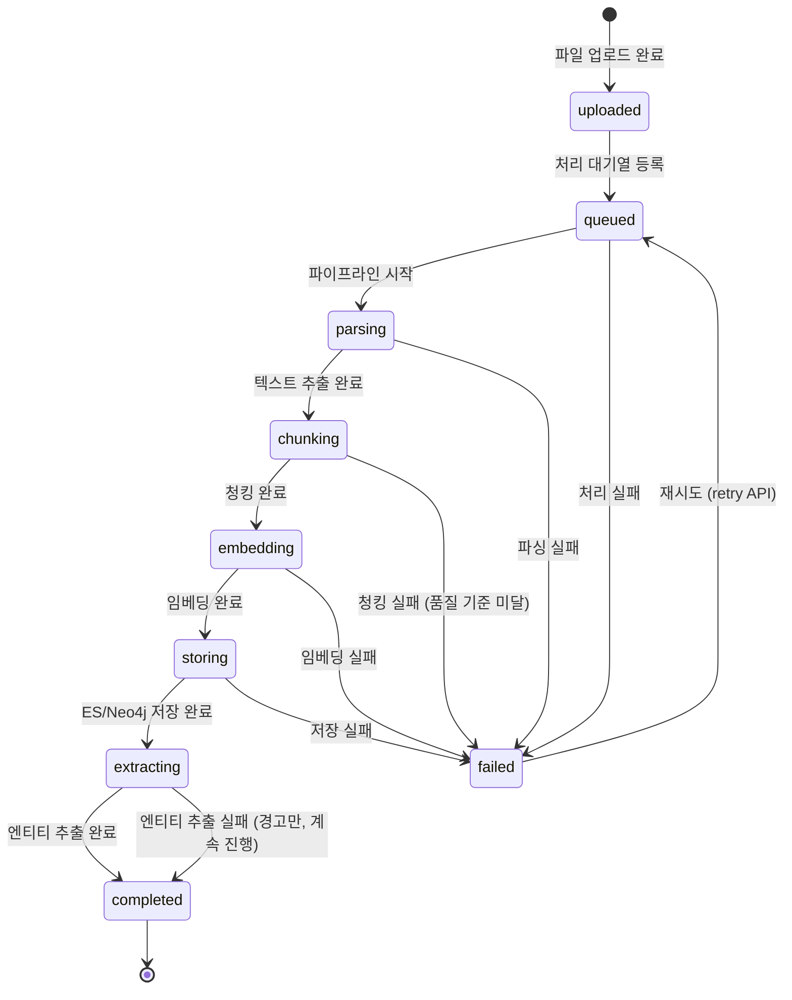
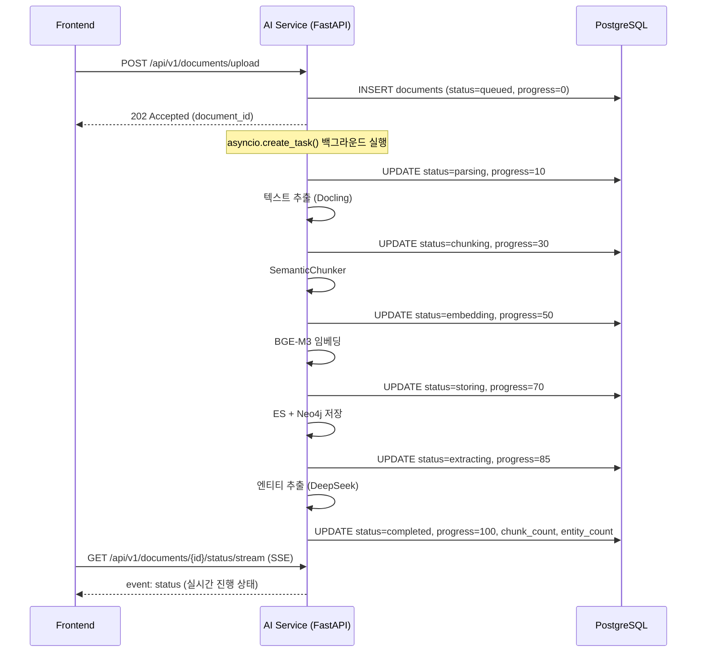
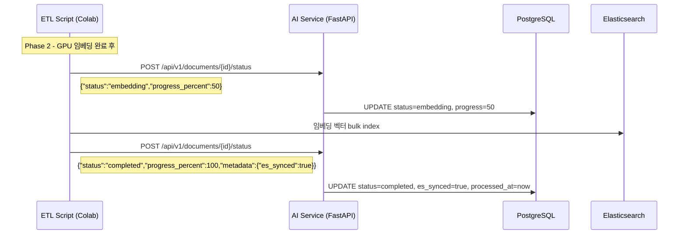

# STORY-089: PG-AI Service 문서 동기화 설계

**작성일**: 2026-03-05
**담당**: Backend Developer
**Sprint**: 09
**Story Points**: 5 SP

---

## 1. 현황 분석

### 1.1 문서 처리 파이프라인 현황

`document_processing_pipeline.py`에 세부 상태가 이미 정의되어 있음:

```python
class ProcessingStatus:
    UPLOADED   = "uploaded"
    QUEUED     = "queued"
    PROCESSING = "processing"
    PARSING    = "parsing"
    CHUNKING   = "chunking"
    EMBEDDING  = "embedding"
    STORING    = "storing"
    EXTRACTING = "extracting"
    COMPLETED  = "completed"
    FAILED     = "failed"
```

각 단계에서 `repository.update_document_status()` 호출로 상태 업데이트 시도 중.

### 1.2 문제점

| 문제 | 위치 | 영향 |
|------|------|------|
| PG dual-write가 in-memory 분기에만 존재 | `document_processing_pipeline.py:219` | PG backend 모드에서 중간 상태 미반영 |
| `progress_percent` 컬럼 PG 미존재 | `01_postgresql_schema.sql` | 진행률 저장 불가 |
| `processing_error` vs `error_message` 컬럼명 혼용 | `document_repository.py:264`, `document_processing_pipeline.py:250` | 에러 메시지 저장 누락 위험 |
| AI Service → PG 콜백 없음 | AI Service 파이프라인 | ETL batch 처리 시 상태 미동기화 |

### 1.3 PG documents 테이블 현재 상태 필드

```sql
processing_status  VARCHAR(30) DEFAULT 'pending'   -- 상태
processing_error   TEXT                             -- 에러 메시지
processed_at       TIMESTAMP                        -- 완료 시각
chunk_count        INTEGER DEFAULT 0
entity_count       INTEGER DEFAULT 0
es_synced          BOOLEAN DEFAULT false
es_synced_at       TIMESTAMP
neo4j_synced       BOOLEAN DEFAULT false
neo4j_synced_at    TIMESTAMP
-- progress_percent 컬럼 없음!
```

---

## 2. 동기화 방식 결정

### 2.1 방식 비교

| 방식 | 장점 | 단점 | 적합도 |
|------|------|------|--------|
| **직접 DB 업데이트** (AI Service → PG) | 즉시 반영, 단순 | AI Service가 PG 의존성 추가, 결합도 증가 | 중간 |
| **API 콜백** (AI Service → Backend API → PG) | 관심사 분리, 검증 가능 | 네트워크 홉 추가 | 높음 |
| **이벤트 기반** (Kafka/Redis) | 비동기, 확장성 | 인프라 복잡도 증가 | 낮음 (과도함) |

### 2.2 채택: API 콜백 방식

온라인 처리(즉시 업로드 후 처리)는 기존 in-process 방식 유지.
ETL 배치 처리(3-Phase)는 AI Service가 Backend API를 호출하여 상태 업데이트.

**결정 이유**:
- 현재 AI Service와 Backend가 동일 Docker network에서 동작
- Backend API가 유일한 PG 게이트웨이 역할 (보안 명확)
- Phase 2 GPU 임베딩 완료 후 상태 업데이트 필요한 요구사항에 적합

---

## 3. 상태 흐름 정의



### 3.1 상태별 progress_percent 매핑

| 상태 | progress_percent | 설명 |
|------|-----------------|------|
| uploaded | 0 | 업로드만 완료 |
| queued | 0 | 처리 대기 |
| parsing | 10 | 파싱 시작 |
| chunking | 30 | 청킹 처리 |
| embedding | 50 | 임베딩 생성 |
| storing | 70 | ES/Neo4j 저장 |
| extracting | 85 | 엔티티 추출 |
| completed | 100 | 완료 |
| failed | 0 | 실패 |

---

## 4. 구현 설계

### 4.1 PG 스키마 변경 (신규 마이그레이션)

```sql
-- Migration: STORY-089 PG progress_percent 컬럼 추가
ALTER TABLE documents
    ADD COLUMN IF NOT EXISTS progress_percent INTEGER DEFAULT 0
    CHECK (progress_percent BETWEEN 0 AND 100);

-- processed_at 업데이트 보장
ALTER TABLE documents
    ALTER COLUMN processed_at SET DEFAULT NULL;
```

### 4.2 Backend: 상태 콜백 API 엔드포인트 추가

```
POST /api/v1/documents/{document_id}/status
Content-Type: application/json
Authorization: Bearer <internal_service_token>

{
    "status": "embedding",
    "progress_percent": 50,
    "error_message": null,
    "metadata": {
        "chunk_count": 42,
        "entity_count": 15,
        "es_synced": true,
        "neo4j_synced": false
    }
}
```

**응답**:
```json
{
    "document_id": "uuid",
    "status": "embedding",
    "progress_percent": 50,
    "updated_at": "2026-03-05T10:00:00Z"
}
```

### 4.3 document_repository.py 수정 사항

`update_status()` 메서드에 `progress_percent` 지원 추가 (현재 파라미터는 있지만 DB에 반영 안 됨):

```python
async def update_status(
    self,
    document_id: UUID,
    status: str,
    error_message: Optional[str] = None,
    progress_percent: int = 0,  # DB에 반영
    chunk_count: Optional[int] = None,
    entity_count: Optional[int] = None,
    es_synced: Optional[bool] = None,
    neo4j_synced: Optional[bool] = None,
) -> None:
    # progress_percent를 SET 절에 포함
    set_parts = [
        "processing_status = $2",
        "processing_error = $3",
        "updated_at = $4",
        "progress_percent = $5",   # 추가
    ]
    params = [document_id, status, error_message, now, progress_percent]
    # ...
    if status == "completed":
        set_parts.append(f"processed_at = ${idx}")
        params.append(now)
```

### 4.4 document_processing_pipeline.py 수정 사항

현재 in-memory 분기에만 있는 dual-write를 PG backend 모드에서도 일관되게 동작하도록 수정.

현재 문제 위치(`document_processing_pipeline.py:218-235`):
```python
# STORY-089: PG dual-write - in-memory 업데이트 후 PG에도 동기화
try:
    from app.services.document_repository import get_document_repository
    pg_repo = await get_document_repository()
    await pg_repo.update_status(...)
except Exception as e:
    logger.warning(f"PG dual-write failed (non-critical): {e}")
```

이 코드는 `_use_memory=True` 분기 내부에 있어, PG backend 모드(`_use_memory=False`)에서는 `update_document_status()` 내 직접 PG 업데이트 경로를 사용함 → 이미 `progress_percent` 없이 업데이트됨.

**수정**: PG backend 모드의 `update_document_status()` 메서드에 `progress_percent` 포함.

---

## 5. 시퀀스 다이어그램

### 5.1 온라인 업로드 처리 (기존 + 개선)



### 5.2 ETL 배치 처리 (Phase 2 GPU 임베딩 후 상태 업데이트)



---

## 6. API 스펙 합의 요청 (rag 팀원 검토 필요)

### 6.1 AI Service에서 호출할 콜백 API

**POST** `/api/v1/documents/{document_id}/status`

| 필드 | 타입 | 필수 | 설명 |
|------|------|------|------|
| status | str | O | 처리 상태 (parsing/chunking/embedding/storing/extracting/completed/failed) |
| progress_percent | int | X | 진행률 0-100 |
| error_message | str | X | 실패 시 에러 메시지 |
| metadata.chunk_count | int | X | 생성된 청크 수 |
| metadata.entity_count | int | X | 추출된 엔티티 수 |
| metadata.es_synced | bool | X | ES 동기화 완료 여부 |
| metadata.neo4j_synced | bool | X | Neo4j 동기화 완료 여부 |

**인증**: 내부 서비스 토큰 또는 공유 시크릿 헤더
→ 현재 AI Service 내부 처리라 별도 인증 없음, `X-Internal-Service: ai-service` 헤더로 식별

### 6.2 rag 팀원에게 질문

1. ETL 3-Phase 중 어느 단계에서 PG 상태 업데이트가 필요한가?
   - Phase 1 완료 시: `stored` or `completed`? → `chunking_complete` 중간 상태 필요?
   - Phase 2 (GPU 임베딩) 완료 시: `embedding_complete` → `completed`로 변경?
   - Phase 3 (엔티티 추출) 완료 시: `completed` 확인?

2. AI Service에서 직접 PG 업데이트 vs Backend API 콜백 중 어느 방식 선호?
   - 현재 AI Service에 asyncpg 이미 있음 (직접 업데이트 가능)
   - Backend API 콜백이 관심사 분리 측면에서 더 깔끔

---

## 7. 구현 순서 (우선순위)

| 순서 | 작업 | 담당 | 비고 |
|------|------|------|------|
| 1 | PG 스키마 `progress_percent` 컬럼 추가 마이그레이션 | Backend (DB 협의) | 즉시 적용 가능 |
| 2 | `document_repository.update_status()` progress_percent 반영 | Backend | 1 선행 |
| 3 | `document_processing_pipeline.py` PG backend 모드 dual-write 검증 | Backend | 현재 동작 확인 필요 |
| 4 | 상태 콜백 API 엔드포인트 추가 (`POST /documents/{id}/status`) | Backend | rag와 스펙 합의 후 |
| 5 | ETL 3-Phase 스크립트에 콜백 호출 추가 | RAG/ETL | 4 선행 |
| 6 | Frontend SSE 연동 검증 | Frontend | 기존 `/status/stream` 활용 |

---

## 8. 완료 기준

- [x] 현재 문서 처리 파이프라인 분석 완료
- [x] 동기화 방식 설계 문서 작성 (API 콜백 방식 채택)
- [ ] AI Service 상태 콜백 API 구현 (rag와 스펙 합의 후)
- [x] PG documents 테이블 상태 필드 정의 (`progress_percent` 추가 필요)

---

## 9. 관련 파일

| 파일 | 역할 |
|------|------|
| `knowledge_service/src/app/services/document_processing_pipeline.py` | 파이프라인 + 상태 업데이트 |
| `knowledge_service/src/app/services/document_repository.py` | PG asyncpg 연동 |
| `knowledge_service/src/app/api/routes/documents.py` | REST API + SSE 스트리밍 |
| `infrastructure/docker/init-db/01_postgresql_schema.sql` | PG 스키마 (progress_percent 미존재) |
