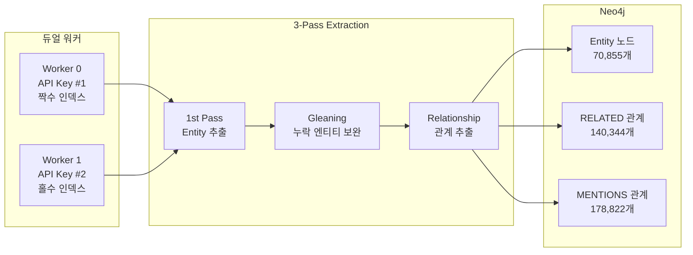

# Entity Extraction 결과 보고서

**날짜**: 2026-02-15
**Sprint**: Sprint 12
**Phase**: ETL Phase 3 - Gleaning Entity Extraction

---

## 1. 실행 요약

| 항목 | 값 |
|------|-----|
| 대상 청크 | 16,185건 (token_count >= 100) |
| 처리 완료 | 16,185건 (100%) |
| 소요 시간 | ~8시간 (14:00~22:25 KST) |
| 워커 | 2개 (듀얼 API 키 파티셔닝) |
| Concurrency | 10 per worker |
| LLM | DeepSeek V3.2 (deepseek-chat) |
| Gleaning | 1회 (2-pass extraction) |
| 에러 | 23건 (0.14%) |

---

## 2. 추출 결과

### 2.1 전체 통계

| 항목 | 값 |
|------|-----|
| 고유 엔티티 | **70,855개** |
| 총 노드 (Neo4j) | **128,355개** |
| 총 관계 (Neo4j) | **375,229개** |
| MENTIONS 관계 | 178,822개 |
| RELATED 관계 | 140,344개 |
| PART_OF 관계 | 56,063개 |
| 고립 엔티티 | 0개 (100% 연결) |

### 2.2 엔티티 타입 분포

| 타입 | 수량 | 비율 |
|------|-----:|-----:|
| Concept | 38,376 | 54.2% |
| Technology | 11,197 | 15.8% |
| Person | 4,403 | 6.2% |
| Entity (미분류) | 4,342 | 6.1% |
| Project | 4,339 | 6.1% |
| Organization | 3,316 | 4.7% |
| Technology+Concept | 2,543 | 3.6% |
| 기타 복합 라벨 | 2,339 | 3.3% |
| **합계** | **70,855** | **100%** |

### 2.3 관계 타입 분포

| 관계 타입 | 수량 | 설명 |
|-----------|-----:|------|
| MENTIONS | 178,822 | Chunk → Entity 참조 |
| RELATED | 140,344 | Entity ↔ Entity 의미적 관계 |
| PART_OF | 56,063 | Chunk → Document 소속 |

RELATED 관계는 `type` 속성에 세부 관계 유형 보유 (CREATED, USES, MANAGES 등)

### 2.4 Chunk-Entity 커버리지

| 항목 | 값 |
|------|-----|
| 엔티티 보유 청크 | 16,180 / 56,063 (28.9%) |
| 엔티티 미보유 청크 | 39,883 (tc < 100 대상 미처리) |

> 전체 56,063 청크 중 tc>=100인 16,185건만 처리. 미보유 39,883건은 토큰 수 부족으로 처리 대상 제외.

### 2.5 가장 많이 언급된 엔티티 (TOP 10)

| 순위 | 엔티티 | 타입 | 언급 수 |
|------|--------|------|--------:|
| 1 | Holmes | Person | 1,859 |
| 2 | Watson | Person | 1,235 |
| 3 | Claude Code | Technology | 853 |
| 4 | Claude | Technology | 813 |
| 5 | Anthropic | Organization | 775 |
| 6 | LLM | Technology | 720 |
| 7 | AI | Technology | 642 |
| 8 | OpenAI | Organization | 525 |
| 9 | API | Technology | 504 |
| 10 | 개발자 | Person | 428 |

> Holmes/Watson은 셜록홈즈 소설 데이터에서 추출. AI/Tech 관련 엔티티가 상위권.

### 2.6 가장 많은 연결을 가진 엔티티 (TOP 5)

| 엔티티 | 연결 수 |
|--------|--------:|
| Holmes | 4,403 |
| Claude Code | 2,614 |
| Claude | 2,197 |
| Watson | 2,152 |
| AI | 2,026 |

---

## 3. 품질 평가

### 3.1 강점
- **100% 완료**: 16,185건 전량 처리, 에러율 0.14%
- **풍부한 관계**: 엔티티당 평균 ~2.0개 RELATED 관계
- **0 고립 엔티티**: 모든 엔티티가 최소 1개 이상 연결
- **의미 있는 관계 설명**: RELATED 관계에 자연어 description 속성 보유

### 3.2 개선 포인트
- **미분류 엔티티 6.1%**: Entity 라벨만 있고 세부 타입 없는 4,342건
- **복합 라벨**: 일부 엔티티가 Person+Organization 등 다중 라벨 보유 (정제 필요)
- **한글/영문 혼재**: 동일 개념의 한글/영문 중복 가능성 (예: AI/인공지능)

### 3.3 Neo4j 리소스

| 항목 | 값 |
|------|-----|
| 메모리 | 1.64GB / 2GB (82.1%) |
| 노드 수 | 128,355 |
| 관계 수 | 375,229 |

---

## 4. 성능 분석

### 4.1 속도

| 구간 | 속도 | 비고 |
|------|------|------|
| 단일 키 (concurrency=5) | ~8.3 chunks/min | 기본 |
| 단일 키 (concurrency=10) | ~14.3 chunks/min | 최적 |
| 단일 키 (concurrency=20) | ~14.3 chunks/min | Rate Limit |
| **듀얼 키 (concurrency=10×2)** | **~40 chunks/min** | **3.1x 향상** |

### 4.2 API 비용 (추정)

| 항목 | 값 |
|------|-----|
| API 호출 | ~48,555회 (16,185 × 3 passes) |
| 평균 토큰/호출 | ~2,000 (입력+출력) |
| 총 토큰 | ~97M tokens |
| DeepSeek V3.2 비용 | ~$0.27/M input + $1.10/M output |
| 추정 비용 | **~$50-70** |

---

## 5. 아키텍처

---

*기록자: Claude Code (Opus 4.6)*
*기록 시간: 2026-02-15 23:09 KST*
