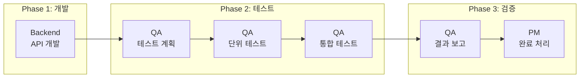

# STORY-024 작업 지시서

## 문서 정보

| 항목 | 값 |
|------|-----|
| **Story** | STORY-024: 직접 로그인 API 개발 |
| **Jira ID** | SCRUM-24 |
| **작성일** | 2026-01-25 |
| **작성자** | PM Agent |
| **Sprint** | Sprint 02 |

---

## 1. 개요

Frontend 로그인 UI가 구현되었으나 직접 로그인 API가 미개발 상태입니다.
본 작업 지시서는 Backend와 QA 에이전트에게 STORY-024 개발 및 테스트 작업을 할당합니다.

---

## 2. Backend Agent 작업 지시

### 2.1 담당자
- **Agent**: Backend Developer
- **역할**: 직접 로그인 API 개발

### 2.2 작업 내용

#### 2.2.1 API 엔드포인트 개발

| 메서드 | 경로 | 설명 |
|--------|------|------|
| POST | `/api/auth/login` | 이메일/비밀번호 로그인 |
| POST | `/api/auth/refresh` | Access Token 갱신 |
| POST | `/api/auth/logout` | 로그아웃 (세션 종료) |
| GET | `/api/auth/me` | 현재 사용자 정보 조회 |

#### 2.2.2 생성해야 할 파일

```
knowledge_service/backend/src/main/java/com/knowledge/backend/
├── api/
│   ├── controller/
│   │   └── AuthController.java              # 신규
│   └── dto/
│       └── auth/
│           ├── LoginRequest.java            # 신규
│           ├── LoginResponse.java           # 신규
│           ├── RefreshRequest.java          # 신규
│           ├── TokenResponse.java           # 신규
│           └── ErrorResponse.java           # 신규 (또는 공통 사용)
├── service/
│   └── AuthService.java                     # 신규
├── security/
│   └── JwtTokenProvider.java                # 수정 또는 신규
└── config/
    └── SecurityConfig.java                  # 수정 (/api/auth/** 공개)
```

#### 2.2.3 기술 요구사항

1. **비밀번호 검증**: BCryptPasswordEncoder 사용
2. **JWT 토큰**:
   - Access Token: 1시간 유효
   - Refresh Token: 7일 유효
   - 환경변수 `JWT_SECRET` 사용
3. **Rate Limiting**: 5회 연속 실패 시 429 응답 (Bucket4j 또는 Redis)
4. **Redis 세션**: Refresh Token 저장 및 관리
5. **에러 처리**: 표준 에러 응답 형식 사용

#### 2.2.4 API 명세

```yaml
# POST /api/auth/login
request:
  Content-Type: application/json
  body:
    email: string (required)
    password: string (required)

response (200 OK):
  body:
    user:
      id: string
      email: string
      username: string
      roles: string[]
    accessToken: string (JWT)
    refreshToken: string
    expiresIn: number (seconds)

response (401 Unauthorized):
  body:
    status: 401
    message: "이메일 또는 비밀번호가 올바르지 않습니다."
    timestamp: string

response (429 Too Many Requests):
  body:
    status: 429
    message: "로그인 시도 횟수를 초과했습니다. 잠시 후 다시 시도해주세요."
    timestamp: string
```

#### 2.2.5 Acceptance Criteria

- [ ] 유효한 이메일/비밀번호 -> 200 OK + JWT 토큰 반환
- [ ] 잘못된 비밀번호 -> 401 Unauthorized
- [ ] 존재하지 않는 이메일 -> 401 Unauthorized
- [ ] 유효한 Refresh Token -> 새 Access Token 반환
- [ ] 만료된 Refresh Token -> 401 Unauthorized
- [ ] 로그아웃 시 세션 종료 -> 200 OK
- [ ] 5회 연속 로그인 실패 -> 429 Too Many Requests

#### 2.2.6 단위 테스트 요구사항

- AuthService 로직 테스트 (최소 10개 케이스)
- JWT 토큰 생성/검증 테스트
- 테스트 커버리지 80% 이상
- TDD 접근 방식 적용 (복잡한 비즈니스 로직)

### 2.3 산출물

| 산출물 | 위치 |
|--------|------|
| AuthController.java | `backend/src/main/java/.../api/controller/` |
| AuthService.java | `backend/src/main/java/.../service/` |
| DTO 클래스들 | `backend/src/main/java/.../api/dto/auth/` |
| 단위 테스트 | `backend/src/test/java/.../` |
| application.yml 수정 | JWT 설정 추가 |

### 2.4 Slack 알림 (필수)

```bash
# 작업 시작 시
./scripts/send_slack.sh proj-hrkp-dev Backend "작업 시작: SCRUM-24 직접 로그인 API 개발"

# 작업 경과 시 (주요 마일스톤마다)
./scripts/send_slack.sh proj-hrkp-dev Backend "작업 경과: SCRUM-24 - AuthController 구현 완료, AuthService 진행 중"

# 작업 완료 시
./scripts/send_slack.sh proj-hrkp-dev Backend "작업 완료: SCRUM-24 - API 4개 구현, 단위테스트 15개 통과, 커버리지 85%"
```

---

## 3. QA Agent 작업 지시

### 3.1 담당자
- **Agent**: QA Engineer
- **역할**: 단위 테스트 및 통합 테스트 계획 수립/실행

### 3.2 작업 내용

#### 3.2.1 테스트 계획 수립

1. **단위 테스트 계획**
   - Backend AuthService 로직 검증
   - JWT 토큰 생성/검증 검증
   - 에러 핸들링 검증

2. **통합 테스트 계획**
   - Login API 전체 플로우 테스트
   - Refresh Token 갱신 플로우 테스트
   - Rate Limiting 동작 검증
   - Redis 세션 연동 검증

3. **E2E 테스트 (Antigravity 연계 가능 시)**
   - Frontend 로그인 폼 -> Backend API 연동
   - 성공/실패 시나리오 검증

#### 3.2.2 테스트 케이스 목록

| ID | 유형 | 테스트 케이스 | 우선순위 |
|----|------|-------------|---------|
| TC-AUTH-001 | Unit | 유효한 자격 증명으로 로그인 성공 | P0 |
| TC-AUTH-002 | Unit | 잘못된 비밀번호로 로그인 실패 | P0 |
| TC-AUTH-003 | Unit | 존재하지 않는 이메일로 로그인 실패 | P0 |
| TC-AUTH-004 | Unit | 비활성화된 계정 로그인 실패 | P1 |
| TC-AUTH-005 | Unit | Access Token 생성 검증 | P0 |
| TC-AUTH-006 | Unit | Refresh Token 갱신 성공 | P0 |
| TC-AUTH-007 | Unit | 만료된 Refresh Token 갱신 실패 | P0 |
| TC-AUTH-008 | Integration | 로그인 -> 토큰 발급 전체 플로우 | P0 |
| TC-AUTH-009 | Integration | 5회 연속 실패 Rate Limiting | P1 |
| TC-AUTH-010 | Integration | 로그아웃 후 세션 무효화 | P1 |
| TC-AUTH-011 | E2E | Frontend 로그인 폼 연동 | P1 |
| TC-AUTH-012 | E2E | 에러 메시지 표시 확인 | P2 |

#### 3.2.3 Antigravity 연계 테스트 (선택)

Frontend 로그인 컴포넌트가 Antigravity로 생성되었다면:
- Antigravity 생성 코드 품질 검증
- React Testing Library를 사용한 컴포넌트 테스트
- 접근성 검증 (WCAG 2.1 AA)

#### 3.2.4 품질 기준

| 메트릭 | 목표 |
|--------|------|
| 테스트 커버리지 | >= 80% |
| P0 케이스 통과율 | 100% |
| P1 케이스 통과율 | >= 95% |
| Critical 버그 | 0건 |

### 3.3 산출물

| 산출물 | 위치 |
|--------|------|
| 테스트 계획서 | `knowledge_service/docs/04_testing/auth_api_test_plan.md` |
| 단위 테스트 코드 | `backend/src/test/java/.../` |
| 통합 테스트 코드 | `backend/src/test/java/.../integration/` |
| 테스트 결과 보고서 | `knowledge_service/docs/results/` |

### 3.4 테스트 계획서 템플릿

```markdown
# Auth API 테스트 계획서

## 1. 개요
- 테스트 대상: STORY-024 직접 로그인 API
- 테스트 기간: YYYY-MM-DD ~ YYYY-MM-DD
- 테스트 담당: QA Agent

## 2. 테스트 범위
### 2.1 단위 테스트
- AuthService
- JwtTokenProvider
- DTO Validation

### 2.2 통합 테스트
- Login Flow
- Refresh Flow
- Logout Flow
- Rate Limiting

### 2.3 E2E 테스트 (선택)
- Frontend 연동

## 3. 테스트 환경
- Backend: SpringBoot 3.2+
- Database: H2 (Test), PostgreSQL (Integration)
- Redis: Testcontainers

## 4. 테스트 케이스
(위 테스트 케이스 목록 포함)

## 5. 실행 계획
- Day 1: 단위 테스트 작성 및 실행
- Day 2: 통합 테스트 작성 및 실행
- Day 3: 결과 보고서 작성

## 6. 완료 조건
- 커버리지 80% 이상
- P0/P1 케이스 100% 통과
- Critical 버그 0건
```

### 3.5 Slack 알림 (필수)

```bash
# 작업 시작 시
./scripts/send_slack.sh proj-hrkp-dev QA "작업 시작: SCRUM-24 테스트 계획 수립"

# 테스트 계획 완료 시
./scripts/send_slack.sh proj-hrkp-dev QA "작업 경과: SCRUM-24 - 테스트 계획서 작성 완료, 12개 케이스 정의"

# 단위 테스트 완료 시
./scripts/send_slack.sh proj-hrkp-dev QA "작업 경과: SCRUM-24 - 단위 테스트 7/7 통과, 커버리지 82%"

# 통합 테스트 완료 시
./scripts/send_slack.sh proj-hrkp-dev QA "작업 경과: SCRUM-24 - 통합 테스트 5/5 통과"

# 전체 완료 시
./scripts/send_slack.sh proj-hrkp-dev QA "작업 완료: SCRUM-24 - 테스트 12/12 통과, 커버리지 85%, Critical 버그 0건"
```

---

## 4. 작업 순서



### 4.1 병렬 작업 가능 항목
- Backend API 개발과 QA 테스트 계획 수립은 **병렬** 진행 가능
- Backend 단위 테스트 완료 후 QA 통합 테스트 진행

---

## 5. 참고 문서

- [STORY-024 상세](../../backlog/stories/STORY-024-direct-login-api.md)
- [테스트 계획서 템플릿](../../knowledge_service/docs/04_testing/unit_integration_test_plan.md)
- [Backend 상세 설계서](../../knowledge_service/docs/02_design/06_backend_detailed_design.md)
- [인증/인가 설계서](../../knowledge_service/docs/02_design/03_authentication_authorization_detailed_design.md)

---

## 6. PM 확인 사항

### 6.1 Jira 상태 업데이트
- [ ] SCRUM-24: To Do -> In Progress (작업 시작 시)
- [ ] SCRUM-24: In Progress -> Done (작업 완료 시)

### 6.2 Sprint 문서 업데이트
- [ ] `backlog/sprints/sprint-02.md` 상태 업데이트

### 6.3 Slack 알림
- [ ] 작업 할당 알림 완료
- [ ] 완료 시 최종 알림

---

**작성자**: PM Agent
**작성일**: 2026-01-25
