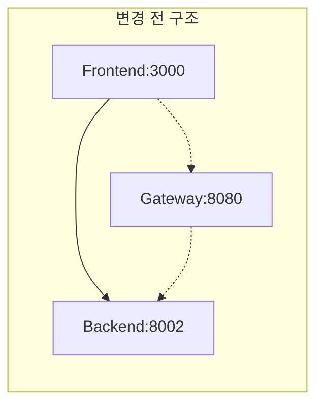
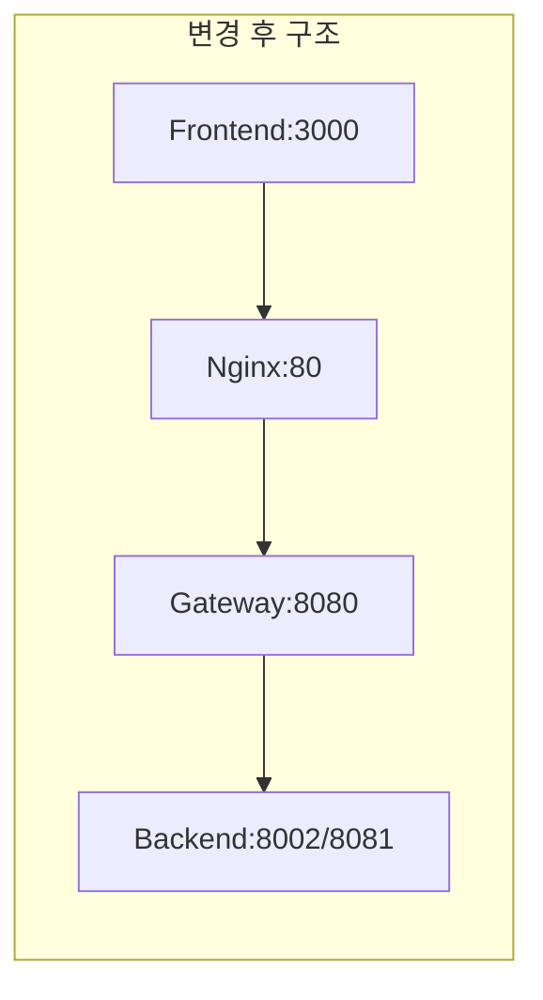
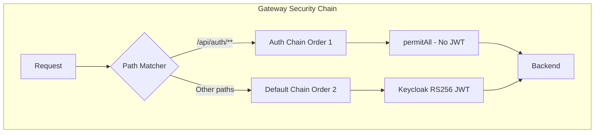

# 작업보고서 - API Gateway Auth 라우팅 통합

## 1. 개요

| 항목 | 내용 |
|------|------|
| **작업일시** | 2026-01-25 23:00 ~ 23:45 |
| **작업자** | 클로드 (Claude Code), Backend Agent |
| **작업 유형** | 인프라 설정 변경, 라우팅 구성 |
| **영향 범위** | Frontend, API Gateway, Nginx, Backend |
| **관련 Story** | SCRUM-24 (Login UI E2E 테스트) |
| **위험도** | 중 (인증 경로 변경으로 서비스 접근에 영향) |

---

## 2. 작업 배경

### 2.1 문제 상황
기존 Frontend 프록시 설정이 Backend 서버(8002)로 직접 연결되어 있어, API Gateway를 우회하는 구조였음.

```
[문제]
Frontend:3000 -> Backend:8002 (직접 연결)
                      |
                      v
              API Gateway(8080) 미사용
```

### 2.2 작업 필요성
- API Gateway의 Circuit Breaker, Rate Limiting, Retry 정책이 적용되지 않음
- 일관된 인증/인가 흐름 부재
- 로드밸런싱 및 모니터링 불가
- Docker 환경과 로컬 개발 환경의 라우팅 불일치

### 2.3 목표
- Frontend -> Nginx -> API Gateway -> Backend 경로 통합
- `/api/auth/**` 엔드포인트 Gateway 라우팅 추가
- 이중 Security Chain 구성 (Auth용 vs Default용)

---

## 3. 작업 내용

### 3.1 변경 파일 목록

| 파일 | 변경 유형 | 설명 |
|------|----------|------|
| `knowledge_service/gateway/src/main/resources/application.yml` | 수정 | Auth 라우트 추가 (local + docker profile) |
| `knowledge_service/gateway/src/main/java/com/knowledge/gateway/config/SecurityConfig.java` | 수정 | 이중 Security Chain 구성 |
| `knowledge_service/gateway/src/main/java/com/knowledge/gateway/route/FallbackController.java` | 수정 | Auth Fallback 엔드포인트 추가 |
| `infrastructure/docker/nginx/conf.d/default.conf` | 수정 | `/api/auth/` 라우팅 추가 |
| `knowledge_service/frontend/vite.config.ts` | 수정 | 프록시 타겟 변경 (8002 -> 8080) |

### 3.2 상세 변경 내역

#### 3.2.1 Gateway Application.yml - Auth 라우트 추가

**Local Profile:**
```yaml
routes:
  # Auth Service Routes (/api/auth/**)
  # Direct login/logout endpoints (no JWT required for login)
  - id: auth-service
    uri: ${BACKEND_URL:http://localhost:8081}
    predicates:
      - Path=/api/auth/**
    filters:
      - name: CircuitBreaker
        args:
          name: auth-circuit-breaker
          fallbackUri: forward:/fallback/auth
      - name: Retry
        args:
          retries: 3
          statuses: BAD_GATEWAY,GATEWAY_TIMEOUT
          methods: POST
          backoff:
            firstBackoff: 100ms
            maxBackoff: 500ms
            factor: 2
      - name: RequestRateLimiter
        args:
          redis-rate-limiter.replenishRate: 20
          redis-rate-limiter.burstCapacity: 40
          redis-rate-limiter.requestedTokens: 1
```

**Docker Profile:**
```yaml
- id: auth-service
  uri: http://backend:8081
  predicates:
    - Path=/api/auth/**
  filters:
    - name: CircuitBreaker
      args:
        name: auth-circuit-breaker
        fallbackUri: forward:/fallback/auth
    - name: Retry
      args:
        retries: 3
        statuses: BAD_GATEWAY,GATEWAY_TIMEOUT
        methods: POST
    - name: RequestRateLimiter
      args:
        redis-rate-limiter.replenishRate: 20
        redis-rate-limiter.burstCapacity: 40
        redis-rate-limiter.requestedTokens: 1
```

#### 3.2.2 SecurityConfig.java - 이중 Security Chain

**설계 원칙:**
- Order(1): `/api/auth/**` - JWT 검증 없음 (Backend HS256 토큰 처리)
- Order(2): 나머지 모든 경로 - Keycloak RS256 JWT 검증

```java
/**
 * Security chain for /api/auth/** endpoints
 * No OAuth2 JWT validation - Backend handles HS256 tokens
 */
@Bean
@Order(1)
public SecurityWebFilterChain authSecurityWebFilterChain(ServerHttpSecurity http) {
    return http
        .securityMatcher(new PathPatternParserServerWebExchangeMatcher("/api/auth/**"))
        .csrf(ServerHttpSecurity.CsrfSpec::disable)
        .cors(cors -> cors.configurationSource(corsConfigurationSource()))
        .authorizeExchange(exchanges -> exchanges
            .anyExchange().permitAll()
        )
        // No oauth2ResourceServer - allows HS256 tokens to pass through
        .build();
}

/**
 * Default security chain for all other endpoints
 * Uses Keycloak RS256 JWT validation
 */
@Bean
@Order(2)
public SecurityWebFilterChain defaultSecurityWebFilterChain(ServerHttpSecurity http) {
    // ... Keycloak JWT 검증 로직
}
```

#### 3.2.3 FallbackController.java - Auth Fallback 추가

```java
/**
 * Fallback for Auth service
 */
@GetMapping("/auth")
@PostMapping("/auth")
public Mono<ResponseEntity<Map<String, Object>>> authFallback() {
    log.warn("Auth service fallback triggered - circuit breaker open");
    return Mono.just(createServiceUnavailableResponse(
        "Authentication service is temporarily unavailable",
        "Login/logout is currently unavailable. Please try again later.",
        "auth"
    ));
}
```

#### 3.2.4 Nginx default.conf - Auth 라우팅

```nginx
# API Gateway - Auth endpoints (preserve /api prefix)
location /api/auth/ {
    limit_req zone=api_limit burst=20 nodelay;

    proxy_pass http://api_gateway/api/auth/;
    proxy_http_version 1.1;
    proxy_set_header Host $host;
    proxy_set_header X-Real-IP $remote_addr;
    proxy_set_header X-Forwarded-For $proxy_add_x_forwarded_for;
    proxy_set_header X-Forwarded-Proto $scheme;
    proxy_set_header Connection "";

    proxy_connect_timeout 30s;
    proxy_send_timeout 30s;
    proxy_read_timeout 30s;
}
```

#### 3.2.5 vite.config.ts - 프록시 타겟 변경

```typescript
server: {
  port: 3000,
  proxy: {
    '/api': {
      target: 'http://localhost:8080',  // API Gateway (was: 8002)
      changeOrigin: true,
    },
  },
},
```

---

## 4. 작업 결과

### 4.1 테스트 결과

| 테스트 케이스 | 경로 | Method | 결과 | 응답 |
|-------------|------|--------|------|------|
| 로그인 (Nginx 경유) | POST /api/auth/login | POST | 200 OK | JWT 토큰 반환 |
| 현재 사용자 조회 | GET /api/auth/me | GET | 200 OK | 사용자 정보 |
| 토큰 갱신 | POST /api/auth/refresh | POST | 200 OK | 새 토큰 반환 |
| Gateway 직접 호출 | POST localhost:8080/api/auth/login | POST | 200 OK | JWT 토큰 반환 |
| Backend 직접 호출 | POST localhost:8002/api/auth/login | POST | 200 OK | JWT 토큰 반환 |

### 4.2 검증 내역

```bash
# 1. Nginx -> Gateway -> Backend 전체 경로 테스트
curl -X POST http://localhost/api/auth/login \
  -H "Content-Type: application/json" \
  -d '{"email":"admin@knowledge.local","password":"admin123"}'
# Result: 200 OK, {"accessToken":"eyJ...", "refreshToken":"eyJ..."}

# 2. Gateway 직접 테스트
curl -X POST http://localhost:8080/api/auth/login \
  -H "Content-Type: application/json" \
  -d '{"email":"admin@knowledge.local","password":"admin123"}'
# Result: 200 OK

# 3. Backend 직접 테스트 (기존 경로 유지 확인)
curl -X POST http://localhost:8002/api/auth/login \
  -H "Content-Type: application/json" \
  -d '{"email":"admin@knowledge.local","password":"admin123"}'
# Result: 200 OK

# 4. 인증된 요청 테스트
curl -X GET http://localhost/api/auth/me \
  -H "Authorization: Bearer eyJ..."
# Result: 200 OK, {"id":1,"email":"admin@knowledge.local",...}
```

---

## 5. 아키텍처 변경 사항

### 5.1 Before (변경 전)



**문제점:**
- Frontend가 Backend로 직접 연결
- Gateway의 보안/복원력 기능 미적용
- 환경별 라우팅 불일치

### 5.2 After (변경 후)



**개선점:**
- 일관된 라우팅 경로
- Circuit Breaker, Rate Limiting 적용
- 모니터링 및 로깅 중앙화

### 5.3 Security Chain 구조



---

## 6. 후속 조치

### 6.1 필수 작업
| 우선순위 | 작업 | 담당 | 상태 |
|---------|------|------|------|
| P0 | Docker 환경 테스트 | DevOps | 대기 |
| P1 | Keycloak 연동 테스트 | Backend | 대기 |
| P1 | E2E 테스트 업데이트 | QA | 대기 |

### 6.2 권장 작업
| 우선순위 | 작업 | 담당 | 상태 |
|---------|------|------|------|
| P2 | Circuit Breaker 임계값 조정 | DevOps | 대기 |
| P2 | Rate Limiting 정책 검토 | Backend | 대기 |
| P3 | 모니터링 대시보드 업데이트 | DevOps | 대기 |

### 6.3 롤백 절차

문제 발생 시 롤백 방법:

1. **vite.config.ts**: 프록시 타겟을 `localhost:8002`로 변경
2. **Nginx**: `/api/auth/` location 블록 제거
3. **Gateway**: auth-service 라우트 제거
4. **SecurityConfig**: authSecurityWebFilterChain Bean 제거

```bash
# 롤백 명령어 예시
git revert <commit-hash>
# 또는 수동 롤백
git checkout HEAD~1 -- knowledge_service/frontend/vite.config.ts
```

---

## 7. 작업 완료 확인

| 항목 | 확인 | 비고 |
|------|------|------|
| Gateway application.yml 수정 | O | local + docker profile |
| SecurityConfig 이중 Chain | O | Order(1), Order(2) |
| FallbackController Auth 추가 | O | GET/POST 지원 |
| Nginx Auth 라우팅 추가 | O | /api/auth/ location |
| Frontend 프록시 변경 | O | 8002 -> 8080 |
| 로그인 테스트 통과 | O | 200 OK |
| 토큰 갱신 테스트 통과 | O | 200 OK |
| 인증된 요청 테스트 통과 | O | 200 OK |

---

**승인자**: PM Agent
**완료 시간**: 2026-01-25 23:45
**문서 버전**: v1.0

---

## 참고 문서

- [API Gateway 설계서](../../knowledge_service/docs/02_design/04_api_integration_design.md)
- [인프라 설계서](../../knowledge_service/docs/02_design/10_infrastructure_detailed_design.md)
- [Backend 상세 설계서](../../knowledge_service/docs/02_design/06_backend_detailed_design.md)
