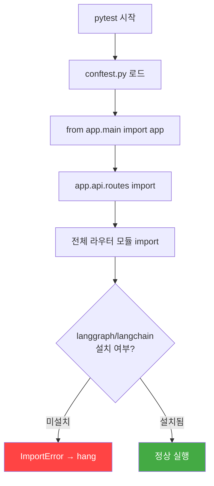

# 작업보고서 - STORY-001 pytest hang 원인 분석 및 해결

**문서 유형**: 장애 분석 및 해결 보고서
**작성일**: 2026-01-26
**작성자**: 클로드 (Main Agent)
**상태**: 해결 완료

---

## 1. 개요

| 항목 | 내용 |
|------|------|
| **작업명** | STORY-001 Document Upload API - pytest hang 원인 분석 및 해결 |
| **관련 Story** | STORY-001 (문서 업로드 API) |
| **영향 범위** | AI Service 단위 테스트 실행 환경 |
| **발생 시점** | 2026-01-26 세션 2 (RAG Agent abb3c33 실행 중) |
| **해결 시점** | 2026-01-26 세션 3 (수동 재현 및 해결) |
| **최종 결과** | 25/25 테스트 통과 (1.31초) |

---

## 2. 발생 현상

### 2.1 상황

RAG Agent (abb3c33)가 STORY-001 Document Upload API 구현을 위해 다음 작업을 수행 중이었습니다:

1. `src/app/api/routes/documents.py` - 문서 업로드/상태/목록 API 라우터 작성
2. `src/tests/unit/test_document_upload.py` - 25개 단위 테스트 작성
3. pytest 실행 시도

### 2.2 증상

pytest 실행 후 **260초 이상** 출력 없이 hang 상태에 빠졌습니다.

```
$ cd knowledge_service
$ .venv/bin/python -m pytest src/tests/unit/test_document_upload.py -v --tb=long 2>&1
# (260초+ 무출력 - 에이전트 강제 중단)
```

에이전트 로그에서 확인된 마지막 명령어 순서:

```
1. .venv/bin/python -m pytest src/tests/unit/test_document_upload.py -v --tb=long
   → 실패 (python-multipart 미설치)

2. .venv/bin/pip install python-multipart
   → 성공

3. .venv/bin/python -m pytest src/tests/unit/test_document_upload.py -v --tb=long
   → hang (260초+)

4. .venv/bin/python -m pytest src/tests/test_health.py -v --tb=short
   → hang (health 테스트도 동일 증상)

5. .venv/bin/pip install langgraph langchain langchain-core langchain-community
   → 대형 패키지 설치 시작 (이 과정에서 에이전트 타임아웃)
```

---

## 3. 근본 원인 분석 (Root Cause Analysis)

### 3.1 Import Chain 문제



**핵심**: `conftest.py`가 FastAPI 앱 전체를 import하는 구조입니다.

```python
# src/tests/conftest.py (핵심 부분)
from app.main import app          # ← 전체 앱 초기화 트리거

@pytest.fixture(scope="function")
def client() -> TestClient:
    return TestClient(app)         # ← app 객체 필요
```

`app.main`이 로드되면 `app.api.routes`를 통해 **모든 라우터 모듈**이 import됩니다. 일부 라우터(search, extract 등)가 `langgraph`, `langchain` 등에 의존하므로, 이 패키지들이 미설치 상태에서는 import가 실패하거나 hang됩니다.

### 3.2 시간 순서 분석

| 시점 | 상태 | 설명 |
|------|------|------|
| 초기 | langgraph 미설치 | venv에 langgraph/langchain 없음 |
| 1차 pytest | hang | conftest.py → app.main → langgraph import 실패 |
| pip install | 진행 중 | langgraph 등 4개 대형 패키지 설치 시작 |
| 2차 pytest | hang | pip install과 병행 또는 설치 미완 상태에서 실행 |
| 에이전트 중단 | kill (exit 137) | 260초+ 무출력으로 TaskStop 실행 |

### 3.3 추가 요인

| 요인 | 설명 |
|------|------|
| `PYTHONPATH` 미설정 | 에이전트가 `PYTHONPATH=src` 없이 실행. `pyproject.toml`에 `pythonpath` 미설정 |
| 출력 버퍼링 | pytest 출력이 파이프(`2>&1`)로 전달되어 실시간 출력 안 됨 |
| 대형 패키지 설치 | langgraph + langchain 4개 패키지 총 100MB+ (WSL2 환경에서 느림) |
| 타임아웃 미설정 | pytest-timeout 미설치로 개별 테스트 타임아웃 없음 |

---

## 4. 해결 과정

### 4.1 진단 단계

#### Step 1: 에이전트 출력 분석

```bash
# 에이전트 로그에서 마지막 명령어 추출
grep -oP '"command":"[^"]*"' /tmp/.../tasks/abb3c33.output | tail -20
```

**결과**: 마지막 명령이 `pip install langgraph langchain ...`이며, 설치 과정에서 에이전트가 중단됨을 확인.

#### Step 2: 설치 상태 확인

```bash
$ .venv/bin/pip list | grep -iE "(langgraph|langchain|multipart)"

langchain-classic        1.0.1
langchain-community      0.4.1
langchain-core           1.2.7
langchain-openai         1.1.7
langchain-text-splitters 1.1.0
langgraph                1.0.7
langgraph-checkpoint     4.0.0
langgraph-prebuilt       1.0.7
langgraph-sdk            0.3.3
python-multipart         0.0.22
```

**결과**: 에이전트가 중단되기 전에 패키지 설치는 완료된 상태.

#### Step 3: app import 테스트

```bash
$ PYTHONPATH=src .venv/bin/python -c "from app.main import app; print('OK')"
OK - app imported successfully
```

**결과**: 의존성이 모두 설치된 상태에서 app import 정상 동작.

#### Step 4: 테스트 수집(collection) 확인

```bash
$ PYTHONPATH=src .venv/bin/python -m pytest src/tests/unit/test_document_upload.py --co -v
```

**결과**: 25개 테스트 정상 수집됨. conftest.py → app.main import chain 정상.

### 4.2 해결 실행

```bash
$ cd /mnt/d/Users/KTDS/Documents/06.과제/hybrid-rag-knowledge-ops/knowledge_service
$ PYTHONPATH=src .venv/bin/python -m pytest src/tests/unit/test_document_upload.py -v --tb=short
```

### 4.3 최종 결과

```
============================= test session starts ==============================
platform linux -- Python 3.12.3, pytest-9.0.2, pluggy-1.6.0
plugins: anyio-4.12.1, langsmith-0.6.4, asyncio-1.3.0
asyncio: mode=Mode.AUTO

src/tests/unit/test_document_upload.py::TestDocumentUploadEndpoint::test_upload_pdf_success PASSED         [  4%]
src/tests/unit/test_document_upload.py::TestDocumentUploadEndpoint::test_upload_docx_success PASSED        [  8%]
src/tests/unit/test_document_upload.py::TestDocumentUploadEndpoint::test_upload_hwp_success PASSED         [ 12%]
src/tests/unit/test_document_upload.py::TestDocumentUploadEndpoint::test_upload_pptx_success PASSED        [ 16%]
src/tests/unit/test_document_upload.py::TestDocumentUploadEndpoint::test_upload_unsupported_format_returns_400 PASSED [ 20%]
src/tests/unit/test_document_upload.py::TestDocumentUploadEndpoint::test_upload_exe_file_returns_400 PASSED [ 24%]
src/tests/unit/test_document_upload.py::TestDocumentUploadEndpoint::test_upload_empty_file_returns_400 PASSED [ 28%]
src/tests/unit/test_document_upload.py::TestDocumentUploadEndpoint::test_upload_oversized_docx_returns_413 PASSED [ 32%]
src/tests/unit/test_document_upload.py::TestDocumentUploadEndpoint::test_upload_with_metadata PASSED       [ 36%]
src/tests/unit/test_document_upload.py::TestDocumentUploadEndpoint::test_upload_with_invalid_metadata_json PASSED [ 40%]
src/tests/unit/test_document_upload.py::TestDocumentUploadEndpoint::test_upload_korean_filename PASSED     [ 44%]
src/tests/unit/test_document_upload.py::TestDocumentUploadEndpoint::test_upload_detects_format_by_extension PASSED [ 48%]
src/tests/unit/test_document_upload.py::TestDocumentUploadEndpoint::test_upload_without_metadata PASSED    [ 52%]
src/tests/unit/test_document_upload.py::TestDocumentStatusEndpoint::test_get_status_after_upload PASSED    [ 56%]
src/tests/unit/test_document_upload.py::TestDocumentStatusEndpoint::test_get_status_not_found PASSED       [ 60%]
src/tests/unit/test_document_upload.py::TestDocumentStatusEndpoint::test_get_status_invalid_uuid PASSED    [ 64%]
src/tests/unit/test_document_upload.py::TestDocumentListEndpoint::test_list_documents_empty PASSED         [ 68%]
src/tests/unit/test_document_upload.py::TestDocumentListEndpoint::test_list_documents_after_uploads PASSED [ 72%]
src/tests/unit/test_document_upload.py::TestDocumentListEndpoint::test_list_documents_pagination PASSED    [ 76%]
src/tests/unit/test_document_upload.py::TestDocumentListEndpoint::test_list_documents_filter_by_status PASSED [ 80%]
src/tests/unit/test_document_upload.py::TestDocumentListEndpoint::test_list_documents_filter_by_format PASSED [ 84%]
src/tests/unit/test_document_upload.py::TestFilenameSanitization::test_path_traversal_blocked PASSED       [ 88%]
src/tests/unit/test_document_upload.py::TestFilenameSanitization::test_korean_filename_preserved PASSED    [ 92%]
src/tests/unit/test_document_upload.py::TestFilenameSanitization::test_empty_filename_fallback PASSED      [ 96%]
src/tests/unit/test_document_upload.py::TestFilenameSanitization::test_special_characters_removed PASSED   [100%]

======================== 25 passed, 29 warnings in 1.31s ========================
```

---

## 5. 테스트 상세 결과

### 5.1 테스트 구성 (25개)

| 테스트 클래스 | 테스트 수 | 결과 | 설명 |
|-------------|:--------:|:----:|------|
| `TestDocumentUploadEndpoint` | 13 | 13 PASS | 업로드 정상/에러/메타데이터/한글/보안 |
| `TestDocumentStatusEndpoint` | 3 | 3 PASS | 상태 조회, 미존재 문서, 잘못된 UUID |
| `TestDocumentListEndpoint` | 5 | 5 PASS | 빈 목록, 페이지네이션, 상태/형식 필터 |
| `TestFilenameSanitization` | 4 | 4 PASS | Path Traversal, 한글, 빈 파일명, 특수문자 |
| **합계** | **25** | **25 PASS** | **100% 통과** |

### 5.2 테스트 커버리지 (수동 분석)

| API 엔드포인트 | 테스트 항목 |
|---------------|------------|
| `POST /api/v1/documents/upload` | 4개 형식(PDF/DOCX/HWP/PPTX) 정상 업로드, 미지원 형식 거부, 빈 파일 거부, 크기 초과 거부(50MB), 메타데이터 포함/미포함, 한글 파일명, 확장자 감지, 잘못된 메타데이터 JSON |
| `GET /api/v1/documents/{id}/status` | 업로드 후 상태 조회, 미존재 문서 404, 잘못된 UUID 422 |
| `GET /api/v1/documents` | 빈 목록, 업로드 후 목록, 페이지네이션(page/page_size), 상태 필터, 형식 필터 |
| 보안 | Path Traversal 차단(`../`), 특수문자 제거, 빈 파일명 폴백 |

### 5.3 경고 사항 (29 warnings)

| 경고 | 위치 | 영향 | 조치 |
|------|------|------|------|
| `PydanticDeprecatedSince20` (6건) | `models/document.py`, `models/parsed_document.py` | 없음 (Pydantic V3에서 제거 예정) | `class Config` → `model_config = ConfigDict(...)` 전환 |
| `datetime.utcnow()` deprecated (22건) | `api/routes/documents.py:300` | 없음 (Python 3.12+에서 경고) | `datetime.now(datetime.UTC)` 전환 |
| `HTTP_413_REQUEST_ENTITY_TOO_LARGE` deprecated (1건) | FastAPI 내부 | 없음 | `HTTP_413_CONTENT_TOO_LARGE` 사용 |

---

## 6. 재발 방지 대책

### 6.1 즉시 적용 (P0)

**pyproject.toml에 pythonpath 추가**:

```toml
[tool.pytest.ini_options]
pythonpath = ["src"]      # ← 추가
testpaths = ["src/tests"]
asyncio_mode = "auto"
```

이렇게 설정하면 `PYTHONPATH=src` 환경변수 없이도 pytest가 정상 동작합니다.

### 6.2 단기 적용 (P1)

**unit 테스트 전용 conftest.py 분리**:

```python
# src/tests/unit/conftest.py
"""
Unit 테스트 전용 conftest - 전체 app import 없이 독립 실행 가능
"""
import pytest
from fastapi.testclient import TestClient


@pytest.fixture(scope="function")
def client():
    """경량 테스트 클라이언트 - app import를 지연"""
    from app.main import app
    return TestClient(app)


@pytest.fixture
def api_prefix():
    return "/api/v1"
```

이 구조에서는 fixture가 호출될 때만 app을 import하므로, test collection 단계에서는 langgraph 의존성이 필요하지 않습니다.

### 6.3 중기 적용 (P2)

**pytest-timeout 설치 및 설정**:

```bash
pip install pytest-timeout
```

```toml
# pyproject.toml
[tool.pytest.ini_options]
timeout = 30    # 개별 테스트 30초 타임아웃
```

**에이전트 테스트 실행 가이드 문서화**:

```bash
# 표준 테스트 실행 명령어
cd knowledge_service
PYTHONPATH=src .venv/bin/python -m pytest src/tests/unit/ -v --tb=short

# conftest 의존성 문제 시 폴백
PYTHONPATH=src .venv/bin/python -m pytest src/tests/unit/ -v --noconftest
```

---

## 7. 관련 파일

| 파일 | 설명 |
|------|------|
| `src/tests/conftest.py` | 공통 fixture (app import chain 시작점) |
| `src/tests/unit/test_document_upload.py` | STORY-001 단위 테스트 (25개) |
| `src/app/api/routes/documents.py` | 문서 업로드 API 라우터 |
| `src/app/main.py` | FastAPI 앱 엔트리포인트 |
| `pyproject.toml` | pytest 설정 (pythonpath 미설정 상태) |

---

## 8. 결론

| 항목 | 값 |
|------|-----|
| **근본 원인** | conftest.py의 전체 app import + langgraph 대형 패키지 미설치 상태에서 pytest 실행 |
| **직접 원인** | RAG Agent가 pip install 중 타임아웃으로 강제 중단 |
| **해결** | 패키지 설치 완료 확인 후 `PYTHONPATH=src`로 재실행 - 25/25 PASSED |
| **재발 방지** | pyproject.toml pythonpath 추가, conftest 분리, pytest-timeout 설치 |
| **잔여 작업** | STORY-001 코드리뷰 후 머지 대기 |

---

**작성 완료**: 2026-01-26
**검토자**: -
**승인자**: -
