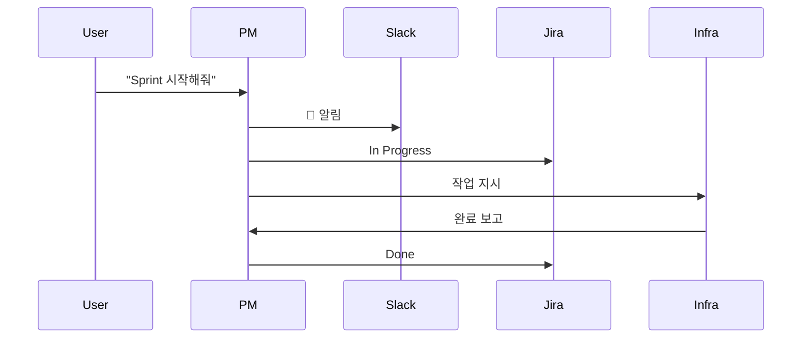

# Vibe Coding Log - 2026-01-19

## Session Theme: "PM이 오케스트라 지휘자가 되다"

오늘의 핵심은 **PM Agent를 Sprint Controller로 승격**시킨 것이다.
각 에이전트가 독립적으로 움직이던 방식에서, PM이 중앙에서 조율하는 방식으로 전환했다.

---

## Inspiration & Insights

### 1. 오케스트라 메타포

```
기존 방식 (각자 연주):
  Backend ──┐
  Frontend ─┼──► Jira (혼란)
  MLRag ────┘

새로운 방식 (지휘자 PM):
  PM (지휘자) ─────────────────────────────────────┐
       │                                           │
       ├──► Backend  ──┐                          │
       ├──► Frontend ──┼──► PM ──► Jira/Slack    │
       └──► MLRag    ──┘     (정돈된 보고)         │
                                                   │
  ◀───────────────────────────────────────────────┘
```

각 악기(에이전트)가 아무리 훌륭해도, 지휘자 없이는 교향곡이 될 수 없다.
PM Agent가 바로 그 지휘자 역할을 한다.

### 2. "보고 의무"의 강제화

모든 에이전트 정의 파일에 **필수** Slack 알림 섹션을 추가했다.
이건 단순한 로깅이 아니라 **accountability**(책임 추적성)의 문제다.

```markdown
## ⚠️ Slack 알림 (필수 - 반드시 수행)
**모든 작업 시 Slack 채널에 진행 상황을 알려야 합니다. 알림을 빠뜨리면 안 됩니다!**
```

"빠뜨리면 안 됩니다!"라는 강조가 핵심이다.
AI 에이전트도 명확한 지시가 있어야 일관되게 행동한다.

### 3. 시퀀스 다이어그램의 힘

기존의 flowchart는 **무엇이 연결되는지**를 보여준다.
시퀀스 다이어그램은 **언제, 어떤 순서로**를 보여준다.



이 다이어그램 하나로 전체 워크플로우가 한눈에 보인다.
코드 없이도 시스템이 어떻게 돌아가는지 이해할 수 있다.

---

## Thought Process

### 문제: PM이 Slack 알림을 안 보냈다

```
사용자: "PM이 SLACK에 아무런 알람 메시지 보내지 않았음"
```

처음에 PM Agent를 호출했을 때, Slack 알림이 누락됐다.
원인을 추적해보니 `SLACK_BOT_TOKEN`이 `.env`에 없었다.

**교훈**: 환경 변수 체크는 에이전트 실행 전에 해야 한다.
그래서 트러블슈팅 섹션을 매뉴얼에 추가했다.

### 해결: Token 형식 교육

사용자가 처음에 부분 토큰을 제공했다:
```
"iqwOmln0dnpci2EP1NTyIBsL 이것 아닌가 싶은데?"
```

Slack Bot Token은 `xoxb-`로 시작해야 한다고 설명하고,
전체 토큰을 받아서 해결했다.

**인사이트**: 사용자도 토큰 형식을 모를 수 있다.
문서에 명확히 형식을 적어두는 게 중요하다.

---

## Ideas Generated

### 1. 에이전트 자동 토큰 체크
```python
# 아이디어: 에이전트 시작 시 환경 변수 검증
def check_environment():
    required = ['SLACK_BOT_TOKEN', 'JIRA_API_TOKEN']
    missing = [v for v in required if not os.getenv(v)]
    if missing:
        raise ConfigError(f"Missing: {missing}")
```

### 2. Slack 알림 라이브러리화
각 에이전트가 curl을 직접 호출하는 대신,
공통 함수로 추상화하면 일관성이 높아질 것.

```bash
# slack_notify.sh
slack_notify() {
    local channel=$1
    local message=$2
    curl -s -X POST "https://slack.com/api/chat.postMessage" \
      -H "Authorization: Bearer $SLACK_BOT_TOKEN" \
      -H "Content-Type: application/json" \
      -d "{\"channel\": \"$channel\", \"text\": \"$message\"}"
}
```

### 3. Sprint Dashboard
Slack 메시지를 파싱해서 실시간 Sprint 대시보드를 만들면?
- 진행률 시각화
- 블로커 자동 감지
- 예상 완료일 계산

---

## Code Snippets Worth Remembering

### Slack 메시지 전송 (검증된 버전)
```bash
source .env

curl -s -X POST "https://slack.com/api/chat.postMessage" \
  -H "Authorization: Bearer $SLACK_BOT_TOKEN" \
  -H "Content-Type: application/json" \
  -d '{
    "channel": "proj-hrkp-dev",
    "text": "*[PM]* 📋 Sprint 01 현황 보고\n\n• 기간: 2026-01-20 ~ 2026-02-02\n• Story: 5개 (21 SP)"
  }'
```

**응답 성공**:
```json
{"ok": true, "channel": "C0A9ABM9EJN", "ts": "1737297844.749529"}
```

### Jira 상태 전이
```bash
# To Do → In Progress (transition id: 21)
curl -s -X POST "https://$JIRA_HOST/rest/api/3/issue/SCRUM-10/transitions" \
  -H "Authorization: Basic $(echo -n $JIRA_EMAIL:$JIRA_API_TOKEN | base64)" \
  -H "Content-Type: application/json" \
  -d '{"transition": {"id": "21"}}'
```

---

## Reflections

### 잘된 점
1. **PM 중심 아키텍처** - 명확한 책임 분리
2. **문서화** - 4개의 상세 가이드 작성
3. **테스트** - 실제 Slack 메시지 전송 성공

### 개선할 점
1. **자동화** - 아직 수동으로 curl 실행해야 함
2. **에러 핸들링** - 토큰 없을 때 graceful한 처리 필요
3. **모니터링** - 알림 전송 성공/실패 추적 필요

### 내일 해볼 것
1. Sprint 01 실제 시작
2. PM이 Infra Agent에게 첫 Story 할당
3. 전체 워크플로우 E2E 테스트

---

## Session Statistics

| 항목 | 수치 |
|------|------|
| 작업 시간 | 약 4시간 |
| 주요 결정 | 2개 (PM 중심, Bot Token 직접 사용) |
| 아이디어 | 3개 |
| 문서 작성 | 4개 |
| "아하!" 순간 | 2회 |

---

## Quote of the Day

> "지휘자 없는 오케스트라는 그냥 악기 소리의 집합이다.
> PM 없는 에이전트 팀도 마찬가지."

---

**기록 시간**: 2026-01-19 저녁
**기분**: 체계가 잡혀가는 느낌, 만족스러움 😊
