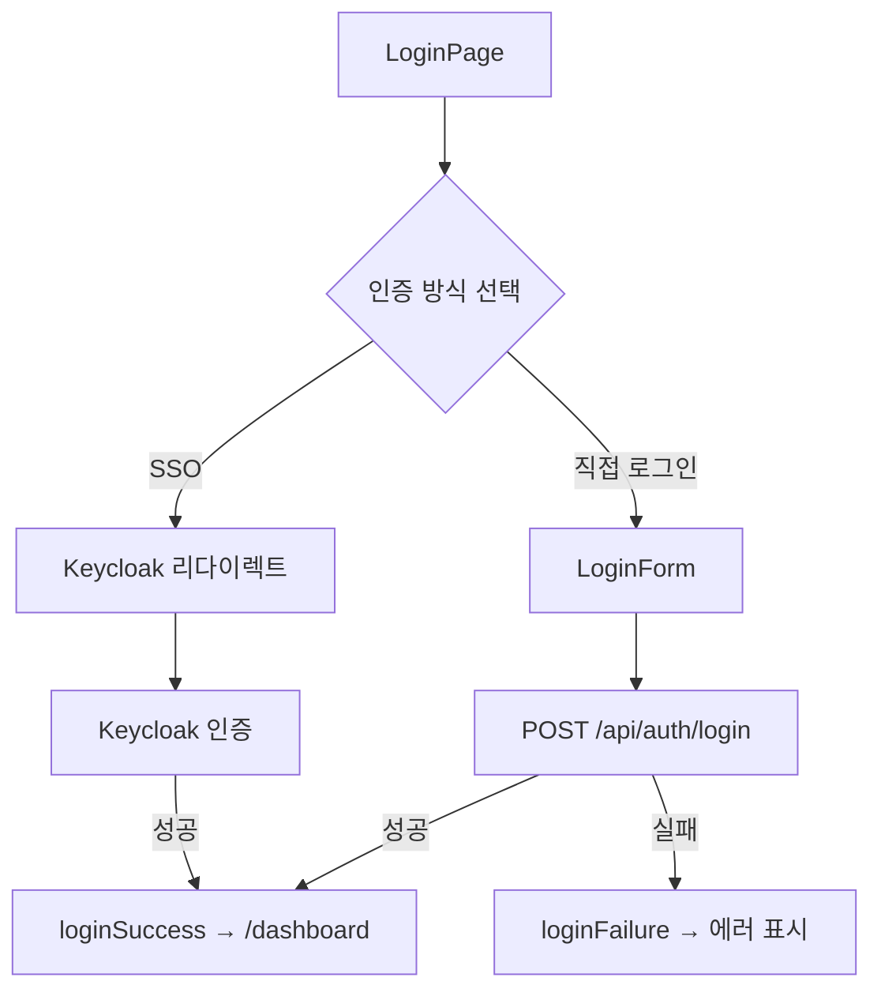

# 세션 로그: Antigravity + 로그인 폼 개발

**날짜**: 2026-01-25
**작업자**: 클로드 (Claude Opus 4.5)
**세션 유형**: UI 개발 + MCP 설정

---

## 1. 작업 배경

### 1.1 사용자 요청
사용자가 `/antigravity:workflow` 명령어를 실행하여 Antigravity + Stitch MCP 기반 UI 개발 워크플로우를 시작하려 했으나, 다음 오류가 발생:

```
API Error: 404 {"type":"error","error":{"type":"not_found_error","message":"model: claude-sonnet-4-1"}}
```

### 1.2 문제 원인
- Stitch MCP 서버가 존재하지 않는 모델 `claude-sonnet-4-1`을 호출
- MCP 설정 파일(`.claude/settings.json`)에 Stitch 서버 미등록

### 1.3 후속 요청
1. Stitch MCP 설정에서 모델을 최신 Opus(`claude-opus-4-5-20251101`)로 변경
2. 로그인 폼을 직접 생성 (Stitch 없이)

---

## 2. 수행한 작업

### 2.1 MCP 설정 업데이트

**파일**: `.claude/settings.json`

**변경 내용**:
```json
{
  "mcpServers": {
    "jira": { ... },
    "github": { ... },
    "stitch": {
      "command": "npx",
      "args": ["-y", "@anthropic/stitch-mcp@latest"],
      "env": {
        "ANTHROPIC_MODEL": "claude-opus-4-5-20251101"
      }
    }
  }
}
```

**목적**:
- Stitch MCP 서버 등록
- Anthropic 최신 모델(Opus 4.5)로 설정
- UI 생성 시 고품질 코드 출력 기대

---

### 2.2 로그인 폼 컴포넌트 생성

**파일**: `knowledge_service/frontend/src/components/auth/LoginForm.tsx`

**컴포넌트 명세**:

| 항목 | 내용 |
|------|------|
| 컴포넌트명 | `LoginForm` |
| 위치 | `src/components/auth/LoginForm.tsx` |
| 타입 | React Functional Component |
| 스타일 | Tailwind CSS |
| 상태 관리 | Redux (authSlice 연동) |

**기능 목록**:

| 기능 | 설명 |
|------|------|
| 이메일 입력 | 이메일 형식 실시간 검증 |
| 비밀번호 입력 | 8자 이상 검증, 표시/숨김 토글 |
| Remember Me | localStorage에 이메일 저장 |
| 폼 제출 | API `/api/auth/login` 호출 |
| SSO 옵션 | Keycloak 리다이렉트 지원 |
| 비밀번호 찾기 | 콜백 함수로 처리 |

**접근성 (WCAG 2.1 AA)**:

| 항목 | 구현 |
|------|------|
| ARIA 라벨 | 모든 입력 필드에 적용 |
| 에러 알림 | `role="alert"` 사용 |
| 포커스 표시 | `focus:ring-2` 클래스 |
| 키보드 네비게이션 | Tab 순서 자연스럽게 설정 |
| 색상 대비 | gray-700/300 (4.5:1 이상) |

**Props 인터페이스**:
```typescript
interface LoginFormProps {
  onForgotPassword?: () => void;  // 비밀번호 찾기 핸들러
  onSSOLogin?: () => void;        // SSO 로그인 핸들러
  redirectPath?: string;          // 로그인 후 이동 경로 (기본: /dashboard)
}
```

---

### 2.3 LoginPage 업데이트

**파일**: `knowledge_service/frontend/src/pages/LoginPage.tsx`

**변경 사항**:
- 기존: SSO 전용 (Keycloak 리다이렉트 버튼만)
- 변경: 직접 로그인 폼 + SSO 옵션 통합

**구조**:
```
LoginPage
├── 로고 및 타이틀
├── 로그인 카드
│   └── LoginForm 컴포넌트
│       ├── 이메일/비밀번호 입력
│       ├── Remember Me + 비밀번호 찾기
│       ├── 로그인 버튼
│       └── SSO 로그인 버튼
└── 푸터
```

---

### 2.4 인덱스 파일 생성

**파일**: `knowledge_service/frontend/src/components/auth/index.ts`

```typescript
export { default as LoginForm } from './LoginForm';
```

---

## 3. 파일 변경 요약

| 파일 | 상태 | 설명 |
|------|------|------|
| `.claude/settings.json` | 수정 | Stitch MCP 추가, Opus 4.5 설정 |
| `src/components/auth/LoginForm.tsx` | 신규 | 로그인 폼 컴포넌트 |
| `src/components/auth/index.ts` | 신규 | 컴포넌트 export |
| `src/pages/LoginPage.tsx` | 수정 | LoginForm 통합 |

---

## 4. 연관 시스템

### 4.1 Redux 상태 (authSlice)

```typescript
interface AuthState {
  user: User | null;
  isAuthenticated: boolean;
  isLoading: boolean;
  error: string | null;
}

// Actions 사용
- loginStart()
- loginSuccess(user)
- loginFailure(error)
- clearError()
```

### 4.2 인증 흐름



---

## 5. 후속 작업 (TODO)

- [ ] `/api/auth/login` API 엔드포인트 구현 (Backend)
- [ ] 비밀번호 찾기 페이지/모달 구현
- [ ] 회원가입 페이지 구현 (필요 시)
- [ ] E2E 테스트 작성 (Cypress/Playwright)
- [ ] Stitch MCP 재시작 후 `/antigravity:workflow` 테스트

---

## 6. 참고 사항

### Antigravity 워크플로우란?

Antigravity는 Anthropic의 AI 기반 UI 생성 도구로, Stitch MCP를 통해 Claude Code와 통합됩니다.

**워크플로우**:
1. WebDesigner: 프롬프트 설계
2. Antigravity/Stitch: 코드 생성
3. Frontend: 통합 및 검증
4. TechLead: 코드 리뷰

**현재 상태**: MCP 설정 완료, Claude Code 재시작 후 사용 가능

---

## 7. 관련 문서

- [CLAUDE.md](../../CLAUDE.md) - 프로젝트 개발 규칙
- [Frontend 상세 설계서](../../knowledge_service/docs/02_design/frontend_detailed_design.md)
- [개발자 에이전트 가이드](../../knowledge_service/docs/05_development/developer_agent_guide.md)
- [Antigravity 워크플로우 스킬](../../.claude/commands/antigravity/workflow.md)
